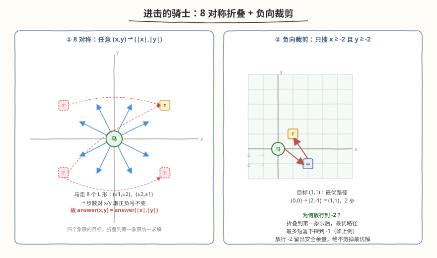
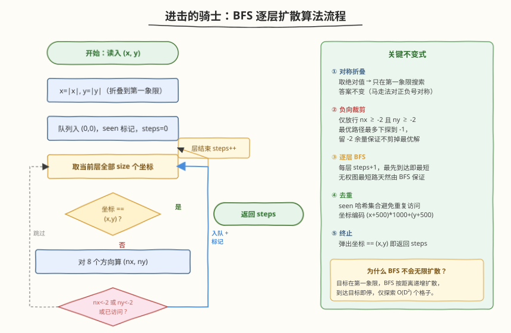
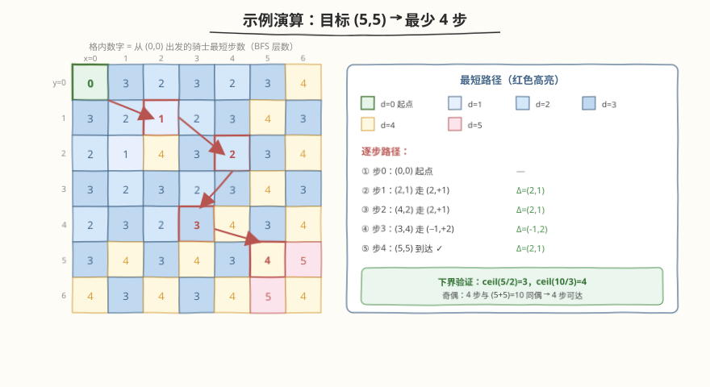

# 进击的骑士

- **题目名称**：进击的骑士
- **链接**：[1197. 进击的骑士](https://leetcode.cn/problems/minimum-knight-moves/)
- **难度**：中等
- **标签**：广度优先搜索、图、对称性剪枝

## 1. 题目概述

在一个**无限大**的象棋棋盘上，骑士（马）从坐标 `(0, 0)` 出发，返回走到 `(x, y)` 所需的**最少移动步数**。

骑士的走法为 8 个 L 形：横纵坐标变化量为 `(±1, ±2)` 或 `(±2, ±1)`。

**示例 1**：

```text
输入：x = 2, y = 1
输出：1
解释：(0,0) → (2,1) 一步到位。
```

**示例 2**：

```text
输入：x = 5, y = 5
输出：4
解释：(0,0) → (2,1) → (4,2) → (3,4) → (5,5)，共 4 步。
```

**约束条件**：

- $-300 \le x, y \le 300$
- $(x, y) \ne (0, 0)$

> ⚠️ **关键约束**：棋盘是**无限**的，不能直接对整个坐标平面做 BFS——必须借助对称性把搜索空间裁剪到一个有限区域。

---

## 2. 解题思路

### 2.1 暴力思路（朴素 BFS）

从 `(0,0)` 出发做 BFS，用 `visited` 集合去重，逐层向外扩散，直到碰到目标 `(x, y)`。

> ❌ 棋盘无限大，目标可能在一三象限的任意位置。不裁剪的话，骑士会向**四面八方**等概率扩散，探索的格子数随步数 $D$ 呈 $O(D^2)$ 增长，且大量探索方向远离目标，效率极低、甚至难以终止。

### 2.2 核心观察：对称折叠 + 负向裁剪



**观察一：8 对称性。** 骑士的 8 种走法关于 $x$ 轴、$y$ 轴、原点都对称（把任一走法的横纵坐标取负号仍是合法走法）。因此：

$$\text{answer}(x, y) = \text{answer}(|x|, |y|)$$

任意目标都可**折叠到第一象限**（取绝对值）后求解，答案不变。这把「朝四个象限扩散」压缩为「只朝第一象限扩散」。

> 💡 **为什么对称成立？** 把一条从 `(0,0)` 到 `(x,y)` 的最优路径里每个坐标的 $x$ 取负号，得到的就是从 `(0,0)` 到 `(-x,y)` 的等长合法路径。所以正负号不影响步数。

**观察二：负向裁剪。** 折叠后目标 `(a, b)` 满足 $a, b \ge 0$。骑士朝目标移动时偶尔需要**短暂下探到负坐标**来走 L 形（例如 `(1,1)` 的最优路径是 `(0,0)→(2,-1)→(1,1)`，需下探到 $-1$），但**不会下探到 $-2$ 以下**。

因此只放行满足 `nx >= -2 && ny >= -2` 的邻居，其余剪掉。这样搜索被限制在区域 $[-2, \infty) \times [-2, \infty)$ 内，又因 BFS 按距离递增扩散、到达目标即停，实际只探索 $O(D^2)$ 个格子（$D$ 为答案，$|x|,|y| \le 300$ 时 $D \le 200$）。

> ⚠️ **为什么留到 $-2$ 而非 $-1$？** 折叠后最优路径最多下探到 $-1$，放行到 $-2$ 是留安全余量——宁可多探几个格子，绝不剪掉最优解。$-1$ 也够，但 $-2$ 更稳妥且多探的格子极少。

### 2.3 算法流程图



1. **折叠**：`x = abs(x)`，`y = abs(y)`，目标归入第一象限。
2. **初始化**：队列放入 `(0,0)`，`seen` 集合标记，`steps = 0`。
3. **逐层 BFS**：每轮处理当前层全部 `size` 个坐标，`steps` 在层结束后 `+1`。
   - 弹出 `(cx, cy)`，若等于 `(x, y)` → 返回 `steps`。
   - 否则枚举 8 个方向 `(nx, ny)`：
     - 若 `nx < -2 || ny < -2` → **跳过**（负向裁剪）。
     - 若已在 `seen` → 跳过（去重）。
     - 否则标记并入队。
4. 队列非空即继续；目标必达，最终返回 `steps`。

> 💡 **BFS 保证最短**：骑士每步代价相等（无权图），BFS 按层数递增扩散，第一次触及目标时的层数即最短步数——这是无权图最短路的基本性质。

### 2.4 示例演算



以目标 `(5, 5)` 为例（折叠后不变）。下表是从 `(0,0)` 出发的 BFS 距离图（格内数字即最短步数），红色高亮为一条最优路径：

| 层 (steps) | 路径坐标 | 方向增量 Δ |
|------------|----------|-----------|
| 0 | `(0,0)` 起点 | — |
| 1 | `(2,1)` | `(2,1)` |
| 2 | `(4,2)` | `(2,1)` |
| 3 | `(3,4)` | `(-1,2)` |
| 4 | `(5,5)` 到达 ✓ | `(2,1)` |

**下界验证**：

- 每步 $x$ 最多 $+2$ → 至少 $\lceil 5/2 \rceil = 3$ 步；
- 每步 $x+y$ 最多 $+3$ → 至少 $\lceil 10/3 \rceil = 4$ 步；
- 奇偶性：每步改变 $x+y$ 的奇偶性（走法改变量 $1+2=3$ 或 $2+1=3$，恒为奇），4 步后 $x+y$ 奇偶 $= 0$，与 $5+5=10$（偶）一致 → 4 步可达。

两个下界取最大值 $4$，奇偶匹配，故答案为 $4$。

---

## 3. 参考代码

### C++

```cpp
class Solution {
public:
    int minKnightMoves(int x, int y) {
        x = abs(x);
        y = abs(y);
        int dirs[8][2] = {{1,2},{2,1},{2,-1},{1,-2},
                          {-1,-2},{-2,-1},{-2,1},{-1,2}};
        queue<pair<int,int>> q;
        q.push({0, 0});
        unordered_set<int> seen;
        seen.insert(encode(0, 0));
        int steps = 0;
        while (!q.empty()) {
            int sz = q.size();
            for (int k = 0; k < sz; k++) {
                auto [cx, cy] = q.front(); q.pop();
                if (cx == x && cy == y) return steps;
                for (auto& d : dirs) {
                    int nx = cx + d[0], ny = cy + d[1];
                    if (nx < -2 || ny < -2) continue;   // 负向裁剪
                    int key = encode(nx, ny);
                    if (seen.count(key)) continue;       // 去重
                    seen.insert(key);
                    q.push({nx, ny});
                }
            }
            steps++;
        }
        return -1;
    }
private:
    // 坐标范围 [-2, ~400]，加 500 偏移后编码为单一整数
    int encode(int a, int b) { return (a + 500) * 1000 + (b + 500); }
};
```

### Python

```python
class Solution:
    def minKnightMoves(self, x: int, y: int) -> int:
        x, y = abs(x), abs(y)
        dirs = [(1,2),(2,1),(2,-1),(1,-2),
                (-1,-2),(-2,-1),(-2,1),(-1,2)]
        q = collections.deque([(0, 0)])
        seen = {(0, 0)}
        steps = 0
        while q:
            for _ in range(len(q)):
                cx, cy = q.popleft()
                if cx == x and cy == y:
                    return steps
                for dx, dy in dirs:
                    nx, ny = cx + dx, cy + dy
                    if nx < -2 or ny < -2:        # 负向裁剪
                        continue
                    if (nx, ny) in seen:          # 去重
                        continue
                    seen.add((nx, ny))
                    q.append((nx, ny))
            steps += 1
        return -1
```

> 💡 **编码技巧**：C++ 用 `unordered_set` 存坐标，需把 `(x,y)` 编码成单个 `int`（如 `(x+500)*1000+(y+500)`），避免自定义哈希的额外开销。Python 直接用元组 `(nx, ny)` 入集合即可，哈希原生支持。

---

## 4. 复杂度分析

| 维度 | 复杂度 | 说明 |
|------|--------|------|
| 时间复杂度 | $O(\max(|x|,|y|)^2)$ | BFS 探索的格子数约 $O(D^2)$，$D$ 为答案；每个格子枚举 8 个方向，总计 $O(D^2)$。$|x|,|y|\le300$ 时 $D\le200$，约 $4\times10^4$ 个格子 |
| 空间复杂度 | $O(\max(|x|,|y|)^2)$ | `seen` 集合与队列最多存 $O(D^2)$ 个坐标 |

---

## 5. 扩展：$O(1)$ 数学公式

BFS 直观但复杂度 $O(D^2)$。利用骑士走法的两个**下界**与**奇偶约束**，可推出 $O(1)$ 闭合公式。

设 $x = |x|,\ y = |y|$，并交换使 $x \ge y \ge 0$（利用 $x,y$ 互换对称性）。

**两个下界**：

- 每步 $x$ 坐标最多变化 $2$ → 至少 $\lceil x/2 \rceil = (x+1)/2$ 步；
- 每步 $x+y$ 最多变化 $3$ → 至少 $\lceil (x+y)/3 \rceil = (x+y+2)/3$ 步。

**奇偶约束**：每步改变 $x+y$ 的奇偶性（走法增量之和恒为奇数 $3$ 或 $\pm1$），故步数 $d$ 与 $x+y$ 奇偶相同。

取两个下界的最大值，再向上调整到满足奇偶，即为答案——**除两个特例外**：

$$
d = \max\!\left(\left\lceil \tfrac{x}{2}\right\rceil,\ \left\lceil \tfrac{x+y}{3}\right\rceil\right),\quad \text{再调到 } d \equiv x+y \pmod 2
$$

| 特例 | 下界给出 | 实际 | 原因 |
|------|---------|------|------|
| $(x,y)=(1,0)$ | $1$（奇偶匹配） | $3$ | 1 步走不到 $(1,0)$（无此走法），必须绕远 |
| $(x,y)=(2,2)$ | $2$（奇偶匹配） | $4$ | 2 步、3 步（奇偶不符）都到不了，需 4 步 |

```cpp
class Solution {
public:
    int minKnightMoves(int x, int y) {
        x = abs(x); y = abs(y);
        if (x < y) swap(x, y);          // 保证 x >= y
        if (x == 1 && y == 0) return 3; // 特例
        if (x == 2 && y == 2) return 4; // 特例
        int d = max((x + 1) / 2, (x + y + 2) / 3);
        if ((d % 2) != ((x + y) % 2)) d++;
        return d;
    }
};
```

> ⚠️ **公式的局限**：纯数学推导，**没有通用搜索框架的迁移性**。面试中先用 BFS 讲清思路，再提公式作为优化亮点更稳妥。两个特例只能死记或由「下界不紧」理解——$(1,0)$ 无单步走法、$(2,2)$ 两步组合凑不出。

---

## 6. 面试要点

1. **为什么不能直接对无限棋盘做朴素 BFS？**

   - 棋盘无限，骑士向四面八方等概率扩散，不裁剪会探索大量远离目标的格子，难以高效终止。必须先用对称性把搜索压到第一象限，再做负向裁剪限定区域。

2. **对称性为什么成立？如何利用？**

   - 骑士 8 种走法关于 $x$ 轴、$y$ 轴、原点对称（任一走法坐标取负号仍是合法走法）。所以 `answer(x,y) = answer(|x|,|y|)`。取绝对值把目标折叠到第一象限，搜索方向减半。

3. **为什么裁剪边界设成 $-2$ 而不是 $0$？**

   - 折叠到第一象限后，最优路径仍可能短暂下探到负坐标走 L 形（如 `(1,1)` 需经 `(2,-1)`）。设成 $0$ 会剪掉这类最优解导致答案偏大。下探最深到 $-1$，放行到 $-2$ 留余量确保不误剪。

4. **BFS 为什么保证最短步数？**

   - 骑士每步代价相等，对应无权图。BFS 按层（距离）递增扩散，第一次触及目标时的层数即最短路径长度——无权图最短路的基本保证。

5. **$O(1)$ 公式里两个特例怎么理解？**

   - $(1,0)$：下界 $\max(\lceil1/2\rceil,\lceil1/3\rceil)=1$ 且奇偶匹配，但没有任何单步走法能到 $(1,0)$，下界不紧，实际需 3 步。$(2,2)$：下界 $2$ 奇偶匹配，但两步走法增量凑不出 $(2,2)$，3 步奇偶又不符，故需 4 步。这两个是下界失效的仅存特例。

---

## 7. 同类练习题

- [994. 腐烂的橘子](https://leetcode.cn/problems/rotting-oranges/)：多源 BFS 逐层扩散求最短时间，与本题单源 BFS 求最短步数同框架
- [1091. 二进制矩阵中的最短路径](https://leetcode.cn/problems/shortest-path-in-binary-matrix/)：八连通网格 BFS 求最短路径，方向数同为 8，对照骑士的 8 个 L 形
- [1293. 网格中的最短路径](https://leetcode.cn/problems/shortest-path-in-a-grid-with-obstacles-elimination/)：带障碍消除次数的 BFS（状态含剩余消除数），本题无障碍但思路同源
- [1778. 未知网格中的最短路径](https://leetcode.cn/problems/shortest-path-in-a-hidden-grid/)：交互式 BFS，方向探索与本题的 8 方向枚举可对照
