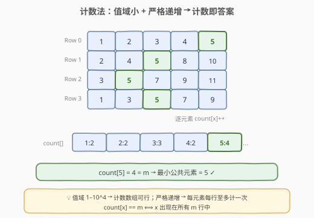
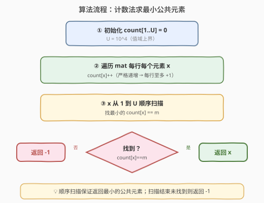
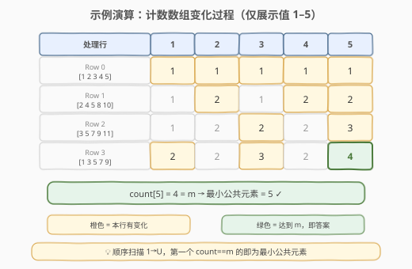

# 找出所有行中最小公共元素

- **题目名称**：找出所有行中最小公共元素
- **链接**：[1198. 找出所有行中最小公共元素](https://leetcode.cn/problems/find-smallest-common-element-in-all-rows/)
- **难度**：简单
- **标签**：数组、哈希表、二分查找

## 1. 题目概述

给定一个 `m × n` 的矩阵 `mat`，其中**每一行都已按严格递增顺序排序**。返回所有行中**最小的公共元素**；如果不存在公共元素，返回 `-1`。

**示例 1**：

```text
输入：mat = [[1,2,3,4,5],[2,4,5,8,10],[3,5,7,9,11],[1,3,5,7,9]]
输出：5
解释：5 是唯一出现在所有行中的元素。
```

**示例 2**：

```text
输入：mat = [[1,2,3],[2,3,4],[2,3,6]]
输出：2
解释：2 和 3 都出现在所有行中，最小的是 2。
```

**示例 3**：

```text
输入：mat = [[1,2,3],[4,5,6],[7,8,9]]
输出：-1
解释：三行互不相交，没有公共元素。
```

**约束条件**：

- `1 <= mat.length, mat[i].length <= 500`
- `1 <= mat[i][j] <= 10^4`
- `mat[i]` 已按**严格递增**顺序排序

> 💡 两个关键约束决定了最优解法：**值域小**（$1$ – $10^4$）使得计数数组可行；**严格递增**意味着同一值在同一行至多出现一次，`count[x]` 精确等于「包含 `x` 的行数」。

---

## 2. 解题思路

### 2.1 暴力思路

遍历第 0 行的每个元素 `candidate`（因第 0 行有序，天然从小到大），对每个 `candidate` 在其余 $m-1$ 行中做**二分查找**。第一个在所有行中都找到的 `candidate` 即为答案。

```text
for candidate in row 0:          # n 个候选
    for row 1..m-1:              # m-1 行
        binary_search(row, candidate)  # O(log n)
```

时间 $O(n \cdot m \cdot \log n)$，空间 $O(1)$。对 $n, m \le 500$ 约 $500 \times 500 \times 9 \approx 2.25 \times 10^6$，可通过。但利用值域约束还能做得更简洁。

> ⚠️ 暴力法不需要额外空间，代码最短，但在值域较小时并非最优——计数法能把时间降到 $O(m \cdot n)$ 且无需二分。

### 2.2 核心观察：计数法——值域小 + 严格递增



**两个关键观察**：

1. **值域小**：$1 \le \text{mat}[i][j] \le 10^4$，只需一个长度 $10001$ 的计数数组 `count[]`，空间约 $40\text{KB}$，远小于矩阵本身。

2. **严格递增 → 每行无重复**：同一值在同一行至多出现一次，因此 `count[x]` 精确等于「包含 `x` 的**行数**」，而非「出现总次数」。无需任何去重操作。

$$\text{count}[x] == m \quad \Longleftrightarrow \quad x \text{ 出现在所有 } m \text{ 行中}$$

> 💡 **若行内允许重复**（非严格递增），`count[x]` 会超过实际行数，需改用哈希集合逐行去重后再计数。本题严格递增，直接累加即可。

**算法**：遍历整个矩阵累加 `count`，然后从 $x = 1$ 到 $U$（$U = 10^4$）顺序扫描，第一个 `count[x] == m` 的 $x$ 即为**最小公共元素**。顺序扫描天然保证「最小」。

> ⚠️ **为什么顺序扫描能保证最小？** `count` 数组按值从小到大扫描，遇到的第一个满足 `count == m` 的值就是值域中最小的公共元素，无需额外排序或比较。

### 2.3 算法流程图



**完整步骤**：

1. **初始化**：`count[1..U] = 0`，$U = 10^4$。
2. **计数**：遍历 `mat` 每行每个元素 `x`，执行 `count[x]++`。
3. **扫描**：`x` 从 $1$ 到 $U$ 顺序扫描，找最小的 `count[x] == m`。
4. **判定**：找到则返回 `x`；扫描结束未找到则返回 `-1`。

### 2.4 示例演算

以 `mat = [[1,2,3,4,5],[2,4,5,8,10],[3,5,7,9,11],[1,3,5,7,9]]`、`m = 4` 为例：



逐行处理后的 `count` 变化（仅展示值 $1$ – $5$）：

| 处理行 | 值 1 | 值 2 | 值 3 | 值 4 | **值 5** | 说明 |
|--------|------|------|------|------|----------|------|
| Row 0 `[1,2,3,4,5]` | 1 | 1 | 1 | 1 | 1 | 5 个值首次出现 |
| Row 1 `[2,4,5,8,10]` | 1 | 2 | 1 | 2 | 2 | 2、4、5 各 +1 |
| Row 2 `[3,5,7,9,11]` | 1 | 2 | 2 | 2 | 3 | 3、5 各 +1 |
| Row 3 `[1,3,5,7,9]` | 2 | 2 | 3 | 2 | **4** | 5 达到 $m=4$ ✓ |

扫描 $x = 1, 2, 3, 4, 5$ 时，`count[1]=2, count[2]=2, count[3]=3, count[4]=2, count[5]=4`。`count[5] == 4 == m`，返回 `5`。

> 💡 值 $7, 8, 9, 10, 11$ 的计数分别为 $2, 1, 2, 1, 1$，均小于 $m=4$，不构成公共元素。表中省略以聚焦关键变化。

---

## 3. 参考代码

### C++

```cpp
class Solution {
public:
    int smallestCommonElement(vector<vector<int>>& mat) {
        int m = mat.size(), n = mat[0].size();
        vector<int> count(10001, 0);
        for (int i = 0; i < m; i++) {
            for (int j = 0; j < n; j++) {
                count[mat[i][j]]++;
            }
        }
        for (int x = 1; x <= 10000; x++) {
            if (count[x] == m) {
                return x;
            }
        }
        return -1;
    }
};
```

> 💡 两次线性遍历：第一次遍历矩阵累加 `count`，第二次从 $1$ 到 $10^4$ 顺序扫描找第一个 `count == m`。严格递增保证每行每值至多 +1，`count[x]` 即含 `x` 的行数。

### Python

```python
class Solution:
    def smallestCommonElement(self, mat: List[List[int]]) -> int:
        m = len(mat)
        count = [0] * 10001
        for row in mat:
            for x in row:
                count[x] += 1
        for x in range(1, 10001):
            if count[x] == m:
                return x
        return -1
```

> 💡 Python 版用 `[0] * 10001` 初始化计数数组，逻辑与 C++ 完全一致。也可用 `collections.Counter` 替代手动数组，但固定大小列表更直观且常数更小。

---

## 4. 复杂度分析

| 维度 | 复杂度 | 说明 |
|------|--------|------|
| 时间复杂度 | $O(m \cdot n + U)$ | 遍历矩阵 $O(m \cdot n)$ + 扫描值域 $O(U)$，其中 $U = 10^4$ |
| 空间复杂度 | $O(U)$ | 计数数组 `count[1..U]`，$U = 10^4$ |

> - $m$ = 矩阵行数，$n$ = 每行元素数，$U$ = 值域上界（$10^4$）。
> - 当 $m \cdot n \gg U$ 时（如 $m = n = 500$，$m \cdot n = 2.5 \times 10^5 \gg 10^4$），时间由矩阵遍历主导，扫描值域的 $O(U)$ 可忽略。
> - 空间 $O(10^4) \approx 40\text{KB}$，远优于哈希表的动态开销。
> - 若值域 $U$ 与 $m \cdot n$ 同阶或更大，计数法不再占优，应改用二分查找或多指针（见第 5 节）。

---

## 5. 扩展：二分查找法与多指针法

当值域不可控（如 $10^9$）时，计数数组不可行，需换用以下两种方法。

### 5.1 二分查找法

遍历第 0 行每个候选值（有序，天然从小到大），对其余 $m-1$ 行做二分查找。第一个在所有行中找到的候选即为答案。

```cpp
class Solution {
public:
    int smallestCommonElement(vector<vector<int>>& mat) {
        int m = mat.size(), n = mat[0].size();
        for (int j = 0; j < n; j++) {
            int candidate = mat[0][j];
            bool found = true;
            for (int i = 1; i < m; i++) {
                if (!binary_search(mat[i].begin(), mat[i].end(), candidate)) {
                    found = false;
                    break;
                }
            }
            if (found) return candidate;
        }
        return -1;
    }
};
```

时间 $O(n \cdot m \cdot \log n)$，空间 $O(1)$。代码最短，适合值域大且只需一个答案的场景。

### 5.2 多指针法（k-way merge）

为每行维护一个指针 `ptr[i]`，初始指向各行首元素。每轮：

1. 取各行当前指针指向值中的**最大值** `maxVal`。
2. 将所有指针指向值小于 `maxVal` 的行**前进**至 $\ge \text{maxVal}$。
3. 若某行越界 → 返回 `-1`；若所有行当前值都等于 `maxVal` → 返回 `maxVal`。

```cpp
class Solution {
public:
    int smallestCommonElement(vector<vector<int>>& mat) {
        int m = mat.size(), n = mat[0].size();
        vector<int> ptr(m, 0);
        while (true) {
            int maxVal = mat[0][ptr[0]];
            for (int i = 1; i < m; i++)
                maxVal = max(maxVal, mat[i][ptr[i]]);
            bool allMatch = true;
            for (int i = 0; i < m; i++) {
                while (ptr[i] < n && mat[i][ptr[i]] < maxVal)
                    ptr[i]++;
                if (ptr[i] == n) return -1;
                if (mat[i][ptr[i]] != maxVal) allMatch = false;
            }
            if (allMatch) return maxVal;
        }
    }
};
```

> 💡 **正确性**：若某行指针已超过值 $x$（`mat[i][ptr[i]] > x`），由于该行递增，后续值均 $> x$，故 $x$ 不可能出现在该行 → $x$ 不是公共元素。因此每轮将所有小于 `maxVal` 的指针推到 $\ge \text{maxVal}$，不会跳过任何公共元素。

时间 $O(m \cdot n)$（每个元素至多被访问一次），空间 $O(m)$（指针数组）。通用性最强，不依赖值域大小。

### 5.3 三种方法对比

| 方法 | 时间 | 空间 | 适用场景 |
|------|------|------|----------|
| 计数法 | $O(mn + U)$ | $O(U)$ | 值域小（$U \ll mn$） |
| 二分查找 | $O(n \cdot m \log n)$ | $O(1)$ | 值域大、代码最简 |
| 多指针 | $O(m \cdot n)$ | $O(m)$ | 值域大、追求线性 |

---

## 6. 面试要点

1. **为什么能用计数法？值域有什么特殊性？**

   > 值域 $1$ – $10^4$，规模小，用长度 $10001$ 的数组即可记录每个值在所有行中出现的次数。空间仅 $O(10^4) \approx 40\text{KB}$，远小于矩阵本身的 $O(m \times n)$。若值域达 $10^9$，计数数组不可行。

2. **严格递增的条件如何被利用？**

   > 每行严格递增 → 同一值在同一行至多出现一次 → `count[x]` 精确等于「包含 `x` 的行数」，无需去重。若行内允许重复（非严格递增），`count[x]` 会超过实际行数，需改用哈希集合逐行去重后再计数。

3. **如果值域很大（如 $10^9$）怎么办？**

   > 改用二分查找法（$O(n \cdot m \cdot \log n)$，空间 $O(1)$）或多指针法（$O(m \cdot n)$，空间 $O(m)$）。二分法代码最短，多指针法时间最优但实现稍复杂。

4. **计数法 vs 二分查找 vs 多指针，如何选择？**

   > 值域小 → 计数法（最简洁、$O(m \cdot n)$）；值域大、只需一个答案 → 二分查找（$O(n \cdot m \cdot \log n)$，代码最短）；值域大、追求线性 → 多指针（$O(m \cdot n)$，通用性最强）。面试中先问清值域范围再选型。

5. **如何保证返回的是最小的公共元素？**

   > 计数法中 `x` 从 $1$ 到 $U$ **顺序扫描**，第一个 `count[x] == m` 的 `x` 即为值域最小公共元素。二分查找法中第 0 行严格递增，遍历候选天然从小到大，第一个在所有行找到的即为最小。多指针法中 `maxVal` 每轮单调递增，命中时即为当前最小公共值。

> 💡 **一句话总结**：1198 是「**值域计数**」的招牌题——值域小（$10^4$）+ 严格递增（每行无重复），用计数数组一次遍历累加、一次顺序扫描即可找到最小公共元素。$O(mn + U)$ / $O(U)$，核心是把「多行求交集」转化为「值域频率统计」。

---

## 7. 同类练习题

- [349. 两个数组的交集](https://leetcode.cn/problems/intersection-of-two-arrays/)：两数组求交集的哈希/计数版，1198 的 $m=2$ 退化情形
- [1002. 查找共用字符](https://leetcode.cn/problems/find-common-characters/)：多字符串求共用字符，用计数取最小频率（计数法在字符串场景的推广）
- [1122. 数组的相对排序](https://leetcode.cn/problems/relative-sort-array/)（[题解](../1101-1200/1122_数组的相对排序.md)）：值域计数排序，与 1198 同样利用小值域建桶
- [697. 数组的度](https://leetcode.cn/problems/degree-of-an-array/)：频率计数求数组度，计数数组在数组属性统计中的应用
- [378. 有序矩阵中第K小的元素](https://leetcode.cn/problems/kth-smallest-element-in-a-sorted-matrix/)（[题解](../0301-0400/378_有序矩阵中第K小的元素.md)）：同样利用矩阵行列有序性质，多指针/二分值域思路
