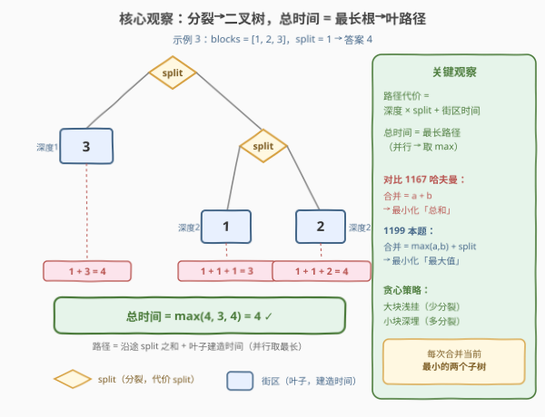
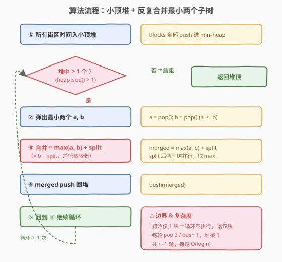

# 建造街区的最短时间

- **题目名称**：建造街区的最短时间
- **链接**：[1199. 建造街区的最短时间](https://leetcode.cn/problems/minimum-time-to-build-blocks/)
- **难度**：困难
- **标签**：贪心、堆、树、哈夫曼思想

## 1. 题目概述

给定一个数组 `blocks`，其中 `blocks[i] = t` 表示第 `i` 个街区需要 `t` 单位时间建造。**每个街区只能由一个工人建造**。

初始只有一个工人。工人可以执行两种操作之一：

1. **分裂**：把自己变成两个工人（工人数量 +1），代价为 `split`。若多个工人同时分裂，它们**并行**进行，代价仍为 `split`。
2. **建造**：建造一个街区然后回家，代价为该街区的建造时间。

求建造**所有**街区所需的最短时间。

**示例 1**：

```text
输入：blocks = [1], split = 1
输出：1
解释：1 个工人建造 1 个街区，耗时 1。
```

**示例 2**：

```text
输入：blocks = [1,2], split = 5
输出：7
解释：先把 1 个工人分裂成 2 个（耗时 5），再各建一块，
      总时间 = 5 + max(1, 2) = 7。
```

**示例 3**：

```text
输入：blocks = [1,2,3], split = 1
输出：4
解释：先把 1 个工人分裂成 2 个（耗时 1），第一个去建第 3 块，
      第二个再分裂成 2 个（耗时 1）去建前两块。
      总时间 = 1 + max(3, 1 + max(1, 2)) = 4。
```

**约束条件**：

- `1 <= blocks.length <= 1000`
- `1 <= blocks[i] <= 10^5`
- `1 <= split <= 100`

> 💡 两个关键信号：① 工人**分裂**天然对应**二叉树内部节点**（代价 `split`），② 街区**建造**对应**叶子**（代价为建造时间）。工人在各分支上**并行**工作 ⇒ 总时间 = **最长的一条根→叶路径**。这是一个「最小化最大路径」的合并问题，与 [1167. 连接木棍的最低费用](../1101-1200/1167_连接木棍的最低费用.md) 的哈夫曼模型同源，但合并规则从「求和」变成了「取最大」。

---

## 2. 解题思路

### 2.1 暴力思路：枚举分裂树形态

一个工人要么建造、要么分裂，整个过程对应一棵**满二叉树**（每个内部节点 2 个孩子）：内部节点 = 分裂，叶子 = 建造街区。`n` 个街区的分裂树有 `n` 个叶子、`n-1` 个内部节点，树形态数为**卡特兰数**量级，`n=1000` 时完全不可枚举。

更直接的递归思路：记 `solve(opts)` 为「一个工人建造街区集合 `opts` 的最短时间」，则

$$\text{solve}(\text{opts}) = \min_{\text{partition } A \cup B} \big(\text{split} + \max(\text{solve}(A), \text{solve}(B))\big)$$

基准 `solve(\{b\}) = b`。但划分数随 $n$ 指数增长，不可行。需要抓住「最长路径」这个目标，发现**贪心**结构。

### 2.2 核心观察：分裂→二叉树，总时间 = 最长根→叶路径



**关键观察**：把分裂过程画成一棵二叉树。每个叶子（街区）的**完工时间**等于从根到该叶子路径上所有 `split` 之和，再加上它自己的建造时间。设叶子 $L$ 的深度（路径上 split 次数）为 $d_L$，则：

$$\text{path}(L) = d_L \cdot \text{split} + \text{block}(L)$$

由于各分支**并行**，总时间 = 所有叶子路径代价的**最大值**：

$$\text{answer} = \max_{L}\ \big(d_L \cdot \text{split} + \text{block}(L)\big)$$

目标是给 $n$ 个街区分配深度（构成合法二叉树），使这个最大值最小。直觉很清楚：**大块浅挂（少分裂）、小块深埋（多分裂）**。

**合并视角**：自底向上看，把两个完工时间为 $T_1 \le T_2$ 的子树合并（先分裂出一个工人给左子树、一个给右子树，再并行），合并后的完工时间为：

$$\text{merge}(T_1, T_2) = \text{split} + \max(T_1, T_2) = \text{split} + T_2$$

这与哈夫曼编码的合并 $\text{merge}=T_1+T_2$ 形式一致，只是把「求和」换成了「取最大」。**贪心策略**：每次合并当前**完工时间最小的两个子树**。

> ⚠️ **贪心正确性的交换论证**：设 $a \le b$ 为当前最小的两个完工时间。在任意最优树中，取一个**最深**的内部节点 $v$（其两个孩子是叶子），设其孩子为 $x \le y$。因 $a,b$ 是全局最小，有 $a \le x$、$b \le y$。把 $a,b$ 与 $x,y$ 位置对换，让 $a,b$ 成为 $v$ 的孩子（沉到最深）：
>
> - $a$ 的新路径 $= D\cdot\text{split}+a \le D\cdot\text{split}+x$（$x$ 的旧路径）$\le \text{OPT}$；
> - $b$ 的新路径 $= D\cdot\text{split}+b \le D\cdot\text{split}+y$（$y$ 的旧路径）$\le \text{OPT}$；
> - $x,y$ 上浮到更浅位置，路径只减不增。
>
> 故对换后最大值不超过 $\text{OPT}$，且 $a,b$ 成了最深处的兄弟。由归纳，**每次合并最小两个**等价于某个最优树。这与 [1167](../1101-1200/1167_连接木棍的最低费用.md) 的交换论证一脉相承——差别仅在于 1167 最小化「加权和」，本题最小化「最大路径」。

### 2.3 算法流程图



**完整步骤**：

1. **建堆**：把所有街区建造时间放入**小顶堆**。
2. **循环**（堆中元素 $> 1$ 时）：
   - 弹出最小两个 $a, b$（$a \le b$）
   - 计算合并后完工时间 `merged = max(a, b) + split`（$= b + \text{split}$）
   - 把 `merged` push 回堆
3. **返回**堆中最后一个元素。

> 💡 **循环次数**：每轮 `pop 2 + push 1`，堆净减 1，从 $n$ 个减到 1 个恰好 $n-1$ 轮。初始只有 1 个街区时循环不执行，直接返回该街区时间，与示例 1 一致。

### 2.4 示例演算

以 `blocks = [1, 2, 3]`、`split = 1` 为例：

![示例演算：blocks = [1, 2, 3]，split = 1，答案 4](../images/min_build_blocks_example_walkthrough.svg)

**逐步执行**：

| 步骤 | 堆状态 | 取出 a, b | 合并 max(a,b)+split | 说明 |
|------|--------|-----------|---------------------|------|
| 初始 | {1, 2, 3} | — | — | 全部入堆 |
| 第 1 次 | {3, 3} | 1, 2 | max(1,2)+1 = 3 | 合并 1,2 得 3 |
| 第 2 次 | {4} | 3, 3 | max(3,3)+1 = 4 | 合并两个 3 得 4 |
| 结束 | {4}（仅 1 个） | — | — | 答案 = 4 |

**对应合并树**：根（4）= `max(3, 3)+1`；左叶是街区 3，右子树（3）= `max(1, 2)+1`，其孩子是街区 1、2。路径代价：街区 3 = $1\cdot1+3=4$，街区 1 = $2\cdot1+1=3$，街区 2 = $2\cdot1+2=4$，最大值 $4$，与结果一致。

> 💡 **与官方公式对照**：示例 3 解释中的 `1 + max(3, 1 + max(1, 2))` 正是递归合并 `split + max(T₁, T₂)`——先合并 1,2 得 `1+max(1,2)=3`，再合并 3 与 3 得 `1+max(3,3)=4`，与堆模拟完全一致。

---

## 3. 参考代码

### C++

```cpp
// 建造街区的最短时间.cpp —— 小顶堆贪心（min-max 合并）
// 编译: g++ -O2 -std=c++17 建造街区的最短时间.cpp -o buildblocks
#include <vector>
#include <queue>
#include <algorithm>
class Solution {
public:
    int minBuildTime(vector<int>& blocks, int split) {
        // greater<int> 使 priority_queue 成为小顶堆
        priority_queue<int, vector<int>, greater<int>> pq(blocks.begin(), blocks.end());

        while (pq.size() > 1) {
            int a = pq.top(); pq.pop();   // 最小
            int b = pq.top(); pq.pop();   // 次小 (a <= b)
            // 合并后完工时间 = split + max(a, b) = split + b
            pq.push(max(a, b) + split);
        }
        return pq.top();
    }
};
```

### Python

```python
class Solution:
    def minBuildTime(self, blocks: List[int], split: int) -> int:
        import heapq
        heapq.heapify(blocks)                       # 原地建小顶堆，O(n)
        while len(blocks) > 1:
            a = heapq.heappop(blocks)               # 最小
            b = heapq.heappop(blocks)               # 次小 (a <= b)
            heapq.heappush(blocks, max(a, b) + split)  # = b + split
        return blocks[0]
```

> 💡 **实现细节**：① `a` 先弹出故 $a \le b$，`max(a,b)` 恒为 $b$，写 `max(a,b)+split` 是为显式呼应合并公式，等价于 `b + split`。② Python `heapify` 原地建堆 $O(n)$，比逐个 push 更优。③ `blocks` 长度为 1 时 `while len > 1` 直接跳过，返回该块时间。④ 结果上界：最坏每个块被叠加 $O(n)$ 次 `split`，$n=1000,\ \text{split}=100$ 时约 $10^5$，远在 `int` 范围内，无需 `long long`。

---

## 4. 复杂度分析

| 维度 | 小顶堆贪心 | 暴力枚举 |
|------|-----------|----------|
| **时间** | $O(n \log n)$ | $O(\text{卡特兰数})$ 指数级 |
| **空间** | $O(n)$ | $O(n)$ 递归栈 |
| **正确性** | ✓ 交换论证最优 | ✓ 但不可行 |

> ⚠️ **时间 $O(n \log n)$**：建堆 $O(n)$，循环 $n-1$ 轮，每轮 2 次 `pop` + 1 次 `push`，各 $O(\log n)$，共 $O(n \log n)$。$n=1000$ 时约 $1000 \times 10 \approx 10^4$ 次堆操作，轻松通过。
>
> - $n$ = 街区数，`split` = 分裂代价。
> - 空间 $O(n)$ 为小顶堆本身。
> - 合并树高度最坏 $O(n)$（当街区间距极大、每次合并值总大于剩余所有元素时退化为链），但不影响堆操作次数。

---

## 5. 扩展：区间 DP 与哈夫曼对比

### 5.1 区间 DP（$O(n^3)$）

将 `blocks` **排序**后，可证明存在一棵最优合并树，其每个子树对应排序数组的**连续区间**（非连续划分总能通过「移动边界」调整为连续而不增加最大路径）。于是定义：

$$\text{dp}[l][r] = \text{一个工人建造排序后 } blocks[l..r] \text{ 的最短时间}$$

- 基准：$\text{dp}[i][i] = blocks[i]$
- 转移：$\text{dp}[l][r] = \min_{k=l}^{r-1}\big(\text{split} + \max(\text{dp}[l][k],\ \text{dp}[k+1][r])\big)$
- 答案：$\text{dp}[0][n-1]$

```cpp
class Solution {
public:
    int minBuildTime(vector<int>& blocks, int split) {
        sort(blocks.begin(), blocks.end());
        int n = blocks.size();
        vector<vector<int>> dp(n, vector<int>(n, 0));
        for (int i = 0; i < n; i++) dp[i][i] = blocks[i];
        for (int len = 2; len <= n; len++) {
            for (int l = 0; l + len <= n; l++) {
                int r = l + len - 1;
                dp[l][r] = INT_MAX;
                for (int k = l; k < r; k++)
                    dp[l][r] = min(dp[l][r], split + max(dp[l][k], dp[k + 1][r]));
            }
        }
        return dp[0][n - 1];
    }
};
```

时间 $O(n^3)$、空间 $O(n^2)$（可滚动到 $O(n)$）。利用最优 $k$ 的单调性还能优化到 $O(n^2)$（Knuth 优化），但 $n=1000$ 时 $O(n^3)=10^9$ 已超时，故**堆贪心 $O(n\log n)$ 才是正解**，区间 DP 仅作思路对照。

### 5.2 与 1167 哈夫曼的本质对比

两题都是「小顶堆每次合并最小两个」，但合并规则与优化目标不同：

| 维度 | 1167 连接木棍（哈夫曼） | 1199 建造街区（本题） |
|------|------------------------|----------------------|
| 合并规则 | $\text{merge} = a + b$ | $\text{merge} = \max(a, b) + \text{split}$ |
| 优化目标 | 最小化**总和** $\sum \text{stick} \times \text{depth}$ | 最小化**最大路径** $\max(d\cdot\text{split}+\text{block})$ |
| 合并值含义 | 新棒长度（被反复累加） | 子树完工时间（并行取较长） |
| 贪心正确性 | 交换论证（加权和） | 交换论证（最大路径） |
| 累加方向 | 合并值进 total | 合并值回堆，最终根值即答案 |

> 💡 **一句话区分**：1167 关心「所有合并的**总代价**」（求和），1199 关心「最长一条路径的**代价**」（取最大）。两题贪心都是「最小两根先合并、深埋底层」，但 1167 累加 `a+b` 进总和，1199 用 `max(a,b)+split` 覆盖子树完工时间。

---

## 6. 面试要点

1. **为什么把分裂建模成二叉树？总时间为什么是最大路径？**

   > 每次分裂产生两个并行工作的工人，对应二叉树的一个内部节点（代价 `split`）；建造街区对应叶子（代价为建造时间）。各分支并行进行，总时间由**最慢的那条分支**决定，即所有根→叶路径代价的最大值 $\max(d_L \cdot \text{split} + \text{block}_L)$。

2. **为什么每次合并最小的两个子树是最优的？如何证明？**

   > 交换论证：设 $a \le b$ 为当前最小两个完工时间。在最优树中取最深的内部节点（孩子 $x \le y$），因 $a \le x$、$b \le y$，把 $a,b$ 与 $x,y$ 对换让 $a,b$ 沉到最深：$a$ 的新路径 $\le x$ 的旧路径、$b$ 的新路径 $\le y$ 的旧路径，$x,y$ 上浮路径只减不增，故最大值不增。因此最小两个总能成为最深兄弟，归纳即得贪心最优。

3. **合并公式为什么是 `max(a,b)+split` 而不是 `a+b`？**

   > 分裂耗时 `split` 后两子树**并行**完工，合并子树的完工时间 = `split` + 较慢那棵的完工时间 = `split + max(a,b)`。若用 `a+b`（求和）那是 [1167](../1101-1200/1167_连接木棍的最低费用.md) 的总代价模型，对应「串行累加」，与本题「并行取最长」不符。

4. **为什么不用排序 + 双指针，而用小顶堆？**

   > 合并产生的新值要插回候选集。排序数组插入是 $O(n)$；双指针无法高效维护动态插入的有序性。小顶堆天然支持 $O(\log n)$ 取最小与插入，$n-1$ 轮共 $O(n\log n)$，是最自然的容器。

5. **初始只有 1 个街区时返回什么？为什么循环条件是 `size > 1`？**

   > 返回该街区自己的建造时间。只有 1 个无需分裂，`while (pq.size() > 1)` 直接跳过，`pq.top()` 即为该块时间，与示例 1（`blocks=[1]` 返回 1）一致，无需特判。

> 💡 **一句话总结**：1199 是「**最小化最大路径**」的合并招牌题——分裂即二叉树内部节点、建造即叶子、并行取最长路径。用小顶堆每次合并最小两个子树（`merge = max(a,b)+split`），循环 $n-1$ 次即得答案。$O(n\log n)$ 时间、$O(n)$ 空间，与 1167 哈夫曼同源但合并规则从「求和」变「取最大」。

---

## 7. 同类练习题

- [1167. 连接木棍的最低费用](https://leetcode.cn/problems/minimum-cost-to-connect-sticks/)（[题解](../1101-1200/1167_连接木棍的最低费用.md)）：同属「小顶堆每次合并最小两个」的哈夫曼模型，但合并 = `a+b`、目标是最小化总代价，对照本题理解「求和 vs 取最大」
- [1046. 最后一块石头的重量](https://leetcode.cn/problems/last-stone-weight/)（[题解](../1001-1100/1046_最后一块石头的重量.md)）：同样用堆模拟「每次取两块」，但合并规则是相消（差值），不追求最小化目标
- [502. IPO](https://leetcode.cn/problems/ipo/)（[题解](../0501-0600/502_IPO.md)）：同为「堆维护可选集 + 贪心逐次取最优」范式，大顶堆取最大利润 + 解锁机制
- [1000. 合并石头的最低成本](https://leetcode.cn/problems/minimum-cost-to-merge-stones/)：K 堆合一堆 + 连续区间约束，贪心失效退化为区间 DP，对照理解「无约束贪心 vs 区间 DP」的边界
- [23. 合并 K 个升序链表](https://leetcode.cn/problems/merge-k-sorted-lists/)：小顶堆多路归并，复用「堆维护候选集逐次取最小」的堆使用技巧
