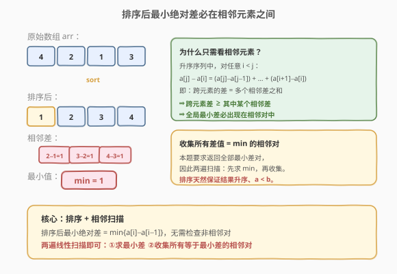
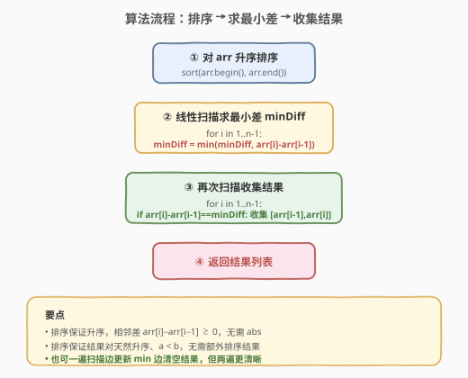

# 最小绝对差

- **题目名称**：最小绝对差
- **链接**：[1200. 最小绝对差](https://leetcode.cn/problems/minimum-absolute-difference/)
- **难度**：简单
- **标签**：数组、排序

## 1. 题目概述

给定一个**互不相同**的整数数组 `arr`，找出其中**绝对差最小的**所有元素对，并以升序返回（按对的顺序）。每个对 `[a, b]` 满足：

- `a`、`b` 来自 `arr`
- `a < b`
- `b - a` 等于数组中任意两元素的最小绝对差

**示例 1**：

```text
输入：arr = [4,2,1,3]
输出：[[1,2],[2,3],[3,4]]
解释：最小绝对差为 1，升序排列后相邻对 (1,2)、(2,3)、(3,4) 的差均为 1。
```

**示例 2**：

```text
输入：arr = [1,3,6,10,15]
输出：[[1,3]]
解释：最小绝对差为 2，只有 (1,3) 这一对。
```

**示例 3**：

```text
输入：arr = [3,8,-10,23,19,-4,-14,27]
输出：[[-14,-10],[19,23],[23,27]]
解释：最小绝对差为 4，共三对。
```

**约束条件**：

- $2 \le \text{arr.length} \le 10^5$
- $-10^9 \le \text{arr[i]} \le 10^9$

> 💡 元素互不相同是关键——它保证任意相邻差 $> 0$，不会出现差为 0 的退化情况。

---

## 2. 解题思路

### 2.1 暴力思路：两两枚举

最直觉的做法是枚举所有 $\binom{n}{2}$ 个元素对，计算每对的绝对差，取最小值后再收集所有等于最小值的对。

> ⚠️ 此法时间 $O(n^2)$，当 $n = 10^5$ 时约 $10^{10}$ 次操作，**必然超时**。问题出在"无序数组中找最近的两点"没有利用任何顺序信息。

### 2.2 核心观察：排序后最小差必在相邻元素间



将数组**升序排序**后，最小绝对差一定出现在**某对相邻元素**之间，无需检查非相邻对。

**为什么？** 对升序序列中任意 $i < j$：

$$a_j - a_i = \sum_{k=i+1}^{j}(a_k - a_{k-1})$$

即跨元素的差等于多个相邻差之和。因为所有相邻差为正（元素互不相同），所以：

$$a_j - a_i \geq \min_{k}\,(a_k - a_{k-1})$$

> 💡 也就是说，**任何跨元素对的差都不会小于某个相邻对的差**。全局最小差必然出现在相邻对中。这个性质与 [530. 二叉搜索树的最小绝对差](../0501-0600/530_二叉搜索树的最小绝对差.md) 完全同构——BST 中序遍历即升序，所以 530 也是在"相邻中序值"之间找最小差。

### 2.3 算法流程图



**完整步骤**：

1. **排序**：对 `arr` 升序排序。
2. **求最小差**：线性扫描相邻对，维护 `minDiff = min(minDiff, arr[i] - arr[i-1])`。
3. **收集结果**：再次扫描相邻对，凡 `arr[i] - arr[i-1] == minDiff` 的，将 `[arr[i-1], arr[i]]` 加入结果。
4. **返回**结果列表。

> ⚠️ **排序带来的天然保证**：① 相邻差 `arr[i] - arr[i-1] ≥ 0`，无需 `abs`；② 结果对天然满足 `a < b` 且整体升序，无需后处理排序。

### 2.4 示例演算

以 `arr = [4,2,1,3]` 为例：

![示例演算：[4,2,1,3] 排序后两遍扫描](../images/min_abs_diff_walkthrough.svg)

**排序后**：`[1, 2, 3, 4]`

**第一遍——求 minDiff**：

| i | 相邻对 | 差值 | minDiff |
|---|--------|------|---------|
| 1 | (1, 2) | 1 | 1 |
| 2 | (2, 3) | 1 | 1 |
| 3 | (3, 4) | 1 | 1 |

**第二遍——收集差值 = 1 的对**：

| i | 相邻对 | 差值 | 是否收集 |
|---|--------|------|----------|
| 1 | (1, 2) | 1 | ✓ → `[1, 2]` |
| 2 | (2, 3) | 1 | ✓ → `[2, 3]` |
| 3 | (3, 4) | 1 | ✓ → `[3, 4]` |

**最终结果**：`[[1,2], [2,3], [3,4]]` ✓

---

## 3. 参考代码

### 方法一：排序 + 两遍扫描（推荐）

### C++

```cpp
class Solution {
public:
    vector<vector<int>> minimumAbsDifference(vector<int>& arr) {
        sort(arr.begin(), arr.end());

        int minDiff = INT_MAX;
        for (int i = 1; i < (int)arr.size(); ++i)
            minDiff = min(minDiff, arr[i] - arr[i - 1]);

        vector<vector<int>> res;
        for (int i = 1; i < (int)arr.size(); ++i)
            if (arr[i] - arr[i - 1] == minDiff)
                res.push_back({arr[i - 1], arr[i]});

        return res;
    }
};
```

### Python

```python
class Solution:
    def minimumAbsDifference(self, arr: List[int]) -> List[List[int]]:
        arr.sort()

        min_diff = min(b - a for a, b in pairwise(arr))

        return [[a, b] for a, b in pairwise(arr) if b - a == min_diff]
```

> 💡 **写法要点**：① Python 3.10+ 的 `itertools.pairwise` 直接生成相邻对，比手写 `range(1, n)` 更优雅；低版本可用 `zip(arr, arr[1:])` 替代。② C++ 用 `INT_MAX` 作初值，保证第一个相邻差必定更新它。③ 结果用 `{arr[i-1], arr[i]}` 初始化列表，一步到位。

### 方法二：排序 + 一遍扫描（边更新边收集）

### C++

```cpp
class Solution {
public:
    vector<vector<int>> minimumAbsDifference(vector<int>& arr) {
        sort(arr.begin(), arr.end());

        int minDiff = INT_MAX;
        vector<vector<int>> res;

        for (int i = 1; i < (int)arr.size(); ++i) {
            int d = arr[i] - arr[i - 1];
            if (d < minDiff) {
                minDiff = d;
                res.clear();
                res.push_back({arr[i - 1], arr[i]});
            } else if (d == minDiff) {
                res.push_back({arr[i - 1], arr[i]});
            }
        }
        return res;
    }
};
```

### Python

```python
class Solution:
    def minimumAbsDifference(self, arr: List[int]) -> List[List[int]]:
        arr.sort()

        min_diff = float('inf')
        res = []

        for a, b in zip(arr, arr[1:]):
            d = b - a
            if d < min_diff:
                min_diff = d
                res = [[a, b]]
            elif d == min_diff:
                res.append([a, b])

        return res
```

> 💡 **一遍扫描 vs 两遍扫描**：一遍法遇到更小差时 `clear()` 已收集结果，逻辑稍复杂但只扫一次。两遍法逻辑更清晰，且因为数组已在内存中，第二遍扫描缓存友好。两者时间复杂度同为 $O(n)$，面试任选其一即可，推荐两遍法可读性更佳。

---

## 4. 复杂度分析

| 维度 | 方法 | 复杂度 | 说明 |
|------|------|--------|------|
| 时间复杂度 | 排序 + 两遍扫描 | $O(n \log n)$ | 排序 $O(n \log n)$ 主导，两遍扫描各 $O(n)$ |
| 空间复杂度 | 排序 + 两遍扫描 | $O(\log n)$ | 排序栈空间（C++ `sort` 为内省排序）；结果不计入 |
| 时间复杂度 | 排序 + 一遍扫描 | $O(n \log n)$ | 同上，扫描合并为单遍 $O(n)$ |
| 空间复杂度 | 排序 + 一遍扫描 | $O(\log n)$ | 同上 |

> ⚠️ 排序的 $O(n \log n)$ 是不可逾越的瓶颈——无序数组找最近点对的最优下界即 $\Omega(n \log n)$。因此本题时间复杂度由排序决定，扫描部分 $O(n)$ 不影响整体量级。

---

## 5. 扩展：桶排序优化（值域有界时）

若题目额外约束值域较小（如 $-10^5 \le \text{arr[i]} \le 10^5$），可用**桶排序**将排序降为 $O(n + K)$（$K$ 为值域宽度）：

1. 建大小为 $K$ 的布尔数组标记每个值是否存在。
2. 从小到大扫描值域，收集出现的元素——天然升序。
3. 后续求最小差与收集逻辑不变。

```python
def minimumAbsDifference(self, arr: List[int]) -> List[List[int]]:
    OFFSET = 10**5
    present = [False] * 200001
    for v in arr:
        present[v + OFFSET] = True

    sorted_arr = [v - OFFSET for v in range(200001) if present[v]]

    min_diff = min(b - a for a, b in zip(sorted_arr, sorted_arr[1:]))
    return [[a, b] for a, b in zip(sorted_arr, sorted_arr[1:]) if b - a == min_diff]
```

> ⚠️ 本题值域达 $2 \times 10^9$，桶排序不可行，$O(n \log n)$ 的比较排序是最优方案。桶排序思路仅在值域与 $n$ 同阶时才有优势。

---

## 6. 面试要点

1. **为什么排序后只需检查相邻元素？**

   > 升序序列中，任意跨元素对 $a_j - a_i$（$i < j$）等于中间所有相邻差之和，不小于其中最小的相邻差。因此全局最小差必出现在某对相邻元素之间。

2. **元素互不相同这个条件重要吗？**

   > 重要。它保证所有相邻差严格为正，使上述"和不小于单项"的论证成立。若有重复元素，最小差为 0，需收集所有相等对，思路仍成立但实现需处理去重。

3. **一遍扫描和两遍扫描哪个更好？**

   > 时间同为 $O(n)$。两遍法逻辑更清晰（先求 min 再收集），一遍法遇到更小差时需 `clear()` 重置结果。面试中推荐两遍法，可读性优先。

4. **结果需要额外排序吗？**

   > 不需要。排序后的数组天然升序，相邻对 `[arr[i-1], arr[i]]` 中 `arr[i-1] < arr[i]`，且按 `i` 递增收集时结果整体升序。排序"一石三鸟"：保证相邻差非负、保证对内升序、保证对间升序。

5. **和 530（BST 最小绝对差）的关系？**

   > 完全同构。BST 中序遍历得到升序序列，530 在"相邻中序值"之间找最小差，本题在"排序后相邻值"之间找最小差。区别在于 530 只需返回最小差值，本题需返回所有等于最小差的对。

> 💡 **一句话总结**：排序将"无序数组找最近点对"降为"相邻扫描"，$O(n^2) \to O(n \log n)$。两遍线性扫描分别求最小差与收集结果，排序天然保证结果的升序与对内 $a < b$。

---

## 7. 同类练习题

- [530. 二叉搜索树的最小绝对差](https://leetcode.cn/problems/minimum-absolute-difference-in-bst/)（[题解](../0501-0600/530_二叉搜索树的最小绝对差.md)）：BST 中序=升序，在相邻中序值间找最小差，与本题完全同构
- [1. 两数之和](https://leetcode.cn/problems/two-sum/)（[题解](../0001-0100/1_两数之和.md)）：数组中找满足条件的元素对，哈希表 $O(n)$ 解法，对照本题排序+扫描的思路差异
- [56. 合并区间](https://leetcode.cn/problems/merge-intervals/)（[题解](../0001-0100/56_合并区间.md)）：同为"排序后线性扫描"范式，排序消除无序性后用一遍扫描解决
- [2144. 打折购买糖果的最小开销](https://leetcode.cn/problems/minimum-cost-of-buying-candies-with-discount/)：排序后贪心购买，共享"排序改变处理顺序"的思路
- [2037. 使每位学生都有座位的最少移动次数](https://leetcode.cn/problems/minimum-number-of-moves-to-seat-everyone/)：排序后配对求最小总距离，同样依赖排序后相邻/对应配对最优
