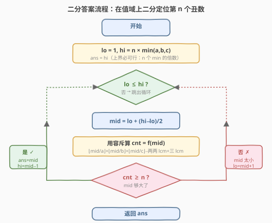
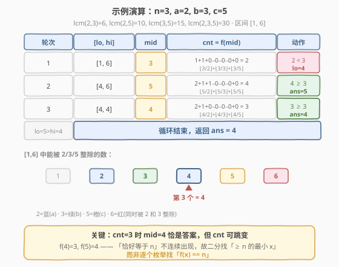

# LeetCode 丑数III 题解

## 1. 题目概述

- **标题 / 题号**：丑数III（#1201，medium）
- **链接**：https://leetcode.cn/problems/ugly-number-iii/
- **难度**：中等
- **标签**：数学、二分查找、二分答案、容斥原理

**题意**：给你四个整数 `n`、`a`、`b`、`c`，请你设计一个算法找出第 `n` 个「丑数」。

此处「丑数」的定义与 [264. 丑数 II](../0201-0300/264_丑数II.md) **不同**：**能被 `a` 或 `b` 或 `c` 至少一个整除的正整数**即为丑数。

**示例 1**：

```text
输入：n = 3, a = 2, b = 3, c = 5
输出：4
解释：能被 2/3/5 至少一个整除的丑数序列为 [2, 3, 4, 5, 6, ...]，第 3 个是 4。
```

**示例 2**：

```text
输入：n = 4, a = 2, b = 3, c = 4
输出：6
解释：丑数序列为 [2, 3, 4, 6, 8, 9, 10, ...]，第 4 个是 6。
```

**示例 3**：

```text
输入：n = 5, a = 2, b = 11, c = 13
输出：10
解释：丑数序列为 [2, 4, 6, 8, 10, 11, 12, 13, ...]，第 5 个是 10。
```

**约束**：

- $1 \le n \le 10^9$
- $1 \le a, b, c \le 10^9$

## 2. 解题思路

### 2.1 暴力思路：逐个枚举

从 `1` 开始逐个检查每个正整数是否能被 `a`、`b`、`c` 至少一个整除，数够 `n` 个即返回。单个检查 $O(1)$，但第 `n` 个丑数的值可能极大（`n`、`a` 都可达 $10^9$，答案上界约为 $n \times \min(a,b,c) \approx 10^{18}$），逐个枚举到该量级必然超时。

> ⚠️ 注意此题与 [264. 丑数 II](../0201-0300/264_丑数II.md) 的「三指针生成」思路**不通用**：264 的丑数定义是「只含质因数 2/3/5」，能通过乘法流有序生成；本题定义是「能被给定 `a/b/c` 整除」，候选是散布在数轴上的倍数，无法用乘法流归并枚举到第 $10^9$ 个。

换一个角度：与其**枚举每个数**判断它是不是丑数，不如反过来——**给定一个上界 `x`，快速算出 `[1, x]` 内有多少个丑数**，再用二分定位第 `n` 个。

### 2.2 核心观察：容斥原理 + 二分答案

![容斥原理：[1, x] 中能被 a/b/c 至少一个整除的个数](../images/ugly3_concept.svg)

定义 $f(x)$ = `[1, x]` 中能被 `a`、`b`、`c` 至少一个整除的正整数个数。由**容斥原理**（三集合并集）：

$$
f(x) = \left\lfloor \frac{x}{a} \right\rfloor + \left\lfloor \frac{x}{b} \right\rfloor + \left\lfloor \frac{x}{c} \right\rfloor - \left\lfloor \frac{x}{\text{lcm}(a,b)} \right\rfloor - \left\lfloor \frac{x}{\text{lcm}(a,c)} \right\rfloor - \left\lfloor \frac{x}{\text{lcm}(b,c)} \right\rfloor + \left\lfloor \frac{x}{\text{lcm}(a,b,c)} \right\rfloor
$$

其中 $\text{lcm}$ 为最小公倍数，$\text{lcm}(u,v) = u / \gcd(u,v) \times v$，三层同理递推。

**两个关键性质**：

1. **$f(x)$ 关于 $x$ 单调递增**：`x` 越大，`[1, x]` 范围越大，能被整除的数只增不减。这正是二分所需的**二段性**——存在分界点 $x^*$，使 $x < x^*$ 时 $f(x) < n$（不够 `n` 个）、$x \ge x^*$ 时 $f(x) \ge n$（够 `n` 个）。
2. **$O(1)$ 验证**：给定 `x`，套用上述公式一次算出 $f(x)$，常数次除法 + gcd，$O(\log \max(a,b,c))$。

于是把「求第 `n` 个丑数」转化为：在值域 $[1, \text{hi}]$ 上**二分答案**，找**最小的 `x` 使 $f(x) \ge n$**，该 `x` 即为答案。

> 💡 **二分上下界**：
> - **下界 `lo = 1`**：第 1 个丑数至少为 1（当 `a=1` 时第 1 个丑数就是 1）。
> - **上界 `hi = n × min(a, b, c)`**：`min(a,b,c)` 的倍数序列 `min, 2·min, ..., n·min` 全是丑数，前 `n` 个倍数已凑够 `n` 个丑数，故第 `n` 个丑数 $\le n \cdot \min(a,b,c)$。当 `n=10^9`、`min=10^9` 时 `hi` 可达 $10^{18}$，必须用 `long long`。

> ⚠️ **为什么找「$f(x) \ge n$ 的最小 `x`」而非「$f(x) = n$」？** 因为 $f(x)$ 在丑数间隙处**不变**、在丑数位置处**跳变**，`n` 对应的「恰好等于」可能不出现为一个独立 `x`。例如 `a=2,b=3,c=5` 时 $f(4)=3$、$f(5)=4$，`f=3` 只在 `x=4` 出现一次；但若 `n=4`，$f(5)=4$ 且 $f(6)=4$（6 同时被 2、3 整除，`f` 不增），「等于 4」的 `x` 有多个。二分找「$\ge n$ 的最小 `x`」能精确锁定该丑数本身（因为只有丑数位置才会让 `f` 首次达到 `n`）。

### 2.3 算法流程图



判定为「够 `n` 个」（$f(\text{mid}) \ge n$）时**先记录 `ans = mid` 再收缩右界**（`hi = mid - 1`），保证最终保留的是「最小的可行值」。

### 2.4 示例演算



以 `n=3, a=2, b=3, c=5` 为例。先算各 lcm：$\text{lcm}(2,3)=6$、$\text{lcm}(2,5)=10$、$\text{lcm}(3,5)=15$、$\text{lcm}(2,3,5)=30$。上界 $\text{hi} = 3 \times \min(2,3,5) = 6$，区间 `[1, 6]`：

| 轮次 | `[lo, hi]` | mid | $f(\text{mid})$ 计算 | cnt | 判定 | 动作 |
|------|-----------|-----|----------------------|-----|------|------|
| 1 | `[1, 6]` | 3 | $\lfloor3/2\rfloor+\lfloor3/3\rfloor+\lfloor3/5\rfloor = 1+1+0 = 2$ | 2 | $2 < 3$ ✗ | `lo = 4` |
| 2 | `[4, 6]` | 5 | $\lfloor5/2\rfloor+\lfloor5/3\rfloor+\lfloor5/5\rfloor = 2+1+1 = 4$ | 4 | $4 \ge 3$ ✓ | `ans = 5`, `hi = 4` |
| 3 | `[4, 4]` | 4 | $\lfloor4/2\rfloor+\lfloor4/3\rfloor+\lfloor4/5\rfloor = 2+1+0 = 3$ | 3 | $3 \ge 3$ ✓ | `ans = 4`, `hi = 3` |
| 4 | `lo=5 > hi=3` | — | — | — | 循环结束 | 返回 `ans = 4` |

`[1, 6]` 内丑数序列为 `[2, 3, 4, 5, 6]`，第 3 个确实是 `4`。

> 💡 **第 2、3 轮是关键**：`mid=5` 时 $f(5)=4 \ge 3$，记录 `ans=5` 但继续向左找更小值；`mid=4` 时 $f(4)=3 \ge 3$，更新 `ans=4`。最终 `4` 就是首次达到 `cnt ≥ 3` 的最小 `x`，恰为第 3 个丑数。注意 $f(4)=3$ 与 $f(5)=4$ 之间 `f` 跳变，正说明必须用「$\ge n$ 的最小」而非「$= n$」来定位。

## 3. 参考代码

### C++

```cpp
class Solution {
  public:
    int nthUglyNumber(int n, int a, int b, int c) {
        long long ab = lcm((long long)a, b);
        long long ac = lcm((long long)a, c);
        long long bc = lcm((long long)b, c);
        long long abc = lcm(ab, c);

        long long lo = 1;
        long long hi = (long long)n * min({a, b, c});
        long long ans = hi;

        while (lo <= hi) {
            long long mid = lo + (hi - lo) / 2;
            long long cnt = mid / a + mid / b + mid / c
                          - mid / ab - mid / ac - mid / bc
                          + mid / abc;
            if (cnt >= n) {
                ans = mid;        // 够 n 个，尝试更小
                hi = mid - 1;
            } else {
                lo = mid + 1;     // 不够 n 个，加大
            }
        }
        return (int)ans;
    }

  private:
    long long gcd(long long x, long long y) {
        while (y) { long long t = x % y; x = y; y = t; }
        return x;
    }
    long long lcm(long long x, long long y) {
        return x / gcd(x, y) * y;   // 先除后乘防溢出
    }
};
```

### Python

```python
import math

class Solution:
    def nthUglyNumber(self, n: int, a: int, b: int, c: int) -> int:
        ab = math.lcm(a, b)
        ac = math.lcm(a, c)
        bc = math.lcm(b, c)
        abc = math.lcm(ab, c)

        def count(x: int) -> int:
            return (x // a + x // b + x // c
                    - x // ab - x // ac - x // bc
                    + x // abc)

        lo, hi = 1, n * min(a, b, c)
        ans = hi
        while lo <= hi:
            mid = (lo + hi) // 2
            if count(mid) >= n:
                ans = mid       # 够 n 个，尝试更小
                hi = mid - 1
            else:
                lo = mid + 1    # 不够 n 个，加大
        return ans
```

> ⚠️ **三个易错点**：
> 1. **必须用 `long long`（C++）**：`hi` 可达 $10^{18}$，`int`（32 位，上限约 $2.1 \times 10^9$）会溢出。`lcm(a,b)` 当 `a=b=10^9` 互质时也达 $10^{18}$，全程用 64 位整数。
> 2. **lcm 先除后乘**：写 `a / gcd(a, b) * b` 而非 `a * b / gcd(a, b)`，避免 `a * b` 中间结果溢出（`10^9 × 10^9 = 10^{18}` 虽在 `long long` 范围内，但「先除后乘」是更稳妥的通用习惯，且在更窄类型下必须如此）。
> 3. **判定用 `cnt >= n` 而非 `cnt == n`**：`f(x)` 在丑数间隙处不变，`f(x) == n` 可能对应多个 `x`（含非丑数位置）。二分找「$\ge n$ 的最小 `x`」才能锁定丑数本身。

## 4. 复杂度分析

| 维度 | 复杂度 | 说明 |
|------|--------|------|
| 时间复杂度 | $O(\log(n \cdot \min(a,b,c)))$ | 二分次数为值域取对数，约 $\le 60$ 次（$10^{18} < 2^{60}$）；每次容斥 $O(1)$ 加若干 gcd，gcd 为 $O(\log \max(a,b,c))$ |
| 空间复杂度 | $O(1)$ | 仅常数个 `long long` 变量 |

> 💡 即便 `n = 10^9`、`a = b = c = 10^9`（最坏 `hi = 10^{18}`），二分也只需约 60 轮，每轮常数级运算，总量远低于时限。对比暴力逐个枚举（需扫描到 $10^{18}$ 量级）有天壤之别。

## 5. 扩展：容斥原理的正确性与 k 个数的推广

### 为什么容斥公式成立？

以两集合为例：`|A ∪ B| = |A| + |B| − |A ∩ B|`。被 `a` 整除的数集合 `A` 与被 `b` 整除的数集合 `B`，其交集 `A ∩ B` 即「同时被 `a` 和 `b` 整除」=「被 $\text{lcm}(a,b)$ 整除」。加 `|A| + |B|` 时交集被算了两次，需减一次。

三集合时，两两交集相减会多减掉三集合交集（`A ∩ B ∩ C`），故再加回一次，得：

$$
|A \cup B \cup C| = |A| + |B| + |C| - |A \cap B| - |A \cap C| - |B \cap C| + |A \cap B \cap C|
$$

这就是 $f(x)$ 公式的来源。每一项 $|A| = \lfloor x/a \rfloor$（`[1, x]` 内 `a` 的倍数个数）。

### 推广到 k 个除数

若除数有 `k` 个 $d_1, \dots, d_k$，容斥需枚举所有 $2^k - 1$ 个非空子集，对每个子集取其元素的 lcm 计算 $\lfloor x / \text{lcm} \rfloor$，按子集大小奇偶决定加减。本题 `k=3` 固定，故 7 项写死即可。`k` 较大时需位掩码枚举子集（$O(2^k)$ 每次验证），适合 `k` 较小（如 $\le 20$）的场景。

> 💡 **与 [264. 丑数 II](../0201-0300/264_丑数II.md) 的本质区别**：
> - **264**：丑数 = 只含质因数 2/3/5，候选是「乘法闭包」，用**生成法**（三指针多路归并）$O(n)$。
> - **1201**：丑数 = 能被给定 `a/b/c` 整除，候选是「除法筛选」，用**计数法**（容斥 + 二分）$O(\log \text{值域})$。
>
> 同为「第 n 个丑数」，定义不同导致解法分野。识别「定义决定方法」是关键。

## 6. 面试要点

1. **为什么能二分？二段性体现在哪？**

   - $f(x)$ = `[1, x]` 内丑数个数，随 `x` 单调递增。存在分界点 $x^*$，使 $x < x^*$ 时 $f(x) < n$（不够 `n` 个）、$x \ge x^*$ 时 $f(x) \ge n$。这种「左不够 / 右够」的结构就是二段性，可二分定位 $x^*$。

2. **上界为什么取 `n × min(a,b,c)`？**

   - `min(a,b,c)` 的前 `n` 个倍数 `min, 2·min, ..., n·min` 都是丑数（都至少能被 `min` 整除），故 `[1, n·min]` 内丑数个数 $\ge n$，第 `n` 个丑数必 $\le n \cdot \min(a,b,c)$。这是紧且正确的上界，避免取过松的值（如 `2×10^18`）增加无谓的二分轮数。

3. **为什么判定用 `cnt >= n` 而非 `cnt == n`？**

   - $f(x)$ 在两个相邻丑数之间不变（间隙内无新丑数），在一个丑数位置跳变。`f(x) == n` 可能对应多个 `x`（含非丑数位置），无法唯一定位。二分找「$\ge n$ 的最小 `x`」恰好落在使 `f` 首次达到 `n` 的那个丑数上，正是答案。

4. **容斥公式里为什么要加减交替？**

   - 并集计数需扣除被多次统计的交集：单个集合加，两两交集减（被加了两次需减一次），三集合交集加回（被三个两两交集各减一次共减三次，但原本只该减两次，故加回一次）。奇偶交替是「恰好计一次」的容斥原理。

5. **为什么必须用 `long long`？**

   - `n` 和 `a/b/c` 都可达 $10^9$，上界 `hi` 可达 $10^{18}$，超出 32 位 `int` 范围（约 $2.1 \times 10^9$）。`lcm` 计算同样可能产生 $10^{18}$ 量级的值。全程用 64 位整数，且 lcm 写成 `a / gcd * b` 先除后乘防中间溢出。

## 同类练习题

| # | 题目 | 与本题的关联 |
|---|------|-------------|
| 875 | [爱吃香蕉的珂珂](https://leetcode.cn/problems/koko-eating-bananas/) | 同套二分答案模板，二分吃香蕉速度 `k`，`check` 用向上取整求和，求最小可行 `k` |
| 1011 | [在 D 天内送达包裹的能力](https://leetcode.cn/problems/capacity-to-ship-packages-within-d-days/) | 二分运载能力，`check` 贪心装船，与本题同为「最小化满足单调条件的值」 |
| 264 | [丑数 II](https://leetcode.cn/problems/ugly-number-ii/) | 同题名但定义不同（乘法闭包 vs 除法筛选），用三指针生成法，对照理解「定义决定方法」 |
| 719 | [找出第 K 小的数对距离](https://leetcode.cn/problems/find-k-th-smallest-pair-distance/) | 二分距离上限 + 双指针统计 `≤ mid` 的数对数，同为「二分值域 + 计数验证」找第 k 小 |
| 252 | [会议室](https://leetcode.cn/problems/meeting-rooms/) | 容斥思想在其他场景的体现（区间重叠计数），巩固「并集 = 加减交替」的直觉 |
