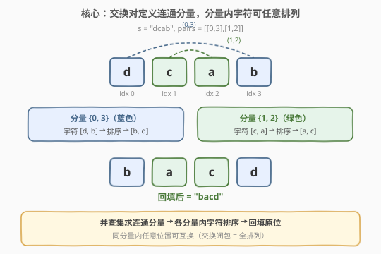
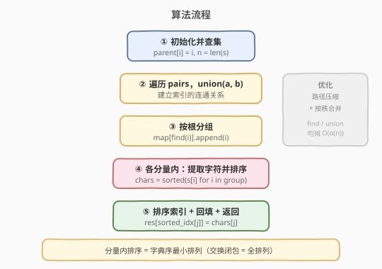
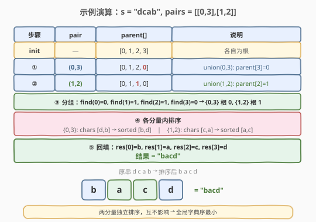

# 交换字符串中的元素

- **题目名称**：交换字符串中的元素
- **链接**：[1202. 交换字符串中的元素](https://leetcode.cn/problems/smallest-string-with-swaps/)
- **难度**：中等
- **标签**：并查集、哈希表、字符串、排序

## 1. 题目概述

给你一个字符串 `s`，以及该字符串中的一些「索引对」数组 `pairs`，其中 `pairs[i] = [a, b]` 表示字符串中的两个索引（编号从 0 开始）。

你可以 **任意多次交换** 在 `pairs` 中任意一对索引处的字符。返回在经过若干次交换后，`s` 可以变成的按**字典序最小**的字符串。

**示例 1**：

```text
输入：s = "dcab", pairs = [[0,3],[1,2]]
输出："bacd"
解释：
交换 s[0] 和 s[3], s = "bcad"
交换 s[1] 和 s[2], s = "bacd"
```

**示例 2**：

```text
输入：s = "dcab", pairs = [[0,3],[1,2],[0,2]]
输出："abcd"
解释：
交换 s[0] 和 s[3], s = "bcad"
交换 s[0] 和 s[2], s = "acbd"
交换 s[1] 和 s[2], s = "abcd"
```

**示例 3**：

```text
输入：s = "cba", pairs = [[0,1],[1,2]]
输出："abc"
解释：
交换 s[0] 和 s[1], s = "bca"
交换 s[1] 和 s[2], s = "bac"
交换 s[0] 和 s[1], s = "abc"
```

**约束条件**：

- $1 \leq \text{s.length} \leq 10^5$
- $0 \leq \text{pairs.length} \leq 10^5$
- $0 \leq \text{pairs[i][0]}, \text{pairs[i][1]} < \text{s.length}$
- `s` 中只含有小写英文字母

> 💡 关键观察：`pairs` 定义的不是「必须交换」，而是「**可以交换**」。任意多次交换意味着同一连通分量内的索引可以达成**任意排列**。因此问题转化为：找出连通分量 → 分量内排序 → 回填。

---

## 2. 解题思路

### 2.1 暴力思路：BFS 模拟交换

把字符串状态看作图的节点，每次交换产生新状态，BFS 搜索所有可达状态取字典序最小。但字符串长度可达 $10^5$，状态空间为 $n!$，完全不可行。

退一步，直接模拟「能换就换」也行不通——交换的顺序会影响最终结果，贪心地按字典序交换不保证全局最优（可能需要先做一次「次优」交换来解锁更优的位置）。

### 2.2 核心观察：并查集 + 连通分量内排序



**关键性质**：`pairs` 中的每对 `[a, b]` 表示索引 `a` 和 `b` 可以交换。由于可以**任意多次**交换，连通的索引集合（通过传递性）构成一个**连通分量**，分量内的字符可以达成**任意排列**。

> 💡 **为什么连通分量内可以达成任意排列？** 这是一个经典结论：给定一张图，图上能通过交换边两端元素得到的排列集合，恰好是各连通分量内的**全对称群**（即分量内任意排列都可达成）。证明思路：在连通分量内任取两点 $u, v$，存在路径 $u \to x_1 \to x_2 \to \cdots \to x_k \to v$，沿路径逐个交换即可将 $u$ 的字符送到 $v$（类似冒泡传递），重复此过程可实现任意排列。

因此，**最优策略**就是：在每个连通分量内，将字符**排序**后放回——排序给出字典序最小的排列。

**算法三步走**：

1. **并查集建连通分量**：将每个 `pairs[i] = [a, b]` 做 `union(a, b)`，得到所有索引的连通分量。
2. **分组提取字符**：按根 `find(i)` 将索引分组，每组收集对应字符。
3. **排序回填**：每组字符排序，每组索引排序，将排序后的字符放回排序后的索引位置。

> ⚠️ **为什么要同时排序索引？** 因为一组内的索引顺序不固定（取决于 `find` 返回的根和遍历顺序），必须将索引也排序，才能将排序后的字符正确「对齐」放回原位。

### 2.3 算法流程图



### 2.4 示例演算



以 `s = "dcab"`, `pairs = [[0,3],[1,2]]` 为例：

| 步骤 | pair | parent[] | 说明 |
|------|------|----------|------|
| init | — | `[0, 1, 2, 3]` | 各自为根 |
| ① | (0,3) | `[0, 1, 2, 0]` | `union(0,3)`：`parent[3]=0` |
| ② | (1,2) | `[0, 1, 1, 0]` | `union(1,2)`：`parent[2]=1` |
| ③ | — | — | 分组：`find` 得 `{0,3}`→根 0，`{1,2}`→根 1 |
| ④ | — | — | `{0,3}`: chars `[d,b]`→sorted `[b,d]`；`{1,2}`: chars `[c,a]`→sorted `[a,c]` |
| ⑤ | — | — | 回填：`res[0]=b, res[1]=a, res[2]=c, res[3]=d` → `"bacd"` |

最终结果 `"bacd"`，与示例一致。

> 💡 **对比示例 2**：若再加入 `[0,2]`，则 `union(0,2)` 会合并 `{0,3}` 和 `{1,2}` 为一个大分量 `{0,1,2,3}`，全部字符 `[d,c,a,b]` 排序为 `[a,b,c,d]`，结果 `"abcd"`。这说明**连通分量的合并是关键**——多一条边可能把多个小分量合成大分量，排序自由度随之增大。

---

## 3. 参考代码

### C++

```cpp
class Solution {
public:
    vector<int> parent;
    vector<int> rank_;

    int find(int x) {
        if (parent[x] != x) parent[x] = find(parent[x]);  // 路径压缩
        return parent[x];
    }

    void unite(int x, int y) {
        int rx = find(x), ry = find(y);
        if (rx == ry) return;
        if (rank_[rx] < rank_[ry]) parent[rx] = ry;       // 按秩合并
        else if (rank_[rx] > rank_[ry]) parent[ry] = rx;
        else { parent[ry] = rx; rank_[rx]++; }
    }

    string smallestStringWithSwaps(string s, vector<vector<int>>& pairs) {
        int n = s.size();
        parent.resize(n);
        rank_.assign(n, 0);
        for (int i = 0; i < n; i++) parent[i] = i;

        for (auto& p : pairs) unite(p[0], p[1]);            // 建连通分量

        unordered_map<int, vector<int>> groups;             // root -> 索引列表
        for (int i = 0; i < n; i++) groups[find(i)].push_back(i);

        string res(n, ' ');
        for (auto& [root, idxs] : groups) {
            string chars;
            for (int i : idxs) chars.push_back(s[i]);
            sort(chars.begin(), chars.end());               // 字符排序
            sort(idxs.begin(), idxs.end());                 // 索引排序
            for (int j = 0; j < (int)idxs.size(); j++)
                res[idxs[j]] = chars[j];                    // 回填
        }
        return res;
    }
};
```

### Python

```python
class Solution:
    def smallestStringWithSwaps(self, s: str, pairs: List[List[int]]) -> str:
        n = len(s)
        parent = list(range(n))
        rank_ = [0] * n

        def find(x):
            while parent[x] != x:
                parent[x] = parent[parent[x]]   # 路径压缩（隔代压缩）
                x = parent[x]
            return x

        def union(x, y):
            rx, ry = find(x), find(y)
            if rx == ry:
                return
            if rank_[rx] < rank_[ry]:
                parent[rx] = ry
            elif rank_[rx] > rank_[ry]:
                parent[ry] = rx
            else:
                parent[ry] = rx
                rank_[rx] += 1

        for a, b in pairs:
            union(a, b)                          # 建连通分量

        groups = collections.defaultdict(list)
        for i in range(n):
            groups[find(i)].append(i)            # 按根分组

        res = list(s)
        for idxs in groups.values():
            chars = sorted(res[i] for i in idxs) # 字符排序
            idxs.sort()                          # 索引排序
            for i, c in zip(idxs, chars):
                res[i] = c                       # 回填
        return ''.join(res)
```

> 💡 **实现细节**：① Python 版用 `defaultdict(list)` 自动初始化分组列表。② 字符排序和索引排序分开做——字符按字典序排，索引按数值排，然后 `zip` 对齐回填。③ C++ 中 `unordered_map<int, vector<int>>` 的遍历顺序不影响正确性，因为每个分量独立处理。④ 注意 `find(i)` 在分组阶段再次调用，确保路径压缩后拿到正确的根。

---

## 4. 复杂度分析

| 维度 | 复杂度 | 说明 |
|------|--------|------|
| **时间** | $O(n \log n + m \cdot \alpha(n))$ | 并查集建图 $m$ 次 `union`，每次均摊 $O(\alpha(n))$；分组 $n$ 次 `find`；各分量内排序合计 $O(n \log n)$（最坏一个大分量） |
| **空间** | $O(n)$ | `parent`、`rank_` 数组 + 分组哈希表 + 结果数组 |

> 💡 由于 $\alpha(n) \leq 5$（实际范围内），并查集部分近似 $O(m)$；瓶颈在排序 $O(n \log n)$。$n, m \leq 10^5$ 时总计约 $10^5 \times 17 \approx 1.7 \times 10^6$，远在时限内。

---

## 5. 扩展：DFS 求连通分量

除了并查集，也可以用 **DFS/BFS** 求连通分量：建邻接表，对每个未访问节点做 DFS 标记整个分量。时间 $O(n + m)$，与并查集同阶。

```python
def smallestStringWithSwaps(self, s: str, pairs: List[List[int]]) -> str:
    n = len(s)
    adj = [[] for _ in range(n)]
    for a, b in pairs:
        adj[a].append(b)
        adj[b].append(a)

    res = list(s)
    visited = [False] * n
    for i in range(n):
        if visited[i]:
            continue
        comp = []
        stack = [i]
        visited[i] = True
        while stack:
            u = stack.pop()
            comp.append(u)
            for v in adj[u]:
                if not visited[v]:
                    visited[v] = True
                    stack.append(v)
        chars = sorted(res[j] for j in comp)
        comp.sort()
        for j, c in zip(comp, chars):
            res[j] = c
    return ''.join(res)
```

> 💡 **并查集 vs DFS/BFS**：并查集适合**动态加边**场景（边逐条给出且可能伴随查询）；DFS/BFS 适合**一次性建图后求全部分量**。本题两者均可，并查集更简洁且不需要建邻接表，空间常数更小。

---

## 6. 面试要点

1. **为什么连通分量内的字符可以达成任意排列？**

   > 连通分量内任两点间存在路径。沿路径逐个交换可将某位置的字符「冒泡」到任意目标位置，重复此过程即可实现任意排列。形式化地说，连通图上交换边两端元素可生成的排列群等于该分量上的全对称群 $S_k$（$k$ 为分量大小）。

2. **为什么要同时排序字符和索引？**

   > 分组后索引的顺序不固定（取决于遍历 / `find` 调用顺序），若不排序索引直接回填，排序后的字符可能放错位置。将索引排序后与排序后的字符 `zip` 对齐，保证最小的字符放到最小的索引位置。

3. **并查集的两个优化是什么？为什么需要？**

   > 路径压缩（`find` 时把路径上节点直接挂到根）和按秩合并（矮树挂高树下）。两者搭配使单次操作均摊 $O(\alpha(n))$，近似常数。不加优化时 `find` 可能退化为 $O(n)$ 链表。

4. **如果 `pairs` 为空，结果是什么？**

   > 每个索引自成独立分量，无法交换任何字符，结果就是原串 `s` 本身。代码中 `groups` 的每个 key 对应单元素列表，排序不改变内容。

5. **并查集和 DFS/BFS 求连通分量各有什么优劣？**

   > 并查集不需要建邻接表，空间更省（只需 `parent` 数组），且支持动态加边；DFS/BFS 需要建邻接表 $O(n + m)$ 空间，但不依赖 `find` 的递归栈（避免栈溢出）。$n = 10^5$ 时两者都可行，并查集代码更简洁。

> 💡 **一句话总结**：交换对定义连通分量，分量内可达成任意排列 → 并查集求分量 → 各分量内字符排序回填，$O(n \log n + m \cdot \alpha(n))$。本质是 [547. 省份数量](https://leetcode.cn/problems/number-of-provinces/) 并查集模板 + 分组排序的组合应用。

---

## 7. 同类练习题

- [547. 省份数量](https://leetcode.cn/problems/number-of-provinces/)：并查集模板题，统计连通分量个数
- [684. 冗余连接](https://leetcode.cn/problems/redundant-connection/)：并查集判环，union 失败即冗余边
- [721. 账户合并](https://leetcode.cn/problems/accounts-merge/)：并查集合并同名账户下的邮箱，分组后收集
- [765. 情侣牵手](https://leetcode.cn/problems/couples-holding-hands/)：并查集求连通分量，每分量需 swap 次数 = size − 1
- [990. 等式方程的可满足性](https://leetcode.cn/problems/satisfiability-of-equality-equations/)：先 union 等式、再查不等式是否冲突
