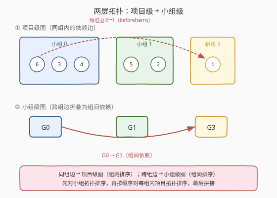
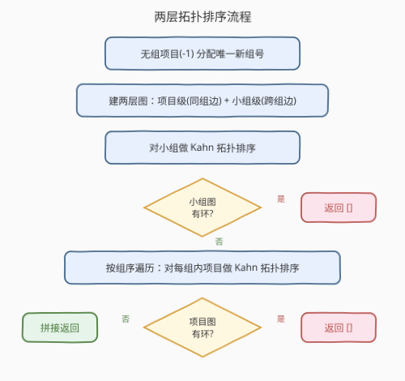
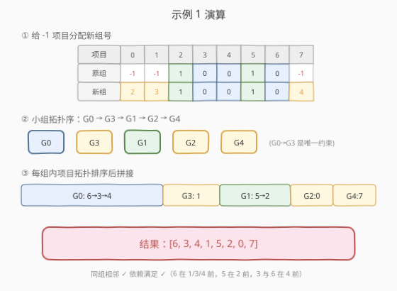

# LeetCode 项目管理 题解

## 1. 题目概述

- **标题 / 题号**：项目管理（#1203，hard）
- **链接**：https://leetcode.cn/problems/sort-items-by-groups-respecting-dependencies/
- **难度**：困难
- **标签**：深度优先搜索、广度优先搜索、图、拓扑排序

**题意**：有 `n` 个项目，每个项目或属于 `m` 个小组之一，或不属于任何小组（`group[i] == -1`）。项目之间存在依赖：`beforeItems[i]` 列出必须在第 `i` 个项目**之前**完成的所有项目。请返回一个项目排序，满足：

1. **同组相邻**：同一小组的项目在结果列表中必须连续排列；
2. **依赖满足**：`beforeItems[i]` 中的每个项目都排在第 `i` 个项目之前。

若无解则返回空列表。

**示例 1**：

```text
输入：n = 8, m = 2, group = [-1,-1,1,0,0,1,0,-1],
     beforeItems = [[],[6],[5],[6],[3,6],[],[],[]]
输出：[6,3,4,1,5,2,0,7]
解释：小组 0 的项目 {3,4,6} 相邻排列且内部 6→3→4；小组 1 的 {2,5} 内部 5→2；
     跨组依赖 6→1（项目 1 依赖项目 6）通过让小组 0 排在小组 3（项目 1 的新组）之前解决。
```

**示例 2**：

```text
输入：n = 8, m = 2, group = [-1,-1,1,0,0,1,0,-1],
     beforeItems = [[],[6],[5],[6],[3],[],[4],[]]
输出：[]
解释：项目 4 依赖项目 3，项目 6 依赖项目 4，项目 3 又依赖项目 6，形成 3→4→6→3 环，无解。
```

**约束**：

- `1 <= m <= n <= 3 * 10^4`
- `group.length == beforeItems.length == n`
- `-1 <= group[i] <= m - 1`
- `0 <= beforeItems[i].length <= n - 1`，`0 <= beforeItems[i][j] <= n - 1`，`i != beforeItems[i][j]`，无重复

> 💡 **两条约束的张力**：「同组相邻」是**位置约束**，「依赖顺序」是**先后约束**。直接对项目做一次拓扑排序无法保证同组项目连续——必须把问题拆成「组间排序」和「组内排序」两层。

## 2. 解题思路

### 2.1 暴力思路

对所有 `n!` 种排列枚举，逐个检查「同组相邻」与「依赖满足」——显然不可行。退一步：只做一次项目级拓扑排序能保证依赖，但同组项目会被其它组的项目「插队」，无法保证相邻。

关键障碍在于：**跨组依赖**（如项目 6 依赖项目 1，但两者不同组）会强迫一个小组整体排在另一个小组之前，这本质上是「小组之间也有先后」。因此需要把跨组依赖**折叠**到小组层面，先确定小组顺序，再在每个小组内部确定项目顺序。

### 2.2 核心观察：两层拓扑排序



核心思想是把排序分成两个层次：

**第一层 —— 小组级拓扑排序**：把每个依赖 `u → v`（`u` 在 `beforeItems[v]` 中）按所在小组分类：

- 若 `group[u] == group[v]`（同组），这条边是**组内依赖**，留到第二层处理；
- 若 `group[u] != group[v]`（跨组），把它折叠成**组间依赖** `group[u] → group[v]`。

对小组图做拓扑排序，得到小组的合法先后顺序。这样保证：只要按组序输出，跨组依赖自然满足。

**第二层 —— 组内项目拓扑排序**：按第一层得到的小组顺序逐组处理，对每个小组内部的项目做拓扑排序（只用组内边）。由于跨组依赖已被组序保证，组内排序只需关心同组项目间的先后。

> ⚠️ **无组项目（`group[i] == -1`）的处理**：题目要求「同组项目相邻」。一个无组项目本身就是一个「只含一个项目的组」，天然满足相邻约束。因此把每个 `-1` 项目分配一个**唯一的新组号**（从 `m` 开始递增），让它成为独立单元素组。这样所有项目都有组，两层框架统一适用。

> 💡 **为什么两层分别判环就够？** 跨组依赖只在组间图体现、组内依赖只在项目图体现，两层互不干扰。任一层出现环都意味着无解——组间环说明小组循环依赖，组内环说明同组项目循环依赖。

### 2.3 算法流程图



完整流程：

1. **分配新组号**：遍历项目，把 `group[i] == -1` 的项目依次赋予 `m, m+1, m+2, ...`，更新 `m` 为总组数。
2. **建两层图**：
   - `group_to_items[g]`：记录每个小组包含哪些项目；
   - 项目级图 `item_adj` / `item_indeg`：仅收录同组边 `u → v`；
   - 小组级图 `group_adj` / `group_indeg`：仅收录跨组边 `group[u] → group[v]`（注意去重，避免同一对组间重复边累加入度）。
3. **小组拓扑排序**（Kahn）：求小组合法序；若排序出的组数 `< 总组数`，说明组间有环，返回 `[]`。
4. **逐组项目拓扑排序**：按组序遍历每个小组，对其内部项目做 Kahn 拓扑排序；若某组排出的项目数 `< 该组项目数`，说明组内有环，返回 `[]`。
5. **拼接**：把各组的项目序列按组序首尾相接，得到最终答案。

> 💡 **跨组边去重**：同一对 `(group[u], group[v])` 可能由多条项目依赖产生。若不去重，`group_indeg` 会被多次累加，导致入度永远降不到 0 而误判为环。可用 `set` 记录已添加的组间边。

### 2.4 示例演算

以示例 1 为例：



**第一步：分配新组号**。`group = [-1,-1,1,0,0,1,0,-1]`，把三个 `-1`（项目 0、1、7）分别赋为组 2、3、4，总组数变为 5：

| 项目 | 0 | 1 | 2 | 3 | 4 | 5 | 6 | 7 |
|------|---|---|---|---|---|---|---|---|
| 原组 | -1 | -1 | 1 | 0 | 0 | 1 | 0 | -1 |
| 新组 | 2 | 3 | 1 | 0 | 0 | 1 | 0 | 4 |

小组构成：`G0={3,4,6}`、`G1={2,5}`、`G2={0}`、`G3={1}`、`G4={7}`。

**第二步：建两层图**。遍历 `beforeItems`：

| 依赖 `u→v` | group[u] | group[v] | 分类 |
|------------|----------|----------|------|
| 6→1 | 0 | 3 | 跨组 → `G0→G3` |
| 5→2 | 1 | 1 | 同组 → 项目图 |
| 6→3 | 0 | 0 | 同组 → 项目图 |
| 3→4 | 0 | 0 | 同组 → 项目图 |
| 6→4 | 0 | 0 | 同组 → 项目图 |

组间图只有一条边 `G0 → G3`；组内图：`G0` 内 `6→3, 3→4, 6→4`，`G1` 内 `5→2`。

**第三步：小组拓扑排序**。组 `G0` 入度 0，其余（除 `G3`）入度也 0，`G3` 入度 1。Kahn 排出一个合法组序（无组间环）：

$$
\text{组序} = [G0,\ G3,\ G1,\ G2,\ G4]
$$

> 💡 除 `G0→G3` 外各组互相独立，顺序任意，因此存在多种合法组序，对应多种合法答案。

**第四步：逐组项目拓扑排序**：

| 小组 | 组内项目 | 组内拓扑序 |
|------|----------|-----------|
| G0 | {3,4,6} | 6 → 3 → 4 |
| G3 | {1} | 1 |
| G1 | {2,5} | 5 → 2 |
| G2 | {0} | 0 |
| G4 | {7} | 7 |

**第五步：拼接**：

$$
\text{结果} = [6,3,4,\ 1,\ 5,2,\ 0,\ 7]
$$

验证：同组相邻 ✓；依赖 `6` 在 `1/3/4` 前 ✓、`5` 在 `2` 前 ✓、`3` 与 `6` 在 `4` 前 ✓。

## 3. 参考代码

### Python

```python
from collections import deque


class Solution:
    def sortItems(self, n: int, m: int, group: List[int],
                  beforeItems: List[List[int]]) -> List[int]:
        # ① 无组项目分配唯一新组号
        for i in range(n):
            if group[i] == -1:
                group[i] = m
                m += 1

        # ② 建两层图
        item_adj = [[] for _ in range(n)]
        item_indeg = [0] * n
        group_adj = [[] for _ in range(m)]
        group_indeg = [0] * m
        group_to_items = [[] for _ in range(m)]
        seen_group_edge = set()          # 组间边去重

        for i in range(n):
            group_to_items[group[i]].append(i)

        for v in range(n):
            for u in beforeItems[v]:     # 依赖 u -> v
                if group[u] == group[v]:
                    item_adj[u].append(v)
                    item_indeg[v] += 1
                else:
                    ga, gb = group[u], group[v]
                    if (ga, gb) not in seen_group_edge:
                        seen_group_edge.add((ga, gb))
                        group_adj[ga].append(gb)
                        group_indeg[gb] += 1

        # ③ 小组拓扑排序
        group_order = self._topoSort(group_adj, group_indeg, range(m))
        if group_order is None:
            return []

        # ④ 按组序逐组项目拓扑排序
        ans = []
        for g in group_order:
            items = group_to_items[g]
            if not items:
                continue
            order = self._topoSort(item_adj, item_indeg, items)
            if order is None:
                return []
            ans.extend(order)
        return ans

    def _topoSort(self, adj, indeg, nodes):
        nodes = list(nodes)
        q = deque([u for u in nodes if indeg[u] == 0])
        order = []
        while q:
            u = q.popleft()
            order.append(u)
            for v in adj[u]:
                indeg[v] -= 1
                if indeg[v] == 0:
                    q.append(v)
        return order if len(order) == len(nodes) else None
```

### C++

```cpp
class Solution {
  public:
    vector<int> sortItems(int n, int m, vector<int>& group,
                          vector<vector<int>>& beforeItems) {
        // ① 无组项目分配唯一新组号
        for (int i = 0; i < n; ++i)
            if (group[i] == -1) group[i] = m++;

        // ② 建两层图
        vector<vector<int>> itemAdj(n), groupAdj(m);
        vector<int> itemIndeg(n, 0), groupIndeg(m, 0);
        vector<vector<int>> groupToItems(m);
        set<pair<int,int>> seenGroupEdge;

        for (int i = 0; i < n; ++i)
            groupToItems[group[i]].push_back(i);

        for (int v = 0; v < n; ++v) {
            for (int u : beforeItems[v]) {        // u -> v
                if (group[u] == group[v]) {
                    itemAdj[u].push_back(v);
                    itemIndeg[v]++;
                } else {
                    int ga = group[u], gb = group[v];
                    if (seenGroupEdge.insert({ga, gb}).second) {
                        groupAdj[ga].push_back(gb);
                        groupIndeg[gb]++;
                    }
                }
            }
        }

        // ③ 小组拓扑排序
        vector<int> groupOrder;
        if (!topoSort(groupAdj, groupIndeg, m, groupOrder))
            return {};

        // ④ 按组序逐组项目拓扑排序
        vector<int> ans;
        for (int g : groupOrder) {
            if (groupToItems[g].empty()) continue;
            vector<int> order;
            if (!topoSort(itemAdj, itemIndeg, n, order, &groupToItems[g]))
                return {};
            for (int x : order) ans.push_back(x);
        }
        return ans;
    }
  private:
    // nodes 为空指针时对 [0,size) 排序；否则只对 *nodes 内的项目排序
    bool topoSort(vector<vector<int>>& adj, vector<int>& indeg, int size,
                  vector<int>& order, vector<int>* nodes = nullptr) {
        queue<int> q;
        int total = 0;
        if (nodes) {
            for (int u : *nodes) {
                total++;
                if (indeg[u] == 0) q.push(u);
            }
        } else {
            for (int u = 0; u < size; ++u) {
                total++;
                if (indeg[u] == 0) q.push(u);
            }
        }
        while (!q.empty()) {
            int u = q.front(); q.pop();
            order.push_back(u);
            for (int v : adj[u])
                if (--indeg[v] == 0) q.push(v);
        }
        return (int)order.size() == total;
    }
};
```

> 💡 **C++ 的 `itemIndeg` 复用**：由于 `itemAdj` 只含同组边，`itemIndeg` 只统计同组入度。逐组排序时虽然共用同一个入度数组，但每个项目只属于一个组，组与组之间互不干扰，因此无需为每组单独建子图。

## 4. 复杂度分析

| 维度 | 复杂度 | 说明 |
|------|--------|------|
| 时间复杂度 | $O(n + m + E)$ | 建图遍历所有依赖边 $E = \sum|\text{beforeItems}[i]|$；两层 Kahn 各访问每条边一次，总计 $O(n + m + E)$ |
| 空间复杂度 | $O(n + m + E)$ | 两张邻接表共 $O(n + m + E)$，入度数组与组间边去重 `set` 同量级 |

> ⚠️ **组间边去重的开销**：用 `set` 去重最坏 $O(E \log E)$。若改为对每个组的出边排序去重或用哈希，可降到均摊 $O(E)$。由于 $n \le 3\times10^4$，`set` 实测可接受。

## 5. 扩展：为什么不能合并成一次拓扑排序？

直觉上似乎可以只建项目级图，在同组项目间加「必须相邻」的约束。但「相邻」是**全局位置约束**，不是简单的两两先后——它要求同组项目在最终序列中**连续占据一段**，这与拓扑排序的局部松弛性质冲突。

举例：小组 `A={a1,a2}`、小组 `B={b1}`，依赖 `a1→b1` 且 `b1→a2`。单看项目级拓扑，合法序 `a1, b1, a2` 满足所有依赖，但 `a1, a2` 不相邻（被 `b1` 隔开）。要让 `a1,a2` 相邻，必须让整个小组 `A` 排在 `B` 前 **或** `B` 排在 `A` 前——而 `a1→b1` 要求 `A` 中至少 `a1` 在 `b1` 前、`b1→a2` 要求 `B` 中 `b1` 在 `a2` 前，两条件**同时**意味着 `A` 必须整体在 `B` 前**且** `B` 必须整体在 `A` 前，矛盾，无解。这正是「组间环」的体现：折叠后得到 `A→B`（来自 `a1→b1`）与 `B→A`（来自 `b1→a2`），组间图成环。

两层拆分把这种矛盾精确地暴露在组间图里，避免在项目级徒劳搜索。

## 6. 面试要点

1. **为什么要给 `-1` 项目分配新组号？**

   - 「同组相邻」对单元素组天然成立。把每个无组项目包装成独立小组后，所有项目统一进入两层框架，无需为无组项目单独走另一套逻辑，代码大幅简化。

2. **组间边为什么要去重？**

   - 同一对 `(ga, gb)` 可能由多条项目依赖产生。若不去重，`groupIndeg[gb]` 会被多次 `+1`，但 Kahn 删边时每条实际邻接边只 `−1` 一次（或反过来），导致入度无法归零、误判为环。用 `set` 或排序去重可消除。

3. **两层拓扑任一层有环意味着什么？**

   - **组间环**：几个小组互相要求「我整体在你前」，无法安排小组顺序。**组内环**：同组项目互相依赖，无法在同组内排出先后。两者都导致无解，返回 `[]`。

4. **能否只用 DFS 三色判环？**

   - 可以。把 `_topoSort` 换成 DFS 后序逆序即可得到拓扑序，DFS 中遇到「访问中」节点即环。但 Kahn（BFS）无递归栈溢出风险（$n$ 可达 $3\times10^4$），且出队顺序天然是拓扑序，面试首选。

5. **本题与 [207. 课程表](../0201-0300/207_课程表.md) 的关系？**

   - 207 是单层拓扑判环的入门题；1203 在其上叠加「分组相邻」约束，升级为**两层拓扑**。核心的 Kahn 模板完全一致，只是建图与调用层次翻倍。

## 同类练习题

| # | 题目 | 与本题的关联 |
|---|------|-------------|
| 207 | [课程表](https://leetcode.cn/problems/course-schedule/)（[题解](../0201-0300/207_课程表.md)） | 单层 Kahn 拓扑判环母题，1203 的基础模板 |
| 210 | [课程表 II](https://leetcode.cn/problems/course-schedule-ii/) | 输出拓扑序而非仅判环，巩固 Kahn 出队即序的性质 |
| 2392 | [给矩阵修建图纸](https://leetcode.cn/problems/build-a-matrix-with-conditions/) | 同样的两层拓扑思想——行约束与列约束各做一次拓扑排序，再交叉填入矩阵 |
| 802 | [找到最终的安全状态](https://leetcode.cn/problems/find-eventual-safe-states/) | DFS 三色判环变体，拓展拓扑/图遍历手感 |
| 444 | [序列重建](https://leetcode.cn/problems/sequence-reconstruction/) | 拓扑排序验证唯一性，对比「判定」与「构造」两种用法 |
