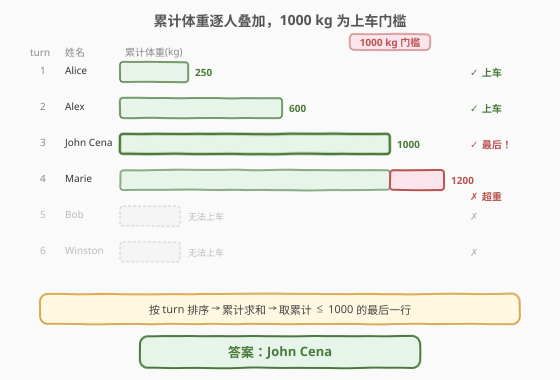
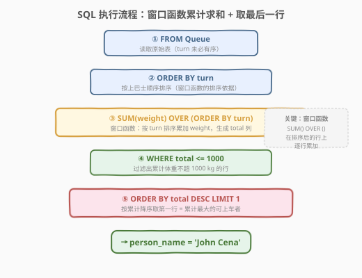
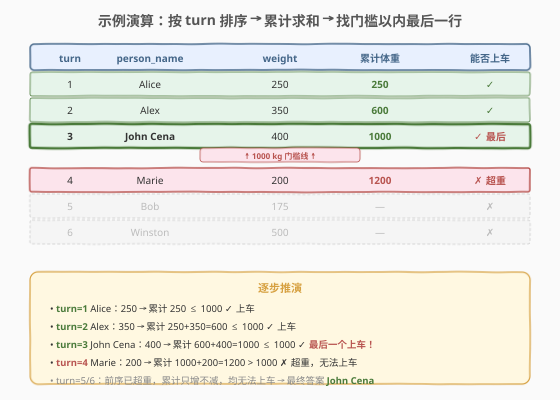

# 最后一个能进入巴士的人

- **题目名称**：最后一个能进入巴士的人
- **链接**：[1204. 最后一个能进入巴士的人](https://leetcode.cn/problems/last-person-to-fit-in-the-bus/)
- **难度**：中等
- **标签**：SQL、窗口函数、累计求和、排序

## 1. 题目概述

有一队乘客在等着上巴士。巴士有 **`1000` 千克**的重量限制，所以其中一部分乘客可能无法上车。乘客按 `turn` 列决定的顺序上车（`turn=1` 第一个上，`turn=n` 最后一个上）。编写 SQL 查询，找出**最后一个**能上巴士且不超过重量限制的乘客，报告 `person_name`。题目保证顺位第一的人可以上车且不会超重。

**表结构**：

```text
Table: Queue
+-------------+---------+
| Column Name | Type    |
+-------------+---------+
| person_id   | int     |  ← 主键
| person_name | varchar |
| weight      | int     |
| turn        | int     |
+-------------+---------+
```

- `person_id` 是主键（具有唯一值）
- `person_id` 和 `turn` 列包含从 `1` 到 `n` 的所有数字（`n` 为表行数）
- `turn` 决定上车顺序：`turn=1` 第一个上，`turn=n` 最后一个上
- `weight` 为乘客体重（千克）

> ⚠️ 本题的关键在于**按 `turn` 排序后逐人累加体重**，找出累计体重 ≤ 1000 的最后一行。一旦某人的累计体重超过 1000，其后的所有人也无法上车（累计只增不减）。

**示例 1**：

```text
输入：
Queue 表:
+-----------+-------------+--------+------+
| person_id | person_name | weight | turn |
+-----------+-------------+--------+------+
| 5         | Alice       | 250    | 1    |
| 4         | Bob         | 175    | 5    |
| 3         | Alex        | 350    | 2    |
| 6         | John Cena   | 400    | 3    |
| 1         | Winston     | 500    | 6    |
| 2         | Marie       | 200    | 4    |
+-----------+-------------+--------+------+

输出：
+-------------+
| person_name |
+-------------+
| John Cena   |
+-------------+
```

**解释**（按 `turn` 排序后）：

| turn | person_id | person_name | weight | 累计体重 | 能否上车 |
|------|-----------|-------------|--------|----------|----------|
| 1 | 5 | Alice | 250 | 250 | ✓ |
| 2 | 3 | Alex | 350 | 600 | ✓ |
| 3 | 6 | John Cena | 400 | 1000 | ✓ 最后一个 |
| 4 | 2 | Marie | 200 | 1200 | ✗ 超重 |
| 5 | 4 | Bob | 175 | — | ✗ |
| 6 | 1 | Winston | 500 | — | ✗ |

**约束条件**：

- `Queue` 是一张乘客排队表，`person_id` 为主键
- `turn` 值从 `1` 到 `n` 连续无重复
- 巴士重量限制为 **1000 千克**
- 题目保证 `turn=1` 的乘客可以上车（即第一个人体重 ≤ 1000）

---

## 2. 解题思路

### 2.1 暴力思路：逐行扫描累加

最直觉的过程式思路：按 `turn` 从小到大逐行扫描，维护一个累加变量 `total`，每加入一个乘客就 `total += weight`，若 `total ≤ 1000` 则记录该乘客为「当前最后可上车者」，否则停止。伪代码如下：

```text
total = 0
last_person = None
for row in Queue.order_by(turn):
    total += row.weight
    if total <= 1000:
        last_person = row.person_name
    else:
        break
return last_person
```

但**纯 SQL 没有显式的逐行循环和可变变量**——需要换用集合式表达。「按 `turn` 排序后累加体重」这一操作，在 SQL 中对应**窗口函数累计求和**（`SUM(weight) OVER (ORDER BY turn)`）或**自连接聚合**（self-join + `GROUP BY` + `SUM`）。

### 2.2 核心观察：窗口函数累计求和



**三个关键点**：

1. **按 `turn` 排序**：乘客上车的顺序由 `turn` 决定，而非 `person_id` 或表中的物理行顺序。必须先按 `turn` 排序才能正确计算「上车时」的累计体重。

2. **窗口函数累计求和**：`SUM(weight) OVER (ORDER BY turn)` 对每一行计算「从 `turn` 最小到当前行」的 `weight` 总和。这等价于过程式思路中的 `total += weight`，但在 SQL 中以声明式一次完成。

   $$
   \text{total}_i = \sum_{\text{turn} \leq \text{turn}_i} \text{weight}
   $$

3. **取门槛以内的最后一行**：过滤出 `total ≤ 1000` 的所有行，再取累计体重**最大**的那一行（即 `ORDER BY total DESC LIMIT 1`）。由于 `turn` 单调递增且 `weight > 0`，累计体重也单调递增，因此「累计最大的可上车者」就是「`turn` 最大的可上车者」。

> 💡 **为什么不能用 `WHERE` 直接过滤再 `LIMIT`？** 因为 `SUM(weight) OVER (...)` 是窗口函数，其结果在 `WHERE` 之后才生成（窗口函数在 `SELECT` 阶段求值，位于 `WHERE` 之后）。必须先用子查询或 CTE 计算出 `total` 列，再在外层 `WHERE` 中过滤。

> ⚠️ **单调性前提**：本题所有 `weight > 0`，因此累计体重随 `turn` 单调递增。一旦某人超重，其后所有人必定也超重——这是「取最后一行即答案」的基础。若 `weight` 可为 0 或负数，单调性被破坏，需逐行判断。

### 2.3 算法流程图



**逻辑执行步骤**：

| 步骤 | SQL 子句 | 作用 |
|------|----------|------|
| ① | `FROM Queue` | 读取原始表（`turn` 未必有序） |
| ② | `ORDER BY turn`（窗口排序） | 窗口函数按 `turn` 排序后逐行累加 |
| ③ | `SUM(weight) OVER (ORDER BY turn) AS total` | 生成累计体重新列 |
| ④ | `WHERE total <= 1000`（外层） | 过滤出可上车的行 |
| ⑤ | `ORDER BY total DESC LIMIT 1` | 取累计最大的可上车者 |

> 💡 **SQL 子句执行顺序**：`FROM` → `WHERE` → `GROUP BY` → `HAVING` → `SELECT`（含窗口函数）→ `ORDER BY` → `LIMIT`。窗口函数在 `SELECT` 阶段求值，晚于 `WHERE`，因此必须嵌套子查询：内层计算 `total`，外层过滤。

### 2.4 示例演算

以示例 1 数据为例，观察窗口函数累计求和的逐步过程：



**步骤 ①：按 `turn` 排序**

原始表中 `turn` 并非有序（5→4→3→6→1→2），先排序为 1→2→3→4→5→6：

| turn | person_name | weight |
|------|-------------|--------|
| 1 | Alice | 250 |
| 2 | Alex | 350 |
| 3 | John Cena | 400 |
| 4 | Marie | 200 |
| 5 | Bob | 175 |
| 6 | Winston | 500 |

**步骤 ②：窗口函数累计求和 `SUM(weight) OVER (ORDER BY turn)`**

逐行累加 `weight`，生成 `total` 列：

| turn | person_name | weight | total（累计） | ≤ 1000？ |
|------|-------------|--------|---------------|----------|
| 1 | Alice | 250 | 250 | ✓ |
| 2 | Alex | 350 | 600 | ✓ |
| 3 | John Cena | 400 | **1000** | ✓ |
| 4 | Marie | 200 | 1200 | ✗ |
| 5 | Bob | 175 | 1375 | ✗ |
| 6 | Winston | 500 | 1875 | ✗ |

> 💡 `total` 的计算方式：`total[turn=1] = 250`，`total[turn=2] = 250 + 350 = 600`，`total[turn=3] = 600 + 400 = 1000`，依此类推。窗口函数 `SUM(weight) OVER (ORDER BY turn)` 对每行计算从首行到当前行的 `weight` 之和。

**步骤 ③：`WHERE total <= 1000` 过滤 + `ORDER BY total DESC LIMIT 1`**

过滤后只剩 3 行（turn 1/2/3），按 `total` 降序取第一行：

| turn | person_name | total |
|------|-------------|-------|
| 3 | **John Cena** | 1000 |

最终输出 `person_name = John Cena`，与示例一致。

---

## 3. 参考代码

### SQL（解法 A：窗口函数 SUM OVER，推荐）

```sql
SELECT person_name
FROM (
    SELECT person_name,
           SUM(weight) OVER (ORDER BY turn) AS total
    FROM Queue
) t
WHERE total <= 1000
ORDER BY total DESC
LIMIT 1;
```

> 💡 **写法要点**：
> - 内层子查询用 `SUM(weight) OVER (ORDER BY turn)` 生成累计体重新列 `total`。
> - 外层 `WHERE total <= 1000` 过滤出可上车的行——窗口函数结果只能在外层引用，不能在同一层的 `WHERE` 中使用。
> - `ORDER BY total DESC LIMIT 1` 取累计最大的可上车者，即最后一个上车的人。
> - 由于 `weight > 0`，累计单调递增，`total` 最大即 `turn` 最大。

### SQL（解法 B：自连接聚合）

```sql
SELECT q1.person_name
FROM Queue q1
JOIN Queue q2 ON q1.turn >= q2.turn
GROUP BY q1.person_id, q1.person_name, q1.turn
HAVING SUM(q2.weight) <= 1000
ORDER BY q1.turn DESC
LIMIT 1;
```

> 💡 **写法要点**：
> - 自连接 `q1.turn >= q2.turn`：对每个 `q1` 行，匹配所有 `turn` 不大于它的 `q2` 行（含自身）。
> - `GROUP BY q1.person_id, q1.person_name, q1.turn` + `HAVING SUM(q2.weight) <= 1000`：对每个乘客计算「上他之前所有人的体重之和」，过滤出 ≤ 1000 的。
> - `ORDER BY q1.turn DESC LIMIT 1`：取 `turn` 最大的可上车者。
> - 与解法 A 的区别：解法 A 用窗口函数（声明式），解法 B 用自连接（关系代数式）。两者逻辑等价，但自连接的时间复杂度为 `O(n²)`，窗口函数为 `O(n log n)`（排序 + 线性扫描）。

### SQL（解法 C：用户变量，MySQL 专用）

```sql
SELECT person_name
FROM (
    SELECT person_name,
           @total := @total + weight AS total
    FROM Queue, (SELECT @total := 0) var
    ORDER BY turn
) t
WHERE total <= 1000
ORDER BY total DESC
LIMIT 1;
```

> 💡 **写法要点**：利用 MySQL 用户变量 `@total` 模拟过程式累加。`ORDER BY turn` 保证按上车顺序处理，`@total := @total + weight` 逐行累加。这种写法 MySQL 8.0+ 已不推荐（窗口函数是标准 SQL 的正规替代），但在旧版本中是唯一选择。

### Python（pandas）

```python
import pandas as pd

def last_person_to_fit_in_the_bus(queue: pd.DataFrame) -> pd.DataFrame:
    queue = queue.sort_values('turn')
    queue['total'] = queue['weight'].cumsum()
    result = queue[queue['total'] <= 1000]
    return result[['person_name']].tail(1)
```

> 💡 **pandas 对照**：
> - `sort_values('turn')` 对应 SQL 的 `ORDER BY turn`。
> - `cumsum()` 对应 `SUM(weight) OVER (ORDER BY turn)` 窗口函数累计求和。
> - `queue['total'] <= 1000` 布尔掩码对应外层 `WHERE total <= 1000`。
> - `.tail(1)` 对应 `ORDER BY total DESC LIMIT 1`——由于已按 `turn` 排序且累计单调递增，最后一行即累计最大者。

---

## 4. 复杂度分析

| 维度 | 解法 A（窗口函数） | 解法 B（自连接） | 解法 C（用户变量） |
|------|-------------------|------------------|-------------------|
| **时间** | $O(n \log n)$ | $O(n^2)$ | $O(n \log n)$ |
| **空间** | $O(n)$ | $O(n^2)$ | $O(n)$ |
| **连接行数** | 无连接 | $n \times n$ | 无连接 |
| **可移植性** | ✓ 标准 SQL | ✓ 标准 SQL | ✗ MySQL 专用 |
| **推荐度** | ✓ **首选** | ✗ 效率差 | △ 仅旧版 MySQL |

> - $n$ = `Queue` 表行数
> - 解法 A：排序 $O(n \log n)$ + 线性扫描 $O(n)$，总 $O(n \log n)$
> - 解法 B：自连接产生 $O(n^2)$ 行，聚合扫描 $O(n^2)$
> - 解法 C：排序 $O(n \log n)$ + 线性扫描 $O(n)$，与 A 同级但非标准 SQL
> - **索引优化**：在 `turn` 列上建索引，排序可走索引，降至 $O(n)$

---

## 5. 扩展：窗口函数 vs 自连接的对比

### 5.1 累计求和的两种范式

| 维度 | 窗口函数 `SUM OVER` | 自连接 `JOIN + GROUP BY` |
|------|---------------------|--------------------------|
| **思路** | 声明式：告诉引擎「按排序累加」 | 关系代数式：把「前缀」表达为连接 |
| **复杂度** | $O(n \log n)$（排序主导） | $O(n^2)$（笛卡尔积） |
| **可读性** | 高，语义直观 | 低，需理解自连接的含义 |
| **标准** | SQL:2003 标准，主流数据库均支持 | SQL 通用，但效率差 |
| **适用场景** | 任意累计/滑动窗口计算 | 无窗口函数的旧环境 |

> 💡 **判定口诀**：凡是「按某种顺序逐行累加/滑动」的需求，优先用窗口函数。自连接是窗口函数出现前的「土办法」，仅在没有窗口函数支持时才考虑。

### 5.2 窗口函数的排序帧

`SUM(weight) OVER (ORDER BY turn)` 的默认帧范围是 `RANGE BETWEEN UNBOUNDED PRECEDING AND CURRENT ROW`，即「从第一行累加到当前行」。这正是「累计求和」的语义。若需其他窗口范围（如「前 3 行到当前行」的滑动窗口），可显式指定：

```sql
-- 滑动窗口：当前行 + 前 2 行的体重之和
SUM(weight) OVER (ORDER BY turn ROWS BETWEEN 2 PRECEDING AND CURRENT ROW)
```

> 💡 `RANGE` 按**值范围**定义帧，`ROWS` 按**物理行数**定义帧。累计求和用默认 `RANGE` 即可；滑动窗口需用 `ROWS` 显式指定行数。

### 5.3 相关变体题

| 变体 | 需求 | 关键差异 |
|------|------|----------|
| **1204（本题）** | 最后一个累计 ≤ 1000 的人 | 窗口函数 + 过滤 + 取最大 |
| 首个超重的人 | 第一个累计 > 1000 的人 | `WHERE total > 1000 ORDER BY total ASC LIMIT 1` |
| 能上车总人数 | 累计 ≤ 1000 的行数 | `SELECT COUNT(*) FROM (...) WHERE total <= 1000` |

---

## 6. 面试要点

1. **为什么窗口函数不能直接在 `WHERE` 中使用？**

   > SQL 的子句执行顺序为 `FROM` → `WHERE` → `GROUP BY` → `HAVING` → `SELECT`（含窗口函数）→ `ORDER BY` → `LIMIT`。窗口函数在 `SELECT` 阶段求值，晚于 `WHERE`，因此 `WHERE` 看不到窗口函数的列。解决方法：将窗口函数放在子查询中，外层 `WHERE` 引用子查询的列。

2. **`SUM(weight) OVER (ORDER BY turn)` 的默认帧是什么？**

   > 默认帧为 `RANGE BETWEEN UNBOUNDED PRECEDING AND CURRENT ROW`，即「从排序后的第一行累加到当前行」。这正是累计求和的语义，无需显式指定。若 `turn` 有重复值，`RANGE` 会把相同 `turn` 的行合并计算；若需逐行累加，用 `ROWS BETWEEN UNBOUNDED PRECEDING AND CURRENT ROW`。

3. **解法 B 自连接为什么是 `q1.turn >= q2.turn`？**

   > 对每个乘客 `q1`，要计算「他上车时车上已有所有人的体重之和」，即所有 `turn ≤ q1.turn` 的人的 `weight` 之和。因此连接条件为 `q1.turn >= q2.turn`（含自身），再 `GROUP BY q1` + `SUM(q2.weight)`。等价于 `q2.turn <= q1.turn`，方向反过来而已。

4. **为什么取 `ORDER BY total DESC LIMIT 1` 而不是 `ORDER BY turn DESC LIMIT 1`？**

   > 因为 `weight > 0`，累计体重随 `turn` 单调递增，`total` 最大即 `turn` 最大，两者等价。但用 `total` 排序更直接地表达了「取累计最大的可上车者」的语义。若题目允许 `weight = 0`（体重为零的人不增加累计），则 `turn` 最大未必 `total` 最大，此时用 `turn` 排序更准确。

5. **如果 `Queue` 表有上百万行，如何优化？**

   > ① 在 `turn` 列上建索引，窗口函数的排序可走索引，降至 $O(n)$。② 避免使用解法 B 的自连接（$O(n^2)$ 会爆炸）。③ 现代数据库（MySQL 8.0+、PostgreSQL、SQL Server）的窗口函数有内部优化，排序后线性扫描即可完成累计求和。④ 若只需近似结果，可用采样统计。

> 💡 **一句话总结**：1204 是 SQL **"窗口函数累计求和 + 子查询过滤"招牌题**——核心两步：① `SUM(weight) OVER (ORDER BY turn)` 生成累计列；② 外层 `WHERE total <= 1000 ORDER BY total DESC LIMIT 1` 取最后一个可上车者。记住窗口函数必须在子查询中计算、外层才能过滤，所有「按序累计 + 阈值过滤」的 SQL 题都能套用。

---

## 7. 同类练习题

- [1174. 即时食物配送 II](https://leetcode.cn/problems/immediate-food-delivery-ii/)（[题解](../1101-1200/1174_即时食物配送II.md)）：`LEFT JOIN` + 子查询求首次订单，同为「子查询 + 聚合」模式
- [550. 游戏玩法分析 IV](https://leetcode.cn/problems/game-play-analysis-iv/)：`LEFT JOIN` + 首次登录日条件连接，共享「排序 + 首行」思想
- [5342. 每个会议的参会人数](https://leetcode.cn/problems/number-of-people-in-each-meeting/)：窗口函数累计统计，类似按时间排序累加
- [180. 连续出现的数字](https://leetcode.cn/problems/consecutive-numbers/)：自连接 + 条件判断，对比理解自连接 vs 窗口函数两种范式
- [586. 订单最多的客户](https://leetcode.cn/problems/customer-placing-the-largest-number-of-orders/)：`GROUP BY` + `ORDER BY COUNT DESC LIMIT 1`，同为「聚合 + 取最值行」模式
