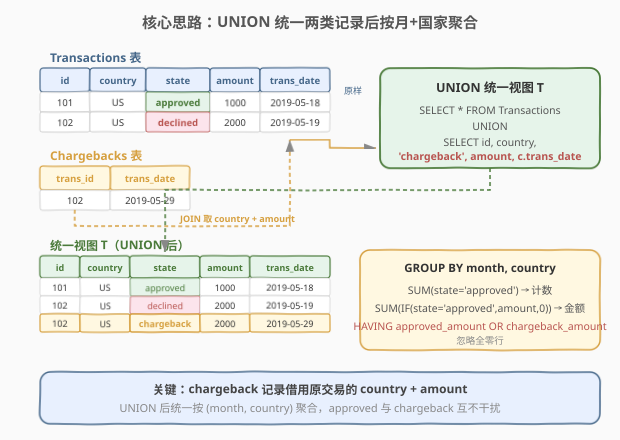
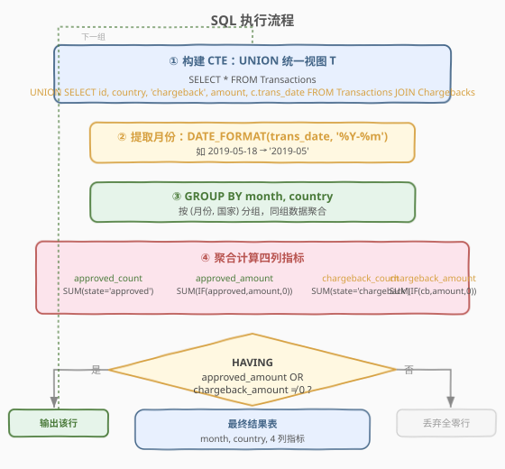
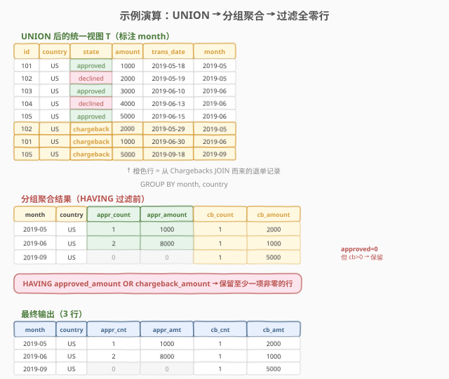

# LeetCode 每月交易 II 题解

## 1. 题目概述

- **标题 / 题号**：每月交易 II（#1205，medium）
- **链接**：https://leetcode.cn/problems/monthly-transactions-ii/
- **难度**：中等
- **标签**：数据库、SQL、聚合、GROUP BY、UNION

**题意**：给定两张表：

- **`Transactions`** 表：记录每笔交易的基本信息。

| 列名 | 类型 | 说明 |
|------|------|------|
| `id` | int | 主键 |
| `country` | varchar | 国家/地区 |
| `state` | enum | 状态：`approved` 或 `declined` |
| `amount` | int | 金额 |
| `trans_date` | date | 交易日期 |

- **`Chargebacks`** 表：记录退单信息，每条退单关联 `Transactions` 表中的一笔交易（即使该交易未被批准）。

| 列名 | 类型 | 说明 |
|------|------|------|
| `trans_id` | int | 外键 → `Transactions.id` |
| `trans_date` | date | 退单日期 |

**任务**：编写一个 SQL 解决方案，找出每个国家/地区的**每月**交易信息：
- 已批准交易的**数量**及其**总金额**
- 退单的**数量**及其**总金额**

> ⚠️ **注意**：只需显示给定月份和国家的行，**忽略所有为零的行**（即 `approved_amount` 和 `chargeback_amount` 都为 0 的行不输出）。结果可以任意顺序返回。

**示例 1**：

```text
输入：
Transactions 表：
+-----+---------+----------+--------+------------+
| id  | country | state    | amount | trans_date |
+-----+---------+----------+--------+------------+
| 101 | US      | approved | 1000   | 2019-05-18 |
| 102 | US      | declined | 2000   | 2019-05-19 |
| 103 | US      | approved | 3000   | 2019-06-10 |
| 104 | US      | declined | 4000   | 2019-06-13 |
| 105 | US      | approved | 5000   | 2019-06-15 |
+-----+---------+----------+--------+------------+
Chargebacks 表：
+----------+------------+
| trans_id | trans_date |
+----------+------------+
| 102      | 2019-05-29 |
| 101      | 2019-06-30 |
| 105      | 2019-09-18 |
+----------+------------+

输出：
+---------+---------+----------------+-----------------+------------------+-------------------+
| month   | country | approved_count | approved_amount | chargeback_count | chargeback_amount |
+---------+---------+----------------+-----------------+------------------+-------------------+
| 2019-05 | US      | 1              | 1000            | 1                | 2000              |
| 2019-06 | US      | 2              | 8000            | 1                | 1000              |
| 2019-09 | US      | 0              | 0               | 1                | 5000              |
+---------+---------+----------------+-----------------+------------------+-------------------+
```

**约束**：

- 退单记录对应 `Transactions` 表中的交易，即使该交易状态为 `declined`
- 退单的日期可能与原交易日期不在同一个月

> 💡 本题是 [1173. 每月交易 I](https://leetcode.cn/problems/monthly-transactions-i/) 的进阶版。关键区别在于退单表 `Chargebacks` 是**独立**的——退单有自己的 `trans_date`，且退单金额需要从关联的原交易中取。这使得我们不能简单地两张表分别聚合再 JOIN，而需要一个 **UNION 统一视图**的策略。

## 2. 解题思路

### 2.1 暴力思路：两张表分别聚合再 JOIN

一个直觉的想法是：

1. 对 `Transactions` 表按 `(month, country)` 分组，统计 `approved_count` 和 `approved_amount`
2. 对 `Chargebacks` JOIN `Transactions` 后按 `(month, country)` 分组，统计 `chargeback_count` 和 `chargeback_amount`
3. 对两组结果做 **FULL OUTER JOIN**（按 `month, country` 对齐），缺失侧补 0

这个方法逻辑正确，但 MySQL 不支持 `FULL OUTER JOIN`，需要用 `LEFT JOIN` + `UNION` + `RIGHT JOIN` 模拟，代码冗长且可读性差。

### 2.2 核心观察：UNION 统一两类记录



**关键洞察**：退单本质上也是一类「交易事件」——它有日期、关联国家、关联金额，只是 `state` 为 `chargeback` 而非 `approved`/`declined`。如果我们能把退单记录「变形」成与 `Transactions` 相同的结构，就可以用 **UNION** 合并成一张统一视图，然后一次性 `GROUP BY (month, country)` 聚合。

**变形方式**：对 `Chargebacks` 表的每条退单记录，通过 `trans_id` JOIN 回 `Transactions` 表，取出原交易的 `country` 和 `amount`，并将 `state` 设为常量 `'chargeback'`：

| 来源 | id | country | state | amount | trans_date |
|------|----|---------|-------|--------|------------|
| Transactions 原表 | 101 | US | approved | 1000 | 2019-05-18 |
| Transactions 原表 | 102 | US | declined | 2000 | 2019-05-19 |
| **Chargebacks JOIN** | 102 | US | **chargeback** | **2000** | **2019-05-29** |

> 💡 **为什么用 chargeback 自己的 `trans_date` 而非原交易日期？** 因为退单的统计月份应以退单发生日期为准。例如原交易 102 发生在 5 月，但退单发生在 5 月 29 日（仍属 5 月）；原交易 101 发生在 5 月，退单发生在 6 月 30 日（属 6 月）。退单归属月份取决于退单日期。

> ⚠️ **declined 交易会被保留在统一视图中，但不影响结果**。因为聚合时只统计 `state = 'approved'` 和 `state = 'chargeback'` 的记录，`declined` 状态的行在 `SUM(state = 'approved')` 和 `SUM(state = 'chargeback')` 中都贡献 0。

### 2.3 算法流程图



**完整步骤**：

1. **构建 CTE `T`**：`UNION` 合并 `Transactions` 全部记录与 `Chargebacks` JOIN `Transactions` 后的变形记录（`state` 标记为 `'chargeback'`）
2. **提取月份**：用 `DATE_FORMAT(trans_date, '%Y-%m')` 将日期截断为 `YYYY-MM` 格式
3. **分组**：`GROUP BY month, country`
4. **聚合四列指标**：
   - `approved_count` = `SUM(state = 'approved')`（布尔转 0/1 求和）
   - `approved_amount` = `SUM(IF(state = 'approved', amount, 0))`
   - `chargeback_count` = `SUM(state = 'chargeback')`
   - `chargeback_amount` = `SUM(IF(state = 'chargeback', amount, 0))`
5. **过滤**：`HAVING approved_amount OR chargeback_amount`（排除两项金额都为 0 的行）

### 2.4 示例演算

以示例数据为例，完整的 UNION → 聚合 → 过滤过程如下：



**第一步：UNION 后的统一视图 T**（共 8 行 = 5 条原交易 + 3 条退单）：

| id | country | state | amount | trans_date | month |
|----|---------|-------|--------|------------|-------|
| 101 | US | approved | 1000 | 2019-05-18 | 2019-05 |
| 102 | US | declined | 2000 | 2019-05-19 | 2019-05 |
| 103 | US | approved | 3000 | 2019-06-10 | 2019-06 |
| 104 | US | declined | 4000 | 2019-06-13 | 2019-06 |
| 105 | US | approved | 5000 | 2019-06-15 | 2019-06 |
| 102 | US | **chargeback** | 2000 | 2019-05-29 | 2019-05 |
| 101 | US | **chargeback** | 1000 | 2019-06-30 | 2019-06 |
| 105 | US | **chargeback** | 5000 | 2019-09-18 | 2019-09 |

**第二步：GROUP BY (month, country) 聚合**：

| month | country | approved_count | approved_amount | chargeback_count | chargeback_amount |
|-------|---------|----------------|-----------------|------------------|-------------------|
| 2019-05 | US | 1（仅 id=101） | 1000 | 1（退单 id=102） | 2000 |
| 2019-06 | US | 2（id=103,105） | 8000 | 1（退单 id=101） | 1000 |
| 2019-09 | US | 0 | 0 | 1（退单 id=105） | 5000 |

> 💡 **2019-09 行的 approved 为 0**，但 `chargeback_amount = 5000 ≠ 0`，因此 `HAVING` 条件通过，该行保留。这正是题目要求「忽略所有为零的行」的含义——只有当 `approved_amount` 和 `chargeback_amount` **都**为 0 时才丢弃。

**第三步：HAVING 过滤** → 本例 3 行均至少有一项非零，全部保留 → 最终输出 3 行。

## 3. 参考代码

### MySQL

```sql
# 1205. 每月交易 II
# 思路：UNION 统一 Transactions 与 Chargebacks（JOIN 取 country+amount），按 (month, country) 聚合
WITH
    T AS (
        SELECT id, country, state, amount, trans_date
        FROM Transactions
        UNION
        SELECT t.id, t.country, 'chargeback', t.amount, c.trans_date
        FROM Transactions AS t
            JOIN Chargebacks AS c ON t.id = c.trans_id
    )
SELECT
    DATE_FORMAT(trans_date, '%Y-%m') AS month,
    country,
    SUM(state = 'approved') AS approved_count,
    SUM(IF(state = 'approved', amount, 0)) AS approved_amount,
    SUM(state = 'chargeback') AS chargeback_count,
    SUM(IF(state = 'chargeback', amount, 0)) AS chargeback_amount
FROM T
GROUP BY 1, 2
HAVING approved_amount OR chargeback_amount;
```

> 💡 **实现细节**：
> - **`UNION`（而非 `UNION ALL`）**：理论上原交易和退单不会完全相同（state 列不同），用 `UNION ALL` 也可以且更快。但此处用 `UNION` 更安全，自动去重。如果追求性能可换 `UNION ALL`。
> - **`SUM(state = 'approved')`**：MySQL 中布尔表达式返回 `1`/`0`，直接 `SUM` 即得计数，无需 `COUNT(IF(...))`。
> - **`HAVING approved_amount OR chargeback_amount`**：利用 MySQL 中 `0` 为假、非零为真的特性，等价于 `HAVING approved_amount > 0 OR chargeback_amount > 0`。
> - **`GROUP BY 1, 2`**：按 SELECT 列位置分组，等价于 `GROUP BY month, country`。

## 4. 复杂度分析

| 维度 | 复杂度 | 说明 |
|------|--------|------|
| **时间** | $O(N + C)$ | $N$ = `Transactions` 行数，$C$ = `Chargebacks` 行数；UNION 扫描两表各一次，聚合扫描统一视图一次 |
| **空间** | $O(N + C)$ | CTE `T` 物化统一视图，大小为两表行数之和 |
| **JOIN 开销** | $O(C)$ | `Chargebacks` JOIN `Transactions` 按 `id = trans_id` 等值连接，主键查找 $O(1)$ 每行 |

> ⚠️ 若 `Transactions.id` 上有主键索引（题目约束 `id` 是主键），JOIN 退单表时每条退单 $O(1)$ 查找，总计 $O(C)$。UNION 阶段无排序需求（`UNION` 去重需要排序，若换 `UNION ALL` 可省去排序开销）。

## 5. 扩展：FULL OUTER JOIN 方案与 UNION ALL 优化

### 5.1 FULL OUTER JOIN 模拟方案

如果不用 UNION 统一视图，可以分别聚合后用 `LEFT JOIN` + `UNION` + `RIGHT JOIN` 模拟 `FULL OUTER JOIN`：

```sql
WITH
    Approved AS (
        SELECT
            DATE_FORMAT(trans_date, '%Y-%m') AS month,
            country,
            COUNT(*) AS approved_count,
            SUM(amount) AS approved_amount
        FROM Transactions
        WHERE state = 'approved'
        GROUP BY 1, 2
    ),
    CB AS (
        SELECT
            DATE_FORMAT(c.trans_date, '%Y-%m') AS month,
            t.country,
            COUNT(*) AS chargeback_count,
            SUM(t.amount) AS chargeback_amount
        FROM Chargebacks AS c
            JOIN Transactions AS t ON c.trans_id = t.id
        GROUP BY 1, 2
    )
SELECT
    COALESCE(a.month, b.month) AS month,
    COALESCE(a.country, b.country) AS country,
    COALESCE(a.approved_count, 0) AS approved_count,
    COALESCE(a.approved_amount, 0) AS approved_amount,
    COALESCE(b.chargeback_count, 0) AS chargeback_count,
    COALESCE(b.chargeback_amount, 0) AS chargeback_amount
FROM Approved AS a
    LEFT JOIN CB AS b ON a.month = b.month AND a.country = b.country
UNION
SELECT
    COALESCE(a.month, b.month) AS month,
    COALESCE(a.country, b.country) AS country,
    COALESCE(a.approved_count, 0) AS approved_count,
    COALESCE(a.approved_amount, 0) AS approved_amount,
    COALESCE(b.chargeback_count, 0) AS chargeback_count,
    COALESCE(b.chargeback_amount, 0) AS chargeback_amount
FROM Approved AS a
    RIGHT JOIN CB AS b ON a.month = b.month AND a.country = b.country
WHERE a.month IS NULL;
```

> ⚠️ 此方案代码量约为 UNION 方案的 3 倍，且需要大量 `COALESCE` 处理 NULL。UNION 统一视图方案将两类记录合并到同一框架下，天然避免了 JOIN 对齐问题——这就是「统一数据模型」的优势。

### 5.2 UNION ALL 性能优化

`UNION` 会隐式排序去重，而本题中原交易行（state 为 `approved`/`declined`）与退单行（state 为 `chargeback`）的 state 列不同，不可能重复。因此可以安全使用 `UNION ALL` 省去排序开销：

```sql
WITH
    T AS (
        SELECT id, country, state, amount, trans_date
        FROM Transactions
        UNION ALL                      -- ← 改为 UNION ALL，省去排序去重
        SELECT t.id, t.country, 'chargeback', t.amount, c.trans_date
        FROM Transactions AS t
            JOIN Chargebacks AS c ON t.id = c.trans_id
    )
SELECT
    DATE_FORMAT(trans_date, '%Y-%m') AS month,
    country,
    SUM(state = 'approved') AS approved_count,
    SUM(IF(state = 'approved', amount, 0)) AS approved_amount,
    SUM(state = 'chargeback') AS chargeback_count,
    SUM(IF(state = 'chargeback', amount, 0)) AS chargeback_amount
FROM T
GROUP BY 1, 2
HAVING approved_amount OR chargeback_amount;
```

> 💡 当数据量大时，`UNION ALL` 比 `UNION` 快一个排序的量级（$O(M \log M)$ → $O(M)$）。面试时可以主动提出这个优化点。

## 6. 面试要点

1. **为什么不能直接两张表分别 GROUP BY 再 JOIN？**

   > 可以，但 MySQL 没有 `FULL OUTER JOIN`，需要用 `LEFT JOIN + UNION + RIGHT JOIN` 模拟，代码冗长且需要大量 `COALESCE` 处理 NULL。UNION 统一视图方案把两类记录合并到同一结构中，一次 `GROUP BY` 搞定，代码简洁且不易出错。

2. **退单的 `amount` 和 `country` 从哪里来？**

   > `Chargebacks` 表只有 `trans_id` 和 `trans_date`，没有金额和国家信息。必须通过 `trans_id` JOIN 回 `Transactions` 表，取原交易的 `country` 和 `amount`。退单的统计月份用退单自己的 `trans_date`（而非原交易日期），因为退单发生的月份可能与原交易不同。

3. **`SUM(state = 'approved')` 为什么能当 COUNT 用？**

   > MySQL 中布尔表达式 `state = 'approved'` 返回 `1`（true）或 `0`（false）。`SUM` 对这列 0/1 求和等价于统计满足条件的行数，即 `COUNT(IF(state = 'approved', 1, NULL))` 的简写。这是 MySQL 特有的简化写法。

4. **`HAVING approved_amount OR chargeback_amount` 的含义？**

   > MySQL 中 `0` 为假、非零为真。`HAVING approved_amount OR chargeback_amount` 等价于 `HAVING approved_amount > 0 OR chargeback_amount > 0`，即排除两项金额都为 0 的行。注意是「两项都为 0」才排除，只要有一项非零就保留（如 2019-09 行 approved 为 0 但 chargeback 为 5000，仍保留）。

5. **`UNION` 和 `UNION ALL` 在本题中有什么区别？**

   > `UNION` 会排序去重，`UNION ALL` 不去重。本题中原交易行与退单行的 `state` 列不同（`approved`/`declined` vs `chargeback`），不可能完全重复，因此 `UNION ALL` 是安全的且更快（省去排序 $O(M \log M)$ → $O(M)$）。数据量大时应优先 `UNION ALL`。

> 💡 **一句话总结**：本题的核心技巧是 **UNION 统一数据模型**——把退单记录「变形」成与交易记录相同的结构（借 JOIN 补 `country`+`amount`，标 `state='chargeback'`），合并后一次 `GROUP BY` 聚合，避免了 FULL OUTER JOIN 的繁琐。这是处理「两类事件按相同维度聚合」问题的通用范式。

## 同类练习题

| # | 题目 | 与本题的关联 |
|---|------|-------------|
| 1173 | [每月交易 I](https://leetcode.cn/problems/monthly-transactions-i/) | 本题的前置题，没有独立 Chargebacks 表，退单信息直接在 Transactions 表中，只需单表聚合 |
| 1193 | [每月交易 I](https://leetcode.cn/problems/monthly-transactions-i/) | 同上，单表聚合练习 |
| 550 | [游戏玩法分析 IV](https://leetcode.cn/problems/game-play-analysis-iv/) | SQL 聚合 + 日期函数，练习 `DATE_FORMAT` 与分组统计 |
| 185 | [部门工资前三高的所有员工](https://leetcode.cn/problems/top-three-favored-departments/) | SQL 聚合 + 窗口函数，另一种「分组内排名」的聚合场景 |
| 602 | [好友申请 II - 谁有最多的好友](https://leetcode.cn/problems/friend-requests-ii-who-has-the-most-friends/) | UNION 合并双向关系，与本题 UNION 统一两类记录的思路一致 |
