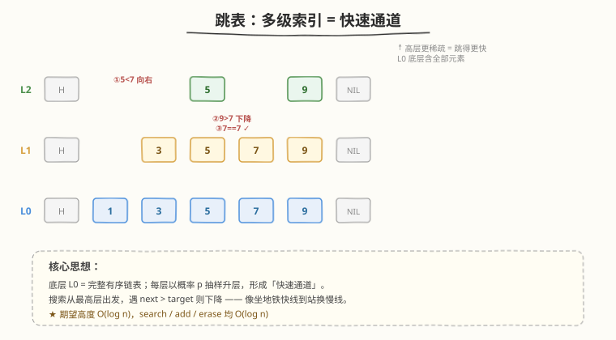
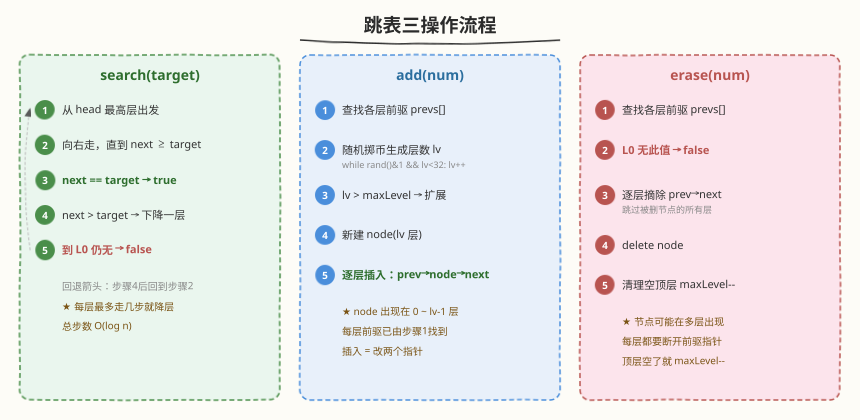
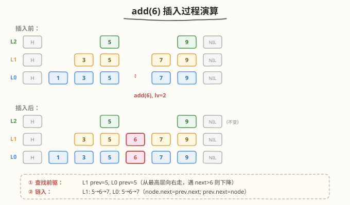

# LeetCode 设计跳表 题解

## 1. 题目概述

- **标题 / 题号**：设计跳表（#1206，hard）
- **链接**：https://leetcode.cn/problems/design-skiplist/
- **难度**：困难
- **标签**：设计、链表、概率

**题意**：不使用任何内置库，设计一个**跳表（SkipList）**，支持以下操作：

- `Skiplist()`：初始化跳表
- `bool search(int target)`：若 `target` 存在于跳表中则返回 `true`，否则返回 `false`
- `void add(int num)`：将 `num` 插入跳表
- `bool erase(int num)`：删除跳表中的一个 `num`。若 `num` 不存在则返回 `false`；若存在多个则删除任意一个即可

> ⚠️ 注意 `add` 允许插入**重复值**，`erase` 每次只删除**一个**。

**示例 1**：

```text
输入：
Skiplist skiplist = new Skiplist();
skiplist.add(1);
skiplist.add(2);
skiplist.add(3);
skiplist.search(0);   // 返回 false
skiplist.add(4);
skiplist.search(1);   // 返回 true
skiplist.erase(0);    // 返回 false，0 不在跳表中
skiplist.erase(1);    // 返回 true
skiplist.search(1);   // 返回 false，1 已被删除
```

**约束**：

- `0 <= num, target <= 2 * 10^4`
- 最多调用 `3 * 10^4` 次 `search`、`add` 和 `erase`

## 2. 解题思路

### 2.1 暴力思路

用有序链表存所有元素。`search` 线性扫描 `O(n)`；`add` 找到位置后插入 `O(n)`；`erase` 线性查找后删除 `O(n)`。最多 `3 * 10^4` 次操作、每次 `O(n)` 最坏 `O(10^9)`，不可行。

用平衡树（AVL / 红黑树）可以做到 `O(log n)`，但手写平衡树旋转逻辑复杂。跳表用**概率替代旋转**，以更简洁的代码实现同样的 `O(log n)` 期望复杂度。

### 2.2 核心观察：多级索引链表



跳表的核心思想是**在有序链表之上叠加多层「快速通道」**：

- **底层 L0**：完整有序链表，包含所有元素
- **上层 Li**：从 Li−1 中以概率 $p$ 抽样，形成稀疏索引层
- **层越高越稀疏**：最高层可能只有 1-2 个节点，可一步跨越大量元素

> 💡 **地铁快线类比**：高层 = 快线（停站少、跨距大），底层 = 慢线（站站停）。搜索时先坐快线到目标附近，再换慢线精准定位——总「跳数」期望 $O(\log n)$。

**搜索路径**（以查找 7 为例，参见上图红色路径）：
1. 从最高层 L2 的 head 出发，向右走到 5（$5 < 7$，继续）
2. 下一个是 9（$9 > 7$），**下降一层**到 L1
3. 在 L1 从 5 向右走到 7（$7 = 7$），**找到！**

每次「下降」时，当前节点在下一层也存在（跳表不变量），因此无需重新从头搜索。

### 2.3 算法流程



三个操作共享同一个**查找前驱**的核心逻辑：

**`find(target)` —— 查找各层前驱**：
1. 从 `head` 最高层出发
2. 向右走，直到 `next.val ≥ target`
3. 记录当前层的前驱节点 `prevs[i]`
4. 下降一层，重复
5. 最终得到每一层上 `target` 的前驱数组

**`search(target)`**：
- 在 `find` 的过程中，若某层 `next.val == target`，直接返回 `true`
- 走完所有层仍未命中，返回 `false`

**`add(num)`**：
1. 调用 `find(num)` 获取各层前驱
2. **随机掷币**生成层数 `lv`：`while rand()&1 && lv < MAX_LV: lv++`
3. 若 `lv > maxLevel`，扩展前驱数组（新层的前驱都是 `head`）
4. 新建 `lv` 层节点
5. 逐层执行链表插入：`node.next[i] = prevs[i].next[i]; prevs[i].next[i] = node`

**`erase(num)`**：
1. 调用 `find(num)` 获取各层前驱
2. 检查 L0 的 `next` 是否等于 `num`，不等则返回 `false`
3. 从该节点出现的**每一层**摘除：`prevs[i].next[i] = node.next[i]`
4. 释放节点内存
5. 清理空的顶层：`while maxLevel > 1 && head.next[maxLevel-1] == null: maxLevel--`

### 2.4 示例演算

以向已有跳表 `add(6)` 为例，设随机层数 `lv=2`（掷币 2 次正面）：



**插入前**：
```
L2: H → 5 → 9 → NIL
L1: H → 3 → 5 → 7 → 9 → NIL
L0: H → 1 → 3 → 5 → 7 → 9 → NIL
```

**查找前驱**（从 L2 向下）：
- L2：走到 5，next=9 > 6，记录 prev=5，下降
- L1：从 5 出发，next=7 > 6，记录 prev=5，下降
- L0：从 5 出发，next=7 > 6，记录 prev=5

**链入**（`lv=2`，插入 L1 和 L0）：
- L1：`6.next = 5.next(=7); 5.next = 6` → `5 → 6 → 7`
- L0：同理 → `5 → 6 → 7`

**插入后**：
```
L2: H → 5 → 9 → NIL                    （不变）
L1: H → 3 → 5 → 6 → 7 → 9 → NIL        （6 插入）
L0: H → 1 → 3 → 5 → 6 → 7 → 9 → NIL    （6 插入）
```

## 3. 参考代码

### C++

```cpp
class Skiplist {
    struct Node {
        int val;
        vector<Node*> next;
        Node(int v, int lv = 1) : val(v), next(lv, nullptr) {}
    };
    Node* head;
    int maxLevel;
    static const int MAX_LV = 32;

    int randomLevel() {
        int lv = 1;
        while ((rand() & 1) && lv < MAX_LV) lv++;
        return lv;
    }

    vector<Node*> find(int target) {
        vector<Node*> prevs(maxLevel, nullptr);
        Node* cur = head;
        for (int i = maxLevel - 1; i >= 0; i--) {
            while (cur->next[i] && cur->next[i]->val < target)
                cur = cur->next[i];
            prevs[i] = cur;
        }
        return prevs;
    }

  public:
    Skiplist() {
        maxLevel = 1;
        head = new Node(-1, MAX_LV);
    }

    bool search(int target) {
        Node* cur = head;
        for (int i = maxLevel - 1; i >= 0; i--) {
            while (cur->next[i] && cur->next[i]->val < target)
                cur = cur->next[i];
            if (cur->next[i] && cur->next[i]->val == target)
                return true;
        }
        return false;
    }

    void add(int num) {
        vector<Node*> prevs = find(num);
        int lv = randomLevel();
        if (lv > maxLevel) {
            prevs.resize(lv, head);
            maxLevel = lv;
        }
        Node* node = new Node(num, lv);
        for (int i = 0; i < lv; i++) {
            node->next[i] = prevs[i]->next[i];
            prevs[i]->next[i] = node;
        }
    }

    bool erase(int num) {
        vector<Node*> prevs = find(num);
        if (!prevs[0]->next[0] || prevs[0]->next[0]->val != num)
            return false;
        Node* node = prevs[0]->next[0];
        for (int i = 0; i < (int)node->next.size(); i++) {
            prevs[i]->next[i] = node->next[i];
        }
        delete node;
        while (maxLevel > 1 && !head->next[maxLevel - 1])
            maxLevel--;
        return true;
    }
};
```

### Python

```python
import random


class Skiplist:
    MAX_LV = 32

    class _Node:
        __slots__ = ('val', 'next')

        def __init__(self, val, lv=1):
            self.val = val
            self.next = [None] * lv

    def __init__(self):
        self.head = self._Node(-1, self.MAX_LV)
        self.max_level = 1

    def _random_level(self):
        lv = 1
        while random.random() < 0.5 and lv < self.MAX_LV:
            lv += 1
        return lv

    def _find(self, target):
        prevs = [None] * self.max_level
        cur = self.head
        for i in range(self.max_level - 1, -1, -1):
            while cur.next[i] and cur.next[i].val < target:
                cur = cur.next[i]
            prevs[i] = cur
        return prevs

    def search(self, target: int) -> bool:
        cur = self.head
        for i in range(self.max_level - 1, -1, -1):
            while cur.next[i] and cur.next[i].val < target:
                cur = cur.next[i]
            if cur.next[i] and cur.next[i].val == target:
                return True
        return False

    def add(self, num: int) -> None:
        prevs = self._find(num)
        lv = self._random_level()
        if lv > self.max_level:
            prevs.extend([self.head] * (lv - self.max_level))
            self.max_level = lv
        node = self._Node(num, lv)
        for i in range(lv):
            node.next[i] = prevs[i].next[i]
            prevs[i].next[i] = node

    def erase(self, num: int) -> bool:
        prevs = self._find(num)
        if not prevs[0].next[0] or prevs[0].next[0].val != num:
            return False
        node = prevs[0].next[0]
        for i in range(len(node.next)):
            prevs[i].next[i] = node.next[i]
        while self.max_level > 1 and self.head.next[self.max_level - 1] is None:
            self.max_level -= 1
        return True
```

## 4. 复杂度分析

| 维度 | 复杂度 | 说明 |
|------|--------|------|
| 时间复杂度 | $O(\log n)$ 期望 | 每层最多走常数步（期望 1/p），共 $O(\log_{1/p} n)$ 层；`search`/`add`/`erase` 均如此 |
| 空间复杂度 | $O(n)$ | 每个元素在底层出现 1 次，上层期望出现 $p + p^2 + \cdots = \frac{p}{1-p}$ 次，总节点数 $O(n)$ |

> ⚠️ 时间复杂度是**期望**值，非最坏保证。理论上 `randomLevel()` 可能返回 `MAX_LV`，但概率为 $2^{-32}$，可忽略。最坏情况退化为 $O(n)$（所有节点都在同一层），但概率极低。

## 5. 扩展：跳表 vs 平衡树

| 维度 | 跳表 | 红黑树 / AVL |
|------|------|-------------|
| 查找/插入/删除 | $O(\log n)$ 期望 | $O(\log n)$ 最坏 |
| 实现复杂度 | 简单（掷币 + 链表） | 复杂（旋转 + 染色 / 平衡因子） |
| 范围查询 | 天然有序链表，L0 直接遍历 | 中序遍历 |
| 并发友好性 | 高（局部加锁即可） | 低（旋转影响多节点） |
| 内存开销 | 每节点多层指针 $O(\log n)$ | 每节点固定 2 指针 + 颜色 |
| 最坏保证 | 无（概率保证） | 有 |

> 💡 **工业应用**：Redis 的 `ZSET`（有序集合）底层用跳表 + 哈希表；LevelDB / RocksDB 的 `MemTable` 用跳表；Java 的 `ConcurrentSkipListMap` 用跳表实现并发有序映射。选择跳表而非红黑树的核心原因：**实现简单 + 并发友好**。

## 6. 面试要点

1. **为什么跳表的期望高度是 $O(\log n)$？**

   每个节点以概率 $p$ 升到上一层。第 $k$ 层的期望节点数为 $n \cdot p^k$。当 $k > \log_{1/p} n$ 时，期望节点数 $< 1$，即层数几乎不超过 $\log_{1/p} n$。对 $p = 0.5$，期望高度约 $\log_2 n$。

2. **跳表和红黑树怎么选？**

   - 需要确定性最坏保证 → 红黑树
   - 需要并发 / 范围扫描 / 实现简洁 → 跳表
   - 内存敏感 → 红黑树（每节点固定开销更小）
   - 面试中手写 → 跳表（代码量约为红黑树的 1/3）

3. **为什么用随机层数而不是确定性分配？**

   随机性保证了**各操作的独立性**——无需全局协调（不像平衡树需要回溯调整）。每个节点独立掷币，期望高度自然收敛到 $O(\log n)$。若改用确定性分配（如每隔 $k$ 个选一个），插入/删除时需要大量调整，退化为平衡树的复杂度。

4. **`erase` 时为什么要逐层摘除？**

   一个节点可能出现在 0 到 `lv-1` 共 `lv` 层。每层的**前驱指针**都指向它，必须逐层断开并重连到它的后继，否则会留下悬空指针导致内存错误。摘除完成后清理空的顶层（`maxLevel--`）保持结构紧凑。

5. **`head` 为什么预分配 32 层？**

   `head` 是所有层的入口，每层都需要 `head.next[i]` 指向该层的第一个数据节点。预分配 32 层避免了动态扩展 `head` 的复杂度。32 层足够：$n = 2 \times 10^4$ 时 $\log_2 n \approx 15$，32 远超所需；超过 32 层的概率为 $2^{-32}$，可忽略。

## 同类练习题

| # | 题目 | 与本题的关联 |
|---|------|-------------|
| 146 | [LRU 缓存](https://leetcode.cn/problems/lru-cache/)（[题解](../0101-0200/146_LRU缓存.md)） | 经典设计题，哈希表 + 双向链表实现 $O(1)$ 缓存 |
| 460 | [LFU 缓存](https://leetcode.cn/problems/lfu-cache/)（[题解](../0401-0500/460_LFU缓存.md)） | 频率桶 + 哈希表，比 LRU 多一维频率，同为数据结构设计 |
| 705 | [设计哈希集合](https://leetcode.cn/problems/design-hashset/) | 用哈希函数 + 拉链法设计 $O(1)$ 集合，基础设计题 |
| 706 | [设计哈希映射](https://leetcode.cn/problems/design-hashmap/) | 705 的键值对版本，哈希设计入门 |
| 1146 | [快照数组](https://leetcode.cn/problems/snapshot-array/)（[题解](../1101-1200/1146_快照数组.md)） | 二分查找 + 设计，另一种 $O(\log n)$ 设计思路 |
