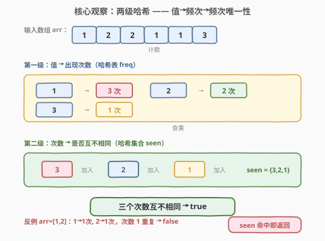
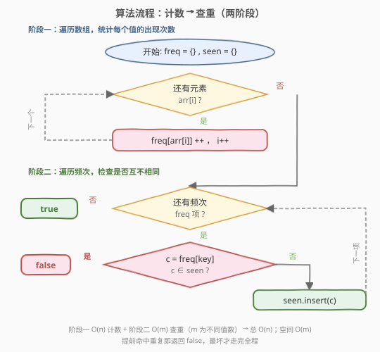
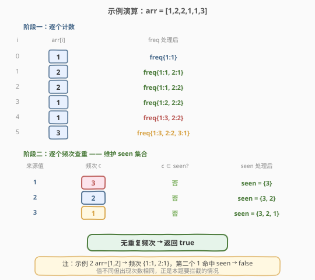

# LeetCode 独一无二的出现次数 题解

## 1. 题目概述

- **标题 / 题号**：独一无二的出现次数（#1207，easy）
- **链接**：https://leetcode.cn/problems/unique-number-of-occurrences/
- **难度**：简单
- **标签**：数组、哈希表、计数

**题意**：给你一个整数数组 `arr`，如果数组中**每个数的出现次数都是独一无二的**，就返回 `true`；否则返回 `false`。

换言之：统计每个值的出现次数后，这些次数之间两两不同即为真。

**示例 1**：

```text
输入：arr = [1,2,2,1,1,3]
输出：true
解释：1 出现 3 次，2 出现 2 次，3 出现 1 次。三个次数 3、2、1 互不相同。
```

**示例 2**：

```text
输入：arr = [1,2]
输出：false
解释：1 出现 1 次，2 出现 1 次。两个次数都是 1，出现重复，返回 false。
```

**示例 3**：

```text
输入：arr = [-3,0,1,-3,1,1,1,-3,10,0]
输出：true
解释：-3 出现 3 次，0 出现 2 次，1 出现 4 次，10 出现 1 次。次数 3、2、4、1 互不相同。
```

**约束**：

- `1 <= arr.length <= 1000`
- `-1000 <= arr[i] <= 1000`

> 💡 注意值域 **−1000 到 1000** 是关键线索：不同值至多 2001 种，可用偏移 +1000 后的定长数组代替哈希表，空间 $O(1)$（与输入规模无关）。

## 2. 解题思路

### 2.1 暴力思路：双重循环数次数再两两比对

对每个不同的值，遍历一遍数组数它出现几次，得到次数列表后再两两比较是否有相等。时间 $O(n \cdot m + m^2)$（$m$ 为不同值数，最坏 $m = n$），约 $O(n^2)$，当 $n = 1000$ 时尚可过，但思路笨重且无法应对更大规模。

问题在于：我们反复扫描数组只为数某个值的次数，又反复两两比较只为发现一次重复。如果能"一次计数 + 一次查重"，就能把两段都压到线性。

### 2.2 核心观察：两级哈希 —— 值→频次→频次唯一性



本题天然分两步，每步都用哈希：

1. **第一级（值 → 频次）**：用哈希表 `freq` 统计每个值出现几次。一遍扫描即可，$O(n)$。
2. **第二级（频次 → 是否互异）**：再开一个哈希**集合** `seen`，逐个把频次塞进去；塞之前先查——若该频次已在 `seen` 中，说明**两个不同值出现了相同次数**，立刻返回 `false`。

> 为什么用集合就够？题问"次数是否两两不同"，等价于"次数集合的大小 == 频次表的条目数"。边插入边查重，一旦发现重复立即短路返回，无需数完再比。

> ⚠️ 关键易错点：重复的是**出现次数**，不是值本身。示例 2 中值 1 和 2 本就不同，但它们都出现 1 次——次数撞车才是要拦截的情况。集合 `seen` 装的是"次数"而非"值"，正对应这一语义。

### 2.3 算法流程图



**完整步骤**：

1. **初始化**：`freq` 哈希表为空，`seen` 哈希集合为空。
2. **阶段一（计数）**：遍历 `arr` 每个元素 `x`，`freq[x] += 1`。
3. **阶段二（查重）**：遍历 `freq` 的每个条目 `(值, 次数 c)`：
   - 若 `c ∈ seen`，返回 `false`（次数撞车）。
   - 否则 `seen.insert(c)`。
4. **返回** `true`（全程无重复）。

> 💡 **提前短路**：阶段二一旦命中重复立即返回，最坏情况（确实全部唯一）才走完整个 `freq`。平均表现优于"数完再比集合大小"的写法，尽管最坏复杂度相同。

### 2.4 示例演算

以示例 1 `arr = [1,2,2,1,1,3]` 为例：



**阶段一（逐个计数）**：

| i | arr[i] | freq 处理后 |
|---|--------|-------------|
| 0 | 1      | {1:1}                 |
| 1 | 2      | {1:1, 2:1}            |
| 2 | 2      | {1:1, 2:2}            |
| 3 | 1      | {1:2, 2:2}            |
| 4 | 1      | {1:3, 2:2}            |
| 5 | 3      | {1:3, 2:2, 3:1}       |

**阶段二（逐个频次查重）**：

| 来源值 | 频次 c | c ∈ seen? | seen 处理后 |
|--------|--------|-----------|-------------|
| 1      | 3      | 否        | {3}                   |
| 2      | 2      | 否        | {3, 2}                |
| 3      | 1      | 否        | {3, 2, 1}             |

三次均未命中，返回 `true`。对比示例 2 `arr=[1,2]`：`freq={1:1, 2:1}`，第二个频次 1 命中 `seen` 中已有的 1，立即返回 `false`。

## 3. 参考代码

### 方法一：哈希表计数 + 哈希集合查重（通用）

### C++

```cpp
class Solution {
public:
    bool uniqueOccurrences(vector<int>& arr) {
        unordered_map<int, int> freq;
        for (int x : arr) freq[x]++;
        unordered_set<int> seen;
        for (auto& [v, c] : freq) {
            if (!seen.insert(c).second) return false;
        }
        return true;
    }
};
```

### Python

```python
class Solution:
    def uniqueOccurrences(self, arr: List[int]) -> bool:
        from collections import Counter
        freq = Counter(arr)
        return len(set(freq.values())) == len(freq)
```

> 💡 **Python 一行写法**：`set(freq.values())` 自动去重，集合大小等于频次条目数即说明次数两两不同。语义最清晰，但无法提前短路——数据小时无所谓，更看重可读性时优先此版。

### 方法二：C++ 定长数组（值域优化版）

> 💡 **关键观察**：`arr[i] ∈ [-1000, 1000]`，偏移 +1000 后落在 `[0, 2000]`，至多 2001 种值；频次 `c ∈ [1, 1000]`，查重也可用定长布尔数组 `seen[1001]`。两段都用数组代替哈希，常数更小，空间严格 $O(1)$。

```cpp
class Solution {
public:
    bool uniqueOccurrences(vector<int>& arr) {
        int freq[2001] = {0};
        for (int x : arr) freq[x + 1000]++;
        bool seen[1001] = {false};
        for (int i = 0; i <= 2000; i++) {
            int c = freq[i];
            if (c == 0) continue;
            if (seen[c]) return false;
            seen[c] = true;
        }
        return true;
    }
};
```

> ⚠️ `seen` 大小取 1001 而非 2001：频次最大为 $n \le 1000$，故下标 `c` 不会超过 1000。数组按下标直接访问，比 `unordered_set` 的哈希开销小，是"值域小→用数组代替哈希"的常见优化（与 [448. 找到所有数组中消失的数字](../0401-0500/448_找到所有数组中消失的数字.md) 的下标当哈希键同理）。

## 4. 复杂度分析

| 维度 | 方法一（哈希表/集合） | 方法二（定长数组） |
|------|----------------------|--------------------|
| **时间** | $O(n)$ | $O(n)$ |
| **空间** | $O(m)$，$m$ 为不同值数 | $O(1)$ |

> ⚠️ **时间** $O(n)$：阶段一遍历 $n$ 个元素各 $O(1)$；阶段二遍历 $m$ 个频次条目各 $O(1)$，$m \le n$，总计 $O(n)$。提前短路不改变最坏界。
>
> **空间**：方法一用哈希表存 $m$ 个条目，$O(m)$；方法二借助值域有界性用定长数组，$2001 + 1001$ 个槽与 $n$ 无关，严格 $O(1)$。这是约束 `arr[i] ∈ [-1000,1000]` 带来的红利——若值域无界则只能退回 $O(m)$。

## 5. 面试要点

1. **为什么用两个哈希结构？**

   > 第一个哈希表解决"每个值出现几次"，第二个哈希集合解决"这些次数是否互异"。两个问题分别用"键→计数"和"集合判重"两种哈希用法，天然对应题目的两段语义。

2. **`seen` 里装的是值还是次数？为什么？**

   > 装的是**次数**。题问"出现次数是否独一无二"，重复的判定对象是次数而非值本身。示例 2 中值 1 和 2 不同，但都出现 1 次——撞的是次数。集合装次数正好捕捉这一语义。

3. **`seen.insert(c).second` 是什么意思？**

   > `unordered_set::insert` 返回一个 `pair<迭代器, bool>`，其中 `bool` 为 `true` 表示插入成功（原先没有），`false` 表示已存在（撞车）。取 `.second` 即"是否新插入"，为 `false` 时说明次数重复，立即返回 `false`。一行完成"查 + 插"原子操作。

4. **Python 的 `len(set(...)) == len(freq)` 为什么对？**

   > `freq.values()` 是所有次数，`set` 去重后若大小等于频次条目数，说明没有重复次数。这等价于"集合不缩水即无重复"，是判重的经典判据。缺点是无法提前短路，但写法最简洁。

5. **值域扩大到 $10^9$ 还能用定长数组吗？**

   > 不能。方法二依赖 `arr[i] + 1000 ∈ [0,2000]` 这一有界性，值域无界时数组下标越界，只能退回方法一的 `unordered_map`/`unordered_set`，空间 $O(m)$。思路（两级哈希）不变，只是失去 $O(1)$ 空间。

> 💡 **一句话总结**：1207 的本质是"两级哈希"——先哈希表把值聚成频次，再哈希集合判频次是否互异。值域有界时数组替代哈希得 $O(1)$ 空间。这套"计数 + 判重"范式可直接迁移到任意"频率唯一性"问题。

## 同类练习题

| # | 题目 | 与本题的关联 |
|---|------|-------------|
| 697 | [数组的度](https://leetcode.cn/problems/degree-of-an-array/) | 同样先哈希计数每个值的频次与首末位置，再在频次最大的值里取最短区间，"计数型哈希"同范式 |
| 448 | [找到所有数组中消失的数字](https://leetcode.cn/problems/find-all-numbers-disappeared-in-an-array/)（[题解](../0401-0500/448_找到所有数组中消失的数字.md)） | 值域有界用下标当哈希键的招牌题，方法二同源优化 |
| 389 | [找不同](https://leetcode.cn/problems/find-the-difference/) | 字符串频次哈希比对找多出的字符，"计数 + 比对"同一思路 |
| 242 | [有效的字母异位词](https://leetcode.cn/problems/valid-anagram/) | 两串频次表逐键比较，"频次哈希判等"的姊妹问题（判全等 vs 判互异） |
| 349 | [两个数组的交集](https://leetcode.cn/problems/intersection-of-two-arrays/) | 哈希集合做存在性判定，集合判重的另一面应用 |
