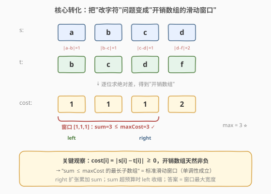
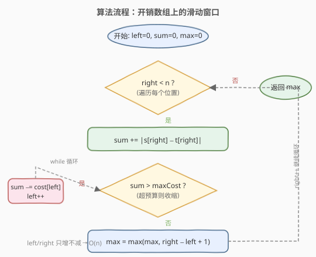
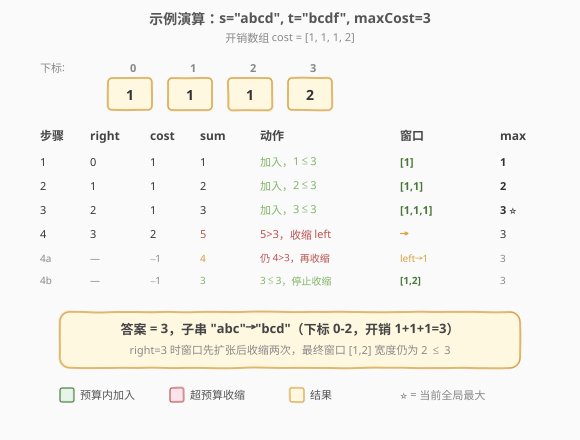

# LeetCode 尽可能使字符串相等 题解

## 1. 题目概述

- **标题 / 题号**：尽可能使字符串相等（#1208，medium）
- **链接**：https://leetcode.cn/problems/get-equal-substrings-within-budget/
- **难度**：中等
- **标签**：字符串、滑动窗口、数组

**题意**：给你两个**长度相同**的字符串 `s` 和 `t`。将 `s` 的第 `i` 个字符变到 `t` 的第 `i` 个字符需要 $|s[i] - t[i]|$ 的开销（两个字符 ASCII 码值差的绝对值，可能为 0）。

用于变更字符串的最大预算是 `maxCost`，转化时总开销应 $\le$ 该预算（因此转化可能是不完全的）。返回 `s` 的子字符串能转化为 `t` 中对应子字符串的**最大长度**。

**示例 1**：

```text
输入：s = "abcd", t = "bcdf", maxCost = 3
输出：3
解释：s 中的 "abc" 可以变为 "bcd"，开销为 |a−b|+|b−c|+|c−d| = 1+1+1 = 3，所以最大长度为 3。
```

**示例 2**：

```text
输入：s = "abcd", t = "cdef", maxCost = 3
输出：1
解释：s 中任一字符变成 t 中对应字符的开销都是 2。因此最大长度为 1（开销 2 ≤ 3）。
```

**示例 3**：

```text
输入：s = "abcd", t = "acde", maxCost = 0
输出：1
解释：a → a，cost = 0，字符串未变化，所以最大长度为 1。
```

**约束**：

- $1 \le s.length \le 10^5$
- $t.length == s.length$
- $0 \le maxCost \le 10^6$
- `s` 和 `t` 都只含小写英文字母

> 💡 **问题重塑**：定义开销数组 $\text{cost}[i] = |s[i] - t[i]| \ge 0$。问题等价于——在**非负数组** `cost` 上求**和不超过 `maxCost` 的最长连续子数组**。这正是滑动窗口的标准适用场景。

## 2. 解题思路

### 2.1 暴力思路

枚举所有子串 $[i, j]$，逐个累加 $\sum_{k=i}^{j} |s[k] - t[k]|$，判断是否 $\le maxCost$，记录最长长度。两重循环 + 求和共 $O(n^2)$，在 $n = 10^5$ 时超时。

### 2.2 核心观察：开销数组上的滑动窗口



关键直觉是把字符转换问题**降维**为数值数组问题：

1. **逐位求差**：$\text{cost}[i] = |s[i] - t[i]|$，得到一个非负数组。
2. **窗口维护**：用双指针 `[left, right]` 维护一个开销和 $\le maxCost$ 的窗口。
   - `right` 右移，把 $\text{cost}[right]$ 累加进 `sum`。
   - 一旦 `sum > maxCost`，就不断从左端扣除 $\text{cost}[left]$ 并右移 `left`，直到 `sum ≤ maxCost`。
   - 答案就是窗口宽度的最大值 $\max(\text{right} - \text{left} + 1)$。

> 💡 **为什么滑动窗口成立？** 因为 $\text{cost}[i] \ge 0$，窗口扩张只会让 `sum` **不减少**，收缩只会让 `sum` **不增加**——这种**单调性**是滑动窗口正确性的前提。若 `cost` 可为负（如 [560. 和为 K 的子数组](../0501-0600/560_和为K的子数组.md) 中元素有正有负），单调性被破坏，滑窗失效，只能用前缀和 + 哈希。

> 💡 **与 [3. 无重复字符的最长子串](../0001-0100/3_无重复字符的最长子串.md) 的对照**：3 题「窗口内无重复」靠哈希表查重来收缩 `left`；本题「窗口内和 ≤ 预算」靠数值累加来收缩 `left`。两者都是「`right` 扩张探索、`left` 收缩修正、记录最大窗口」的同向双指针模板。

### 2.3 算法流程图



整体只有一重循环，`left`、`right` 都只增不减，因此总移动次数不超过 $2n$。

> ⚠️ **`while` 而非 `if`**：收缩必须用 `while` 循环——新增的一个 `cost[right]` 可能很大（最大 25），需要连续弹出多个左端元素才能把 `sum` 压回预算内。若误用 `if` 只弹一次，窗口可能仍超预算，导致后续 `max` 记录到非法窗口。

### 2.4 示例演算

以 `s = "abcd", t = "bcdf", maxCost = 3` 为例，开销数组 `cost = [1, 1, 1, 2]`：



| 步骤 | right | cost[right] | sum | 动作 | 窗口 | max |
|------|-------|-------------|-----|------|------|-----|
| 1 | 0 | 1 | 1 | 加入，1 ≤ 3 | [1] | 1 |
| 2 | 1 | 1 | 2 | 加入，2 ≤ 3 | [1,1] | 2 |
| 3 | 2 | 1 | 3 | 加入，3 ≤ 3 | [1,1,1] | 3 ⭐ |
| 4 | 3 | 2 | 5 | 5 > 3，收缩 left | → | 3 |
| 4a | — | −1 | 4 | 仍 4 > 3，再收缩 | left→1 | 3 |
| 4b | — | −1 | 3 | 3 ≤ 3，停止 | [1,2] | 3 |

> 💡 第 4 步 `right=3` 加入开销 2 后 `sum=5 > 3`，连续收缩两次（弹出两个 1）才把 `sum` 压回 3，此时窗口 `[1,2]` 宽度为 2，未超过已记录的最大值 3。最终答案为 **3**。

## 3. 参考代码

### C++

```cpp
class Solution {
  public:
    int equalSubstring(string s, string t, int maxCost) {
        int n = s.size();
        int left = 0, sum = 0, maxLen = 0;
        for (int right = 0; right < n; right++) {
            sum += abs(s[right] - t[right]);
            while (sum > maxCost) {
                sum -= abs(s[left] - t[left]);
                left++;
            }
            maxLen = max(maxLen, right - left + 1);
        }
        return maxLen;
    }
};
```

### Python

```python
class Solution:
    def equalSubstring(self, s: str, t: str, maxCost: int) -> int:
        left = sum_ = max_len = 0
        for right in range(len(s)):
            sum_ += abs(ord(s[right]) - ord(t[right]))
            while sum_ > maxCost:
                sum_ -= abs(ord(s[left]) - ord(t[left]))
                left += 1
            max_len = max(max_len, right - left + 1)
        return max_len
```

> ⚠️ **Python 注意点**：`s[right]` 是单字符字符串，不能直接相减取绝对值，需用 `ord()` 转 ASCII 码再 `abs`。C++ 中 `char` 可直接做算术，`s[right] - t[right]` 即得差值。

## 4. 复杂度分析

| 维度 | 复杂度 | 说明 |
|------|--------|------|
| 时间复杂度 | $O(n)$ | `left`、`right` 各至多遍历一次，`while` 收缩的总次数不超过 `n` |
| 空间复杂度 | $O(1)$ | 仅用 `left`、`sum`、`maxLen` 三个变量，无需额外数组 |

## 5. 扩展：前缀和 + 二分查找

由于 `cost[i] ≥ 0`，前缀和数组 $\text{prefix}$ 天然**单调递增**，可用二分查找替代滑窗：对每个右端点 `j`，二分找最小的 `left` 使 $\text{prefix}[j+1] - \text{prefix}[\text{left}] \le maxCost$，即 $\text{prefix}[\text{left}] \ge \text{prefix}[j+1] - maxCost$。

```cpp
class Solution {
  public:
    int equalSubstring(string s, string t, int maxCost) {
        int n = s.size();
        vector<int> prefix(n + 1, 0);
        for (int i = 0; i < n; i++)
            prefix[i + 1] = prefix[i] + abs(s[i] - t[i]);
        int maxLen = 0;
        for (int j = 0; j < n; j++) {
            int target = prefix[j + 1] - maxCost;
            int lo = lower_bound(prefix.begin(), prefix.begin() + j + 1, target) - prefix.begin();
            maxLen = max(maxLen, j + 1 - lo);
        }
        return maxLen;
    }
};
```

| 方法 | 时间复杂度 | 空间复杂度 | 适用场景 |
|------|-----------|-----------|---------|
| 滑动窗口 | $O(n)$ | $O(1)$ | 元素非负（单调性成立），首选 |
| 前缀和 + 二分 | $O(n \log n)$ | $O(n)$ | 同样要求非负；若需支持在线查询/可持久化前缀和时更灵活 |

> 💡 滑窗法在时间和空间上都更优，面试中应首选。前缀和 + 二分的价值在于**模板迁移**——当问题从「最长」变成「计数」「第 K 大」等变体时，二分思路更易扩展。

## 6. 面试要点

1. **为什么收缩用 `while` 而不是 `if`？**

   - 新加入的 $\text{cost}[right]$ 最大可达 25（`'a'` 与 `'z'` 的差），可能远超预算。需要连续弹出多个左端元素才能把 `sum` 压回预算内。`if` 只弹一次会导致窗口仍超预算时错误地更新 `max`。

2. **滑动窗口正确性的前提是什么？为什么 `cost` 可负时失效？**

   - 前提是窗口量的**单调性**：扩张让 `sum` 不减、收缩让 `sum` 不增。这样 `sum > maxCost` 时唯一正确动作就是收缩 `left`。若 `cost` 可负，扩张后 `sum` 可能反而减小，收缩后可能反而增大，单调性被破坏，滑窗无法保证不漏解。

3. **本题与 [209. 长度最小的子数组](../0201-0300/209_长度最小的子数组.md) 的异同？**

   - 209 求「**最短**子数组使和 $\ge target$」（正数数组），收缩条件是 `sum ≥ target` 时记录并收缩；本题求「**最长**子数组使和 $\le maxCost$」（非负数组），收缩条件是 `sum > maxCost` 时收缩。两者都是同向双指针，但优化方向相反（一个最小化长度、一个最大化长度），收缩时机也不同。

4. **能否不显式构造 `cost` 数组？**

   - 可以。代码中直接 `abs(s[right] - t[right])` 在线计算，无需预存数组，空间保持 $O(1)$。收缩时同理用 `abs(s[left] - t[left])` 重新计算。

5. **`maxCost = 0` 时算法行为如何？**

   - 此时只允许开销为 0 的位置（即 $s[i] = t[i]$）。窗口内任一非零开销都会触发收缩，`max` 记录的是最长连续相同段。示例 3 中 `cost = [0,2,2,2]`，只有 `right=0` 时 `sum=0 ≤ 0`，`max=1`，后续每加入一个 2 都立刻被弹出，答案为 1，符合预期。

## 同类练习题

| # | 题目 | 与本题的关联 |
|---|------|-------------|
| 3 | [无重复字符的最长子串](https://leetcode.cn/problems/longest-substring-without-repeating-characters/)（[题解](../0001-0100/3_无重复字符的最长子串.md)） | 同为「求最长满足条件的子串」的滑窗，靠哈希表查重收缩 `left` |
| 209 | [长度最小的子数组](https://leetcode.cn/problems/minimum-size-subarray-sum/)（[题解](../0201-0300/209_长度最小的子数组.md)） | 滑窗对偶题——求「最短」使和 $\ge target$，对比收缩时机 |
| 713 | [乘积小于 K 的子数组](https://leetcode.cn/problems/subarray-product-less-than-k/)（[题解](../0701-0800/713_乘积小于K的子数组.md)） | 非负单调滑窗 + 计数，对比 `right−left+1` 技巧 |
| 1456 | [定长子串中元音的最大数目](https://leetcode.cn/problems/maximum-number-of-vowels-in-a-substring-of-given-length/) | 定长滑窗，窗口宽度固定时维护内部计数 |
| 1658 | [将 x 减到 0 的最小操作数](https://leetcode.cn/problems/minimum-operations-to-reduce-x-to-zero/) | 变体——求「最长子和为 `total−x`」的中间子数组，再转换为操作数 |
