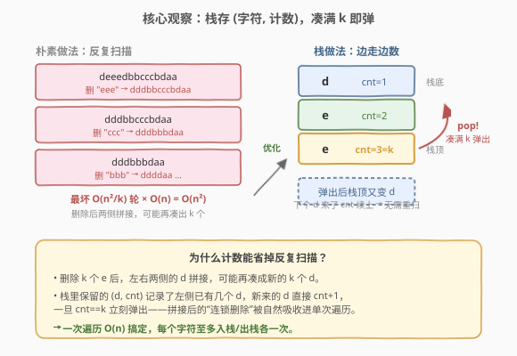
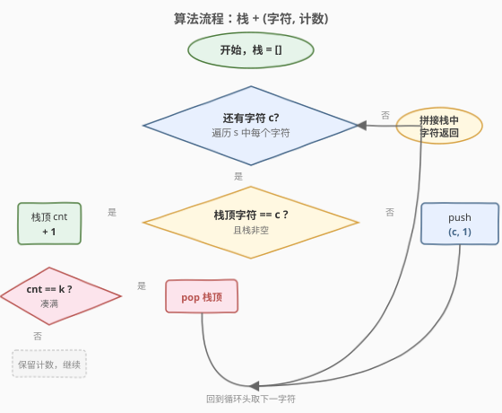
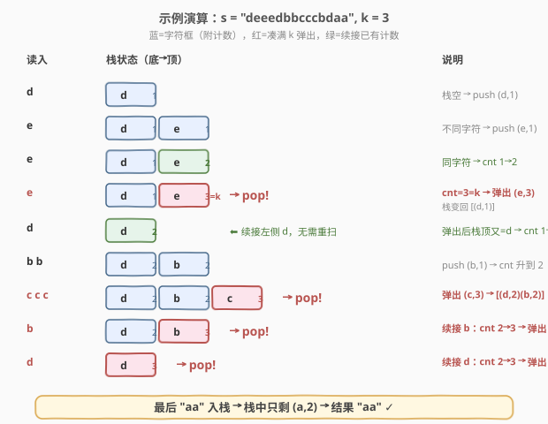

# 删除字符串中的所有相邻重复项 II

- **题目名称**：删除字符串中的所有相邻重复项 II
- **链接**：[1209. 删除字符串中的所有相邻重复项 II](https://leetcode.cn/problems/remove-all-adjacent-duplicates-in-string-ii/)
- **难度**：中等
- **标签**：栈、字符串、模拟

## 1. 题目概述

给你一个字符串 `s` 和一个整数 `k`。一次 **`k` 重复项删除**是指：从 `s` 中选出 `k` 个**相邻且相同**的字母，删除它们，使被删子串左右两侧拼接在一起。反复进行 `k` 重复项删除，直到无法再删为止。返回**最终的字符串**。

**示例 1**：

```text
输入：s = "abcd", k = 2
输出："abcd"
解释：没有长度为 2 的相邻相同字母段，无需删除。
```

**示例 2**：

```text
输入：s = "deeedbbcccbdaa", k = 3
输出："aa"
解释：
先删 "eee" 和 "ccc" 得到 "ddbbbdaa"，
再删 "bbb" 得到 "dddaa"，
再删 "ddd" 得到 "aa"。
```

**示例 3**：

```text
输入：s = "pbbcggttciiippooaais", k = 2
输出："ps"
```

**约束条件**：

- $1 \le \text{s.length} \le 10^5$
- $2 \le k \le 10^4$
- `s` 仅由小写英文字母组成

> 💡 **问题重塑**：本题是 [1047. 删除字符串中的所有相邻重复项](../1001-1100/1047_删除字符串中的所有相邻重复项.md)（$k=2$ 的特例）的泛化版。核心难点在于删除 `k` 个字符后，左右两侧拼接可能**再次凑出 `k` 个相同字符**，形成连锁消除——必须高效处理这种「塌缩」。

---

## 2. 解题思路

### 2.1 暴力思路：反复扫描

每轮扫描字符串，找到第一段长度 $\ge k$ 的连续相同字符，从中删去 $k$ 个，重新开始下一轮扫描，直到某轮无删除。每轮扫描 $O(n)$，最坏需要 $O(n/k)$ 轮（每次删除后字符串塌缩一段），总计 $O(n^2/k)$；且字符串频繁拼接常数大，在 $n = 10^5$ 时超时。

优化方向：用一个**栈**边遍历边计数，把「凑满 $k$ 个立即删除」和「删除后两侧续接」合并进一次扫描——这就是 [1047](../1001-1100/1047_删除字符串中的所有相邻重复项.md) 栈解法从「成对消除」到「成组消除」的自然推广。

### 2.2 核心观察：栈存 (字符, 计数)



关键直觉是把「连续相同字符段」抽象为栈中的一个**二元组 `(字符, 计数)`**：

- 遍历每个字符 `c`：
  - 若**栈非空且栈顶字符 == `c`**：栈顶计数 `+1`；若计数达到 `k`，**弹出栈顶**（这 `k` 个字符整组删除）。
  - 否则：**压入 `(c, 1)`**（开启一个新的字符段）。
- 扫描结束后，按栈底到栈顶顺序拼接字符（每段重复其计数次）即为答案。

> 💡 **为什么计数能省掉反复扫描？** 删除 `k` 个 `e` 后，左右两侧的 `d` 拼接，可能再凑成新的 `k` 个 `d`。栈里保留的 `(d, cnt)` 记录了左侧已有几个 `d`，新来的 `d` 直接 `cnt+1`，一旦 `cnt == k` 立刻弹出——拼接后的「连锁删除」被自然吸收进单次遍历，无需回头重扫。

> 💡 **与 [1047](../1001-1100/1047_删除字符串中的所有相邻重复项.md) 的对照**：1047 是 $k=2$ 的特例，栈里只存字符即可——栈顶与当前相同就「弹出抵消」（等价于计数到 2 即弹）。本题把「弹出的阈值」从 2 推广到 $k$，因此栈元素从「单字符」升级为「(字符, 计数)」以跟踪同字符段的累积长度。

### 2.3 算法流程图



整体只有一重遍历循环，每个字符至多被压入一次、弹出一次，因此总时间 $O(n)$。

> ⚠️ **弹出后不回溯**：弹出 `(e, 3)` 后，新暴露的栈顶可能是另一种字符，但**不需要立刻检查它是否凑满 `k`**——因为该段在入栈时计数就已 $< k$，只有后续新字符才可能让它继续增长。当前字符 `c` 已被这组 `e` 「挡住」无法续接到更左侧，故 `c` 自身作为新段压入即可。

### 2.4 示例演算

以 `s = "deeedbbcccbdaa", k = 3` 为例，展示栈中 `(字符, 计数)` 的演变：



| 读入 | 栈状态（底→顶） | 动作 | 说明 |
|------|-----------------|------|------|
| d | (d,1) | push | 栈空，新段 |
| e | (d,1)(e,1) | push | 不同字符，新段 |
| e | (d,1)(e,2) | cnt+1 | 同字符，计数升 |
| e | (d,1) | **pop** | (e,3)=k → 整组删除 |
| d | (d,2) | cnt+1 | ⬅ 续接左侧 d，无需重扫 |
| b,b | (d,2)(b,2) | push+cnt | 新段 b 后计数升到 2 |
| c,c,c | (d,2)(b,2) | **pop** | (c,3)=k → 删除 |
| b | (d,2) | **pop** | 续接 b：2→3=k → 删除 |
| d | (空) | **pop** | 续接 d：2→3=k → 删除 |
| a,a | (a,2) | push+cnt | 栈空，新段 a 计数到 2 |

> 💡 注意第 5 步：弹出 `(e,3)` 后栈顶回到 `(d,1)`，紧接着读入的 `d` 直接 `cnt+1` 变 `(d,2)`——这正是「删除后两侧续接」被栈自动处理的体现。后续 `bbb`、`ddd` 的连锁消除同理，全部在一次遍历内完成。最终栈中只剩 `(a,2)`，拼成 `"aa"`。

---

## 3. 参考代码

### C++

```cpp
class Solution {
  public:
    string removeDuplicates(string s, int k) {
        // 栈元素：{字符, 连续计数}
        vector<pair<char, int>> stk;
        for (char c : s) {
            if (!stk.empty() && stk.back().first == c) {
                if (++stk.back().second == k)
                    stk.pop_back();
            } else {
                stk.push_back({c, 1});
            }
        }
        string ans;
        for (auto& [c, cnt] : stk)
            ans.append(cnt, c);
        return ans;
    }
};
```

### Python

```python
class Solution:
    def removeDuplicates(self, s: str, k: int) -> str:
        stk = []  # 元素：[字符, 连续计数]
        for c in s:
            if stk and stk[-1][0] == c:
                stk[-1][1] += 1
                if stk[-1][1] == k:
                    stk.pop()
            else:
                stk.append([c, 1])
        return ''.join(c * cnt for c, cnt in stk)
```

> ⚠️ **拼接结果时按计数展开**：栈里存的是 `(字符, 计数)`，输出时要把每段字符重复其计数次（C++ 用 `ans.append(cnt, c)`，Python 用 `c * cnt`），不要只输出一次字符。

> 💡 **结构化绑定**：C++17 的 `auto& [c, cnt]` 让遍历栈时直接拆出字符和计数，可读性更好。若编译器不支持 C++17，改用 `stk[i].first` / `stk[i].second` 即可。

---

## 4. 复杂度分析

| 维度 | 复杂度 | 说明 |
|------|--------|------|
| 时间复杂度 | $O(n)$ | 每个字符至多被压入一次、弹出一次；末尾拼接结果也是 $O(n)$ |
| 空间复杂度 | $O(n)$ | 最坏情况无任何删除（如 `k > n` 或字符全不同），所有字符入栈 |

> ⚠️ 看似栈法仍只扫一遍，关键在于「弹出」操作把后续可能触发的连锁删除提前吸收——这是从 $O(n^2)$ 降到 $O(n)$ 的根本原因。每个字符无论被删还是保留，都只参与一次压入、至多一次弹出。

---

## 5. 扩展：用两个并行栈 / 单字符串模拟

除「`(字符, 计数)` 二元组栈」外，还有两种等价实现，思路相同、存储形式不同：

**方法二：字符栈 + 计数栈（双栈）**

用一个栈存字符、另一个栈存对应段的连续计数，两栈同步压入/弹出。逻辑与主方法完全一致，只是把二元组拆成两个并行数组，适合不能用 `pair` 的语言环境。

```cpp
class Solution {
  public:
    string removeDuplicates(string s, int k) {
        string chars;            // 字符栈
        vector<int> counts;      // 计数栈
        for (char c : s) {
            if (!chars.empty() && chars.back() == c) {
                if (++counts.back() == k) {
                    chars.pop_back();
                    counts.pop_back();
                }
            } else {
                chars.push_back(c);
                counts.push_back(1);
            }
        }
        string ans;
        for (int i = 0; i < (int)chars.size(); i++)
            ans.append(counts[i], chars[i]);
        return ans;
    }
};
```

**方法三：原地修改 + 计数栈**

利用 `string` 本身作为「字符栈」，额外只维护一个计数栈，原地写入并截断。空间上省去显式字符栈，但复杂度不变。

| 方法 | 时间复杂度 | 空间复杂度 | 说明 |
|------|-----------|-----------|------|
| `(字符, 计数)` 栈 | $O(n)$ | $O(n)$ | 主方法，结构最清晰，推荐面试书写 |
| 字符栈 + 计数栈 | $O(n)$ | $O(n)$ | 二元组拆双栈，等价 |
| 原地 + 计数栈 | $O(n)$ | $O(n)$ | 字符栈复用结果串，常数略优 |

> 💡 三种方法本质相同——都是「栈 + 计数」跟踪同字符段长度，凑满 $k$ 即弹。面试中写主方法即可，能用最少的代码清晰表达思路。

---

## 6. 面试要点

1. **为什么不能用「一遍扫描遇到 k 个就删」？**

   - 一遍线性扫描只能在当前窗口内识别连续 `k` 个相同字符，但删除后**左右两侧拼接**可能再凑出新的 `k` 个。线性扫描不知道左侧已经被删了多少个同字符，无法处理这种塌缩。栈保存的 `(字符, 计数)` 恰好记录了左侧尚未被删的同字符段长度，删除后新栈顶的计数就是「续接」的起点。

2. **栈里为什么存 `(字符, 计数)` 而不是只存字符？**

   - $k=2$（[1047](../1001-1100/1047_删除字符串中的所有相邻重复项.md)）时，相同就配对抵消，栈只存字符即可。本题 $k$ 任意，需要知道当前段已累积到第几个，才能判断是否达到 $k$。计数即「当前连续段的长度」，到 $k$ 就整段弹出。

3. **弹出后要不要立刻检查新栈顶是否也凑满 k？**

   - **不需要**。新栈顶的计数在它入栈时就已经 $< k$，且之后没有同字符续接它（否则它不会停留在栈顶以下）。只有后续读入的新字符才可能让它增长。当前字符 `c` 与新栈顶字符一般不同（若相同它早就续接了），故 `c` 直接作为新段压入。

4. **时间复杂度为什么是 $O(n)$ 而不是 $O(n^2)$？**

   - 虽然删除看似会触发连锁，但「连锁」已被栈的弹出吸收：每次 `pop` 永久移除一个栈元素，而每个字符至多被压入一次、弹出一次。所有 `pop` 的总次数不超过压入总次数 $\le n$，均摊每步 $O(1)$。

5. **`k > n` 时算法行为如何？**

   - 任何段的计数都达不到 $k$，栈永远不会弹出，最终结果就是原串 `s`。算法自然正确，无需特判。

---

## 7. 同类练习题

- [1047. 删除字符串中的所有相邻重复项](https://leetcode.cn/problems/remove-all-adjacent-duplicates-in-string/)（[题解](../1001-1100/1047_删除字符串中的所有相邻重复项.md)）：本题 $k=2$ 的特例，栈只存字符即可，对照「成对消除 → 成组消除」的推广
- [394. 字符串解码](https://leetcode.cn/problems/decode-string/)（[题解](../0301-0400/394_字符串解码.md)）：栈处理嵌套结构，弹出时机与计数/倍数的配合
- [735. 行星碰撞](https://leetcode.cn/problems/asteroid-collision/)（[题解](../0701-0800/735_行星碰撞.md)）：栈模拟相邻元素抵消，对照「栈顶与当前互动」的判定逻辑
- [844. 比较含退格的字符串](https://leetcode.cn/problems/backspace-string-compare/)：栈模拟退格删除，更简单的栈模拟入门题
- [71. 简化路径](https://leetcode.cn/problems/simplify-path/)（[题解](../0001-0100/71_简化路径.md)）：栈模拟路径层级压入/弹出，对照栈在「扫描中累积结果」的通用范式
