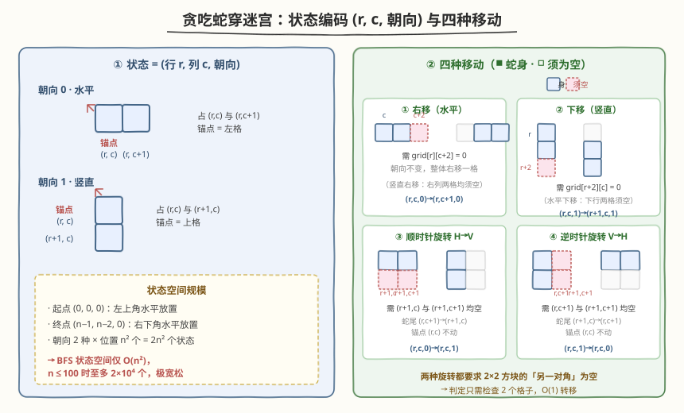
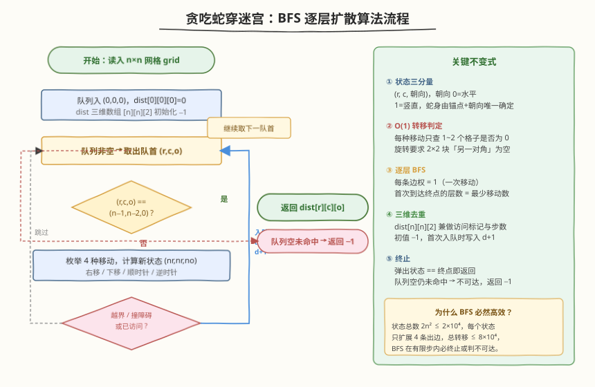
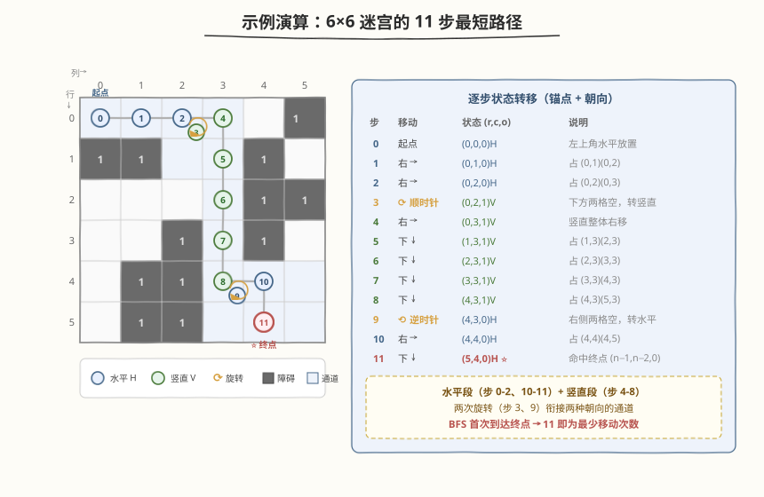

# LeetCode 穿过迷宫的最少移动次数 题解

## 1. 题目概述

- **标题 / 题号**：穿过迷宫的最少移动次数（#1210，hard）
- **链接**：https://leetcode.cn/problems/minimum-moves-to-reach-target-with-rotations/
- **难度**：困难
- **标签**：广度优先搜索、矩阵、状态搜索

**题意**：在一个 $n \times n$ 的网格上，一条长度为 2 的蛇（占两个单元格）从左上角出发——初始水平放置，占据 $(0,0)$ 与 $(0,1)$。网格中 `0` 表示空单元格，`1` 表示障碍物。蛇要移动到右下角，终点占据 $(n-1, n-2)$ 与 $(n-1, n-1)$（同样水平放置）。

每次移动蛇可以选择以下四种动作之一：

1. **右移**：整体向右移动一格，保持水平/竖直状态不变。
2. **下移**：整体向下移动一格，保持水平/竖直状态不变。
3. **顺时针旋转**：仅当蛇处于水平状态，且其下方两个单元格均为空时，蛇从 $(r,c),(r,c+1)$ 变为 $(r,c),(r+1,c)$（变为竖直）。
4. **逆时针旋转**：仅当蛇处于竖直状态，且其右面两个单元格均为空时，蛇从 $(r,c),(r+1,c)$ 变为 $(r,c),(r,c+1)$（变为水平）。

所有移动都要求目标格子无障碍且不越界。返回蛇抵达终点所需的**最少移动次数**；若无法到达则返回 `-1`。

**示例 1**：

```text
输入：grid = [[0,0,0,0,0,1],
              [1,1,0,0,1,0],
              [0,0,0,0,1,1],
              [0,0,1,0,1,0],
              [0,1,1,0,0,0],
              [0,1,1,0,0,0]]
输出：11
解释：一种可行方案是 [右, 右, 顺时针旋转, 右, 下, 下, 下, 下, 逆时针旋转, 右, 下]。
```

**示例 2**：

```text
输入：grid = [[0,0,1,1,1,1],
              [0,0,0,0,1,1],
              [1,1,0,0,0,1],
              [1,1,1,0,0,1],
              [1,1,1,0,0,1],
              [1,1,1,0,0,0]]
输出：9
```

**约束**：

- $2 \le n \le 100$
- $0 \le \text{grid}[i][j] \le 1$
- 蛇保证从空单元格开始出发。

> 💡 **问题重塑**：蛇身由「锚点 $(r,c)$ + 朝向」唯一确定（锚点取两格中行/列较小者）。每次移动是状态间的一次转移，且**每次代价恒为 1**。于是问题等价于——在「状态图」上求从起点状态到终点状态的**无权最短路径**。这正是 BFS 的标准适用场景。

## 2. 解题思路

### 2.1 暴力思路（DFS 全搜索）

从起点出发用 DFS 枚举所有合法动作序列，记录到达终点的最小步数。问题在于状态会反复经过、路径长度无上界估计，需要额外维护访问标记避免死循环；即便如此，DFS 无法保证第一次找到终点就是最短，必须搜遍所有可能再取最小，$n=100$ 时状态空间过大，难以高效剪枝。

### 2.2 核心观察：状态编码 + BFS



关键直觉是给蛇的**整体姿态**建立一个紧凑的状态编码：

1. **锚点 + 朝向**：蛇身占两格，但只要固定一个「锚点」$(r,c)$（取两格中行较小者；行相同取列较小者）再加一个朝向位，就能唯一确定姿态：
   - 朝向 `0`（水平）：占 $(r,c)$ 与 $(r,c+1)$。
   - 朝向 `1`（竖直）：占 $(r,c)$ 与 $(r+1,c)$。
2. **状态空间小**：朝向 2 种 × 位置 $n^2$ 个 = $2n^2$ 个状态。$n \le 100$ 时至多 $2 \times 10^4$ 个，极宽松。
3. **转移 O(1)**：四种移动每次只需检查 1~2 个格子是否为空：
   - 右移/下移检查新探入的那一两个格子；
   - 两种旋转都要求蛇所在 **$2 \times 2$ 方块的「另一对角」两个格子**为空，判定条件完全一致。

> 💡 **为什么 BFS 必然给出最优？** 每条转移边权恒为 1（一次移动），构成无权图。BFS 按层扩展，**首次到达终点状态的层数即为最少移动次数**——这是无权图最短路的天然性质，无需像 Dijkstra 那样维护距离堆。

> ⚠️ **旋转的锚点不变**：顺时针旋转 $(r,c,0) \to (r,c,1)$ 与逆时针旋转 $(r,c,1) \to (r,c,0)$，锚点 $(r,c)$ 始终不动，只是蛇尾从一条边「摆」到相邻的另一条边。因此同一锚点有两个朝向状态，二者通过旋转互相可达（前提是 $2 \times 2$ 块的另两个格子为空）。

### 2.3 算法流程图



整体流程是一个标准的单源 BFS：

1. 初始化 `dist[n][n][2]` 全为 `-1`（兼做访问标记与步数），起点 `(0,0,0)` 入队，`dist[0][0][0] = 0`。
2. 循环取出队首 `(r,c,o)`，若等于终点 `(n-1, n-2, 0)` 即返回 `dist[r][c][o]`。
3. 否则枚举 4 种移动：对每个合法且未访问的新状态，写入 `dist = d+1` 并入队。
4. 队列空仍未命中终点，返回 `-1`。

> 💡 **`dist` 一物两用**：三维数组同时承担「访问标记」（`-1` 即未访问）和「最短步数」两个角色。BFS 的特性保证**首次写入即为最短**，后续再遇到同一状态可直接跳过，无需更新——这是无权 BFS 比 Dijkstra 更轻量的关键。

### 2.4 示例演算

以示例 1 的 $6 \times 6$ 网格为例，BFS 找到的一条 11 步最短路径如下（蓝色为水平段、绿色为竖直段、橙色 ⟳ 为旋转）：



| 步 | 移动 | 状态 $(r,c,o)$ | 说明 |
|----|------|----------------|------|
| 0 | 起点 | $(0,0,0)$ H | 左上角水平放置 |
| 1 | 右 | $(0,1,0)$ H | 占 $(0,1),(0,2)$ |
| 2 | 右 | $(0,2,0)$ H | 占 $(0,2),(0,3)$ |
| 3 | 顺时针 ⟳ | $(0,2,1)$ V | 下方 $(1,2),(1,3)$ 均空，转竖直 |
| 4 | 右 | $(0,3,1)$ V | 竖直整体右移，占 $(0,3),(1,3)$ |
| 5 | 下 | $(1,3,1)$ V | 占 $(1,3),(2,3)$ |
| 6 | 下 | $(2,3,1)$ V | 占 $(2,3),(3,3)$ |
| 7 | 下 | $(3,3,1)$ V | 占 $(3,3),(4,3)$ |
| 8 | 下 | $(4,3,1)$ V | 占 $(4,3),(5,3)$ |
| 9 | 逆时针 ⟲ | $(4,3,0)$ H | 右侧 $(4,4),(5,4)$ 均空，转水平 |
| 10 | 右 | $(4,4,0)$ H | 占 $(4,4),(4,5)$ |
| 11 | 下 | $(5,4,0)$ H ⭐ | 命中终点 $(n-1,n-2,0)$ |

> 💡 **路径结构**：水平段（步 0-2）走到第 0 行右端可转弯处，顺时针旋为竖直；竖直段（步 4-8）沿第 3 列一路下探到底部；再逆时针旋回水平，水平段（步 10-11）滑入终点。**两次旋转恰好衔接了两种朝向的通道**——这正是贪吃蛇穿迷宫的精髓：移动是廉价的（沿通道滑行），旋转是关键决策点（在合适的 $2 \times 2$ 空地块换朝向）。BFS 自动在所有可能的旋转点中选出全局最短组合。

## 3. 参考代码

### C++

```cpp
class Solution {
  public:
    int minimumMoves(vector<vector<int>>& grid) {
        int n = grid.size();
        vector<vector<vector<int>>> dist(n,
            vector<vector<int>>(n, vector<int>(2, -1)));
        queue<tuple<int, int, int>> q;
        q.push({0, 0, 0});
        dist[0][0][0] = 0;
        while (!q.empty()) {
            auto [r, c, o] = q.front();
            q.pop();
            int d = dist[r][c][o];
            if (r == n - 1 && c == n - 2 && o == 0) return d;

            if (o == 0) {
                if (c + 2 < n && grid[r][c + 2] == 0 && dist[r][c + 1][0] == -1) {
                    dist[r][c + 1][0] = d + 1;
                    q.push({r, c + 1, 0});
                }
                if (r + 1 < n && grid[r + 1][c] == 0 && grid[r + 1][c + 1] == 0
                    && dist[r + 1][c][0] == -1) {
                    dist[r + 1][c][0] = d + 1;
                    q.push({r + 1, c, 0});
                }
                if (r + 1 < n && grid[r + 1][c] == 0 && grid[r + 1][c + 1] == 0
                    && dist[r][c][1] == -1) {
                    dist[r][c][1] = d + 1;
                    q.push({r, c, 1});
                }
            } else {
                if (c + 1 < n && grid[r][c + 1] == 0 && grid[r + 1][c + 1] == 0
                    && dist[r][c + 1][1] == -1) {
                    dist[r][c + 1][1] = d + 1;
                    q.push({r, c + 1, 1});
                }
                if (r + 2 < n && grid[r + 2][c] == 0 && dist[r + 1][c][1] == -1) {
                    dist[r + 1][c][1] = d + 1;
                    q.push({r + 1, c, 1});
                }
                if (c + 1 < n && grid[r][c + 1] == 0 && grid[r + 1][c + 1] == 0
                    && dist[r][c][0] == -1) {
                    dist[r][c][0] = d + 1;
                    q.push({r, c, 0});
                }
            }
        }
        return -1;
    }
};
```

### Python

```python
class Solution:
    def minimumMoves(self, grid: List[List[int]]) -> int:
        n = len(grid)
        dist = [[[-1, -1] for _ in range(n)] for _ in range(n)]
        q = collections.deque([(0, 0, 0)])
        dist[0][0][0] = 0
        while q:
            r, c, o = q.popleft()
            d = dist[r][c][o]
            if r == n - 1 and c == n - 2 and o == 0:
                return d

            if o == 0:
                if c + 2 < n and grid[r][c + 2] == 0 and dist[r][c + 1][0] == -1:
                    dist[r][c + 1][0] = d + 1
                    q.append((r, c + 1, 0))
                if (r + 1 < n and grid[r + 1][c] == 0 and grid[r + 1][c + 1] == 0
                        and dist[r + 1][c][0] == -1):
                    dist[r + 1][c][0] = d + 1
                    q.append((r + 1, c, 0))
                if (r + 1 < n and grid[r + 1][c] == 0 and grid[r + 1][c + 1] == 0
                        and dist[r][c][1] == -1):
                    dist[r][c][1] = d + 1
                    q.append((r, c, 1))
            else:
                if (c + 1 < n and grid[r][c + 1] == 0 and grid[r + 1][c + 1] == 0
                        and dist[r][c + 1][1] == -1):
                    dist[r][c + 1][1] = d + 1
                    q.append((r, c + 1, 1))
                if r + 2 < n and grid[r + 2][c] == 0 and dist[r + 1][c][1] == -1:
                    dist[r + 1][c][1] = d + 1
                    q.append((r + 1, c, 1))
                if (c + 1 < n and grid[r][c + 1] == 0 and grid[r + 1][c + 1] == 0
                        and dist[r][c][0] == -1):
                    dist[r][c][0] = d + 1
                    q.append((r, c, 0))
        return -1
```

> ⚠️ **代码组织说明**：`o == 0` 分支处理水平蛇的 3 种出边（右移、下移、顺时针旋转），`o == 1` 分支处理竖直蛇的 3 种出边（右移、下移、逆时针旋转）。注意顺时针与逆时针的合法性条件**完全相同**（都检查 $2 \times 2$ 块的另两个格子），只是作用于不同朝向——因此 `o == 0` 分支的第三块与 `o == 1` 分支的第三块是镜像对称的。

> 💡 **越界检查的细节**：水平蛇右移要查 `c+2 < n`（新探入的尾格），竖直蛇下移要查 `r+2 < n`；而竖直蛇右移要查 `c+1 < n`（因为竖直时锚点列 `c` 已占，右移后新列 `c+1` 需 `< n`）。把「蛇身实际占哪两格」想清楚，边界条件自然不会写错。

## 4. 复杂度分析

| 维度 | 复杂度 | 说明 |
|------|--------|------|
| 时间复杂度 | $O(n^2)$ | 状态总数 $2n^2$，每个状态扩展 4 条出边，每条转移 O(1) 判定，总转移 $\le 8n^2$ |
| 空间复杂度 | $O(n^2)$ | `dist[n][n][2]` 三维数组 + 队列，最坏存全部状态 |

> 💡 $n = 100$ 时 $2n^2 = 2 \times 10^4$，BFS 在毫秒级完成，远低于时限。

## 5. 扩展：状态压缩与双向 BFS

**状态压缩**：若需把状态塞进一维（例如用 `visited` 集合而非三维数组），可编码 `id = ((r * n + c) << 1) | o`，共 $2n^2$ 个整数，与三维数组等价但更紧凑。本题 $n$ 小，三维数组更直观、访问 O(1)，无需压缩。

**双向 BFS**：从起点 $(0,0,0)$ 和终点 $(n-1,n-2,0)$ 同时扩散，当两侧搜索前沿相遇时即可停止。由于状态空间已很小（$2 \times 10^4$），单向 BFS 足够快；双向 BFS 的优势在于状态空间更大时（如 $n$ 放宽到 $10^3$）可把搜索量从 $O(n^2)$ 降到约 $O(n)$ 量级的 frontier 大小。

| 方法 | 时间复杂度 | 空间复杂度 | 适用场景 |
|------|-----------|-----------|---------|
| 单源 BFS | $O(n^2)$ | $O(n^2)$ | 本题首选，实现最简 |
| 双向 BFS | $O(n^2)$（常数更小） | $O(n^2)$ | 状态空间巨大时收益明显 |
| A* | 取决于启发式 | $O(n^2)$ | 需可采纳启发式（如曼哈顿距离），本题收益有限 |

## 6. 面试要点

1. **为什么把蛇身编码成 (r, c, 朝向) 而不是记录两格坐标？**

   - 蛇身两格不是独立的：它们必然相邻（水平或竖直）。用「锚点 + 朝向」一个三元组即可唯一确定姿态，状态数从「两格坐标对」的 $O(n^4)$ 降到 $O(n^2)$，这是本题能高效求解的关键降维。

2. **两种旋转的合法性条件为什么相同？**

   - 顺时针（H→V）要求蛇所在 $2 \times 2$ 块的**下排两格**为空；逆时针（V→H）要求**右列两格**为空。但蛇本身已占 $2 \times 2$ 块的一对角（水平占上排、竖直占左列），所以两种旋转实质都要求「$2 \times 2$ 块中蛇未占的另一对角两格为空」——判定条件镜像对称，只是作用朝向不同。

3. **BFS 首次到达终点为什么就是最短？**

   - 每次移动代价恒为 1，构成无权图。BFS 按层扩展，第 $k$ 层即「$k$ 步可达」的全部状态。终点首次被访问时所在的层数就是最少步数，无需像带权图那样用 Dijkstra 维护距离堆。

4. **`dist` 数组为什么能一物两用（访问标记 + 步数）？**

   - 初始化为 `-1` 表示未访问。BFS 中一个状态首次被写入的 `dist` 值就是最短步数（因为按层扩展），之后若再遇到同一状态直接跳过——既避免重复入队，又无需单独维护 `visited` 集合。

5. **什么情况下返回 -1？**

   - BFS 队列耗尽仍未弹出终点状态，说明终点不可达（被障碍墙隔断，或缺少可旋转的 $2 \times 2$ 空地块来切换朝向）。此时 `dist[n-1][n-2][0]` 仍为 `-1`，直接返回 `-1`。

## 同类练习题

| # | 题目 | 与本题的关联 |
|---|------|-------------|
| 752 | [打开转盘锁](https://leetcode.cn/problems/open-the-lock/)（[题解](../0701-0800/752_打开转盘锁.md)） | 同为「状态编码 + 无权图 BFS 求最少操作」，把转盘 4 位串编码为节点，每次拨一格连边 |
| 773 | [滑动谜题](https://leetcode.cn/problems/sliding-puzzle/)（[题解](../0701-0800/773_滑动谜题.md)） | 2×3 棋盘的数字滑块，把棋盘排列编码为状态，BFS 求最少移动次数，与本题「姿态编码」思路完全同构 |
| 127 | [单词接龙](https://leetcode.cn/problems/word-ladder/)（[题解](../0101-0200/127_单词接龙.md)） | 把每个单词作为节点、差一字母连边，BFS 求最短转换序列，对照「状态作节点、合法转移作边」的通用范式 |
| 542 | [01 矩阵](https://leetcode.cn/problems/01-matrix/)（[题解](../0501-0600/542_01矩阵.md)） | 多源 BFS 求每个格子到最近 0 的距离，对照本题单源 BFS 求起点到终点的最短步数 |
| 994 | [腐烂的橘子](https://leetcode.cn/problems/rotting-oranges/)（[题解](../0901-1000/994_腐烂的橘子.md)） | 网格 BFS 逐层扩散，层 = 时间/步数，与本题「BFS 层数即答案」同源 |
