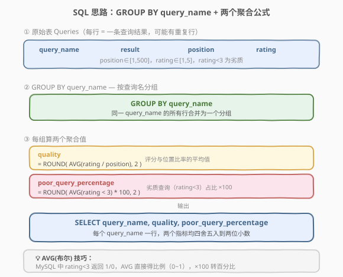
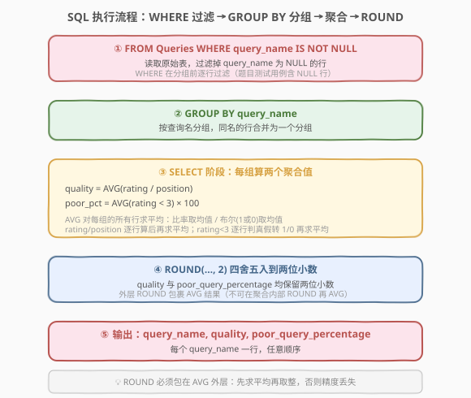
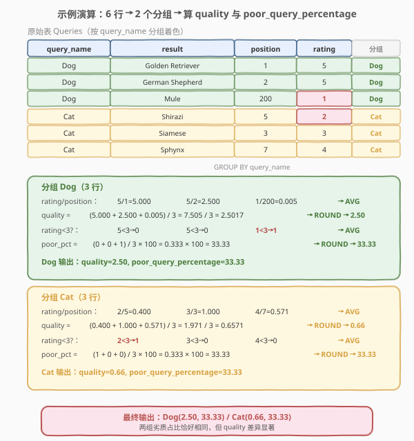

# LeetCode 查询结果的质量和占比 题解

## 1. 题目概述

- **标题 / 题号**：查询结果的质量和占比（#1211，easy）
- **链接**：https://leetcode.cn/problems/queries-quality-and-percentage/
- **难度**：简单
- **标签**：SQL、GROUP BY、AVG 聚合、ROUND、布尔转比例

**题意**：给定 `Queries` 表，每行记录一次搜索查询返回的一条结果：该结果在结果列表中的**位置** `position`（1 到 500）以及用户给出的**评分** `rating`（1 到 5）。评分小于 3 的查询结果被定义为**质量很差**（劣质查询）。要求按 `query_name` 分组，计算两个指标：

- **质量 `quality`**：各查询结果的「评分与位置之比」的平均值，即 $\text{AVG}(\text{rating} / \text{position})$。
- **劣质查询百分比 `poor_query_percentage`**：评分小于 3 的查询结果占全部查询结果的百分比。

两个指标均**四舍五入到小数点后两位**，结果任意顺序返回。

**表结构**：

```text
Table: Queries
+-------------+---------+
| Column Name | Type    |
+-------------+---------+
| query_name  | varchar |
| result      | varchar |
| position    | int     |  ← 1 到 500
| rating      | int     |  ← 1 到 5，< 3 为劣质
+-------------+---------+
```

- 此表可能有**重复的行**（无主键）
- `position` 取值为 1 到 500
- `rating` 取值为 1 到 5，`rating < 3` 的查询结果为劣质

> ⚠️ 本题核心是 **`GROUP BY` + 两个 `AVG` 聚合**：一个对算术表达式 `rating/position` 求平均，一个对布尔表达式 `rating < 3` 求平均（MySQL 中布尔自动转 1/0，`AVG` 即得比例）。难点仅在于理解「`AVG` 既能平均数值，也能平均布尔」这一双用途，以及 `ROUND` 必须包在 `AVG` 外层。

**示例 1**：

```text
输入：
Queries 表:
+------------+-------------------+----------+--------+
| query_name | result            | position | rating |
+------------+-------------------+----------+--------+
| Dog        | Golden Retriever  | 1        | 5      |
| Dog        | German Shepherd   | 2        | 5      |
| Dog        | Mule              | 200      | 1      |
| Cat        | Shirazi           | 5        | 2      |
| Cat        | Siamese           | 3        | 3      |
| Cat        | Sphynx            | 7        | 4      |
+------------+-------------------+----------+--------+

输出：
+------------+---------+-----------------------+
| query_name | quality | poor_query_percentage |
+------------+---------+-----------------------+
| Dog        | 2.50    | 33.33                 |
| Cat        | 0.66    | 33.33                 |
+------------+---------+-----------------------+
```

**解释**：

| query_name | quality 计算 | poor_query_percentage 计算 |
|------------|-------------|---------------------------|
| Dog | $(5/1 + 5/2 + 1/200) / 3 = 2.50$ | $(1/3) \times 100 = 33.33$（仅第 3 行 rating=1 < 3） |
| Cat | $(2/5 + 3/3 + 4/7) / 3 = 0.66$ | $(1/3) \times 100 = 33.33$（仅第 1 行 rating=2 < 3） |

**约束**：

- `Queries` 表可能有重复行（无主键约束）
- `position` ∈ [1, 500]，`rating` ∈ [1, 5]
- 结果 `quality` 与 `poor_query_percentage` 均保留两位小数

## 2. 解题思路

### 2.1 暴力思路：逐分组遍历

最直觉的过程式思路：对每个 `query_name`，遍历其所有行，逐行累加 `rating/position`，同时数 `rating < 3` 的行数；最后用累加和除以行数得 `quality`，用劣质行数除以总行数乘 100 得 `poor_query_percentage`。伪代码如下：

```text
for each query_name:
    rows = [r for r in Queries if r.query_name == query_name]
    sum_ratio = sum(r.rating / r.position for r in rows)
    poor_count = sum(1 for r in rows if r.rating < 3)
    quality = round(sum_ratio / len(rows), 2)
    poor_pct = round(poor_count / len(rows) * 100, 2)
    output(query_name, quality, poor_pct)
```

但**纯 SQL 没有显式逐行循环**——「按 `query_name` 分组后对每组算两个指标」需换成集合式表达：`GROUP BY query_name` + 两个 `AVG` 聚合一次性完成。

### 2.2 核心观察：GROUP BY + AVG 的双用途



**`AVG` 聚合函数的两种用法**：

1. **平均数值表达式**：`AVG(rating / position)` —— 对每行先算 `rating/position`（一个浮点数），再对组内所有行求算术平均，得到 `quality`。

   $$
   \text{quality} = \text{ROUND}\Big(\text{AVG}\Big(\frac{\text{rating}}{\text{position}}\Big),\; 2\Big)
   $$

2. **平均布尔表达式（算比例）**：`AVG(rating < 3)` —— MySQL 中 `rating < 3` 返回 `1`（真）或 `0`（假），对这列 0/1 求平均即为「劣质行占比」（0~1 之间），`× 100` 转百分比。

   $$
   \text{poor\_query\_percentage} = \text{ROUND}\Big(\text{AVG}(\text{rating} < 3) \times 100,\; 2\Big)
   $$

> 💡 **`AVG(布尔)` 技巧**：这是 SQL 算「满足条件行的占比」的惯用法。MySQL 中任何比较表达式（`<`、`=`、`>` 等）都返回 `1`/`0`，`AVG` 对 0/1 列求均值即为比例（介于 0~1）。`× 100` 转百分比，`ROUND(, 2)` 保留两位小数。等价的显式写法是 `AVG(CASE WHEN rating < 3 THEN 1 ELSE 0 END)`，但 `AVG(rating < 3)` 更简洁（依赖 MySQL 隐式转换；PostgreSQL 等需 `CAST(... AS INT)`）。

> ⚠️ **`ROUND` 必须包在 `AVG` 外层**：先对组内所有行求平均，再对最终均值四舍五入。若写成 `AVG(ROUND(rating/position, 2))` 则是先逐行取整再求平均——每行都丢了精度，结果会偏。两者语义完全不同。

### 2.3 算法流程图



**逻辑执行步骤**：

| 步骤 | SQL 子句 | 作用 |
|------|----------|------|
| ① | `FROM Queries WHERE query_name IS NOT NULL` | 读取原始表，过滤掉 `query_name` 为 `NULL` 的行（测试用例含 NULL 行，NULL 无法归属任何分组） |
| ② | `GROUP BY query_name` | 按查询名分组，同名的行合并为一个分组 |
| ③ | `AVG(rating / position)` / `AVG(rating < 3) * 100` | 每组算两个聚合值：比率均值 / 劣质占比×100 |
| ④ | `ROUND(..., 2)` | 两个指标均四舍五入到两位小数 |

> 💡 **SQL 子句执行顺序**：`FROM`（含 `WHERE`）→ `GROUP BY` → `HAVING` → `SELECT`（含 `AVG`）→ `ORDER BY` → `LIMIT`。`WHERE` 在分组**前**逐行过滤（剔除 NULL），`GROUP BY` 将剩余行按 `query_name` 分桶，`SELECT` 阶段的 `AVG` 对每个分组各自求均值。

> ⚠️ **为什么要 `WHERE query_name IS NOT NULL`**：`GROUP BY` 会把所有 `query_name = NULL` 的行归入同一个「NULL 组」。若不过滤，结果会多出一行 `query_name = NULL` 的统计，而题目要求「找出每次的 `query_name`」——NULL 不是有效的查询名。LeetCode 测试用例确实包含 `query_name` 为 NULL 的行，必须显式过滤。

### 2.4 示例演算

以示例 1 数据为例，观察 `GROUP BY` 后两组各自计算 `quality` 与 `poor_query_percentage` 的过程：



**步骤 ①：分组**

按 `query_name` 分组，6 行分为两组：

| 分组 | 行数 | 包含的 (rating, position) |
|------|------|--------------------------|
| Dog | 3 | (5,1), (5,2), (1,200) |
| Cat | 3 | (2,5), (3,3), (4,7) |

**步骤 ②：算 `quality = AVG(rating/position)`**

逐行算 `rating/position`，再求平均：

| 分组 | 逐行比率 | 求和 | 平均 | ROUND → quality |
|------|---------|------|------|-----------------|
| Dog | 5/1=5.000, 5/2=2.500, 1/200=0.005 | 7.505 | 2.5017 | **2.50** |
| Cat | 2/5=0.400, 3/3=1.000, 4/7=0.571 | 1.971 | 0.6571 | **0.66** |

> 💡 注意 Dog 的第 3 行 `rating=1, position=200`，比率仅 0.005，远小于前两行的 5.0 和 2.5——这正是「位置靠后且评分低」的结果对 `quality` 的拖累。

**步骤 ③：算 `poor_query_percentage = AVG(rating < 3) * 100`**

逐行判定 `rating < 3`（真→1，假→0），再求平均乘 100：

| 分组 | 逐行判定 | 求和 | 平均 | ×100 | ROUND → poor_pct |
|------|---------|------|------|------|-----------------|
| Dog | 5<3→0, 5<3→0, 1<3→**1** | 1 | 0.3333 | 33.33 | **33.33** |
| Cat | 2<3→**1**, 3<3→0, 4<3→0 | 1 | 0.3333 | 33.33 | **33.33** |

> 💡 两组的劣质占比恰好相同（均 1/3），但 `quality` 差异显著（2.50 vs 0.66）——说明「质量」与「劣质占比」刻画的是不同维度：前者反映平均水准，后者反映不及格比例。

## 3. 参考代码

### SQL（解法 A：GROUP BY + AVG + ROUND，推荐）

```sql
SELECT query_name,
       ROUND(AVG(rating / position), 2) AS quality,
       ROUND(AVG(rating < 3) * 100, 2) AS poor_query_percentage
FROM Queries
WHERE query_name IS NOT NULL
GROUP BY query_name;
```

> 💡 **写法要点**：
> - **`WHERE query_name IS NOT NULL`**：剔除 `query_name` 为 NULL 的行，避免结果多出 NULL 分组（LeetCode 测试用例含 NULL 行）。
> - **`AVG(rating / position)`**：逐行算比率后再求平均，得 `quality`。`AVG` 内部是表达式，不是单列。
> - **`AVG(rating < 3) * 100`**：MySQL 中 `rating < 3` 返回 1/0，`AVG` 对 0/1 列求均值得劣质比例（0~1），`× 100` 转百分比。
> - **`ROUND(..., 2)` 包在 `AVG` 外层**：先求平均再取整。若写 `AVG(ROUND(rating/position, 2))` 则逐行先取整再平均，精度丢失。
> - **`GROUP BY query_name`**：按查询名分组，每组输出一行。

### SQL（解法 B：CASE WHEN 显式布尔，跨数据库兼容）

```sql
SELECT query_name,
       ROUND(AVG(rating / position), 2) AS quality,
       ROUND(AVG(CASE WHEN rating < 3 THEN 1 ELSE 0 END) * 100, 2) AS poor_query_percentage
FROM Queries
WHERE query_name IS NOT NULL
GROUP BY query_name;
```

> 💡 **写法要点**：用 `CASE WHEN rating < 3 THEN 1 ELSE 0 END` 替代 `rating < 3`，显式产出 0/1 整数列。逻辑等价于解法 A，但不依赖 MySQL 的「布尔隐式转整数」特性，在 PostgreSQL、SQL Server、SQLite 等数据库上均可运行（部分数据库中布尔不能直接参与 `AVG` 数值运算）。

### Python（pandas）

```python
import pandas as pd

def queries_quality_and_percentage(queries: pd.DataFrame) -> pd.DataFrame:
    df = queries[queries['query_name'].notna()].copy()
    df['ratio'] = df['rating'] / df['position']
    df['is_poor'] = (df['rating'] < 3).astype(int)
    result = df.groupby('query_name').agg(
        quality=('ratio', 'mean'),
        poor_query_percentage=('is_poor', 'mean')
    ).reset_index()
    result['quality'] = result['quality'].round(2)
    result['poor_query_percentage'] = (result['poor_query_percentage'] * 100).round(2)
    return result[['query_name', 'quality', 'poor_query_percentage']]
```

> 💡 **pandas 对照**：
> - `queries['query_name'].notna()` 对应 SQL 的 `WHERE query_name IS NOT NULL`。
> - `df['ratio'] = df['rating'] / df['position']` 逐行算比率，对应 `AVG(rating / position)` 中表达式部分。
> - `df['is_poor'] = (df['rating'] < 3).astype(int)` 显式转 0/1，对应 `rating < 3` 布尔转整数（pandas 中布尔需 `.astype(int)` 才能数值聚合）。
> - `groupby('query_name').agg(...)` 对应 `GROUP BY query_name` + 两个 `AVG`。
> - `.round(2)` 对应 `ROUND(..., 2)`，作用在聚合后的均值上（与 SQL 一致：先平均再取整）。

## 4. 复杂度分析

| 维度 | 解法 A（AVG 布尔） | 解法 B（CASE WHEN） | pandas |
|------|-------------------|---------------------|--------|
| **时间** | $O(n)$ | $O(n)$ | $O(n)$ |
| **空间** | $O(k)$ | $O(k)$ | $O(n)$ |
| **可移植性** | ✗ MySQL 隐式转换 | ✓ 标准 SQL | ✓ pandas |
| **推荐度** | ✓ **MySQL 首选** | ✓ 跨数据库 | ✓ pandas 环境 |

> - $n$ = `Queries` 表行数，$k$ = 不同 `query_name` 的数量（分组数）
> - 三个解法均为线性扫描一次表 + 分组聚合，时间 $O(n)$（哈希分组均摊）
> - SQL 解法 A/B 的空间为 $O(k)$（仅存分组聚合结果）；pandas 额外构造 `ratio`/`is_poor` 两列，空间 $O(n)$
> - **索引优化**：在 `query_name` 上建索引可加速分组（走索引扫描而非全表扫描）

## 5. 扩展：AVG 的两种语义与 ROUND 的位置

### 5.1 AVG 既能平均数值，也能平均布尔

`AVG` 是 SQL 中最灵活的聚合函数之一，它对**任何可求数值平均的表达式**生效：

| 用法 | 表达式 | 含义 |
|------|--------|------|
| 平均数值 | `AVG(rating / position)` | 逐行算比率，再求算术平均 |
| 平均布尔（算比例） | `AVG(rating < 3)` | 布尔转 1/0，求均值得占比（0~1） |
| 平均列 | `AVG(rating)` | 直接对某列求平均 |

> 💡 **算比例的三个等价写法**（MySQL）：
> 1. `AVG(rating < 3)` —— 最简洁，依赖隐式转换
> 2. `AVG(CASE WHEN rating < 3 THEN 1 ELSE 0 END)` —— 显式，跨数据库
> 3. `SUM(rating < 3) / COUNT(*)` —— 分别求和与计数，最直观但需处理 `COUNT(*) = 0`（本题分组非空故无需）

### 5.2 ROUND 包内层 vs 外层

```sql
-- ✅ 正确：先平均再取整（外层 ROUND）
ROUND(AVG(rating / position), 2)

-- ❌ 错误：先逐行取整再平均（内层 ROUND）
AVG(ROUND(rating / position, 2))
```

以 Dog 组为例对比：

| 写法 | 逐行值 | 求平均 | 结果 |
|------|--------|--------|------|
| `ROUND(AVG(...), 2)` | 5.000, 2.500, 0.005 | 2.5017 → 取整 | **2.50** ✓ |
| `AVG(ROUND(..., 2))` | 5.00, 2.50, 0.01 | 2.5033 → 取整 | **2.50**（本例恰好相同） |

> ⚠️ 本例因数值巧合两者结果相同，但**语义完全不同**：内层 `ROUND` 在每行都截断精度，当各行比率的小数部分分布不均时会产生系统性偏差。正确做法是先聚合再取整——保留中间计算的完整精度，仅在最终输出时四舍五入。

### 5.3 相关变体题

| 变体 | 需求 | 关键差异 |
|------|------|----------|
| **1211（本题）** | 每组算比率均值 + 劣质占比 | `AVG(表达式)` + `AVG(布尔)×100` |
| 仅算比率均值 | 每组算 `quality` | 去掉 `poor_query_percentage` 列 |
| 仅算劣质占比 | 每组算 `poor_query_percentage` | 去掉 `quality` 列，纯 `AVG(布尔)×100` |
| 分位数版本 | 每组算中位数评分 | 需 `PERCENTILE_CONT` 窗口函数 |

## 6. 面试要点

1. **`AVG(rating < 3)` 为什么能算出比例？**

   > MySQL 中比较表达式 `rating < 3` 返回 `1`（真）或 `0`（假），`AVG` 对这列 0/1 求算术平均，结果就是「真值占比」（介于 0~1）。`× 100` 转百分比，`ROUND(, 2)` 保留两位小数。这等价于 `SUM(rating < 3) / COUNT(*)`，但 `AVG` 写法更简洁。

2. **为什么要 `WHERE query_name IS NOT NULL`？**

   > `GROUP BY` 会把所有 `query_name = NULL` 的行归入同一个 NULL 分组。题目要求「找出每次的 `query_name`」，NULL 不是有效查询名。LeetCode 测试用例确实包含 NULL 行，不过滤会多出一行 `query_name = NULL` 的统计导致结果不符。`WHERE` 在分组**前**逐行过滤，是剔除 NULL 的正确位置。

3. **`ROUND(AVG(...), 2)` 和 `AVG(ROUND(..., 2))` 有什么区别？**

   > 前者先对组内所有行求平均，再对最终均值取整（正确）；后者先逐行取整再求平均（错误，精度丢失）。正确做法是保留中间计算完整精度，仅在最终输出时四舍五入。本例因数值巧合两者结果相同，但语义不同，在其它数据上会产生偏差。

4. **`AVG(rating / position)` 中 `position` 会不会为 0 导致除零？**

   > 不会。题目约束 `position` 取值为 1 到 500，最小为 1，不存在除零风险。但若题目未保证 `position > 0`，需用 `NULLIF(position, 0)` 规避：`AVG(rating / NULLIF(position, 0))`——除零结果为 NULL，`AVG` 自动忽略 NULL 行。

5. **跨数据库如何保证 `AVG(布尔)` 可移植？**

   > MySQL 隐式将布尔转为 1/0，但 PostgreSQL 中布尔不能直接参与 `AVG` 数值运算（需 `CAST`），SQL Server 也不支持。可移植写法是 `AVG(CASE WHEN rating < 3 THEN 1 ELSE 0 END)`，显式产出整数列，所有数据库均支持。或用 `SUM(CASE WHEN ... THEN 1 ELSE 0 END) / COUNT(*)`。

> 💡 **一句话总结**：1211 是 SQL **"GROUP BY + AVG 双用途"招牌题**——核心就一句：`GROUP BY query_name` 后，`AVG(rating/position)` 算质量均值、`AVG(rating<3)*100` 算劣质占比，`ROUND` 包外层先平均再取整。记住 `AVG(布尔)` 算比例的技巧和 `WHERE ... IS NOT NULL` 过滤 NULL 分组，所有「分组 + 比率/占比统计」的 SQL 题都能套用。

## 同类练习题

| # | 题目 | 与本题的关联 |
|---|------|-------------|
| 1174 | [即时食物配送 II](https://leetcode.cn/problems/immediate-food-delivery-ii/)（[题解](../1101-1200/1174_即时食物配送II.md)） | `AVG(布尔) × 100` 算即时订单占比，同为「AVG 算比例」招牌技巧 |
| 1205 | [每月交易 II](https://leetcode.cn/problems/monthly-transactions-ii/)（[题解](1205_每月交易II.md)） | `GROUP BY` + 聚合计数/求和，共享「分组后多指标聚合」模式 |
| 595 | [大的国家](https://leetcode.cn/problems/big-countries/) | `WHERE` 条件过滤 + 简单列投影，对比理解「WHERE 过滤」与「GROUP BY 聚合」的边界 |
| 586 | [订单最多的客户](https://leetcode.cn/problems/customer-placing-the-largest-number-of-orders/) | `GROUP BY` + `ORDER BY COUNT DESC LIMIT 1`，同为「分组聚合」基础题 |
| 620 | [有趣的电影](https://leetcode.cn/problems/not-boring-movies/) | `WHERE` 布尔过滤 + `ORDER BY`，对比 `AVG(布尔)` 的「聚合布尔」与 `WHERE 布尔` 的「过滤布尔」两种用法 |
