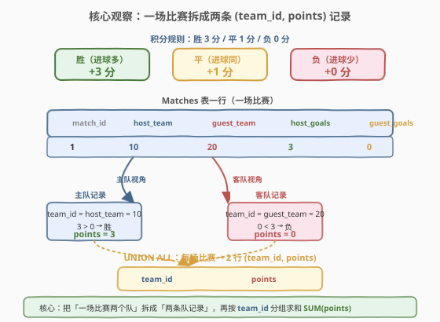
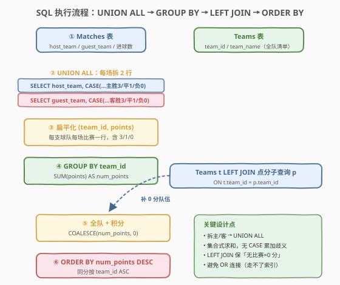
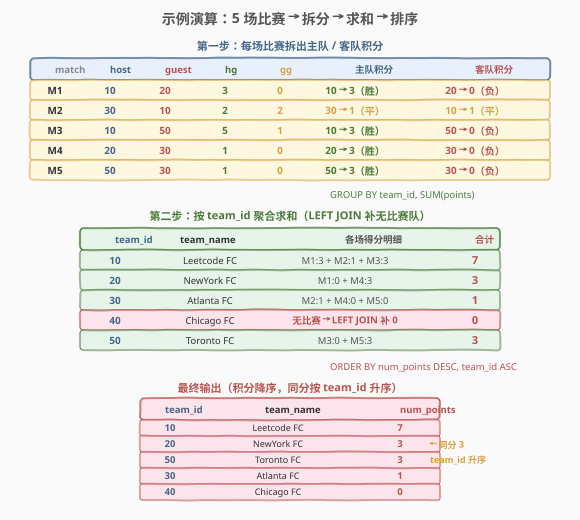

# 查询球队积分

- **题目名称**：查询球队积分
- **链接**：[1212. 查询球队积分](https://leetcode.cn/problems/team-scores-in-football-tournament/)
- **难度**：中等
- **标签**：SQL、`UNION ALL`、`LEFT JOIN`、`GROUP BY`、`CASE` 表达式

## 1. 题目概述

数据库中有两张表：`Teams` 记录所有球队，`Matches` 记录每场已结束的比赛。每场比赛分主队（`host_team`）与客队（`guest_team`），各自的进球数由 `host_goals`、`guest_goals` 给出。请编写 SQL 查询，按以下规则计算每支球队的总积分，并返回 `team_id`、`team_name`、`num_points`：

- **胜**（进球多于对手）得 **3** 分；
- **平**（进球与对手相同）得 **1** 分；
- **负**（进球少于对手）得 **0** 分。

> ⚠️ 关键坑点：① 一支球队可能既是某些场的主队、又是另一些场的客队，需要**两端汇总**；② 某支球队可能**一场比赛都没参加**（如示例中的 Chicago FC），此时积分应为 **0**，不能因为没出现在 `Matches` 表里就被漏掉。

**表结构**：

```text
Table: Teams
+---------------+----------+
| Column Name   | Type     |
+---------------+----------+
| team_id       | int      |  ← 唯一键
| team_name     | varchar  |
+---------------+----------+
每行代表一支独立足球队。

Table: Matches
+---------------+---------+
| Column Name   | Type    |
+---------------+---------+
| match_id      | int     |  ← 唯一键
| host_team     | int     |
| guest_team    | int     |
| host_goals    | int     |
| guest_goals   | int     |
+---------------+---------+
每行代表一场已结束的比赛。
```

**示例 1**：

```text
输入：
Teams 表:
+-----------+--------------+
| team_id   | team_name    |
+-----------+--------------+
| 10        | Leetcode FC  |
| 20        | NewYork FC   |
| 30        | Atlanta FC   |
| 40        | Chicago FC   |
| 50        | Toronto FC   |
+-----------+--------------+
Matches 表:
+------------+--------------+---------------+-------------+--------------+
| match_id   | host_team    | guest_team    | host_goals  | guest_goals  |
+------------+--------------+---------------+-------------+--------------+
| 1          | 10           | 20            | 3           | 0            |
| 2          | 30           | 10            | 2           | 2            |
| 3          | 10           | 50            | 5           | 1            |
| 4          | 20           | 30            | 1           | 0            |
| 5          | 50           | 30            | 1           | 0            |
+------------+--------------+---------------+-------------+--------------+

输出：
+------------+--------------+---------------+
| team_id    | team_name    | num_points    |
+------------+--------------+---------------+
| 10         | Leetcode FC  | 7             |
| 20         | NewYork FC   | 3             |
| 50         | Toronto FC   | 3             |
| 30         | Atlanta FC   | 1             |
| 40         | Chicago FC   | 0             |
+------------+--------------+---------------+
```

**解释**（逐队积分明细）：

| team_id | team_name | 各场得分 | 合计 |
|---------|-----------|----------|------|
| 10 | Leetcode FC | M1 胜 +3、M2 平 +1、M3 胜 +3 | **7** |
| 20 | NewYork FC | M1 负 +0、M4 胜 +3 | **3** |
| 30 | Atlanta FC | M2 平 +1、M4 负 +0、M5 负 +0 | **1** |
| 40 | Chicago FC | 无比赛 | **0** |
| 50 | Toronto FC | M3 负 +0、M5 胜 +3 | **3** |

**约束条件**：

- `team_id` 是 `Teams` 表的唯一键，`match_id` 是 `Matches` 表的唯一键
- 返回结果按 `num_points` **降序**排序；同分则按 `team_id` **升序**排序
- 球队可能未参加任何比赛，此时积分为 0

---

## 2. 解题思路

### 2.1 暴力思路：逐场累加

最直觉的过程式思路：维护一张「球队 → 积分」的哈希表，逐行扫描 `Matches`，对每场比赛分别给主队、客队加 3/1/0 分，最后再补上没参赛的球队（0 分）。伪代码如下：

```text
points = {t.team_id: 0 for t in Teams}
for m in Matches:
    if m.host_goals > m.guest_goals: points[m.host_team] += 3
    elif m.host_goals < m.guest_goals: points[m.guest_team] += 3
    else:
        points[m.host_team] += 1
        points[m.guest_team] += 1
return sorted(points.items(), key=lambda x: (-x[1], x[0]))
```

但**纯 SQL 没有可变变量和逐行循环**——需要换用集合式表达。难点有二：① 一场比赛涉及**两支球队**，要在同一次聚合中同时处理主客双方；② 必须保留**未参赛**的球队。

### 2.2 核心观察：拆行 + 聚合



**三个关键点**：

1. **拆行（UNION ALL）**：把 `Matches` 的每一行「拆」成两条记录——一条站在主队视角、一条站在客队视角，每条带上该队本场所获积分 `points`。这样「一场比赛两支队」就被规整成「一行一队一分」，可直接按 `team_id` 分组求和。

   $$
   \text{num\_points}(t) = \sum_{\text{涉及 } t \text{ 的比赛}} \text{points}_t
   $$

2. **积分判定（CASE）**：站在某队视角，只需比较「自己进球」与「对手进球」：
   - 主队视角：`host_goals > guest_goals` → 胜 3 分；`host_goals = guest_goals` → 平 1 分；否则 0 分；
   - 客队视角：把比较方向反过来即可（`guest_goals > host_goals` → 胜 3 分，以此类推）。

3. **保全队（LEFT JOIN）**：以 `Teams` 为左表、积分子查询为右表做 `LEFT JOIN`，保证 `Teams` 中的每一支球队都出现在结果里。未参赛的球队在右表无匹配，`num_points` 为 `NULL`，用 `COALESCE(..., 0)` 兜底为 0。

> 💡 **为什么用 `UNION ALL` 而不是 `UNION`？** `UNION` 会对结果去重，可能误删「同队同分」的合法记录（如某队两场都进 0 球得 0 分，两行完全相同）。`UNION ALL` 保留全部行，求和才正确。

> ⚠️ **为什么不用 `JOIN ON team_id = host_team OR team_id = guest_team`？** 这种写法虽短，但 `OR` 连接条件**无法走索引**，数据库只能对 `Teams × Matches` 做全表扫描后逐行过滤，时间复杂度退化为 $O(T \times M)$。拆成两次 `UNION ALL` 后，每个分支是简单的等值连接，可分别利用 `host_team`、`guest_team` 上的索引。

### 2.3 算法流程图



**逻辑执行步骤**：

| 步骤 | SQL 子句 | 作用 |
|------|----------|------|
| ① | `FROM Matches`（主队分支） | 取每场主队视角，`CASE` 算主队积分 |
| ② | `UNION ALL`（客队分支） | 取每场客队视角，`CASE` 算客队积分 |
| ③ | 扁平化为 `(team_id, points)` | 每支球队每场比赛一行 |
| ④ | `GROUP BY team_id` + `SUM(points)` | 每队总积分 |
| ⑤ | `Teams LEFT JOIN` 子查询 | 保留未参赛球队，`COALESCE` 补 0 |
| ⑥ | `ORDER BY num_points DESC, team_id ASC` | 按积分降序，同分按 id 升序 |

> 💡 **SQL 子句执行顺序**：`FROM`/`JOIN` → `WHERE` → `GROUP BY` → `HAVING` → `SELECT`（含聚合）→ `ORDER BY`。聚合 `SUM` 在 `GROUP BY` 后求值，因此积分求和必须放在子查询里完成，外层再 `LEFT JOIN` 与排序。

### 2.4 示例演算

以示例 1 数据为例，观察拆行 → 求和 → 排序的全过程：



**步骤 ①：每场比赛拆出主队 / 客队积分**

| match | host | guest | hg | gg | 主队积分 | 客队积分 |
|-------|------|-------|----|----|----------|----------|
| M1 | 10 | 20 | 3 | 0 | 10 → 3（胜） | 20 → 0（负） |
| M2 | 30 | 10 | 2 | 2 | 30 → 1（平） | 10 → 1（平） |
| M3 | 10 | 50 | 5 | 1 | 10 → 3（胜） | 50 → 0（负） |
| M4 | 20 | 30 | 1 | 0 | 20 → 3（胜） | 30 → 0（负） |
| M5 | 50 | 30 | 1 | 0 | 50 → 3（胜） | 30 → 0（负） |

**步骤 ②：`UNION ALL` 合并后 `GROUP BY team_id` 求和**

| team_id | team_name | 各场得分明细 | 合计 |
|---------|-----------|--------------|------|
| 10 | Leetcode FC | M1:3 + M2:1 + M3:3 | **7** |
| 20 | NewYork FC | M1:0 + M4:3 | **3** |
| 30 | Atlanta FC | M2:1 + M4:0 + M5:0 | **1** |
| 40 | Chicago FC | 无比赛 → `LEFT JOIN` 补 0 | **0** |
| 50 | Toronto FC | M3:0 + M5:3 | **3** |

**步骤 ③：`ORDER BY num_points DESC, team_id ASC` 排序**

20 与 50 同为 3 分，按 `team_id` 升序，20 排在 50 之前：

| team_id | team_name | num_points |
|---------|-----------|------------|
| 10 | Leetcode FC | 7 |
| 20 | NewYork FC | 3 |
| 50 | Toronto FC | 3 |
| 30 | Atlanta FC | 1 |
| 40 | Chicago FC | 0 |

与示例输出一致。

---

## 3. 参考代码

### SQL（解法 A：UNION ALL 拆主客 + LEFT JOIN，推荐）

```sql
SELECT t.team_id,
       t.team_name,
       COALESCE(p.num_points, 0) AS num_points
FROM Teams t
LEFT JOIN (
    SELECT team_id, SUM(points) AS num_points
    FROM (
        SELECT host_team AS team_id,
               CASE WHEN host_goals > guest_goals THEN 3
                    WHEN host_goals = guest_goals THEN 1
                    ELSE 0 END AS points
        FROM Matches
        UNION ALL
        SELECT guest_team AS team_id,
               CASE WHEN guest_goals > host_goals THEN 3
                    WHEN guest_goals = host_goals THEN 1
                    ELSE 0 END AS points
        FROM Matches
    ) split
    GROUP BY team_id
) p ON t.team_id = p.team_id
ORDER BY num_points DESC, t.team_id;
```

> 💡 **写法要点**：
> - 内层两个 `SELECT` 分别站在主队、客队视角，用 `CASE` 算出本队积分 `points`，`UNION ALL` 拼成扁平的 `(team_id, points)` 表。
> - 中层 `GROUP BY team_id` + `SUM(points)` 得每队总积分 `num_points`。
> - 外层 `Teams LEFT JOIN` 子查询：以球队全集为左表，未参赛的球队右表无匹配，`COALESCE(p.num_points, 0)` 兜底为 0。
> - `ORDER BY num_points DESC, t.team_id`：积分降序，同分按 `team_id` 升序。
> - 两个分支均为等值连接，可分别命中 `host_team`、`guest_team` 上的索引。

### SQL（解法 B：LEFT JOIN ON ... OR ... + GROUP BY + CASE）

```sql
SELECT t.team_id,
       t.team_name,
       SUM(
           CASE WHEN t.team_id = m.host_team   AND m.host_goals  > m.guest_goals THEN 3
                WHEN t.team_id = m.guest_team  AND m.guest_goals > m.host_goals  THEN 3
                WHEN m.host_goals = m.guest_goals THEN 1
                ELSE 0 END
       ) AS num_points
FROM Teams t
LEFT JOIN Matches m
       ON t.team_id = m.host_team OR t.team_id = m.guest_team
GROUP BY t.team_id, t.team_name
ORDER BY num_points DESC, t.team_id;
```

> 💡 **写法要点**：
> - 不拆行，直接把 `Teams` 与 `Matches` 用 `OR` 条件连接：一支队作为主队或客队的比赛都会被匹配到同一组。
> - `SUM(CASE ...)` 在聚合时按「当前行 `team_id` 是主还是客」分别判定积分，平局两方都加 1。
> - `LEFT JOIN` 保证未参赛球队出现；此时 `m.*` 全为 `NULL`，`CASE` 落到 `ELSE 0`，`SUM(NULL...0)` 在 MySQL 中为 `0`（`SUM` 忽略 `NULL`，单行 0 求和为 0），无需 `COALESCE`。
> - **缺点**：`OR` 连接走不了索引，数据量大时性能差（见第 4 节）。

### SQL（解法 C：主客分别聚合再合并）

```sql
SELECT t.team_id,
       t.team_name,
       COALESCE(host_pts, 0) + COALESCE(guest_pts, 0) AS num_points
FROM Teams t
LEFT JOIN (
    SELECT host_team AS team_id,
           SUM(CASE WHEN host_goals > guest_goals THEN 3
                    WHEN host_goals = guest_goals THEN 1 ELSE 0 END) AS host_pts
    FROM Matches GROUP BY host_team
) h ON t.team_id = h.team_id
LEFT JOIN (
    SELECT guest_team AS team_id,
           SUM(CASE WHEN guest_goals > host_goals THEN 3
                    WHEN guest_goals = host_goals THEN 1 ELSE 0 END) AS guest_pts
    FROM Matches GROUP BY guest_team
) g ON t.team_id = g.team_id
ORDER BY num_points DESC, t.team_id;
```

> 💡 **写法要点**：把主队积分、客队积分分别在两个子查询里聚合好，再两次 `LEFT JOIN` 到 `Teams` 上相加。逻辑最直白（每队的积分 = 当主队的积分 + 当客队的积分），但需要两次连接，写法稍长。适合「主客两端规则不同」需要分别统计的场景。

### Python（pandas）

```python
import pandas as pd

def team_scores(teams: pd.DataFrame, matches: pd.DataFrame) -> pd.DataFrame:
    host = matches[['host_team']].rename(columns={'host_team': 'team_id'})
    host['points'] = matches.apply(
        lambda r: 3 if r.host_goals > r.guest_goals
                  else 1 if r.host_goals == r.guest_goals else 0, axis=1)
    guest = matches[['guest_team']].rename(columns={'guest_team': 'team_id'})
    guest['points'] = matches.apply(
        lambda r: 3 if r.guest_goals > r.host_goals
                  else 1 if r.guest_goals == r.host_goals else 0, axis=1)
    pts = pd.concat([host, guest]).groupby('team_id')['points'].sum().reset_index()
    res = teams.merge(pts, on='team_id', how='left').fillna({'points': 0})
    res = res.sort_values(['points', 'team_id'], ascending=[False, True])
    return res.rename(columns={'points': 'num_points'})[
        ['team_id', 'team_name', 'num_points']]
```

> 💡 **pandas 对照**：
> - `concat([host, guest])` 对应 SQL 的 `UNION ALL` 拼主客两表。
> - `groupby('team_id')['points'].sum()` 对应 `GROUP BY team_id` + `SUM(points)`。
> - `teams.merge(..., how='left').fillna({'points': 0})` 对应 `Teams LEFT JOIN` 子查询 + `COALESCE(..., 0)`。
> - `sort_values(['points', 'team_id'], ascending=[False, True])` 对应 `ORDER BY num_points DESC, team_id ASC`。

---

## 4. 复杂度分析

| 维度 | 解法 A（UNION ALL） | 解法 B（OR 连接） | 解法 C（双聚合合并） |
|------|---------------------|-------------------|----------------------|
| **时间** | $O(M + T)$ | $O(T \times M)$ | $O(M + T)$ |
| **空间** | $O(M)$ | $O(M)$ | $O(T + M)$ |
| **索引利用** | ✓ 等值连接命中索引 | ✗ `OR` 走不了索引 | ✓ 各分支命中索引 |
| **连接次数** | 1 次 `LEFT JOIN` | 1 次 `LEFT JOIN` | 2 次 `LEFT JOIN` |
| **可读性** | 高 | 中（`CASE` 内含 `team_id` 判定） | 高（主客分离最直观） |
| **推荐度** | ✓ **首选** | ✗ 数据量大时慢 | △ 适合主客规则不同的变体 |

> - $T$ = `Teams` 行数，$M$ = `Matches` 行数
> - 解法 A：两个分支各扫描一次 `Matches`（$O(M)$），`GROUP BY` 哈希聚合 $O(M)$，`LEFT JOIN` 哈希连接 $O(T + M)$。
> - 解法 B：`OR` 条件使连接退化为嵌套循环，最坏 $O(T \times M)$；即便有索引也无法高效利用。
> - 解法 C：两次 `GROUP BY` 各 $O(M)$，两次 `LEFT JOIN` 共 $O(T + M)$，常数因子略大于 A。
> - **索引优化**：在 `Matches(host_team)`、`Matches(guest_team)` 上分别建索引，解法 A、C 的等值连接可降至接近 $O(M)$。

---

## 5. 扩展：UNION ALL vs OR 连接的取舍

### 5.1 「一行变多行」的拆行范式

本题的本质是**「一行涉及多个实体」的聚合**——一场比赛关联两支球队。SQL 处理这类问题有两种范式：

| 范式 | 做法 | 代表写法 | 特点 |
|------|------|----------|------|
| **拆行** | 把一行拆成多行，每行只关联一个实体，再分组聚合 | `UNION ALL`（解法 A） | 集合式，索引友好，可读性好 |
| **展宽** | 保持一行，在聚合函数里用 `CASE` 按角色分别判定 | `OR` 连接 + `SUM(CASE)`（解法 B） | 写法短，但 `OR` 连接性能差 |

> 💡 **判定口诀**：凡是「同一行要同时处理多个同质对象」（一场比赛两支队、一笔订单买卖双方、一条边两个顶点），优先用 `UNION ALL` 拆行。`OR` 连接是「图省事」的写法，小数据量无妨，数据量一大就成性能瓶颈。

### 5.2 LEFT JOIN 保全集的通用套路

「主体表 + 可能缺失的附属数据」是 SQL 高频场景。以**主体表为左表**做 `LEFT JOIN`，右表无匹配时列值为 `NULL`，再用 `COALESCE(x, 0)` 兜底：

```sql
-- 通用骨架：保留 Teams 全集，缺失补 0
SELECT t.*, COALESCE(p.val, 0) AS val
FROM Teams t
LEFT JOIN ( /* 子查询算附属值 */ ) p ON t.team_id = p.team_id;
```

> ⚠️ **`INNER JOIN` 会漏队**：若直接 `JOIN`，未参赛球队（`team_id` 不在 `Matches` 中）会被丢弃，结果少了 Chicago FC 这一行。必须用 `LEFT JOIN`。

### 5.3 相关变体题

| 变体 | 需求 | 关键差异 |
|------|------|----------|
| **1212（本题）** | 每队总积分，主客两端汇总 | `UNION ALL` 拆行 + `LEFT JOIN` 保全队 |
| 只算主场积分 | 仅主队视角 | 去掉客队分支，单一 `GROUP BY host_team` |
| 按胜/平/负场次统计 | 输出每队胜负平计数 | `CASE` 计数版：`SUM(CASE WHEN ... THEN 1 ELSE 0 END)` 分三列 |
| 净胜球排行 | 进球数 − 失球数 | 拆行时分别带 `goals_for`、`goals_against`，再 `SUM` 相减 |

---

## 6. 面试要点

1. **为什么必须用 `LEFT JOIN` 而不是 `INNER JOIN`？**

   > 未参赛的球队（如 Chicago FC）不出现在 `Matches` 表中。`INNER JOIN` 只保留两表都匹配的行，会把这类球队丢掉，结果少行。`LEFT JOIN` 以 `Teams` 为左表保留全集，右表无匹配时列值为 `NULL`，再用 `COALESCE(..., 0)` 补 0 分。

2. **为什么用 `UNION ALL` 而不是 `UNION`？**

   > `UNION` 会对拼接结果去重。若某队两场比赛积分相同（如两场都 0 分），两条 `(team_id, points)` 完全相同，`UNION` 会误删一条，导致 `SUM` 少算。`UNION ALL` 保留全部行，求和才准确。

3. **解法 B 的 `CASE` 里为什么要判断 `team_id = host_team`？**

   > `OR` 连接后，同一场比赛会与主队、客队各匹配一次，混在同一组里。聚合时必须先判断「当前行 `team_id` 是这场的主队还是客队」，才能选对比较方向（主队比 `host_goals > guest_goals`，客队比 `guest_goals > host_goals`）。这是展宽范式相对拆行范式的额外复杂度。

4. **为什么 `OR` 连接走不了索引？**

   > 数据库索引按单一列（或组合列）的等值/范围条件高效检索。`team_id = host_team OR team_id = guest_team` 跨两列，优化器通常无法用单一索引同时满足两个分支，只能退化为对 `Teams × Matches` 全表扫描后逐行过滤。拆成两次 `UNION ALL` 后，每个分支是单列等值连接，可分别命中 `host_team`、`guest_team` 索引。

5. **同分排序为什么按 `team_id` 而不是 `team_name`？**

   > 题目明确要求「同分按 `team_id` 升序」。若按 `team_name` 排序，不同语言环境下字符串排序规则（大小写、重音、本地化）可能不一致，结果不稳定。`team_id` 是整数，排序确定无歧义。

> 💡 **一句话总结**：1212 是 SQL **「拆行 + 保全队」招牌题**——核心三步：① `UNION ALL` 把每场比赛拆成主客两条 `(team_id, points)`；② `GROUP BY team_id` + `SUM(points)` 求每队积分；③ `Teams LEFT JOIN` 子查询 + `COALESCE(..., 0)` 保留未参赛球队。记住「一行涉及多实体就拆行、主体表用 LEFT JOIN 保全」，所有「多端汇总 + 可能缺失」的 SQL 题都能套用。

---

## 7. 同类练习题

- [1174. 即时食物配送 II](https://leetcode.cn/problems/immediate-food-delivery-ii/)（[题解](../1101-1200/1174_即时食物配送II.md)）：`LEFT JOIN` + 子求首次订单，同为「子查询 + 聚合」模式
- [614. 二级关注者](https://leetcode.cn/problems/second-degree-follower/)（[题解](../0601-0700/614_二级关注者.md)）：自连接把两跳拼成一行，对照「展宽 vs 拆行」两种范式
- [608. 树节点](https://leetcode.cn/problems/tree-node/)（[题解](../0601-0700/608_树节点.md)）：`CASE` 表达式按角色分类判定，巩固 `CASE` 在聚合中的用法
- [586. 订单最多的客户](https://leetcode.cn/problems/customer-placing-the-largest-number-of-orders/)（[题解](../0501-0600/586_订单最多的客户.md)）：`GROUP BY` + `ORDER BY COUNT DESC LIMIT 1`，同为「聚合 + 排序取最值」模式
- [550. 游戏玩法分析 IV](https://leetcode.cn/problems/game-play-analysis-iv/)（[题解](../0501-0600/550_游戏玩法分析IV.md)）：`LEFT JOIN` + 首次登录条件连接，共享「保全集 + 子查询」思想
