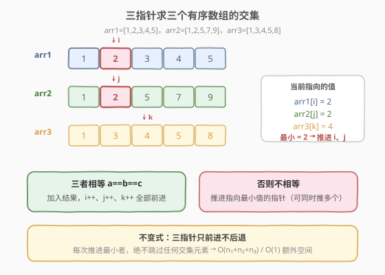
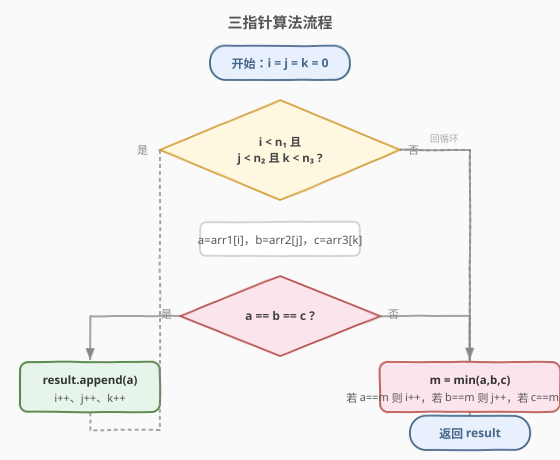

# 三个有序数组的交集

- **题目名称**：三个有序数组的交集
- **链接**：[1213. 三个有序数组的交集](https://leetcode.cn/problems/intersection-of-three-sorted-arrays/)
- **难度**：简单
- **标签**：数组、双指针、二分查找、计数

## 1. 题目概述

给定三个**升序排列**且各自内部元素**互不相同**的整数数组 `arr1`、`arr2`、`arr3`，返回一个**升序**数组，其中只包含**同时出现在三个数组中**的整数。

**示例 1**：

```text
输入：arr1 = [1,2,3,4,5], arr2 = [1,2,5,7,9], arr3 = [1,3,4,5,8]
输出：[1,5]
解释：只有 1 和 5 同时出现在三个数组中。
```

**示例 2**：

```text
输入：arr1 = [197,418,523,876,1356], arr2 = [501,880,1593,1710,1870], arr3 = [521,682,1337,1395,1764]
输出：[]
解释：三个数组没有共同的整数。
```

**约束条件**：

- $1 \leq \text{arr1.length}, \text{arr2.length}, \text{arr3.length} \leq 1000$
- $1 \leq \text{arr1}[i], \text{arr2}[i], \text{arr3}[i] \leq 2000$
- 每个数组中的整数**互不相同**，且按**严格升序**排列

> 💡 这是 [349. 两个数组的交集](https://leetcode.cn/problems/intersection-of-two-arrays/) 的三数组升级版。关键在于充分利用**有序**这一性质——三个指针同步扫描，$O(n_1+n_2+n_3)$ 一次过。同时数值范围被限制在 $[1, 2000]$，这让「计数法」也成为一个极其高效的备选方案。

---

## 2. 解题思路

### 2.1 暴力思路：双重线性查找

对 `arr1` 中的每个元素 $x$，分别在 `arr2` 和 `arr3` 中线性扫描判断是否存在，若都存在则加入结果。时间 $O(n_1 \times (n_2 + n_3))$，最坏约 $10^6$ 次比较，能过但未利用「有序」性质，且需要额外处理去重（本题每个数组内部互异，结果天然无重复，但暴力法未体现有序优势）。

### 2.2 核心观察：三指针同步推进



**关键性质**：三个数组都已升序排序，因此可以用三个指针 $i, j, k$ 分别从各数组头部出发，**只前进不后退**地同步扫描。

**核心决策**：

设当前三个指针指向的值为 $a = \text{arr1}[i]$、$b = \text{arr2}[j]$、$c = \text{arr3}[k]$。

| 情况 | 操作 | 含义 |
|------|------|------|
| **$a = b = c$** | 加入结果，$i{+}{+}, j{+}{+}, k{+}{+}$ | 三者相等，必为交集元素 |
| **否则** | 推进指向**最小值**的指针 | 最小值不可能再出现在其它数组后续位置（因为它们更大），故可安全丢弃 |

> 💡 **为什么推进最小者是安全的？** 假设 $a$ 是三者最小且 $a < b$。由于 `arr2` 升序，`arr2[j..]` 中的值都 $\geq b > a$，因此 $a$ **绝不可能**出现在 `arr2` 中，不可能是交集元素。丢弃 $a$（即 $i{+}{+}$）不会漏掉任何答案。若有多个指针同时指向最小值，则一并推进。

> ⚠️ **为什么不用「三者不等则全部 +1」？** 那样会跳过本该匹配的元素。例如 $a=2, b=2, c=3$ 时，$a$ 与 $b$ 相等只是暂时被 $c$ 卡住，正确做法是推进 $i, j$（最小值 2），保留 $k$，等 $c$ 也追上 2（或超过）。若三者全 +1，会把 2 直接丢掉而漏答。

### 2.3 算法流程图



**完整步骤**：

1. **初始化**：$i = j = k = 0$，结果数组 `res` 为空
2. **循环**：只要 $i < n_1$ 且 $j < n_2$ 且 $k < n_3$：
   - 取 $a, b, c$
   - 若 $a = b = c$：`res.append(a)`，三指针各 $+1$
   - 否则：$m = \min(a, b, c)$，凡是指向 $m$ 的指针都 $+1$
3. **任一指针越界即结束**（剩余元素不可能同时出现在三个数组中），返回 `res`

### 2.4 示例演算

以 `arr1=[1,2,3,4,5]`, `arr2=[1,2,5,7,9]`, `arr3=[1,3,4,5,8]` 为例：

![示例演算：五步得到交集 [1,5]](../images/inter3arr_walkthrough.svg)

| 步 | $i, j, k$ | $a, b, c$ | 判定 | 操作 |
|----|-----------|-----------|------|------|
| 1 | 0, 0, 0 | 1, 1, 1 | 全等 | 加入 **1**，三指针各 +1 |
| 2 | 1, 1, 1 | 2, 2, 3 | min=2 | $i{+}{+}, j{+}{+}$ |
| 3 | 2, 2, 1 | 3, 5, 3 | min=3 | $i{+}{+}, k{+}{+}$ |
| 4 | 3, 2, 2 | 4, 5, 4 | min=4 | $i{+}{+}, k{+}{+}$ |
| 5 | 4, 2, 3 | 5, 5, 5 | 全等 | 加入 **5**，三指针各 +1 |
| — | 5, 3, 4 | — | $i \geq n_1$ | 循环结束 |

最终结果 `[1, 5]`，与示例一致。

> 💡 观察步 2–4：`arr1` 的 2、3、4 因为在 `arr3` 中「追不上」（被更大的值卡住）而被逐步丢弃，直到三方都指向 5 才再次相等。这正是「推进最小者」的精髓——**让小的追上大的，而不是让大的等小的**。

---

## 3. 参考代码

### C++

```cpp
// 三个有序数组的交集.cpp —— 三指针同步推进
// 编译: g++ -O2 -std=c++17 三个有序数组的交集.cpp -o inter3
class Solution {
public:
    vector<int> arraysIntersection(vector<int>& arr1, vector<int>& arr2, vector<int>& arr3) {
        vector<int> res;
        int i = 0, j = 0, k = 0;
        int n1 = arr1.size(), n2 = arr2.size(), n3 = arr3.size();
        while (i < n1 && j < n2 && k < n3) {
            int a = arr1[i], b = arr2[j], c = arr3[k];
            if (a == b && b == c) {            // 三者相等：交集元素
                res.push_back(a);
                i++; j++; k++;
            } else {                           // 否则推进指向最小值的指针
                int m = min({a, b, c});
                if (a == m) i++;
                if (b == m) j++;
                if (c == m) k++;
            }
        }
        return res;
    }
};
```

### Python

```python
class Solution:
    def arraysIntersection(self, arr1: List[int], arr2: List[int], arr3: List[int]) -> List[int]:
        res = []
        i = j = k = 0
        n1, n2, n3 = len(arr1), len(arr2), len(arr3)
        while i < n1 and j < n2 and k < n3:
            a, b, c = arr1[i], arr2[j], arr3[k]
            if a == b == c:                    # 三者相等：交集元素
                res.append(a)
                i += 1; j += 1; k += 1
            else:                              # 否则推进指向最小值的指针
                m = min(a, b, c)
                if a == m: i += 1
                if b == m: j += 1
                if c == m: k += 1
        return res
```

> 💡 **实现细节**：① `min({a, b, c})`（C++）/ `min(a, b, c)`（Python）取三者最小值，再用三个独立 `if`（非 `else if`）把所有指向最小值的指针一并推进——这一点很重要，否则当两个指针同时指向最小值时会多走一轮。② 每个数组内部元素互异，因此相等时直接加入无需查重；三指针同步前进保证结果天然升序。

---

## 4. 复杂度分析

| 维度 | 三指针 | 计数法 | 二分法 |
|------|--------|--------|--------|
| **时间** | $O(n_1+n_2+n_3)$ | $O(n_1+n_2+n_3+V)$ | $O(n_{\min} \cdot (\log n_2 + \log n_3))$ |
| **空间** | $O(1)$（不计输出） | $O(V)$，$V=2000$ | $O(1)$（不计输出） |
| **是否利用有序** | ✓ | ✗（利用值域） | ✓ |
| **是否利用值域** | ✗ | ✓ | ✗ |

> ⚠️ **三指针时间**：每轮循环至少有一个指针 $+1$，三个指针总共最多前进 $n_1+n_2+n_3$ 次，故总轮数 $O(n_1+n_2+n_3)$，每轮 $O(1)$。$n \leq 1000$ 时约 $3000$ 次操作，极快。

---

## 5. 扩展：计数法与二分法

### 5.1 计数法（利用值域 $[1, 2000]$）

约束给出元素值 $\in [1, 2000]$，开一个大小 $2001$ 的计数数组，三个数组各扫一遍累加，最后收集出现次数为 $3$ 的值：

```python
def arraysIntersection(self, arr1, arr2, arr3):
    cnt = [0] * 2001
    for v in arr1: cnt[v] += 1
    for v in arr2: cnt[v] += 1
    for v in arr3: cnt[v] += 1
    return [v for v in range(1, 2001) if cnt[v] == 3]
```

$O(n_1+n_2+n_3+V)$ 时间、$O(V)$ 空间。由于 $V=2000$ 很小，常数极低，实测往往比三指针还快。按值域递增收集，结果天然升序、去重。

> 💡 这是对「**值域小**」这一约束的兑现：当值域 $V$ 远小于数据规模相关量时，计数法/桶往往是最优解。对比 [448. 找到所有数组中消失的数字](https://leetcode.cn/problems/find-all-numbers-disappeared-in-an-array/) 同样利用 $[1, n]$ 值域做原地标记。

### 5.2 二分法

选最短的数组（假设为 `arr1`）枚举元素，对每个 $x$ 在另外两个升序数组中二分查找：

```python
import bisect
def arraysIntersection(self, arr1, arr2, arr3):
    def in_arr(x, arr):
        i = bisect.bisect_left(arr, x)
        return i < len(arr) and arr[i] == x
    return [x for x in arr1 if in_arr(x, arr2) and in_arr(x, arr3)]
```

$O(n_{\min} \cdot (\log n_2 + \log n_3))$。当三个数组长度悬殊（一个很短、两个很长）时优于三指针；长度相近时三指针更优。

> ⚠️ 注意应枚举**最短**数组以最小化 $n_{\min}$，否则可能退化。

---

## 6. 面试要点

1. **为什么推进最小值的指针是安全的，不会漏掉答案？**

   > 设 $a$ 最小且 $a < b$。`arr2` 升序 ⇒ `arr2[j..]` 全部 $\geq b > a$，故 $a$ 不可能出现在 `arr2`，不可能是三数组交集。丢弃 $a$ 安全。多个指针同指最小值时一并推进同理。

2. **为什么「三者不等就全部 +1」是错的？**

   > 反例 $a=2, b=2, c=3$：此时 $a=b$ 只是被 $c$ 卡住，正确做法是推进 $i, j$（最小值 2）让 $c$ 有机会追上；若三者全 +1，会把 2 直接丢掉，而 2 本可能在后续匹配（此处虽不匹配，但逻辑上已错）。规则应是「推进指向**最小值**的指针」，而非「推进全部」。

3. **三指针法的时间复杂度为什么是 $O(n_1+n_2+n_3)$？**

   > 每轮循环至少一个指针 $+1$，三指针总前进次数上界为 $n_1+n_2+n_3$，故循环轮数线性。每轮 $O(1)$，总计 $O(n_1+n_2+n_3)$。

4. **计数法在什么前提下才优于三指针？**

   > 值域 $V$ 较小（本题 $V=2000$）时，$O(V)$ 空间可接受，且按值域收集天然升序去重、常数低。若值域很大（如 $10^9$），计数法空间爆炸，三指针/二分更合适。

5. **结果需要去重吗？为什么？**

   > 不需要。每个数组内部元素互不相同（题目约束），三指针只在 $a=b=c$ 时加入且随后三指针都前进，同一值只会被加入一次。若改为「数组内部可能有重复」的变体（如 [350. 两个数组的交集 II](https://leetcode.cn/problems/intersection-of-two-arrays-ii/)），则需改为计数最小频次。

> 💡 **一句话总结**：三个有序数组求交集 = 三指针同步扫描，相等则收录、否则推进最小者，$O(n_1+n_2+n_3)$ / $O(1)$ 空间。本质是 [349/350. 两数组交集](https://leetcode.cn/problems/intersection-of-two-arrays/) 双指针法的自然推广——从「两指针比大小」扩展到「三指针取最小」。

---

## 7. 同类练习题

- [349. 两个数组的交集](https://leetcode.cn/problems/intersection-of-two-arrays/)：本题两数组版，排序+双指针或哈希集合，结果去重
- [350. 两个数组的交集 II](https://leetcode.cn/problems/intersection-of-two-arrays-ii/)：两数组交集含重复（按最小出现次数），计数/双指针
- [1198. 找出最小公共元素](https://leetcode.cn/problems/find-smallest-common-element-in-all-rows/)：矩阵每行有序，求所有行的最小公共元素，三指针思想推广到多行（或计数法取首个频次=行数者）
- [1002. 查找共用字符](https://leetcode.cn/problems/find-common-characters/)：多字符串公共字符（含重复），计数法取最小频次，思路同计数法版
- [448. 找到所有数组中消失的数字](https://leetcode.cn/problems/find-all-numbers-disappeared-in-an-array/)：同样利用 $[1, n]$ 小值域，原地标记替代计数数组
