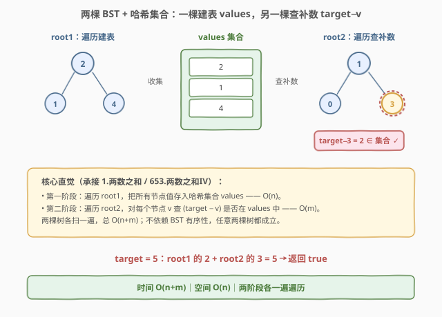
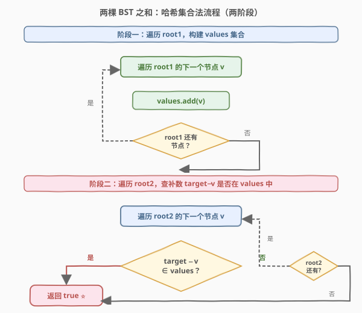
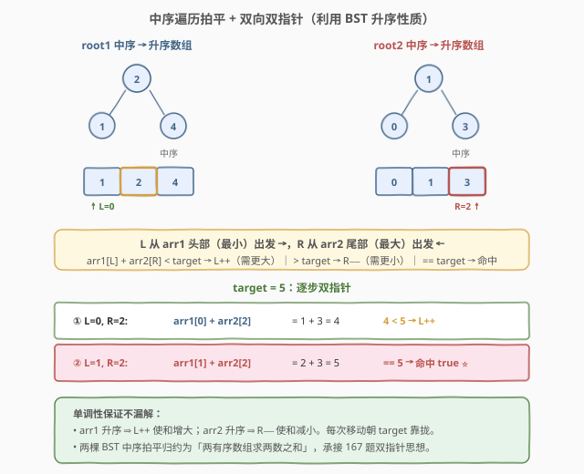

# LeetCode 查找两棵二叉搜索树之和 题解

## 1. 题目概述

- **标题 / 题号**：查找两棵二叉搜索树之和（#1214，medium）
- **链接**：https://leetcode.cn/problems/two-sum-bsts/
- **难度**：中等
- **标签**：树、二叉搜索树、哈希表、双指针、DFS

**题意**：给定**两棵二叉搜索树（BST）** 的根节点 `root1` 和 `root2`，以及一个整数 `target`。判断是否存在 `root1` 中的一个节点 `a` 与 `root2` 中的一个节点 `b`，使得 $a.\text{val} + b.\text{val} = \text{target}$。存在返回 `true`，否则返回 `false`。

**示例 1**：

```text
输入：root1 = [2,1,4], root2 = [1,0,3], target = 5
输出：true
解释：root1 中的节点 2 + root2 中的节点 3 = 5。
      （或 root1 的 4 + root2 的 1 = 5，同样合法）
```

```text
       2                    1
      / \                  / \
     1   4                0   3
   root1                root2
```

**示例 2**：

```text
输入：root1 = [2,1,4], root2 = [1,0,3], target = 10
输出：false
解释：root1 最大值 4 + root2 最大值 3 = 7 < 10，不存在满足条件的节点对。
```

**约束**：

- 每棵树的节点数 $1 \leq n, m \leq 5000$
- $-10^6 \leq \text{Node.val} \leq 10^6$
- $-10^6 \leq \text{target} \leq 10^6$
- `root1` 和 `root2` 均为合法 BST

> 💡 这是 [653. 两数之和 IV - 输入 BST](../0601-0700/653_两数之和IV输入BST.md) 的「双树版」升级：653 在**同一棵** BST 里找两节点之和，本题跨**两棵** BST 各取一个节点。核心仍是「遍历时查补数」，但「先查后存」的自配问题不再存在——因为两棵树天然分开，不存在「同一节点用两次」的风险。

## 2. 解题思路

### 2.1 暴力思路：枚举所有跨树节点对

对 `root1` 的每个节点 $a$，遍历 `root2` 的所有节点 $b$，判断 $a.\text{val} + b.\text{val} = \text{target}$。时间 $O(n \times m)$，对 $5000 \times 5000 = 2.5 \times 10^7$ 次比较，勉强能过但未利用任何结构性质。

问题本质：对每个 $a$，找「$b = \text{target} - a.\text{val}$」用了 $O(m)$ 线性扫描——这正是**哈希表**能优化到 $O(1)$ 的地方，和 [1. 两数之和](../0001-0100/1_两数之和.md) 完全同构。

### 2.2 核心观察：哈希集合查补数，两阶段遍历



关键直觉：要在两棵树中各取一个节点凑成 $\text{target}$，可以**分两阶段**处理：

1. **建表阶段**：遍历 `root1`，把所有节点值存入哈希集合 `values`。
2. **查补阶段**：遍历 `root2`，对每个节点 $v$ 查 $\text{target} - v$ 是否在 `values` 中——在则命中。

> 💡 **与 653 的关键区别**：653 在**同一棵**树里找两节点，必须「先查后存」防止节点自配（$k = 2v$ 时查到自己）。本题两棵树天然分离，`root1` 全部建完表后再查 `root2`，不存在「同一节点用两次」的问题，因此**无需「先查后存」**——建表和查补是两个独立阶段，顺序天然安全。

> ⚠️ **为什么选较小的树建表？** 空间复杂度由 `values` 集合大小决定，即建表树的节点数。若 $n \ll m$，用 `root1`（小树）建表只需 $O(n)$ 空间，再用 $O(m)$ 遍历大树查补。反之亦然。总时间仍为 $O(n + m)$，但空间从 $O(\min(n,m))$ 取较小者更优。

### 2.3 算法流程图



整个流程清晰分为两个独立阶段：

- **阶段一**：遍历 `root1`，逐节点 `values.add(v)`，直到 `root1` 遍历完毕。
- **阶段二**：遍历 `root2`，逐节点查 $\text{target} - v \in \text{values}$，命中即返回 `true`；遍历完未命中返回 `false`。

两阶段各自一次完整遍历，总时间 $O(n + m)$。

### 2.4 示例演算

以 `root1 = [2,1,4]`、`root2 = [1,0,3]`、`target = 5` 为例：

![示例演算：root1=[2,1,4], root2=[1,0,3], target=5](../images/twosum2bst_walkthrough.svg)

| 步 | 树 | 访问节点 v | 操作 / 查询 | values |
|----|------|-----------|------------|--------|
| 1 | root1 | 2 | add → | {2} |
| 2 | root1 | 1 | add → | {2,1} |
| 3 | root1 | 4 | add → | {2,1,4} |
| 4 | root2 | 1 | 查 $5-1=4 \in \{2,1,4\}$？**命中** ⭐ | — |
| 5* | root2 | 0 | — 跳过（已返回 true） | — |

> 💡 步骤 4 命中时，补数 $4$ 来自 `root1` 的右子节点，当前节点 $1$ 来自 `root2` 的根——跨树配对 $1 + 4 = 5$。注意 $2 + 3 = 5$ 也是合法对，但哈希法在访问 `root2` 的节点 $1$ 时就先命中了 $4$，**早停**不再访问后续节点。若 $\text{target} = 10$，则 `root2` 全部遍历后 $9/10/7$ 均不在集合中，返回 `false`。

## 3. 参考代码

### C++（DFS + 哈希集合）

```cpp
// 1214. 查找两棵二叉搜索树之和.cpp —— 两阶段哈希集合
// 编译: g++ -O2 -std=c++17 1214.cpp -o twosum2bst
class Solution {
public:
    bool twoSumBSTs(TreeNode* root1, TreeNode* root2, int target) {
        unordered_set<int> values;
        collect(root1, values);                       // 阶段一：root1 建表
        return find(root2, target, values);            // 阶段二：root2 查补数
    }
private:
    void collect(TreeNode* node, unordered_set<int>& values) {
        if (!node) return;
        values.insert(node->val);
        collect(node->left, values);
        collect(node->right, values);
    }
    bool find(TreeNode* node, int target, const unordered_set<int>& values) {
        if (!node) return false;
        if (values.count(target - node->val)) return true;   // 查补数，命中即返回
        return find(node->left, target, values)
            || find(node->right, target, values);
    }
};
```

### Python（迭代 + 哈希集合）

```python
class Solution:
    def twoSumBSTs(self, root1: Optional[TreeNode], root2: Optional[TreeNode], target: int) -> bool:
        # 阶段一：遍历 root1 建表
        values = set()
        stack = [root1]
        while stack:
            node = stack.pop()
            if node:
                values.add(node.val)
                stack.append(node.left)
                stack.append(node.right)

        # 阶段二：遍历 root2 查补数
        stack = [root2]
        while stack:
            node = stack.pop()
            if node:
                if target - node.val in values:      # 查补数，命中即返回
                    return True
                stack.append(node.left)
                stack.append(node.right)
        return False
```

> 💡 **实现细节**：① C++ 版用递归 DFS（系统栈 $O(h_1 + h_2)$），Python 版用显式栈迭代避免极端链状树递归过深。② 建表阶段不关心遍历顺序（前/中/后序均可），因为只是收集全部值。③ 查补阶段用 `||` 短路：一旦左子树命中就不再访问右子树，实现早停。④ 若已知哪棵树更小，可对小树建表以节省空间。

## 4. 复杂度分析

| 维度 | 复杂度 | 说明 |
|------|--------|------|
| 时间复杂度 | $O(n + m)$ | 阶段一遍历 `root1` 的 $n$ 个节点各 `add` 一次；阶段二遍历 `root2` 的 $m$ 个节点各 `count` 一次；哈希操作均摊 $O(1)$ |
| 空间复杂度 | $O(\min(n, m))$ | `values` 集合存储建表树的全部节点值；对较小树建表更省空间。递归栈额外 $O(h)$，被集合 $O(n)$ 吸收 |

> ⚠️ BST 平衡时 $h = O(\log n)$，链状退化为 $O(n)$。本题 $n, m \leq 5000$，递归深度可控；若 $n$ 更大且树可能链状，建议用迭代版。

## 5. 扩展：中序遍历 + 双指针（利用 BST 升序性质）



既然两棵输入都是 BST，**中序遍历**各自得到一个**升序数组**，于是问题归约为「两个有序数组中各取一个元素凑目标和」——这是 [167. 两数之和 II - 输入有序数组] 的双数组推广。

**算法**：

1. 分别中序遍历 `root1`、`root2`，收集到升序数组 `arr1`（长度 $n$）、`arr2`（长度 $m$）。
2. 左指针 $L = 0$（`arr1` 头部，最小），右指针 $R = m - 1$（`arr2` 尾部，最大）：
   - $\text{arr1}[L] + \text{arr2}[R] = \text{target}$ → 命中，返回 `true`。
   - 和 $< \text{target}$ → $L{+}{+}$（左端太小，需更大的数）。
   - 和 $> \text{target}$ → $R{-}{-}$（右端太大，需更小的数）。
3. $L \geq n$ 或 $R < 0$ 时未命中，返回 `false`。

### Python（中序 + 双指针）

```python
class Solution:
    def twoSumBSTs(self, root1: Optional[TreeNode], root2: Optional[TreeNode], target: int) -> bool:
        def inorder(node):
            if not node:
                return []
            return inorder(node.left) + [node.val] + inorder(node.right)

        arr1 = inorder(root1)
        arr2 = inorder(root2)

        l, r = 0, len(arr2) - 1
        while l < len(arr1) and r >= 0:
            s = arr1[l] + arr2[r]
            if s == target:
                return True
            elif s < target:
                l += 1
            else:
                r -= 1
        return False
```

**两种解法对比**：

| 解法 | 时间 | 空间 | 是否依赖 BST | 思路承接 |
|------|------|------|--------------|----------|
| 哈希集合 | $O(n+m)$ | $O(\min(n,m))$ | 否（任意两棵树均可） | 1. 两数之和 / 653 |
| 中序+双指针 | $O(n+m)$ | $O(n+m)$（两个数组） | 是（需升序） | 167. 两数之和 II |

> 💡 哈希集合法**更通用**（任意树形、空间更省）、**代码更短**；双指针法**更贴合 BST**（展示对升序性质的利用），但需存两个数组、空间 $O(n+m)$。面试时先给哈希法（快、稳、省空间），再补一句「两棵 BST 还能中序拍平后用 167 题的双指针」，体现思路层次。

> ⚠️ 还存在第三种解法：用两个 BST 迭代器（一个对 `root1` 中序正序取最小、一个对 `root2` 中序逆序取最大），边遍历边双指针，空间可降到 $O(h_1 + h_2)$。这是 [173. 二叉搜索树迭代器] 的双指针延伸，思路优雅但代码较长，本题 $n, m \leq 5000$ 不必追求 $O(h)$ 空间。

## 6. 面试要点

1. **这题和 653. 两数之和 IV 有什么关系？**

   > 653 在**同一棵** BST 里找两节点之和，本题跨**两棵** BST 各取一个节点。两者核心都是「遍历时查补数 $\text{target} - v$」，差别在于：653 必须「先查后存」防自配（同一棵树里 $k = 2v$ 会查到自己），而本题两棵树天然分离，建表和查补是独立两阶段，不存在自配问题。

2. **为什么本题不需要「先查后存」？**

   > 「先查后存」是为防止「同一节点被当作自己的补数」。本题要求一个节点来自 `root1`、另一个来自 `root2`，两棵树在物理上分离。阶段一把 `root1` 全部值存入集合后，阶段二才遍历 `root2` 查补数——查的集合里只有 `root1` 的值，`root2` 的当前节点绝不可能在集合中，因此无需担心自配。

3. **为什么选较小的树建表？**

   > 空间复杂度等于建表树的节点数 $O(\text{建表树大小})$。对较小树建表，空间为 $O(\min(n, m))$，比固定对某一棵建表更优。时间不变，仍是 $O(n + m)$（两棵都要遍历一遍）。

4. **中序 + 双指针的单调性如何保证不漏解？**

   > `arr1` 升序 ⇒ $L{+}{+}$ 使和增大；`arr2` 升序 ⇒ $R{-}{-}$ 使和减小。所以「和太小就 $L{+}{+}$、和太大就 $R{-}{-}$」是**贪心最优**：每次移动朝 $\text{target}$ 靠拢。若当前 $\text{arr1}[L] + \text{arr2}[R] < \text{target}$，则对于更大的 $R$（即 $\text{arr2}[R'] > \text{arr2}[R]$），和只会更大——但这不是我们要的方向；实际上和太小意味着 $\text{arr1}[L]$ 太小，增大 $L$ 是唯一正确的方向。这正是 167 题核心证明的推广。

5. **能否做到 $O(h_1 + h_2)$ 空间？**

   > 可以。用两个 BST 迭代器：一个对 `root1` 按中序正序（`next` 吐最小），一个对 `root2` 按中序逆序（`prev` 吐最大），各自只维护 $O(h)$ 的栈。双指针比较两迭代器当前值之和，按和与 $\text{target}$ 的关系推进其中一个迭代器。空间从 $O(n + m)$ 降到 $O(h_1 + h_2)$，是 173 题 BST 迭代器的双指针延伸。本题 $n, m \leq 5000$，$O(n)$ 已足够。

6. **如果两棵树中存在重复值，算法还正确吗？**

   > 正确。哈希集合存的是「值是否出现」，不关心出现次数。`root1` 有重复值时集合只存一份，但 `root2` 查补数仍能命中——只要存在任意一个节点值为补数即可。双指针法同理：有序数组上的双指针只比较值，重复值不影响和的判定。

> 💡 **一句话总结**：两棵 BST 找跨树两数之和 = 哈希集合两阶段（一棵建表、另一棵查补数），$O(n+m)$ / $O(\min(n,m))$。本质是 [1. 两数之和](../0001-0100/1_两数之和.md) 的「双树版」——遍历方式从数组换成树，查补数逻辑一字不改。

## 同类练习题

| # | 题目 | 与本题的关联 |
|---|------|-------------|
| 1 | [两数之和](https://leetcode.cn/problems/two-sum/)（[题解](../0001-0100/1_两数之和.md)） | 哈希表查补数的母题，本题是其「双树版」 |
| 653 | [两数之和 IV - 输入 BST](https://leetcode.cn/problems/two-sum-iv-input-is-a-bst/)（[题解](../0601-0700/653_两数之和IV输入BST.md)） | 单棵 BST 内找两数之和，本题是其跨树升级，对比「先查后存」的差异 |
| 167 | [两数之和 II - 输入有序数组](https://leetcode.cn/problems/two-sum-ii-input-array-is-sorted/) | 有序数组双指针，本题中序+双指针解法直接归约于此 |
| 173 | [二叉搜索树迭代器](https://leetcode.cn/problems/binary-search-tree-iterator/)（[题解](../0101-0200/173_二叉搜索树迭代器.md)） | 受控中序遍历，是 $O(h)$ 空间双指针解法的基础 |
| 1213 | [三个有序数组的交集](https://leetcode.cn/problems/intersection-of-three-sorted-arrays/)（[题解](../1201-1300/1213_三个有序数组的交集.md)） | 同为 1201-1300 区间，多有序结构上同步推进的思路，承接双指针家族 |
