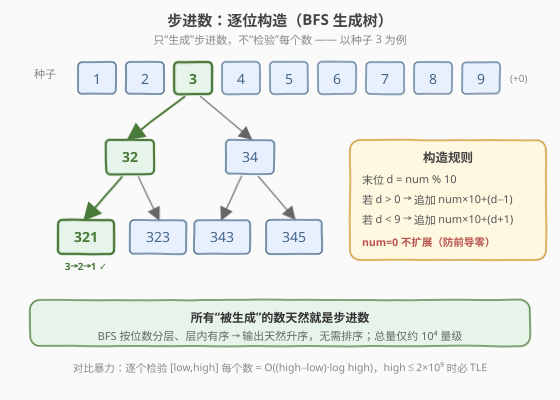
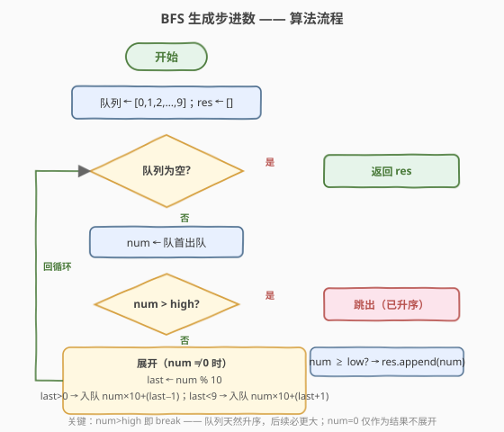
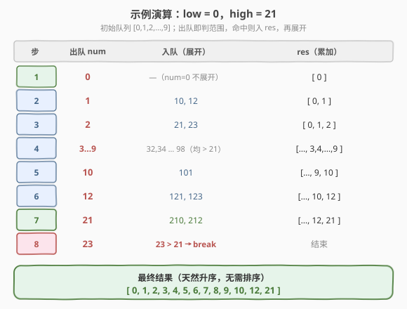

# 步进数

- **题目名称**：步进数
- **链接**：[1215. 步进数](https://leetcode.cn/problems/stepping-numbers/)
- **难度**：中等
- **标签**：广度优先搜索、深度优先搜索、数学、数位构造

## 1. 题目概述

如果一个数的**相邻两位数字之差的绝对值恰好为 1**，则称该数为**步进数**（Stepping Number）。例如 `321` 是步进数（$|3-2|=1$，$|2-1|=1$），而 `425` 不是（$|4-2|=2$）。**一位数**（$0$ 到 $9$）没有相邻位，按定义均为步进数。

给定整数 `low` 和 `high`，返回区间 $[\text{low}, \text{high}]$ 内**所有步进数**，按**升序**排列。

**示例 1**：

```text
输入：low = 0, high = 21
输出：[0, 1, 2, 3, 4, 5, 6, 7, 8, 9, 10, 12, 21]
```

**示例 2**：

```text
输入：low = 10, high = 15
输出：[10, 12]
```

**约束条件**：

- $0 \leq \text{low} \leq \text{high} \leq 2 \times 10^9$

> 💡 注意 $\text{high}$ 可达 $2 \times 10^9$，区间宽度最大约 $2 \times 10^9$。「逐个检验」的暴力法会超时。关键洞察是：**步进数极其稀疏**（$10^9$ 以内只有约 $10^4$ 个），因此应当**直接构造**步进数，而不是遍历区间去检验。

---

## 2. 解题思路

### 2.1 暴力思路：逐个检验

遍历 $[\text{low}, \text{high}]$ 中每个数 $x$，逐位检查相邻位差是否均为 $1$。检验单个数需 $O(\log x)$，总时间 $O((\text{high}-\text{low}+1) \cdot \log \text{high})$。当 $\text{high}-\text{low} \approx 2 \times 10^9$ 时约 $2 \times 10^{10}$ 次操作，**必然超时**。

> ⚠️ 暴力法的根本问题在于：它把绝大部分时间花在**检验非步进数**上，而绝大多数数根本不是步进数——这是纯粹的浪费。

### 2.2 核心观察：BFS 逐位构造



**关键性质**：一个多位步进数，去掉最后一位后**仍然是步进数**（前缀保持相邻差为 1 的性质）。因此可以从一位数种子出发，**逐位生长**：

设当前已构造的数为 $\text{num}$，其末位为 $d = \text{num} \bmod 10$。要保证新数仍是步进数，**新追加的位只能是 $d-1$ 或 $d+1$**（且必须在 $0 \sim 9$ 范围内）：

| 条件 | 追加的数 | 含义 |
|------|----------|------|
| $d > 0$ | $\text{num} \times 10 + (d-1)$ | 末位减 1 |
| $d < 9$ | $\text{num} \times 10 + (d+1)$ | 末位加 1 |

**种子**：$0, 1, 2, \dots, 9$ 都是一位数步进数。但 $0$ **不展开**——否则会生成 $01, 012$ 这类带前导零的「伪数」，它们实际等价于已由 $1, 12$ 等覆盖的更短步进数。

> 💡 **为什么 BFS 输出天然升序？** 所有 $k$ 位数都小于所有 $k+1$ 位数；同一层（同位数）内，若种子 $a < b$，则 $a$ 的所有子代都小于 $b$ 的所有子代（因为 $a \times 10 + 9 < (a+1) \times 10 + 0$）。队列按层 FIFO 展开，故出队序列天然升序。这意味着一旦 $\text{num} > \text{high}$，**后续必然全部越界，可直接 `break`**。

> ⚠️ **整数溢出**：$\text{high} \leq 2 \times 10^9$ 接近 `INT_MAX`，展开时 $\text{num} \times 10$ 可能溢出 32 位整数。C++ 中队列元素与中间计算应使用 `long long`。

### 2.3 算法流程图



**完整步骤**：

1. **初始化**：队列存入 $0, 1, 2, \dots, 9$，结果 `res` 为空
2. **循环**（队列非空）：
   - $\text{num} \leftarrow$ 队首出队
   - 若 $\text{num} > \text{high}$：`break`（升序保证后续全越界）
   - 若 $\text{num} \geq \text{low}$：`res.append(num)`
   - 若 $\text{num} = 0$：跳过展开（防前导零）
   - 否则 $d \leftarrow \text{num} \bmod 10$；若 $d > 0$ 入队 $\text{num}\times10+(d-1)$；若 $d < 9$ 入队 $\text{num}\times10+(d+1)$
3. 返回 `res`（已升序）

### 2.4 示例演算

以 $\text{low}=0, \text{high}=21$ 为例：



| 步 | 出队 $\text{num}$ | 入队（展开） | res（累加） |
|----|-------------------|--------------|-------------|
| 1 | 0 | —（不展开） | $[0]$ |
| 2 | 1 | 10, 12 | $[0, 1]$ |
| 3 | 2 | 21, 23 | $[0, 1, 2]$ |
| 4 | 3…9 | 32,34 … 98（均 $> 21$） | $[\dots, 3, 4, \dots, 9]$ |
| 5 | 10 | 101 | $[\dots, 9, 10]$ |
| 6 | 12 | 121, 123 | $[\dots, 10, 12]$ |
| 7 | 21 | 210, 212 | $[\dots, 12, 21]$ |
| 8 | 23 | $23 > 21 \Rightarrow$ `break` | 结束 |

最终结果 $[0, 1, 2, 3, 4, 5, 6, 7, 8, 9, 10, 12, 21]$，与示例一致。

> 💡 观察步 8：出队 $23$ 时立即 `break`，队列里残留的 $32, 34, 101, 121, \dots$ 全部 $> 21$，无需再处理。这正是「升序 + 提前终止」带来的剪枝收益——当 `high` 很大但 `low` 较小时，我们也只生成到 `high` 为止。

---

## 3. 参考代码

### C++

```cpp
// 步进数.cpp —— BFS 逐位构造
// 编译: g++ -O2 -std=c++17 步进数.cpp -o stepping
class Solution {
public:
    vector<int> countSteppingNumbers(int low, int high) {
        vector<int> res;
        queue<long long> q;
        for (int i = 0; i <= 9; ++i) q.push(i);          // 种子 0..9
        while (!q.empty()) {
            long long num = q.front(); q.pop();
            if (num > high) break;                       // 升序：后续全越界
            if (num >= low) res.push_back((int)num);
            if (num == 0) continue;                      // 0 不展开，防前导零
            int last = num % 10;
            if (last > 0) q.push(num * 10 + last - 1);   // 末位 -1
            if (last < 9) q.push(num * 10 + last + 1);   // 末位 +1
        }
        return res;
    }
};
```

### Python

```python
class Solution:
    def countSteppingNumbers(self, low: int, high: int) -> List[int]:
        res = []
        q = collections.deque(range(10))                 # 种子 0..9
        while q:
            num = q.popleft()
            if num > high:                               # 升序：后续全越界
                break
            if num >= low:
                res.append(num)
            if num == 0:                                 # 0 不展开，防前导零
                continue
            last = num % 10
            if last > 0:
                q.append(num * 10 + last - 1)            # 末位 -1
            if last < 9:
                q.append(num * 10 + last + 1)            # 末位 +1
        return res
```

> 💡 **实现细节**：① C++ 用 `long long` 存队列元素，避免 `num * 10` 在 `num` 接近 $2 \times 10^9$ 时溢出；返回前再转回 `int`。② `num > high` 时 `break` 而非 `continue`——这是升序保证下的强剪枝。③ `num == 0` 用 `continue` 跳过展开，但 $0$ 本身仍可作为结果（当 $\text{low}=0$ 时）。

---

## 4. 复杂度分析

| 维度 | BFS 构造 | 暴力检验 | DFS 构造 |
|------|----------|----------|----------|
| **时间** | $O(S)$，$S$ 为步进数总数 | $O((\text{high}-\text{low}) \log \text{high})$ | $O(S \log S)$（需排序） |
| **空间** | $O(S)$（队列 + 输出） | $O(1)$（不计输出） | $O(\log \text{high})$ 递归栈 + $O(S)$ 输出 |
| **是否升序输出** | ✓ 天然升序 | ✓（按遍历序） | ✗（需排序） |
| **是否剪枝** | ✓（$> \text{high}$ 即停） | ✗ | ✓（$> \text{high}$ 即回溯） |

> 其中 $S$ 为 $[0, \text{high}]$ 内步进数个数。$10^9$ 以内 $S \approx 3.6 \times 10^4$，$2 \times 10^9$ 以内 $S$ 仍在 $10^4$ 量级，远小于区间宽度。

> ⚠️ **BFS 时间为何是 $O(S)$ 而非 $O(S \log \text{high})$？** 每个步进数只入队、出队各一次，展开时取末位、乘 10 均为 $O(1)$ 操作（位数为 $\log \text{high}$ 但乘法/取模在固定宽度整数上是常数时间），故总操作数与 $S$ 同阶。

---

## 5. 扩展：DFS 写法

BFS 改为 DFS 同样可行：从每个种子 $0 \sim 9$ 深度优先向下构造，超过 $\text{high}$ 即回溯。区别在于 **DFS 不保证升序**（深度优先会先钻到最长位数），因此末尾需排序：

```python
class Solution:
    def countSteppingNumbers(self, low: int, high: int) -> List[int]:
        res = []
        def dfs(num: int):
            if num > high:
                return
            if num >= low:
                res.append(num)
            if num == 0:
                return
            last = num % 10
            if last > 0:
                dfs(num * 10 + last - 1)
            if last < 9:
                dfs(num * 10 + last + 1)
        for i in range(10):
            dfs(i)
        res.sort()                       # DFS 不保序，需排序
        return res
```

> 💡 **BFS vs DFS 取舍**：BFS 利用层序天然升序，省去排序且可在 $\text{num} > \text{high}$ 时整体 `break`；DFS 递归写法更简洁，但需 $O(S \log S)$ 排序且无法提前整体终止（只能逐分支回溯）。本题首选 BFS。

> ⚠️ DFS 递归深度等于步进数最大位数（$\leq 10$），远小于系统限制，无栈溢出风险。

---

## 6. 面试要点

1. **为什么不能逐个检验区间里的数？**

   > $\text{high} \leq 2 \times 10^9$，区间宽度最大 $2 \times 10^9$，逐个检验 $O((\text{high}-\text{low}) \log \text{high}) \approx 2 \times 10^{10}$，必然超时。根本原因是步进数极稀疏（$10^9$ 内仅约 $3.6 \times 10^4$ 个），检验大量非步进数是纯浪费。

2. **为什么「逐位构造」是正确的？不会漏掉步进数吗？**

   > 任何多位步进数去掉末位后前缀仍是步进数（相邻差为 1 的性质对前缀逐位成立）。故从一位数种子出发，每次只追加与末位差 1 的数字，能且仅能生成全部步进数：每个步进数都对应一条从其首位开始的生长路径，且该路径每一步都满足「末位 ±1」规则，必被 BFS 枚举到。

3. **为什么 BFS 输出天然升序，可以在 `num > high` 时直接 `break`？**

   > 所有 $k$ 位数小于所有 $k+1$ 位数；同层内种子 $a < b$ 时 $a$ 的子代全小于 $b$ 的子代（$a\times10+9 < (a+1)\times10$）。BFS 按层 FIFO，出队序列递增。故首次遇到 $\text{num} > \text{high}$ 后，队列中剩余元素必都 $> \text{high}$，`break` 安全。

4. **为什么 $0$ 要特殊处理（不展开）？**

   > $0$ 的末位为 $0$，展开只能生成 $0\times10+1 = 1$，即「01」，它实际就是一位数 $1$，已被种子覆盖。继续展开会重复生成等价数并引入前导零歧义，故 $0$ 只作为结果（当 $\text{low}=0$）保留，不参与展开。

5. **C++ 中为什么要用 `long long`？**

   > $\text{high} \leq 2 \times 10^9$ 接近 `INT_MAX`（约 $2.147 \times 10^9$）。当 $\text{num}$ 接近 $\text{high}$ 时，$\text{num} \times 10$ 约 $2 \times 10^{10}$，远超 32 位整数上界，会溢出为负数导致死循环或错误。用 `long long` 存队列与中间运算，返回前再转 `int` 即可。

> 💡 **一句话总结**：步进数 = BFS 逐位构造，末位 $d$ 只能接 $d\pm1$，种子 $0\sim9$（$0$ 不展开），升序出队遇 `> high` 即停，$O(S)/O(S)$。核心范式是「**构造而非检验**」——当目标集合远稀疏于全集时，直接生成目标比遍历全集过滤更高效。

---

## 7. 同类练习题

- [258. 各位相加](https://leetcode.cn/problems/add-digits/)：对数字的数位做处理，数学规律 $O(1)$，对照本题「数位构造」的数位思维
- [400. 第 N 位数字](https://leetcode.cn/problems/nth-digit/)：按位数分层定位，同样是「构造/定位」而非遍历，承接数位分层思想
- [1012. 至少有 1 位重复的数字](https://leetcode.cn/problems/numbers-with-repeated-digits/)：数位 DP 求「至少有重复位」的数个数，正面构造「无重复位」的数，与本题「直接构造满足数位约束的数」同源
- [357. 统计各位数字都不同的数字个数](https://leetcode.cn/problems/count-numbers-with-unique-digits/)：构造各位互不相同的数（排列计数），数位构造 + 组合计数，本题的「计数」版
- [2376. 统计特殊整数](https://leetcode.cn/problems/count-special-integers/)：数位 DP 统计各位互不相同且不超过 $n$ 的数个数，357 的「带上界」升级版，与本题共享「数位约束直接构造」范式
