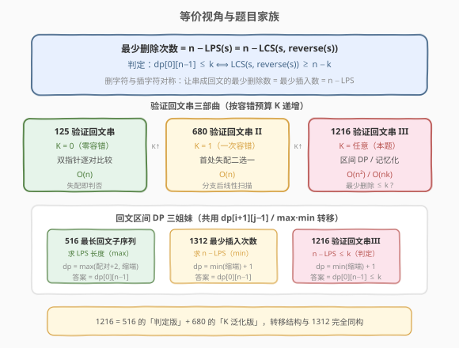

# LeetCode 验证回文串 III 题解

## 1. 题目概述

- **标题 / 题号**：验证回文串 III（#1216，hard）
- **链接**：https://leetcode.cn/problems/valid-palindrome-iii/
- **难度**：困难
- **标签**：动态规划、区间 DP、字符串

**题意**：给你一个字符串 `s` 和一个整数 `k`，你**最多可以删除 `s` 中的 `k` 个字符**。判断是否能把它变成**回文串**。

**回文串**：正读反读都相同的字符串，如 `"aceca"`、`"abba"`。

本题是 [680. 验证回文串 II](../0601-0700/680_验证回文串II.md) 的泛化版：680 只允许删 1 个（`k=1`），用双指针贪心即可；本题允许删任意 `k` 个，需要动态规划。

**示例 1**：

```text
输入：s = "abcdeca", k = 2
输出：true
解释：删除 'b' 和 'd'，得到 "aceca"，是回文串。
```

**示例 2**：

```text
输入：s = "abbab", k = 1
输出：true
解释：删除末尾 'b'，得到 "abba"，是回文串。
```

**示例 3**：

```text
输入：s = "abcdeca", k = 1
输出：false
解释：最少需要删除 2 个字符才能成回文，k=1 不够。
```

**约束**：

- $1 \leq s.length \leq 1000$
- $0 \leq k \leq s.length$
- `s` 仅由小写英文字母组成

> 💡 **问题重塑**：判断「能否用 $\leq k$ 次删除把 `s` 变回文」等价于求「让 `s` 变回文的**最少删除次数**」，再与 $k$ 比较。而最少删除次数恰好等于 $n - \text{LPS}(s)$（最长回文子序列长度）——不在 LPS 中的字符每个删一次。这正是 [516. 最长回文子序列](../0501-0600/516_最长回文子序列.md) 与 [1312. 让字符串成为回文串的最少插入次数](../1301-1400/1312_让字符串成为回文串的最少插入次数.md) 的同源问题。

## 2. 解题思路

### 2.1 暴力思路：递归枚举两端

对子串 `s[i..j]`：若两端字符相同，问题缩小到内部 `s[i+1..j-1]`；若不同，则两端至少有一个要被删除，分别尝试删左端或删右端，取两种删法中的较小值再加 1。递归无记忆化时时间 $O(2^n)$，指数级超时，且有大量重复子问题（同一个区间被反复求解）。

### 2.2 核心观察：区间 DP

![核心观察：dp[i][j] = 让 s[i..j] 成为回文的最少删除次数](../images/valid_palindrome_iii_concept.svg)

**定义**：`dp[i][j]` = 让子串 `s[i..j]`（闭区间）成为回文串的**最少删除次数**。

**边界**：

```text
dp[i][i] = 0                        # 单字符天然回文，无需删除
dp[i][i-1] = 0                      # 空串天然回文（i > j，统一为 0）
```

**转移**（核心）：

```text
若 s[i] == s[j]：
    dp[i][j] = dp[i+1][j-1]         # 两端已配对，内部自行解决，不花代价

若 s[i] != s[j]：
    dp[i][j] = min(dp[i+1][j],      # 删掉左端 s[i]，内部变成 s[i+1..j]
                   dp[i][j-1]) + 1  # 删掉右端 s[j]，内部变成 s[i..j-1]
```

**两种转移的直觉**：

| 情况 | DP 来源 | 含义 |
|------|---------|------|
| **两端字符相同** | `dp[i+1][j-1]` | 两端自然配对成回文外壳，只需处理内部，**不花代价** |
| **两端字符不同** | `min(dp[i+1][j], dp[i][j-1]) + 1` | 必须删掉某一个端点，代价 `+1`，内部缩到对应更短区间 |

> 💡 **为什么两端相同时直接 `dp[i+1][j-1]` 而不取 `min`？** 因为配对两端至少不比单边删除差：若不配对而单边删字符，代价 `+1` 起步，必然 $\geq$ 配对后内部代价。所以两端相同时**贪心配对**最优——这是回文类区间 DP 的通用性质（516、1312 同源）。

> ⚠️ **填表顺序**：`dp[i][j]` 依赖 `dp[i+1][j-1]`（左下）、`dp[i+1][j]`（下方）、`dp[i][j-1]`（左方），三者都要先算出。因此按**子串长度从小到大**填表：外层 `len` 从 2 到 `n`，内层枚举起点 `i`，令 `j = i + len - 1`。这保证查 `dp[i+1][j-1]` 时该值已填好。

**答案**：`dp[0][n-1] <= k`（整个串的最少删除次数是否不超过预算）。

### 2.3 算法流程图

![算法流程：初始化边界 → 按长度递增填表 → 返回 dp[0][n−1] ≤ k](../images/valid_palindrome_iii_flow.svg)

**完整步骤**：

1. **初始化**：`dp` 为 `n × n` 矩阵，全 0。对角线 `dp[i][i] = 0`（单字符回文），长度为 0 的区间（`j < i`）也视为 0，无需特殊处理。
2. **按长度递增填表**：`len` 从 2 到 `n`，对每个 `i` 从 0 到 `n-len`，令 `j = i + len - 1`：
   - `s[i] == s[j]` → `dp[i][j] = dp[i+1][j-1]`
   - `s[i] != s[j]` → `dp[i][j] = min(dp[i+1][j], dp[i][j-1]) + 1`
3. **返回** `dp[0][n-1] <= k`

> 💡 **下标不出界**：当 `len=2` 时 `j = i+1`，`dp[i+1][j-1] = dp[i+1][i]` 属于 `j < i` 的无效区间，按 0 处理（`dp` 初始全 0 即天然满足）。这正是把空串边界定义为 0 的便利。

### 2.4 示例演算

以 `s = "abcxba", k = 1` 为例演算区间 DP 填表过程：

![示例演算：abcxba 的区间 DP 填表，答案 dp[0][5]=1 ≤ 1 → true](../images/valid_palindrome_iii_walkthrough.svg)

**dp 表**（行 = 起点 `i`，列 = 终点 `j`，仅填 `i ≤ j` 部分；`i > j` 为空串，值为 0）：

| `i\j` | 0 (`a`) | 1 (`b`) | 2 (`c`) | 3 (`x`) | 4 (`b`) | 5 (`a`) |
|-------|---------|---------|---------|---------|---------|---------|
| 0 (`a`) | 0 | 1 | 2 | 3 | 2 | **1** |
| 1 (`b`) | — | 0 | 1 | 2 | **1** | 2 |
| 2 (`c`) | — | — | 0 | 1 | 2 | 3 |
| 3 (`x`) | — | — | — | 0 | 1 | 2 |
| 4 (`b`) | — | — | — | — | 0 | 1 |
| 5 (`a`) | — | — | — | — | — | 0 |

**沿答案路径追溯**：

| 格子 | 长度 | 字符比较 | 转移 | 值 | 说明 |
|------|------|----------|------|----|------|
| `dp[2][3]` | 2 | `c` ≠ `x` | `min(dp[3][3], dp[2][2])+1` | 1 | 失配删一个，二选一取较小 |
| `dp[1][4]` | 4 | `b` == `b` | `dp[2][3]` | 1 | 内层配对，无删除，继承内部 ✓ |
| `dp[0][5]` | 6 | `a` == `a` | `dp[1][4]` | 1 | 首尾配对，继承内部 ✓ |

最终 `dp[0][5] = 1 ≤ k=1`，返回 `true`。构造方案：删除下标 2 的 `c`，得到 `"abxba"`（两端 `a` 与内层 `b…b` 配对，`x` 居中成回文）。

> 💡 **嵌套配对结构**：本题的精髓在于回文可以**嵌套**——外层 `a…a` 配对后内部交给 `dp[1][4]`，而 `dp[1][4]` 又有内层 `b…b` 配对（`dp[2][3]`），层层向内收缩。只要最内层 `c≠x` 删一个即可。这种「两端配对向内缩」的结构正是区间 DP 擅长的场景。

## 3. 参考代码

### C++

```cpp
// 验证回文串 III.cpp —— 区间 DP
// 编译: g++ -O2 -std=c++17 验证回文串III.cpp -o vpal3
class Solution {
public:
    bool isValidPalindrome(string s, int k) {
        int n = s.size();
        // dp[i][j] = 让 s[i..j] 成为回文的最少删除次数
        vector<vector<int>> dp(n, vector<int>(n, 0));

        // 按子串长度递增填表
        for (int len = 2; len <= n; ++len) {
            for (int i = 0; i + len <= n; ++i) {
                int j = i + len - 1;
                if (s[i] == s[j]) {
                    dp[i][j] = dp[i + 1][j - 1];          // 两端配对，无代价
                } else {
                    dp[i][j] = min(dp[i + 1][j],          // 删左端 s[i]
                                   dp[i][j - 1]) + 1;     // 删右端 s[j]
                }
            }
        }
        return dp[0][n - 1] <= k;
    }
};
```

### Python

```python
class Solution:
    def isValidPalindrome(self, s: str, k: int) -> bool:
        n = len(s)
        dp = [[0] * n for _ in range(n)]

        for length in range(2, n + 1):
            for i in range(n - length + 1):
                j = i + length - 1
                if s[i] == s[j]:
                    dp[i][j] = dp[i + 1][j - 1]          # 两端配对，无代价
                else:
                    dp[i][j] = min(dp[i + 1][j],          # 删左端 s[i]
                                   dp[i][j - 1]) + 1      # 删右端 s[j]

        return dp[0][n - 1] <= k
```

> 💡 **实现细节**：① `dp` 初始化为全 0，对角线 `dp[i][i]=0` 天然满足，`len=2` 时 `dp[i+1][j-1]=dp[i+1][i]` 是 `j<i` 的无效区间，读到的也是 0，恰好是空串的边界值。② 外层按 `len` 递增保证依赖项已算好。③ 与 [1312](../1301-1400/1312_让字符串成为回文串的最少插入次数.md) 的代码几乎一字不差——只是把「插入」语义换成「删除」，转移方程完全相同（因为删字符与插字符对称，两者都等于 $n - \text{LPS}$）。

## 4. 复杂度分析

| 维度 | 区间 DP | 记忆化双指针（见 5.2） |
|------|---------|----------------------|
| **时间** | $O(n^2)$ | $O(n \cdot k)$ |
| **空间** | $O(n^2)$ | $O(n \cdot k)$（可滚动到 $O(n)$） |
| **思路** | 直接对子串做删除 DP | 泛化 680 的双指针 + 记忆化 |
| **适用** | $n$ 中等（$\leq 1000$），$k$ 任意 | $k$ 较小时更优 |

> ⚠️ 时间 $O(n^2)$：双重循环枚举所有 $O(n^2)$ 个区间，每个区间 $O(1)$ 转移。$n=1000$ 时约 $5 \times 10^5$ 次操作，远在限制内。

## 5. 扩展

### 5.1 等价于 n − 最长回文子序列



本题有一条非常优雅的**等价转化**路径。关键观察：

> **一个字符串的最长回文子序列（LPS）已经构成回文。** 要让整个串变回文，只需把「不在 LPS 中的字符」逐个删掉即可，恰好需要 $n - \text{LPS}(s)$ 次；而这正是最优的，因为每次删除最多让 LPS 长度增加 1。

因此：

$$
\text{最少删除次数} = n - \text{LPS}(s) = n - \text{LCS}(s,\ \text{reverse}(s))
$$

> 💡 **为什么 LPS = LCS(s, reverse(s))？** 回文子序列正读反读相同，因此它必然同时出现在 `s` 和 `reverse(s)` 中；反之 `s` 与 `reverse(s)` 的任一公共子序列，按 `s` 中的顺序读与按 `reverse(s)` 中的顺序读互为镜像，必为 `s` 的回文子序列。二者等长，故 LPS = LCS(s, rev(s))。详见 [516. 最长回文子序列](../0501-0600/516_最长回文子序列.md) 第 5 节。

于是判定条件可改写为：

$$
\text{LCS}(s,\ \text{reverse}(s)) \geq n - k
$$

直接套用 [1143. 最长公共子序列](../1101-1200/1143_最长公共子序列.md) 的模板即可，时间同为 $O(n^2)$：

```python
class Solution:
    def isValidPalindrome(self, s: str, k: int) -> bool:
        t = s[::-1]
        n = len(s)
        # 复用 1143 最长公共子序列模板，求 LCS(s, reverse(s))
        dp = [[0] * (n + 1) for _ in range(n + 1)]
        for i in range(1, n + 1):
            for j in range(1, n + 1):
                if s[i - 1] == t[j - 1]:
                    dp[i][j] = dp[i - 1][j - 1] + 1
                else:
                    dp[i][j] = max(dp[i - 1][j], dp[i][j - 1])
        return n - dp[n][n] <= k
```

**两种解法对比**：

| 方法 | 状态定义 | 转移核心 | 与本题的契合 |
|------|----------|----------|-------------|
| **区间 DP** | `dp[i][j]` = 子串 `s[i..j]` 的最少删除 | 两端配对 / 单边删 `+1` | 直接建模删除操作，语义最贴切 |
| **LCS 等价** | `dp[i][j]` = `s` 与 `rev(s)` 的 LCS 长度 | 匹配 `+1` / `max(上,左)` | 借成熟模板，证明依赖 LPS=LCS |

> 💡 **面试推荐**：先讲区间 DP（语义直观、易自圆其说），再点出「$n - \text{LPS} = n - \text{LCS}(s, \text{rev}(s)) \leq k$」的等价视角展示思维深度。

### 5.2 记忆化双指针：O(n·k) 泛化 680

[680. 验证回文串 II](../0601-0700/680_验证回文串II.md)（`k=1`）用双指针从两端逼近，首处失配时二选一删法，分支后线性扫描，$O(n)$。将其泛化到任意 `k`：失配时递归尝试「删左 / 删右」两分支，每分支消耗一次删除预算，带记忆化即可。

```python
from functools import lru_cache

class Solution:
    def isValidPalindrome(self, s: str, k: int) -> bool:
        @lru_cache(None)
        def dfs(i, j):
            if i >= j:
                return 0                       # 空串/单字符，无需删除
            if s[i] == s[j]:
                return dfs(i + 1, j - 1)       # 配对，向内缩
            return 1 + min(dfs(i + 1, j),      # 删左端
                            dfs(i, j - 1))      # 删右端
        return dfs(0, len(s) - 1) <= k
```

> 💡 **为什么是 $O(n \cdot k)$ 而非 $O(n^2)$？** 关键在于 `dfs(i, j)` 的值表示最少删除次数，而我们只关心它是否 $\leq k$。从两端出发，相邻两次「失配分支」之间的匹配字符是**免费推进**的（不消耗删除预算）。因此在任意搜索路径上，失配分支的次数 $\leq k$。对每个左指针 `i`，与之配对的右指针 `j` 只有 $O(k)$ 种「有效偏移」（由删除预算决定），故有效状态数为 $O(n \cdot k)$。当 `k` 较小时远优于 $O(n^2)$。

> ⚠️ **$k=1$ 时退化为 680**：删除预算只有 1 次，失配后两个分支各自退化为零容错的线性回文扫描，不再产生新分支——正是 680 的 $O(n)$ 双指针贪心。680 之所以是简单题，正因为 $k=1$ 时二分支结构既简洁又最优。

### 5.3 与 516 / 1312 的关系

1216 与 [516. 最长回文子序列](../0501-0600/516_最长回文子序列.md)、[1312. 让字符串成为回文串的最少插入次数](../1301-1400/1312_让字符串成为回文串的最少插入次数.md) 同属**回文区间 DP 家族**，共用 `dp[i+1][j-1]`（两端配对）与 `max/min(缩端)` 的转移骨架，只是问法不同：

| | 516 最长回文子序列 | 1312 最少插入次数 | 1216 验证回文串 III |
|------|-------------------|-------------------|---------------------|
| **允许操作** | 不操作（求子序列） | 插入字符 | 删除字符 |
| **状态语义** | `s[i..j]` 的 LPS 长度 | `s[i..j]` 的最少插入 | `s[i..j]` 的最少删除 |
| **DP 取向** | `max`（求最长） | `min`（求最少） | `min`（求最少） |
| **答案** | `dp[0][n-1]` | `dp[0][n-1]` | `dp[0][n-1] ≤ k` |
| **本质联系** | LPS | $n - \text{LPS}$ | $n - \text{LPS} \leq k$ |

> 💡 **删与插的对称性**：让串成回文的最少删除数 = 最少插入数 = $n - \text{LPS}$。因为删除 `s` 中不在 LPS 的字符等价于在 LPS 的镜像位置插入这些字符——两者都把「非回文部分」消除，数量相同。所以 1216 的转移方程与 1312 **一字不差**，只是语义从「插入」换成「删除」。

## 6. 面试要点

1. **`dp[i][j]` 的定义和转移方程是什么？**

   > `dp[i][j]` = 让子串 `s[i..j]` 成为回文串的最少删除次数。若 `s[i]==s[j]`，`dp[i][j]=dp[i+1][j-1]`（两端配对，无代价）；若 `s[i]!=s[j]`，`dp[i][j]=min(dp[i+1][j], dp[i][j-1])+1`（删掉某一端，代价 `+1`）。答案为 `dp[0][n-1] <= k`。

2. **两端字符不同时，为什么是 `min(dp[i+1][j], dp[i][j-1])+1`？**

   > 两端不同意味着无法自然配对，必须删掉其中一个端点。删左端 `s[i]` 后内部剩 `s[i+1..j]`，代价 `dp[i+1][j]+1`；删右端 `s[j]` 同理代价 `dp[i][j-1]+1`。取两者较小值。两种删法覆盖所有最优情况。

3. **为什么答案等于 $n - \text{LPS}(s)$？删与插为何对称？**

   > 最长回文子序列 LPS 已经是回文，无需改动；不在 LPS 中的每个字符都需删掉一次，共 $n - \text{LPS}$ 次。这是最优的：每次删除最多让 LPS 长度增加 1。而删字符与插字符对称——删 `s` 中不在 LPS 的字符，等价于在 LPS 镜像位置插入这些字符，故最少删除数 = 最少插入数 = $n - \text{LPS}$。

4. **本题与 680（验证回文串 II）的关系？**

   > 680 是 $k=1$ 的特例：双指针从两端逼近，首处失配时二选一删法，分支后退化为零容错线性扫描，$O(n)$。本题泛化到任意 $k$：失配处需递归尝试两分支，带记忆化为 $O(n \cdot k)$，或用区间 DP $O(n^2)$。$k=1$ 时记忆化双指针恰好退化为 680 的贪心。

5. **区间 DP 和 LCS 等价法，面试选哪个？**

   > 推荐先讲区间 DP——它直接建模「删除」操作，状态语义贴切、证明自洽。再补充 LCS 等价视角（$n - \text{LCS}(s, \text{rev}(s)) \leq k$）展示思维广度。若 $k$ 较小且 $n$ 很大，可改用记忆化双指针 $O(n \cdot k)$，它是 680 贪心的自然泛化。

> 💡 **一句话总结**：1216 是回文区间 DP 家族的「判定版」——`dp[i][j]` 表示子串 `s[i..j]` 的最少删除次数，两端相同时配对无代价、不同时单边删 `+1`，按长度递增填表后判断 `dp[0][n-1] ≤ k`。等价于 $n - \text{LPS}(s) \leq k$，转移结构与 1312 完全同构。与 680（$k=1$）、516（求 LPS）、1312（最少插入）共同构成「回文 + 删除/插入」的完整谱系，掌握一题即可迁移一片。

## 同类练习题

| # | 题目 | 与本题的关联 |
|---|------|-------------|
| 680 | [验证回文串 II](https://leetcode.cn/problems/valid-palindrome-ii/)（[题解](../0601-0700/680_验证回文串II.md)） | 本题 $k=1$ 的特例，双指针 + 首处失配二分支贪心 $O(n)$，理解 680 后再泛化到任意 $k$ 即得本题 |
| 516 | [最长回文子序列](https://leetcode.cn/problems/longest-palindromic-subsequence/)（[题解](../0501-0600/516_最长回文子序列.md)） | 区间 DP 求 LPS 长度，本题答案 $n - \text{LPS} \leq k$ 的基石，转移结构同源（`max` vs `min`） |
| 1312 | [让字符串成为回文串的最少插入次数](https://leetcode.cn/problems/minimum-insertion-steps-to-make-a-string-palindrome/)（[题解](../1301-1400/1312_让字符串成为回文串的最少插入次数.md)） | 转移方程与本题一字不差（删与插对称），$n - \text{LPS}$ 的另一面，对照理解「最少操作数」与「能否在预算内」 |
| 1143 | [最长公共子序列](https://leetcode.cn/problems/longest-common-subsequence/)（[题解](../1101-1200/1143_最长公共子序列.md)） | LCS 二维 DP 模板，本题等价解法 $n - \text{LCS}(s, \text{rev}(s)) \leq k$ 的基石 |
| 125 | [验证回文串](https://leetcode.cn/problems/valid-palindrome/) | 零容错（$k=0$）回文判定母题，双指针逐对比较，是 680→1216 容错递进链的起点 |
