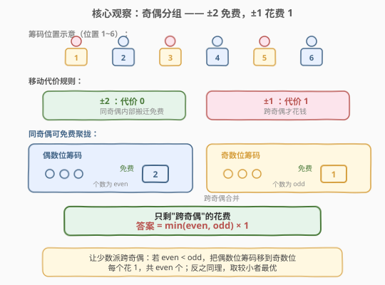
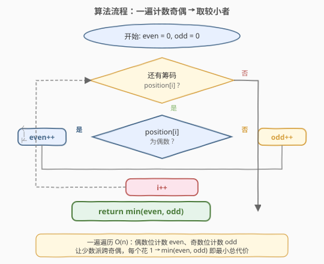
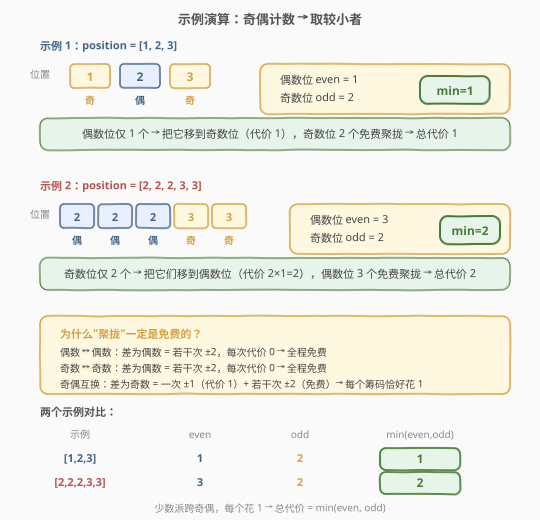

# LeetCode 玩筹码 题解

## 1. 题目概述

- **标题 / 题号**：玩筹码（#1217，easy）
- **链接**：https://leetcode.cn/problems/play-with-chips/
- **难度**：简单
- **标签**：贪心、数组、数学

**题意**：有 `n` 个筹码，第 `i` 个筹码的位置为 `position[i]`。你需要把**所有筹码移到同一个位置**。每次移动规则如下：

- 将筹码从 `position[i]` 移到 `position[i] + 2` 或 `position[i] - 2`，**代价为 0**（即移动偶数距离免费）；
- 将筹码从 `position[i]` 移到 `position[i] + 1` 或 `position[i] - 1`，**代价为 1**（即移动奇数距离花 1）。

返回将所有筹码移到同一位置的**最小总代价**。

**示例 1**：

```text
输入：position = [1,2,3]
输出：1
解释：位置 1 和 3 是奇数位（2 个筹码），位置 2 是偶数位（1 个筹码）。
      把位置 2 的筹码移到位置 1（代价 1），再把位置 3 的筹码移到位置 1（代价 0，3→1 差为偶数）。
      总代价 = 1。
```

**示例 2**：

```text
输入：position = [2,2,2,3,3]
输出：2
解释：偶数位有 3 个筹码，奇数位有 2 个筹码。
      把 2 个奇数位筹码各移到偶数位（代价 2×1=2），偶数位 3 个筹码免费聚拢。
      总代价 = 2。
```

**示例 3**：

```text
输入：position = [1,100000000]
输出：1
解释：1 是奇数位，100000000 是偶数位，各 1 个筹码，min(1,1)=1。
```

**约束**：

- `1 <= position.length <= 100`
- `1 <= position[i] <= 10^9`

> 💡 关键线索：`position[i]` 可达 $10^9$，但移动代价只取决于**距离的奇偶性**——偶数距离免费、奇数距离花 1。因此筹码的**具体位置不重要，只有位置的奇偶性重要**。这是把 $10^9$ 值域压缩为 2 类的核心。

## 2. 解题思路

### 2.1 暴力思路：枚举目标位置逐个算代价

对每个可能的目标位置 `t`（从所有 `position[i]` 中取，或遍历 `1` 到 `max`），把每个筹码移到 `t` 的代价算出来求和，取所有 `t` 中的最小值。

单个筹码从 `p` 到 `t` 的代价 = `|p - t| % 2`（奇数距离花 1，偶数距离花 0）。对 `n` 个筹码、`m` 个候选目标，时间 $O(n \cdot m)$。当 `position[i]` 高达 $10^9$ 时候选目标虽可只取 `n` 个出现过的位置，但仍需 $O(n^2)$，且思路未抓住"奇偶"这一本质，不够优雅。

问题在于：代价只区分奇偶两类，我们却在一个一个地枚举具体位置——若能**按奇偶分组**，就能把 $10^9$ 种位置压缩成 2 类，一步到位。

### 2.2 核心观察：奇偶分组 —— ±2 免费，±1 花费 1



把移动规则翻译成**奇偶语言**：

1. **移动偶数距离（±2、±4…）代价为 0**：意味着筹码可以在**同奇偶**的位置之间**任意搬迁、完全免费**。偶数位筹码能免费聚到任意偶数位，奇数位筹码能免费聚到任意奇数位。
2. **移动奇数距离（±1、±3…）代价为 1**：奇数距离 = 一次 ±1（代价 1）+ 若干次 ±2（代价 0），所以**跨奇偶移动每个筹码恰好花 1**。

于是问题被压缩成**两堆**：

- **偶数位筹码**（个数记 `even`）：可免费聚到某个偶数位（如位置 0 或 2）；
- **奇数位筹码**（个数记 `odd`）：可免费聚到某个奇数位（如位置 1 或 3）。

最终要把两堆合到同一位置，必须让**其中一堆跨奇偶**。每个跨奇偶的筹码花 1，所以**让少数派跨奇偶**最优：

$$\text{答案} = \min(\text{even}, \text{odd}) \times 1 = \min(\text{even}, \text{odd})$$

> ⚠️ **关键易错点**：不要试图枚举具体目标位置。代价函数 `|p - t| % 2` 只依赖 `p` 和 `t` 的**奇偶异同**——同奇偶为 0、异奇偶为 1。因此只有两种本质不同的目标：偶数位目标或奇数位目标。选偶数位目标则所有奇数位筹码各花 1（总 `odd`）；选奇数位目标则所有偶数位筹码各花 1（总 `even`）。取较小者即 $\min(\text{even}, \text{odd})$。

### 2.3 算法流程图



**完整步骤**：

1. **初始化**：`even = 0`，`odd = 0`。
2. **一遍遍历**：对每个 `position[i]`：
   - 若 `position[i] % 2 == 0`，`even++`；
   - 否则 `odd++`。
3. **返回** `min(even, odd)`。

> 💡 **为什么不用关心具体位置值？** 因为代价只取决于奇偶性。`position[i] = 100000000`（偶数）和 `position[i] = 2`（偶数）在代价计算上完全等价——都能免费移到任意偶数位。$10^9$ 的值域被 `% 2` 压缩成 $\{0, 1\}$ 两类，这正是"贪心 + 奇偶性"的威力。

### 2.4 示例演算

以示例 1 `position = [1,2,3]` 和示例 2 `position = [2,2,2,3,3]` 为例：



**示例 1 `position = [1,2,3]`**：

| 筹码 | 位置 | 奇偶 | 计数 |
|------|------|------|------|
| 0    | 1    | 奇   | odd = 1 |
| 1    | 2    | 偶   | even = 1 |
| 2    | 3    | 奇   | odd = 2 |

`even = 1`，`odd = 2`，`min(1, 2) = 1`。让偶数位的 1 个筹码跨奇偶（移到奇数位，代价 1），奇数位 2 个免费聚拢。

**示例 2 `position = [2,2,2,3,3]`**：

| 筹码 | 位置 | 奇偶 | 计数 |
|------|------|------|------|
| 0    | 2    | 偶   | even = 1 |
| 1    | 2    | 偶   | even = 2 |
| 2    | 2    | 偶   | even = 3 |
| 3    | 3    | 奇   | odd = 1 |
| 4    | 3    | 奇   | odd = 2 |

`even = 3`，`odd = 2`，`min(3, 2) = 2`。让奇数位的 2 个筹码跨奇偶（各移到偶数位，代价 2×1=2），偶数位 3 个免费聚拢。

## 3. 参考代码

### C++

```cpp
class Solution {
public:
    int minCostToMoveChips(vector<int>& position) {
        int even = 0, odd = 0;
        for (int p : position) {
            if (p % 2 == 0) even++;
            else odd++;
        }
        return min(even, odd);
    }
};
```

> 💡 `p % 2 == 0` 判偶数；由于 `position[i] >= 1` 恒正，无需担心负数取模的符号问题。若值可能为负，用 `p & 1` 更稳妥（按位判奇偶不受符号影响）。

### Python

```python
class Solution:
    def minCostToMoveChips(self, position: List[int]) -> int:
        odd = sum(p & 1 for p in position)
        return min(odd, len(position) - odd)
```

> 💡 **Python 简写**：`p & 1` 取最低位判奇偶，`sum` 一次算出奇数位个数 `odd`；偶数位个数 = `len(position) - odd`，无需单独计数。`min(odd, n - odd)` 即答案。

### 方法二：位运算判奇偶（C++ 等价优化）

```cpp
class Solution {
public:
    int minCostToMoveChips(vector<int>& position) {
        int odd = 0;
        for (int p : position) odd += (p & 1);
        return min(odd, (int)position.size() - odd);
    }
};
```

> ⚠️ `(int)position.size()` 显式转换避免 `size_t` 与 `int` 混合运算时的有符号/无符号警告。`p & 1` 返回 0 或 1，累加即奇数位个数，与方法一完全等价但少维护一个计数器。

## 4. 复杂度分析

| 维度 | 复杂度 | 说明 |
|------|--------|------|
| **时间** | $O(n)$ | 一遍遍历 `position` 数组，每个元素做一次 `% 2`（或 `& 1`）判断，$O(1)$ 摊还 |
| **空间** | $O(1)$ | 仅用两个计数器 `even`/`odd`（或一个 `odd` + 总数），与输入规模无关 |

> ⚠️ **时间** $O(n)$：遍历 $n$ 个筹码各 $O(1)$，总计 $O(n)$。无排序、无嵌套循环。
>
> **空间** $O(1)$：不随 $n$ 或 `position[i]` 的值域（$10^9$）增长。奇偶性把 $10^9$ 值域压缩为 2 类，是"值域无关"的典型——即使位置值再大也不影响空间。

## 5. 扩展：代价函数推广

本题的代价规则是"偶数距离 0、奇数距离 1"。若推广代价规则，思路可迁移：

- **若 ±k 免费、其余按距离计费**：类似地，筹码可按 `position[i] % k` 分成 $k$ 组，组内免费聚拢，跨组按代价取最优。本题是 $k = 2$ 的特例。
- **若每次移动代价恒为 1（不分奇偶）**：则退化为"把所有筹码移到中位数"（一维 $L_1$ 聚点问题），中位数最小化总绝对偏差。

> 💡 本质上，本题的代价函数 $\text{cost}(p, t) = |p - t| \bmod 2$ 是一个**只依赖奇偶性的二元函数**。识别出"代价只分两类"是解题的关键跳跃——一旦看清这一点，$10^9$ 的值域就坍缩为 $\{0, 1\}$，答案自然浮现。

## 6. 面试要点

1. **为什么答案是 `min(even, odd)`？**

   > 移动偶数距离代价为 0，所以同奇偶的筹码可免费聚到同一位置。最终只剩"跨奇偶"的花费：选偶数位为目标则所有奇数位筹码各花 1（共 `odd`），选奇数位为目标则所有偶数位筹码各花 1（共 `even`）。取较小者即让少数派跨奇偶，故 `min(even, odd)`。

2. **`position[i]` 高达 $10^9$ 会影响解法吗？**

   > 不会。代价只取决于距离的奇偶性（`|p - t| % 2`），与具体数值无关。`10^9` 的值域被 `% 2` 压缩成 $\{0, 1\}$ 两类，时间和空间都是 $O(n)$ / $O(1)$，与值域大小完全无关。

3. **为什么不用枚举目标位置？**

   > 枚举具体位置是 $O(n^2)$ 且没有抓住本质。代价函数 `|p - t| % 2` 只区分"目标奇偶同 / 异"两种情况，因此只有两个本质不同的目标选择（偶数位目标 vs 奇数位目标），分别对应代价 `odd` 和 `even`，取 `min` 即可。

4. **`p & 1` 和 `p % 2` 有什么区别？**

   > 对非负整数完全等价。但 `p % 2` 在 C/C++ 中对**负数**可能返回 -1（实现定义行为在 C++11 起规定向零取整，`-3 % 2 == -1`），而 `p & 1` 取最低位，对负数也能正确得到 1（补码下奇数最低位为 1）。本题 `position[i] >= 1` 恒正，两者无差异；面试中若值域含负数，优先 `p & 1`。

5. **如果代价规则变成"±2 花费 1、±1 免费"会怎样？**

   > 那代价函数变成 `1 - (|p - t| % 2)`——同奇偶花 1、跨奇偶免费。此时应让**多数派**跨奇偶（免费），少数派留在原地但每个花 1，答案为 `min(even, odd)` 的反向：`max(even, odd)` 的组内花费... 实际上需要重新分析。关键在于：识别代价函数依赖什么（奇偶？模 k？），再据此分组取最优。

> 💡 **一句话总结**：1217 的本质是"代价只分奇偶两类"——偶数距离免费使同奇偶筹码聚拢无成本，跨奇偶每筹码花 1，让少数派跨奇偶得 `min(even, odd)`。识别"代价函数依赖奇偶性"是 $10^9$ 值域坍缩为 2 类的关键跳跃。

## 同类练习题

| # | 题目 | 与本题的关联 |
|---|------|-------------|
| 462 | [最小移动次数使数组元素相等 II](https://leetcode.cn/problems/minimum-moves-to-equal-array-elements-ii/) | 一维 $L_1$ 聚点问题，把所有元素移到中位数最小化总绝对偏差，"代价函数 + 选聚点"同思路但代价恒为 1 |
| 453 | [最小移动次数使数组元素相等](https://leetcode.cn/problems/minimum-moves-to-equal-array-elements/) | 数学逆向思考（n-1 个元素 +1 等价于 1 个元素 -1），"把操作转化为代价"的思维迁移 |
| 292 | [Nim 游戏](https://leetcode.cn/problems/nim-game/) | 看似复杂的博弈问题，本质是按 4 的倍数分类（`n % 4`），"值域压缩为有限类"的同款思路 |
| 231 | [2 的幂](https://leetcode.cn/problems/power-of-two/)（[题解](../0001-0100/231_2的幂.md)） | `n & (n-1)` 判单 1，位运算判性质的本题 `p & 1` 判奇偶的延伸 |
| 1486 | [数组异或操作](https://leetcode.cn/problems/xor-operation-in-array/) | 按奇偶分组的异或规律，"奇偶性决定结果"的位运算同类题 |
