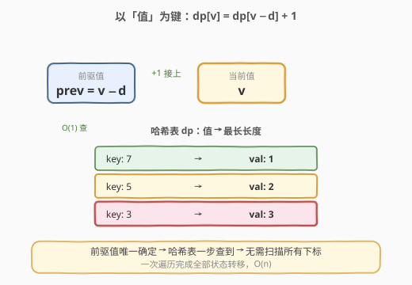
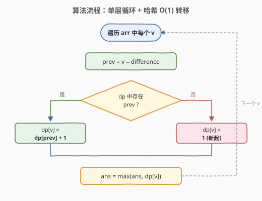

# 最长定差子序列

- **题目名称**：最长定差子序列
- **链接**：[1218. 最长定差子序列](https://leetcode.cn/problems/longest-arithmetic-subsequence-of-given-difference/)
- **难度**：中等
- **标签**：数组、哈希表、动态规划

## 1. 题目概述

给你一个整数数组 `arr` 和一个整数 `difference`，请你找出并返回 `arr` 中最长的**等差子序列**的长度，该子序列中相邻元素之间的差等于 `difference`。

子序列是指从原数组中按顺序选取的一些元素，不要求连续，但**不能改变相对顺序**。

**示例 1**：

```text
输入：arr = [1,2,3,4], difference = 1
输出：4
解释：最长的等差子序列是 [1,2,3,4]，长度为 4。
```

**示例 2**：

```text
输入：arr = [1,3,5,7], difference = 1
输出：1
解释：没有两个元素之差为 1，最长的等差子序列是任意单个元素，长度为 1。
```

**示例 3**：

```text
输入：arr = [1,5,7,8,5,3,4,2,1], difference = -2
输出：4
解释：最长的等差子序列是 [7,5,3,1]，长度为 4。
```

**约束条件**：

- `1 <= arr.length <= 10^5`
- `-10^4 <= arr[i] <= 10^4`
- `-10^4 <= difference <= 10^4`

---

## 2. 解题思路

### 2.1 暴力思路：枚举子序列

最朴素的做法是枚举所有子序列，逐个检查相邻元素之差是否等于 `difference`。但长度为 `n` 的数组有 `2^n` 个子序列，显然不可行。

退一步，即使只做 `O(n^2)` 的 DP：令 `dp[i]` 为以 `arr[i]` 结尾的最长定差子序列长度，对每个 `i` 往前扫找 `arr[j] == arr[i] - difference`，取 `dp[i] = dp[j] + 1`。这在 `n = 10^5` 时仍是 `O(n^2)`，会超时。

> ⚠️ 瓶颈在于：对每个 `arr[i]`，线性扫描查找 `arr[i] - difference` 花了 `O(n)`——这正是哈希表能优化到 `O(1)` 的地方。

### 2.2 核心观察：以「值」为状态，哈希表 O(1) 转移



关键转变：**不要按下标 `dp[i]` 做，而是按值 `dp[v]` 做**。

令 `dp[v]` 表示**以值 `v` 结尾**的最长定差子序列长度。当遍历到 `arr[i] = v` 时，它的前驱值是确定的：`prev = v - difference`。只要 `prev` 之前出现过，就能接上：

$$dp[v] = dp[\text{prev}] + 1$$

如果 `prev` 没出现过，则 `v` 自己开一个长度为 1 的子序列。

> 💡 **为什么按值而不是按下标？** 因为定差子序列的前驱值是**唯一确定**的——`v - difference` 只有一个值。用哈希表 `dp` 以值为键，就能 `O(1)` 查到"以这个前驱值结尾的最长长度"，无需扫描所有下标。一次遍历即可完成所有状态转移。

### 2.3 算法流程图



整个流程是单层循环：算前驱值 → 查哈希 → 命中则接上、未命中则置 1 → 更新答案。每个元素只被处理一次，总时间 `O(n)`。

### 2.4 示例演算

![逐步演算 arr=[1,5,7,8,5,3,4,2,1], difference=-2](../images/lasgd_walkthrough.svg)

以 `arr = [1,5,7,8,5,3,4,2,1]`，`difference = -2` 为例：

| i | arr[i] | prev = arr[i]−d | dp[prev] | dp[arr[i]] | ans | 说明 |
|---|--------|-----------------|----------|------------|-----|------|
| 0 | 1 | 3 | — | 1 | 1 | 前驱 3 未出现，新起 |
| 1 | 5 | 7 | — | 1 | 1 | 前驱 7 未出现，新起 |
| 2 | 7 | 9 | — | 1 | 1 | 前驱 9 未出现，新起 |
| 3 | 8 | 10 | — | 1 | 1 | 前驱 10 未出现，新起 |
| 4 | 5 | 7 | 1 | 2 | 2 | 前驱 7 在，接上：7→5 |
| 5 | 3 | 5 | 2 | 3 | 3 | 前驱 5 在，接上：7→5→3 |
| 6 | 4 | 6 | — | 1 | 3 | 前驱 6 未出现，新起 |
| 7 | 2 | 4 | 1 | 2 | 3 | 前驱 4 在，接上：4→2 |
| 8 | 1 | 3 | 3 | 4 | 4 | 前驱 3 在，接上：7→5→3→1 ⭐ |

最终答案为 **4**，对应子序列 `[7, 5, 3, 1]`（下标 2→4→5→8，每步差 −2）。

> 💡 注意 i=4 时 `arr[i]=5` 与 i=1 重复，`dp[5]` 被**覆盖更新**为更大的值 2（原来是 1）。这正是按值为键的好处：后续再遇到值 5 的前驱时（如 i=5 的 `prev=5`），直接拿到最新的最长长度。

---

## 3. 参考代码

### C++

```cpp
class Solution {
  public:
    int longestSubsequence(vector<int>& arr, int difference) {
        unordered_map<int, int> dp; // 值 -> 以该值结尾的最长长度
        int ans = 0;
        for (int v : arr) {
            int prev = v - difference;
            auto it = dp.find(prev);
            dp[v] = (it != dp.end()) ? it->second + 1 : 1;
            ans = max(ans, dp[v]);
        }
        return ans;
    }
};
```

### Python

```python
class Solution:
    def longestSubsequence(self, arr: List[int], difference: int) -> int:
        dp = {}  # 值 -> 以该值结尾的最长长度
        ans = 0
        for v in arr:
            prev = v - difference
            dp[v] = dp.get(prev, 0) + 1
            ans = max(ans, dp[v])
        return ans
```

> ⚠️ **为何不用数组做 dp？** 虽然 `arr[i]` 范围是 `[-10^4, 10^4]`，可以用偏移映射到数组下标，但 `prev = v - difference` 的范围会随 `difference` 扩展到 `[-2×10^4, 2×10^4]`，需要开更大的数组。哈希表更通用且不依赖值域大小，是首选写法。

---

## 4. 复杂度分析

| 维度 | 复杂度 | 说明 |
|------|--------|------|
| 时间复杂度 | O(n) | 遍历一次数组，每次哈希表操作均摊 O(1) |
| 空间复杂度 | O(n) | 最坏情况哈希表存入 n 个不同的值 |

---

## 5. 扩展：不定差的等差子序列

本题的进阶版本是 [1027. 最长等差子序列](https://leetcode.cn/problems/longest-arithmetic-subsequence/)，其中 `difference` 不固定，需要自己寻找最优公差。此时状态需要改为 `dp[i][d]`（以 `arr[i]` 结尾、公差为 `d` 的最长长度），用二层遍历 `j < i` 枚举前驱，复杂度 `O(n^2)`。本题是 `difference` 固定时的 `O(n)` 特化版——因为前驱值唯一确定，哈希表一步到位。

---

## 6. 面试要点

1. **为什么按「值」而不是「下标」做 DP？**
   - 定差子序列的前驱值 `v - difference` 是唯一确定的。按值为键用哈希表，能把"找前驱"从 `O(n)` 线性扫描降到 `O(1)`，整体从 `O(n^2)` 优化到 `O(n)`。

2. **遇到重复值时 `dp[v]` 被覆盖会有问题吗？**
   - 不会有问题，反而更优。后出现的同值元素能接上更长的前驱链，覆盖后 `dp[v]` 存的是"以值 `v` 结尾的最长长度"的最新值，后续以此为前驱时自动拿到最优。

3. **为什么子序列不要求连续也能这样转移？**
   - `dp[v]` 只记录"以值 `v` 结尾的最长长度"，不关心 `v` 在哪个下标。只要 `prev = v - difference` 在 `v` 之前出现过（遍历顺序保证了这一点），就能接上，天然满足子序列的相对顺序要求。

4. **如果 `difference = 0` 怎么办？**
   - 等价于找出现次数最多的元素。`dp[v] = dp[v] + 1`，每次自增，答案就是最大频率。算法无需特判，自然成立。

5. **能否用数组代替哈希表？**
   - 可以。值域 `[-10^4, 10^4]` 较小，可用偏移量映射到数组下标，访问更快。但要注意 `prev` 的值域会因 `difference` 偏移而扩大，数组要开够范围。哈希表写法更通用、不易越界。

---

## 7. 同类练习题

- [300. 最长递增子序列](https://leetcode.cn/problems/longest-increasing-subsequence/)（[题解](../0201-0300/300_最长递增子序列.md)）：经典 LIS，前驱不唯一需 `O(n^2)` 或二分 `O(n log n)`
- [1027. 最长等差子序列](https://leetcode.cn/problems/longest-arithmetic-subsequence/)：公差不固定的泛化版，`dp[i][d]` 二维状态
- [673. 最长递增子序列的个数](https://leetcode.cn/problems/number-of-longest-increasing-subsequence/)：LIS 计数变体，长度与计数双状态
- [1218. 最长定差子序列](https://leetcode.cn/problems/longest-arithmetic-subsequence-of-given-difference/)（题解）：固定公差的 `O(n)` 特化版
