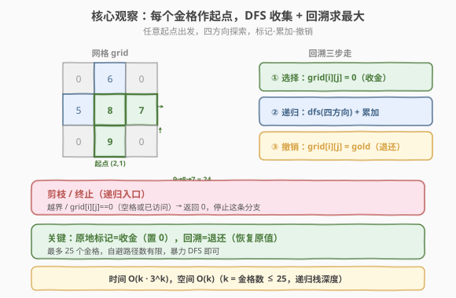
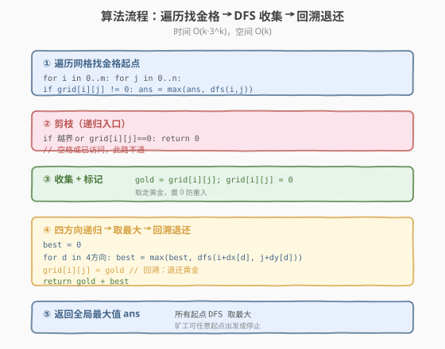
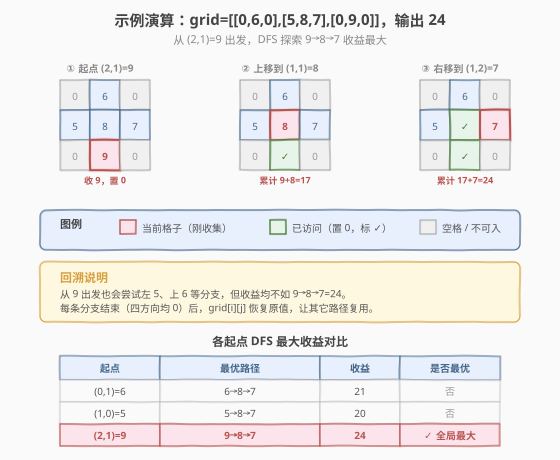

# LeetCode 黄金矿工 题解

## 1. 题目概述

- **标题 / 题号**：黄金矿工（#1219，medium）
- **链接**：https://leetcode.cn/problems/path-with-maximum-gold/
- **难度**：中等
- **标签**：数组、回溯、深度优先搜索、网格

**题意**：给定一个 `m × n` 的网格 `grid`，每个单元格的整数表示该格的黄金数量，`0` 表示空格。矿工按以下规则开采：

- 每次进入一个单元格就收集其中全部黄金；
- 可从当前位置向**上下左右**四个方向走；
- 每个单元格**只能开采一次**；
- **不得进入**黄金数目为 `0` 的单元格；
- 矿工可从**任意**有黄金的单元格出发或停止。

求能收集到的**最大黄金数量**。

**示例 1**：

```text
输入：grid = [[0,6,0],[5,8,7],[0,9,0]]
输出：24
解释：9 -> 8 -> 7，共收集 24。
```

**示例 2**：

```text
输入：grid = [[1,0,7],[2,0,6],[3,4,5],[0,3,0],[9,0,20]]
输出：28
解释：1 -> 2 -> 3 -> 4 -> 5 -> 6 -> 7，共收集 28。
```

**约束**：

- `1 <= grid.length, grid[i].length <= 15`
- `0 <= grid[i][j] <= 100`
- 最多 **25** 个单元格中有黄金。

> 💡 这是 **网格 DFS + 回溯** 的典型题，与 [79. 单词搜索](../0001-0100/79_单词搜索.md) 同源。区别在于：单词搜索是「判定能否匹配给定字符串」（找到即停），本题是「在所有合法路径中求最大收益」（必须枚举所有路径取最大）。约束中「最多 25 个金格」是关键——它保证了暴力 DFS 的搜索空间可控。

## 2. 解题思路

### 2.1 暴力思路：枚举所有路径

从每个有黄金的格子出发，尝试所有不自交的四方向路径，累加黄金，记录全局最大。路径数量随金格数指数增长，但题目保证**金格数 ≤ 25**，且网格结构限制了自避路径的实际数量，暴力回溯即可通过。

### 2.2 核心观察：DFS + 原地标记回溯



**关键思路**：遍历网格，对每个 `grid[i][j] != 0` 的格子作为起点调用 `dfs(i, j)`，返回从该点出发能收集的最大黄金。全局答案为所有起点结果的最大值。

**原地标记**：进入格子时先保存 `gold = grid[i][j]`，再把 `grid[i][j]` 置 `0`（既表示「已访问」，又天然阻止重入，因为 `0` 格不可进入）；递归返回后恢复 `grid[i][j] = gold`，让兄弟分支能复用该格。

> 💡 **为什么本题适合暴力 DFS？** 约束「最多 25 个金格」是定心丸。自避路径在网格上的分支因子约 3（首步 4 方向，之后来路已置 0），最坏 $O(k \cdot 3^k)$，$k \le 25$ 时实际运行很快。无需任何剪枝优化。

### 2.3 算法流程图



**完整步骤**：

1. **遍历网格**：对每个 `grid[i][j] != 0`，调用 `ans = max(ans, dfs(i, j))`。
2. **DFS 函数** `dfs(i, j)`：
   - **剪枝**：越界 / `grid[i][j] == 0`（空格或已访问）→ 返回 `0`
   - **收集 + 标记**：`gold = grid[i][j]`，`grid[i][j] = 0`
   - **四方向递归**：`best = 0`，对每个方向 `best = max(best, dfs(ni, nj))`
   - **回溯**：`grid[i][j] = gold`（退还）
   - **返回**：`gold + best`
3. 返回全局 `ans`。

> ⚠️ **回溯恢复必须在四方向递归全部结束之后**。若在某个方向递归后立即恢复，会破坏其它方向的探索。正确顺序：① 收集置 0 → ② 四方向全部递归取 max → ③ 恢复原值 → ④ 返回。这正是回溯的「选择-递归-撤销」三步走。

### 2.4 示例演算

以 `grid = [[0,6,0],[5,8,7],[0,9,0]]` 为例。金格共 5 个：`(0,1)=6`、`(1,0)=5`、`(1,1)=8`、`(1,2)=7`、`(2,1)=9`。



从 `(2,1)=9` 出发的 DFS 过程：

| 步骤 | 位置 (i,j) | 值 | 操作 | 累计 |
|------|-----------|----|------|------|
| 1 | (2,1) | 9 | 收集 9，置 0，探索四方向（上/下/左/右） | 9 |
| 2 | (1,1) | 8 | 上方，收集 8，置 0，探索四方向 | 17 |
| 3 | (1,2) | 7 | 右方，收集 7，置 0，四方向均 0 → 返回 7 | 24 |
| 4 | (1,1) | 8 | 回溯恢复 (1,1)=8，best=7，返回 8+7=15 | — |
| 5 | (2,1) | 9 | 回溯恢复 (2,2)=9... 实为 (2,1)，best=15，返回 9+15=24 | 24 |

各起点对比：从 `(0,1)=6` 出发最优 `6→8→7=21`，从 `(1,0)=5` 出发最优 `5→8→7=20`，从 `(2,1)=9` 出发最优 `9→8→7=24`。全局最大 **24**。

> 💡 **回溯让每个金格都能被不同路径复用**：步骤 3 把 `(1,2)` 置 0 探索完后，步骤 4 恢复 `(1,1)=8` 时，`(1,2)` 也已在自身 DFS 返回前恢复为 7。所以从 `(0,1)=6` 出发时，`(1,2)=7` 依然可用，能走出 `6→8→7`。若忘了回溯，所有路径会互相封死。

## 3. 参考代码

### C++

```cpp
// 黄金矿工.cpp —— 网格 DFS + 原地标记回溯
// 编译: g++ -O2 -std=c++17 黄金矿工.cpp -o goldmine
class Solution {
    int m, n;
    int dx[4] = {-1, 1, 0, 0};
    int dy[4] = {0, 0, -1, 1};

public:
    int getMaximumGold(vector<vector<int>>& grid) {
        m = grid.size();
        n = grid[0].size();
        int ans = 0;
        for (int i = 0; i < m; i++) {
            for (int j = 0; j < n; j++) {
                if (grid[i][j] != 0)
                    ans = max(ans, dfs(grid, i, j));
            }
        }
        return ans;
    }

private:
    int dfs(vector<vector<int>>& grid, int i, int j) {
        if (i < 0 || i >= m || j < 0 || j >= n || grid[i][j] == 0)
            return 0;
        int gold = grid[i][j];
        grid[i][j] = 0;                       // 收集 + 标记
        int best = 0;
        for (int d = 0; d < 4; d++)
            best = max(best, dfs(grid, i + dx[d], j + dy[d]));
        grid[i][j] = gold;                    // 回溯：退还
        return gold + best;
    }
};
```

### Python

```python
class Solution:
    def getMaximumGold(self, grid: List[List[int]]) -> int:
        m, n = len(grid), len(grid[0])
        dirs = [(-1, 0), (1, 0), (0, -1), (0, 1)]

        def dfs(i: int, j: int) -> int:
            if i < 0 or i >= m or j < 0 or j >= n or grid[i][j] == 0:
                return 0
            gold = grid[i][j]
            grid[i][j] = 0                     # 收集 + 标记
            best = 0
            for di, dj in dirs:
                best = max(best, dfs(i + di, j + dj))
            grid[i][j] = gold                  # 回溯：退还
            return gold + best

        ans = 0
        for i in range(m):
            for j in range(n):
                if grid[i][j] != 0:
                    ans = max(ans, dfs(i, j))
        return ans
```

> 💡 **两处细节**：① 方向数组 `dx/dy` 把四方向写成循环，避免重复代码。② `grid[i][j] = gold` 恢复时用进入函数时保存的 `gold`，而非 `grid[i][j]`（此时已是 0）。`grid` 按引用传递，修改即原地生效，无需额外 `visited` 数组。

## 4. 复杂度分析

| 维度 | 复杂度 | 说明 |
|------|--------|------|
| **时间** | $O(k \cdot 3^k)$ | $k$ 个金格作起点，每个起点 DFS 的自避路径数约 $3^{k-1}$（首步 4 方向，之后来路已置 0 降为 3）。$k \le 25$，实际网格结构大幅缩减搜索空间 |
| **空间** | $O(k)$ | 递归栈深度最大为最长自避路径长度 $\le k$；原地标记无额外数组 |

> ⚠️ 严格上界是 $O(k \cdot 4^k)$（首步也按 4 算），但来路格子已置 0 会被剪枝，实际分支因子约 3。题目限定金格数 $\le 25$，且网格并非完全连通，多数金格的可达邻居远少于 4，因此实测远低于理论上界。

## 5. 扩展：剪枝优化与变体

### 5.1 限制起点的剪枝

观察：最优路径若非单点，其**起点必为度数为 1 的金格**（即只有一个金格邻居的金格）。因为若起点度数 $\ge 2$，总可把起点换成其邻居，路径更长收益不减。因此可只从度数为 1 的金格出发，单点金格单独处理。

```python
def getMaximumGold(self, grid):
    m, n = len(grid), len(grid[0])
    dirs = [(-1,0),(1,0),(0,-1),(0,1)]
    def deg(i, j):
        cnt = 0
        for di, dj in dirs:
            ni, nj = i+di, j+dj
            if 0 <= ni < m and 0 <= nj < n and grid[ni][nj] != 0:
                cnt += 1
        return cnt
    # 只从度数<=1的金格出发；度数>=2的金格作为中间点会被覆盖
    ...
```

> ⚠️ 此优化在金格接近 25 且网格高度连通时显著加速，但实现复杂度上升，面试中作为「如何优化」的加分回答即可。

### 5.2 与 79 单词搜索的对比

| 维度 | 79 单词搜索 | 1219 黄金矿工 |
|------|------------|---------------|
| 目标 | 判定能否匹配给定字符串 | 求所有路径中最大收益 |
| 终止 | 找到一条即返回 `true` | 必须枚举所有路径取最大 |
| 起点 | 匹配 `word[0]` 的格子 | 所有金格 |
| 标记值 | `'#'`（与原字符区分） | `0`（利用「0 不可入」规则） |
| 返回值 | `bool` | `int`（累计收益） |

> 💡 二者共享「四方向 DFS + 原地标记 + 回溯」骨架。单词搜索是「找到即停」的判定型，黄金矿工是「全枚举取最值」的优化型。掌握 79 的模板，本题只需把返回值从 `bool` 改成累计 `int`。

## 6. 面试要点

1. **为什么用原地标记（置 0）而不是 visited 数组？**

   > 题目规定「不得进入黄金数目为 0 的单元格」，所以把已访问格子置 0 一举两得：既标记访问，又天然阻止重入（递归入口的 `grid[i][j] == 0` 判定同时覆盖空格和已访问）。省去 `O(m×n)` 额外空间，代码更简洁。关键是回溯时 `grid[i][j] = gold` 恢复原值，让兄弟分支能复用该格。

2. **回溯恢复的位置为什么重要？**

   > 必须在**四方向递归全部结束后**才恢复。若在某个方向递归后立即恢复，后续方向探索时该格已「解封」，会被重复进入，导致同一格黄金被多次收集。正确顺序：① 收集置 0 → ② 四方向递归取 max → ③ 恢复 → ④ 返回 `gold + best`。

3. **为什么不用剪枝也能通过？**

   > 约束限定金格数 $\le 25$。自避路径在网格上的分支因子约 3，最坏 $O(k \cdot 3^k)$，$k=25$ 时理论上界约 $25 \cdot 3^{25} \approx 4 \times 10^{13}$，看似很大，但网格的二维结构使多数金格的可达邻居远少于 4（边界、0 格阻隔），实际搜索树远小于理论上界，LeetCode 数据范围内毫秒级通过。

4. **本题和「单词搜索」（79）的 DFS 有什么区别？**

   > 单词搜索是**判定型**——找到一条匹配路径即返回 `true`，可提前终止；黄金矿工是**优化型**——必须枚举所有合法路径取最大收益，不能提前终止（除非用上界剪枝）。返回值从 `bool` 变成 `int`，DFS 逻辑从「任一方向成功即返回」变成「四方向取最大累加」。

5. **时间复杂度为什么是 $3^k$ 而不是 $4^k$？**

   > 第一步有 4 个方向，但之后每步最多 3 个方向——因为来路格子已被置 0，递归入口的 `grid[i][j] == 0` 会剪掉。所以分支因子从 4 降为 3，总路径数约 $4 \cdot 3^{k-1} \approx 3^k$。

> 💡 **一句话总结**：1219 黄金矿工是「网格 DFS + 回溯求最值」的招牌——遍历每个金格作起点，四方向 DFS 累加黄金，原地置 0 标记、回溯恢复。时间 $O(k \cdot 3^k)$，空间 $O(k)$，$k \le 25$ 保证暴力可行。与 79 单词搜索共享回溯骨架，是面试必会的网格搜索套路。

## 同类练习题

| # | 题目 | 与本题的关联 |
|---|------|-------------|
| 79 | [单词搜索](https://leetcode.cn/problems/word-search/)（[题解](../0001-0100/79_单词搜索.md)） | 网格 DFS + 回溯判定型（找到即停），本题的判定版前身 |
| 980 | [不同路径 III](https://leetcode.cn/problems/unique-paths-iii/) | 网格 DFS 遍历所有空格的路径计数，回溯骨架相同但求方案数 |
| 695 | [岛屿的最大面积](https://leetcode.cn/problems/max-area-of-island/) | 网格 DFS 求最大连通块面积，不回溯（感染法），对比「试错-撤销」与「染感染」语义 |
| 200 | [岛屿数量](https://leetcode.cn/problems/number-of-islands/)（[题解](../0101-0200/200_岛屿数量.md)） | 网格 DFS 连通块计数，不回溯，理解回溯与不回溯的边界 |
