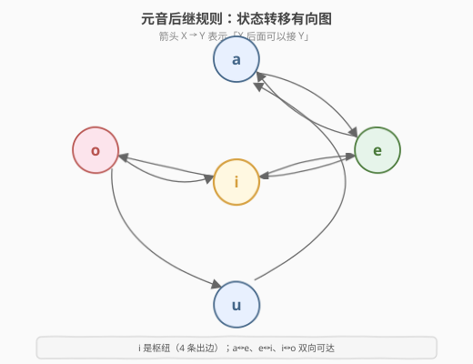
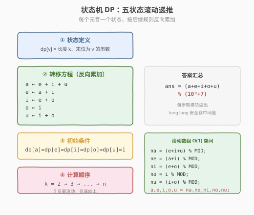
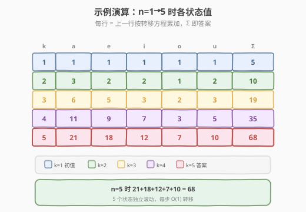

# 统计元音字母序列的数目

- **题目名称**：统计元音字母序列的数目
- **链接**：[1220. 统计元音字母序列的数目](https://leetcode.cn/problems/count-vowels-permutation/)
- **难度**：困难
- **标签**：动态规划、状态机、计数

## 1. 题目概述

给定整数 `n`，统计长度为 `n` 的字符串数目，字符串满足：

- 每个字符都是小写元音字母（`'a'`, `'e'`, `'i'`, `'o'`, `'u'`）
- `'a'` 后面只能跟 `'e'`
- `'e'` 后面只能跟 `'a'` 或 `'i'`
- `'i'` 后面**不能**再跟 `'i'`（可跟 `a`/`e`/`o`/`u`）
- `'o'` 后面只能跟 `'i'` 或 `'u'`
- `'u'` 后面只能跟 `'a'`

答案对 $10^9 + 7$ 取模。

**示例 1**：

```text
输入：n = 1
输出：5
解释：所有可能的字符串："a", "e", "i", "o", "u"
```

**示例 2**：

```text
输入：n = 2
输出：10
解释："ae", "ea", "ei", "ia", "ie", "io", "iu", "oi", "ou", "ua"
```

**示例 3**：

```text
输入：n = 5
输出：68
```

**约束条件**：

- `1 <= n <= 2 * 10^4`

> 💡 这是一道**状态机计数 DP**：每个元音字母是一个「状态」，后继规则就是状态间的转移边。题目本质是在一个 5 节点有向图上数长度为 `n` 的路径条数。掌握「状态定义 → 反向转移方程 → 滚动数组」这套骨架，所有「按规则计数序列」类问题（骰子、跳格子、有限自动机）都能秒杀。

---

## 2. 解题思路

### 2.1 暴力思路：枚举所有序列

从空串出发，逐位选择元音字母，DFS 枚举所有合法序列，到达长度 `n` 时计数 +1。

时间复杂度 `O(5^n)`（每位最多 5 种选择），`n=2*10^4` 时天文数字，**严重超时**。

> ⚠️ 暴力法的问题在于**重复子问题**：以 `'a'` 结尾的长度为 `k` 的串数，无论前面具体怎么排，只取决于「末位是 `a`」这一信息。后面的合法接法完全相同。这正是 DP 出场的时候——用 5 个状态压缩掉所有历史。

### 2.2 核心观察：状态机 DP

**关键定义**：设 `dp[k][v]` = 长度为 `k`、末位为元音 `v` 的合法串数目，其中 `v ∈ {a, e, i, o, u}`。

**核心思考**：把后继规则画成一张**有向图**——节点是 5 个元音，箭头 `X → Y` 表示「`X` 后面可以接 `Y`」。



从图中读出每个元音的**后继集合**（正向，谁可以接在我后面）：

| 当前末位 | 可接的后继 |
|----------|-----------|
| `a` | `e` |
| `e` | `a`, `i` |
| `i` | `a`, `e`, `o`, `u` |
| `o` | `i`, `u` |
| `u` | `a` |

DP 递推时更方便用**反向视角**——「谁贡献给我」，即「长度 `k` 末位为 `v` 的串，来自长度 `k-1` 末位为哪些元音」：

$$
\begin{aligned}
dp[k][a] &= dp[k{-}1][e] + dp[k{-}1][i] + dp[k{-}1][u] \\
dp[k][e] &= dp[k{-}1][a] + dp[k{-}1][i] \\
dp[k][i] &= dp[k{-}1][e] + dp[k{-}1][o] \\
dp[k][o] &= dp[k{-}1][i] \\
dp[k][u] &= dp[k{-}1][i] + dp[k{-}1][o]
\end{aligned}
$$

> 💡 **正向 vs 反向**：正向（我→后继）适合**正向填表**（把我的值加给后继）；反向（前驱→我）适合**反向拉值**（从上一行拉值填当前行）。两者等价，反向写法代码更直观——每行直接用上一行的 5 个值算出当前行的 5 个值，天然适合滚动数组。

### 2.3 算法流程图

有了转移方程，套用 DP 四步法：



**四步法**：

1. **状态定义**：`dp[v]` = 当前长度末位为 `v` 的串数（5 个变量滚动）
2. **转移方程**：见 2.2 的反向累加五式
3. **初始条件**：`dp[a] = dp[e] = dp[i] = dp[o] = dp[u] = 1`（`n=1` 时每个元音自身就是 1 个合法串）
4. **计算顺序**：`k = 2 → 3 → ... → n`，自底向上，每步用旧值算新值后整体覆盖

最终答案 $= \sum_v dp[n][v] \bmod (10^9+7)$。

### 2.4 示例演算

以 `n=5` 为例，看 5 个状态如何从初值逐步递推到答案 `68`：



| k | a | e | i | o | u | Σ |
|---|---|---|---|---|---|---|
| 1 | 1 | 1 | 1 | 1 | 1 | **5** |
| 2 | 3 | 2 | 2 | 1 | 2 | **10** |
| 3 | 6 | 5 | 3 | 2 | 3 | **19** |
| 4 | 11 | 9 | 7 | 3 | 5 | **35** |
| 5 | 21 | 18 | 12 | 7 | 10 | **68** |

以 `k=5` 的 `a=21` 为例验证：`a ← e+i+u = 9+7+5 = 21` ✓

> 💡 注意每行只依赖上一行的 5 个值，**不需要存整个二维表**——5 个变量滚动即可，空间 `O(1)`。

---

## 3. 参考代码

### C++

```cpp
// 统计元音字母序列的数目.cpp —— 状态机 DP + 滚动数组
// 编译: g++ -O2 -std=c++17 统计元音字母序列的数目.cpp -o cvp
using ll = long long;

class Solution {
  public:
    int countVowelPermutation(int n) {
        const ll MOD = 1e9 + 7;
        ll a = 1, e = 1, i = 1, o = 1, u = 1; // n=1 初值
        for (int k = 2; k <= n; ++k) {
            ll na = (e + i + u) % MOD;
            ll ne = (a + i) % MOD;
            ll ni = (e + o) % MOD;
            ll no = i % MOD;
            ll nu = (i + o) % MOD;
            a = na; e = ne; i = ni; o = no; u = nu;
        }
        return (a + e + i + o + u) % MOD;
    }
};
```

### Python

```python
class Solution:
    def countVowelPermutation(self, n: int) -> int:
        MOD = 10**9 + 7
        a = e = i = o = u = 1
        for _ in range(2, n + 1):
            a, e, i, o, u = (
                (e + i + u) % MOD,
                (a + i) % MOD,
                (e + o) % MOD,
                i % MOD,
                (i + o) % MOD,
            )
        return (a + e + i + o + u) % MOD
```

> 💡 Python 的多变量同时赋值是关键：右边的 `e, i, u` 等都是**旧值**，一次性算完所有新值再整体覆盖，避免了用临时变量。这与爬楼梯的 `prev2, prev1 = prev1, prev1 + prev2` 是同一技巧的 5 变量版本。

---

## 4. 复杂度分析

| 维度 | 复杂度 | 说明 |
|------|--------|------|
| **时间复杂度** | `O(n)` | 单层循环 `n-1` 轮，每轮 5 次加法 + 取模 |
| **空间复杂度（滚动）** | `O(1)` | 仅 5 个变量 `a/e/i/o/u` |
| **空间复杂度（二维表）** | `O(n)` | 若保留整个 `dp[n][5]` 表 |
| **最优时间** | `O(log n)` | 矩阵快速幂（见扩展） |

---

## 5. 扩展：矩阵快速幂 `O(log n)`

5 个状态的线性递推可写成矩阵形式。令列向量 $\mathbf{v}_k = \begin{pmatrix} dp[k][a] \\ dp[k][e] \\ dp[k][i] \\ dp[k][o] \\ dp[k][u] \end{pmatrix}$，则 $\mathbf{v}_k = M \cdot \mathbf{v}_{k-1}$，其中转移矩阵 $M$（行=当前状态，列=前驱贡献）为：

$$
M = \begin{pmatrix}
0 & 1 & 1 & 0 & 1 \\
1 & 0 & 1 & 0 & 0 \\
0 & 1 & 0 & 1 & 0 \\
0 & 0 & 1 & 0 & 0 \\
0 & 0 & 1 & 1 & 0
\end{pmatrix}
$$

迭代展开：$\mathbf{v}_n = M^{n-1} \cdot \mathbf{v}_1$，其中 $\mathbf{v}_1 = (1,1,1,1,1)^T$。

矩阵幂用**快速幂**（平方加速）可在 $O(\log n)$ 内算出（每次矩阵乘 $5^3=125$ 次乘法）。`n=2*10^4` 时 DP 已足够快，但若 `n` 放大到 $10^9$，矩阵快速幂是唯一可行解法。

> 💡 这与爬楼梯的 2×2 矩阵快速幂完全同构——任何「常量状态数的线性递推」都能写成矩阵幂形式。状态数决定了矩阵阶数，矩阵快速幂的复杂度为 $O(s^3 \log n)$（$s$ 为状态数）。

---

## 6. 面试要点

1. **为什么用 5 个状态而不是 1 个？**

   - 一个状态 `dp[k]` 只能记「长度 `k` 的总串数」，但**转移依赖于末位是哪个元音**——末位 `a` 和末位 `e` 的后续合法选择不同。
   - 必须按末位拆成 5 个子状态，才能正确表达「无后效性」：`dp[k][v]` 只依赖 `dp[k-1][*]`，与更早的历史无关。

2. **正向填表和反向拉值哪个好？**

   - 两者等价。正向（把我的值推给后继）需要同时更新多个后继，代码里要小心覆盖顺序；反向（从上一行拉值填当前行）每个新值独立计算，天然适合滚动数组同时赋值。
   - 面试推荐反向写法：5 行赋值，清晰无歧义。

3. **为什么每步都要取模？**

   - `n=2*10^4` 时答案极大（远超 `long long`），必须在**每次加法后立即取模**，否则中间值溢出。
   - `long long` 存中间值安全：3 个 `int` 范围值相加最多约 $3 \times 10^9$，不溢出 `long long`（上限约 $9.2 \times 10^{18}$），取模后回到 `int` 范围。

4. **`o ← i` 只有一个前驱，为什么 `o` 的值不等于上一行的 `i`？**

   - 它**确实等于**上一行的 `i`！看演算表：`k=3` 时 `o=2`，正是 `k=2` 的 `i=2`；`k=4` 时 `o=3`，正是 `k=3` 的 `i=3`。`o` 是 `i` 的「延迟一拍影子」。

5. **如果规则改成「`i` 后面可以跟 `i`」，转移方程怎么变？**

   - `dp[k][i]` 的反向式加上 `dp[k-1][i]` 自身：`dp[k][i] = dp[k-1][e] + dp[k-1][o] + dp[k-1][i]`。
   - 矩阵 $M$ 的 `(i, i)` 位置从 0 变 1。本质上 `i` 有了自环边，计数变大。

> 💡 **一句话总结**：本题是「状态机计数 DP」的招牌题——把后继规则建模成 5 节点有向图，反向写出 5 条转移方程，5 变量滚动 `O(n)`/`O(1)` 解决。矩阵快速幂是它的「升级装甲」，应对 `n` 极大的变体。

---

## 7. 同类练习题

- [70. 爬楼梯](https://leetcode.cn/problems/climbing-stairs/)：一维计数 DP 入门，同样的滚动数组骨架（2 状态 → 5 状态的自然推广）
- [377. 组合总和 IV](https://leetcode.cn/problems/combination-sum-iv/)：计数型 DP，外层金额内层硬币，转移方程驱动计数
- [1155. 掷骰子之和等于给定方法数](https://leetcode.cn/problems/number-of-dice-rolls-with-target-sum/)：多状态计数 DP（骰子面数 × 目标和），二维状态转移
- [526. 优美的排列](https://leetcode.cn/problems/beautiful-arrangement/)：状态压缩计数 DP，bitmask 记已用集合，同属「按规则计数序列」家族
