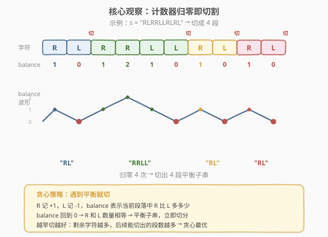
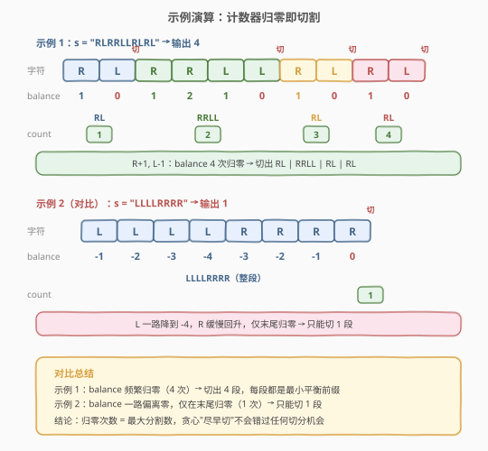

# 分割平衡字符串

- **题目名称**：分割平衡字符串
- **链接**：[1221. 分割平衡字符串](https://leetcode.cn/problems/split-a-string-in-balanced-strings/)
- **难度**：简单
- **标签**：贪心、字符串、计数

## 1. 题目概述

**平衡字符串**定义为：其中 'L' 和 'R' 字符的数量相同。给定一个平衡字符串 `s`，请你将它分割成**尽可能多**的平衡子字符串，返回能得到的最大分割数。

**示例 1**：

```text
输入：s = "RLRRLLRLRL"
输出：4
解释：s 可以分割为 "RL"、"RRLL"、"RL"、"RL"，每段都含有相同数量的 'L' 和 'R'。
```

**示例 2**：

```text
输入：s = "RLLLLRRRLR"
输出：3
解释：s 可以分割为 "RL"、"LLLRRR"、"LR"，每段平衡。
```

**示例 3**：

```text
输入：s = "LLLLRRRR"
输出：1
解释：s 只能作为整体 "LLLLRRRR"，无法在中间切分出更多平衡子串。
```

**示例 4**：

```text
输入：s = "RLRRRLLRLL"
输出：2
解释：s 可以分割为 "RL"、"RRRLLRLL"，两段均平衡。
```

**约束条件**：

- `1 <= s.length <= 1000`
- `s[i]` 为 `'L'` 或 `'R'`
- `s` 是一个平衡字符串（'L' 和 'R' 数量相同）

> 💡 关键线索：题目保证 `s` 整体平衡，要求**最大化分割数**。直觉上"能切就切"——只要某个前缀已经平衡，就立即切掉，剩下的部分继续找平衡前缀。这暗示贪心策略可能最优。

---

## 2. 解题思路

### 2.1 暴力思路：枚举所有分割方案

最直觉的暴力方法是枚举所有可能的分割方式：在 `n-1` 个位置中选若干个作为切分点，验证每种方案的所有段是否平衡，取合法方案中段数最大者。这等价于在 $n-1$ 个位置中做子集枚举，时间复杂度 $O(2^n \cdot n)$，对于 $n = 1000$ 完全不可行。

问题在于：暴力枚举没有利用"**平衡**"这一约束带来的结构。我们需要一种能在 $O(n)$ 内直接判定"在哪里切"的方法。

### 2.2 核心观察：计数器归零即切割



将 'L' 和 'R' 的数量差异用一个**计数器** `balance` 来跟踪：

- 遇到 `'R'`：`balance += 1`
- 遇到 `'L'`：`balance -= 1`

`balance` 的物理含义是：**当前段落中 'R' 比 'L' 多多少**。

- `balance > 0`：当前段落中 'R' 更多，还未平衡
- `balance == 0`：当前段落中 'R' 和 'L' 数量相等 → **平衡子串**，立即切分
- `balance < 0`：当前段落中 'L' 更多，还未平衡

**贪心策略**：从左到右扫描，每当 `balance` 回到 $0$，就在此处切分，`count++`。由于整串保证平衡，`balance` 最终一定归零，因此一定能完整切分。

> ⚠️ **为什么贪心最优？** 交换论证：设最优解没有在最早的 `balance = 0` 处切分，而是将这个平衡前缀并入了后一段。那么后一段的剩余部分仍然是一个平衡子串（因为整体平衡减去平衡前缀 = 平衡后缀）。将这个平衡前缀单独切出，不会减少总段数——反而可能让后续切出更多段。因此"尽早切分"不会比任何方案更差，贪心最优。

### 2.3 算法流程图


**完整步骤**：

1. **初始化**：`balance = 0`，`count = 0`。
2. **遍历**每个字符 `s[i]`：
   - 若 `s[i] == 'R'`，`balance++`；
   - 否则 `balance--`。
   - 若 `balance == 0`，`count++`（找到一个平衡子串，切分）。
3. **返回** `count`。

> 💡 **不需要显式记录切分位置**——`balance` 归零时自动标记了一个平衡子串的结束。整串平衡保证最终 `balance` 必归零，无需特殊处理末尾。

### 2.4 示例演算

以示例 1 `s = "RLRRLLRLRL"` 和示例 3 `s = "LLLLRRRR"` 为例：



**示例 1 `s = "RLRRLLRLRL"`**：

| 步骤 | 字符 | balance | 操作 | count |
|------|------|---------|------|-------|
| 1 | R | 1 | — | 0 |
| 2 | L | 0 | 归零，切分！ | 1 |
| 3 | R | 1 | — | 1 |
| 4 | R | 2 | — | 1 |
| 5 | L | 1 | — | 1 |
| 6 | L | 0 | 归零，切分！ | 2 |
| 7 | R | 1 | — | 2 |
| 8 | L | 0 | 归零，切分！ | 3 |
| 9 | R | 1 | — | 3 |
| 10 | L | 0 | 归零，切分！ | 4 |

输出 $4$，切分为 `"RL" | "RRLL" | "RL" | "RL"`。

**示例 3 `s = "LLLLRRRR"`（对比）**：

| 步骤 | 字符 | balance | 操作 | count |
|------|------|---------|------|-------|
| 1 | L | $-1$ | — | 0 |
| 2 | L | $-2$ | — | 0 |
| 3 | L | $-3$ | — | 0 |
| 4 | L | $-4$ | — | 0 |
| 5 | R | $-3$ | — | 0 |
| 6 | R | $-2$ | — | 0 |
| 7 | R | $-1$ | — | 0 |
| 8 | R | $0$ | 归零，切分！ | 1 |

`balance` 一路降到 $-4$ 再缓慢回升，仅在最末尾归零 → 只能切出 1 段 `"LLLLRRRR"`。

---

## 3. 参考代码

### C++

```cpp
class Solution {
public:
    int balancedStringSplit(string s) {
        int balance = 0, count = 0;
        for (char c : s) {
            balance += (c == 'R') ? 1 : -1;
            if (balance == 0) count++;
        }
        return count;
    }
};
```

> 💡 `(c == 'R') ? 1 : -1` 用三元运算符一行处理两种字符，避免 if-else 分支。`balance` 归零即切分，无需记录切分位置。

### Python

```python
class Solution:
    def balancedStringSplit(self, s: str) -> int:
        balance = 0
        count = 0
        for c in s:
            balance += 1 if c == 'R' else -1
            if balance == 0:
                count += 1
        return count
```

> 💡 `1 if c == 'R' else -1` 是 Python 的三元表达式，逻辑与 C++ 完全一致。也可用 `sum` + 累积判断，但可读性不如显式循环。

### 方法二：Python 简写

```python
class Solution:
    def balancedStringSplit(self, s: str) -> int:
        bal = ans = 0
        for c in s:
            bal += 1 if c == 'R' else -1
            ans += (bal == 0)
        return ans
```

> ⚠️ `ans += (bal == 0)` 利用 Python 中 `True == 1`、`False == 0` 的特性，将条件判断直接转为加法，代码更紧凑但可读性略降。逻辑与方法一完全等价。

---

## 4. 复杂度分析

| 维度 | 复杂度 | 说明 |
|------|--------|------|
| **时间** | $O(n)$ | 一遍遍历字符串，每个字符做一次 $O(1)$ 的计数器更新与判断 |
| **空间** | $O(1)$ | 仅用两个整型变量 `balance` / `count`，与输入规模无关 |

> ⚠️ **时间** $O(n)$：遍历 $n$ 个字符各 $O(1)$，总计 $O(n)$。无排序、无嵌套循环、无回溯。
>
> **空间** $O(1)$：不随 $n$ 增长。仅需 `balance` 和 `count` 两个计数器，无需存储切分位置或额外数据结构。

---

## 5. 扩展：贪心正确性证明与前缀和视角

### 5.1 交换论证证明贪心最优

**命题**：在最早的 `balance = 0` 处切分，得到的分割数不少于任何其他方案。

**证明**（交换论证）：

设 `s[0..k]` 是最短的平衡前缀（即 `s[0..k]` 平衡且 `s[0..j]` 不平衡 $\forall j < k$）。设最优解 $OPT$ 没有在位置 $k$ 处切分，而是将 `s[0..k]` 并入了更大的段 `s[0..m]`（$m > k$，且 `s[0..m]` 平衡）。

由于 `s[0..k]` 平衡且 `s[0..m]` 平衡，所以 `s[k+1..m]` 也平衡（平衡性具有"差"的封闭性）。构造新方案 $OPT'$：在位置 $k$ 处切分 `s[0..k]`，其余部分 `s[k+1..m]` 继续按 $OPT$ 的方式切分。

- $OPT'$ 的段数 $\geq$ $OPT$ 的段数（多切出了 `s[0..k]` 一段，`s[k+1..m]` 的切分数 $\geq 0$）
- 重复此交换直到所有切分点都在最早的 `balance = 0` 处，得到贪心解 $GREEDY$

因此 $GREEDY \geq OPT$，而 $OPT$ 是最优解故 $OPT \geq GREEDY$，所以 $GREEDY = OPT$。$\blacksquare$

### 5.2 前缀和视角

`balance` 本质上是一个**前缀和**：令 $R = +1$、$L = -1$，则 `balance[i]` = `s[0..i]` 的前缀和。

"切分点"即前缀和回到当前段起始值的位置。如果我们将每段的起始前缀和视为 $0$，那么切分条件就是 $\text{prefix\_sum} = 0$，等价于寻找前缀和为零的位置。

这一视角将本题与 [525. 连续数组](https://leetcode.cn/problems/contiguous-array/)（前缀和 + 哈希找同值区间）、[974. 和可被 K 整除的子数组](https://leetcode.cn/problems/subarray-sums-divisible-by-k/)（前缀和 + 同余定理）联系起来——它们都是在前缀和序列上寻找满足特定条件的区间。

> 💡 本题的特殊性在于：整串平衡（前缀和最终为 $0$）+ 只需"恰好归零"的切分（不需要哈希查表），因此只需 $O(1)$ 空间维护滚动前缀和即可，比通用的前缀和 + 哈希更轻量。

---

## 6. 面试要点

1. **为什么"能切就切"的贪心是最优的？**

   > 交换论证：若最优解没有在最早的平衡前缀处切分，则该平衡前缀被并入后段。但平衡性具有差封闭性——大段平衡且前缀平衡，则剩余部分也平衡。将前缀单独切出不会减少总段数，可能还增加。反复交换即得贪心解，故贪心 = 最优。

2. **`balance` 的物理含义是什么？**

   > `balance` 是当前段落中 'R' 比 'L' 多的数量（'R' 记 $+1$，'L' 记 $-1$）。`balance = 0` 表示当前段落中两者数量相等，即平衡子串。切分后 `balance` 从 $0$ 重新开始累计下一段。

3. **为什么不需要回溯或记忆化？**

   > 贪心策略只需一次从左到右的扫描：每个字符更新 `balance`，归零时切分。不需要"撤销"之前的切分决策，因为交换论证保证了每次尽早切分不会导致后续更差。这是贪心"局部最优 = 全局最优"的体现。

4. **如果 `s` 不保证整体平衡会怎样？**

   > 若 `s` 不平衡，最终 `balance` 不会归零，末尾会剩一段不平衡的"尾巴"。此时贪心策略仍然切出所有归零的段，但不保证覆盖整个字符串。题目保证 `s` 平衡，所以最终一定归零，整串被完整切分。

5. **这道题和括号匹配（如 20. 有效括号）有什么异同？**

   > 相同点：都用计数器跟踪"平衡"状态（本题 'R'/'L'，括号题 '(' / ')'）。不同点：本题只有一种字符对（'R' vs 'L'），一个计数器即可；括号题有多种括号类型 `()[]{}`，需要栈来匹配嵌套结构。本题的计数器退化了栈的作用——单类型无需栈。

> 💡 **一句话总结**：1221 的本质是"前缀和归零即切分"——'R' 记 $+1$、'L' 记 $-1$，`balance` 归零处就是平衡子串的边界。交换论证保证"尽早切"的贪心最优，$O(n)$ / $O(1)$ 一步到位。

---

## 7. 同类练习题

- [1541. 平衡括号的最少插入次数](https://leetcode.cn/problems/minimum-insertions-to-balance-a-parentheses-string/)：同为"计数器维护平衡"的贪心，但需处理 `))` 配对与缺失插入，是 1221 计数器思想的进阶版
- [1704. 判断字符串的两半是否相似](https://leetcode.cn/problems/determine-if-string-halves-are-alike/)：判断字符串两半的元音数量是否相等，"两半平衡"的直接判定，balance 思想的简化应用
- [1653. 使字符串平衡的最小删除次数](https://leetcode.cn/problems/minimum-deletions-to-make-string-balanced/)：使 'a'/'b' 字符串平衡（左半无 'b'、右半无 'a'）的最少删除，贪心 + 枚举分界点，与 1221 的字符平衡主题呼应
- [1248. 统计「优美子数组」](https://leetcode.cn/problems/count-number-of-nice-subarrays/)（[题解](1248_统计优美子数组.md)）：计数型子数组问题，前缀和 + 哈希统计"平衡"区间数量，是 1221 前缀和视角的推广
- [525. 连续数组](https://leetcode.cn/problems/contiguous-array/)（[题解](../0501-0600/525_连续数组.md)）：前缀和 + 哈希找最长"平衡"区间，将 0 当 $-1$ 转换后与 1221 的计数器思想同源
