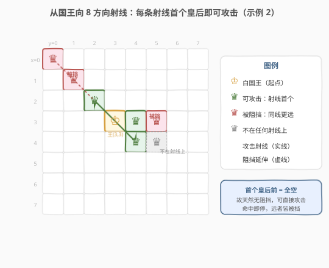
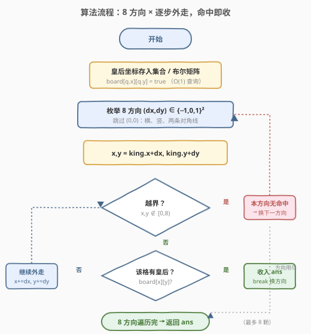
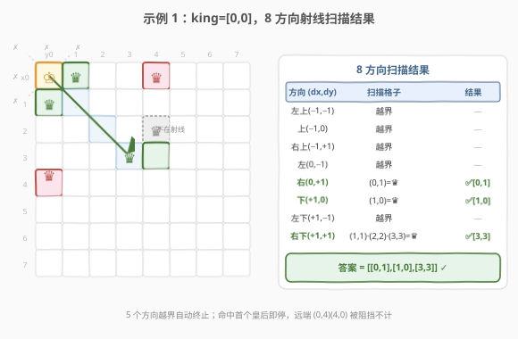

# 可以攻击国王的皇后

- **题目名称**：可以攻击国王的皇后
- **链接**：[1222. 可以攻击国王的皇后](https://leetcode.cn/problems/queens-that-can-attack-the-king/)
- **难度**：中等
- **标签**：数组、矩阵、模拟、搜索

## 1. 题目概述

在一个 **下标从 0 开始** 的 `8 x 8` 棋盘上，有若干黑皇后和一个白国王。给定黑皇后坐标数组 `queens`（`queens[i] = [xQueeni, yQueeni]`，其中 `x` 为行、`y` 为列）和国王坐标 `king = [xKing, yKing]`。返回**能够直接攻击国王**的黑皇后坐标，顺序任意。

> 💡 **“直接攻击”的判定**：皇后与国王在**同一行、同一列或同一对角线**上，且二者之间**没有其它棋子阻挡**。皇后走法是沿 8 个方向（横、竖、两条对角线）直线行进，遇到的第一颗棋子即被“看到”。

**示例 1**：

```text
输入：queens = [[0,1],[1,0],[4,0],[0,4],[3,3],[2,4]], king = [0,0]
输出：[[0,1],[1,0],[3,3]]
解释：国王在左上角 (0,0)。
  - (0,1) 同行右侧相邻，直接攻击；
  - (1,0) 同列下方相邻，直接攻击；
  - (3,3) 对角线右下方，路径 (1,1)(2,2) 均空，直接攻击。
  - (0,4) 虽同行，但被 (0,1) 阻挡；(4,0) 虽同列，但被 (1,0) 阻挡。
```

**示例 2**：

```text
输入：queens = [[0,0],[1,1],[2,2],[3,4],[3,5],[4,4],[4,5]], king = [3,3]
输出：[[2,2],[3,4],[4,4]]
解释：国王在中心 (3,3)。
  - (2,2) 左上对角相邻，攻击；(3,4) 右侧相邻，攻击；(4,4) 右下对角相邻，攻击。
  - (0,0)(1,1) 在左上射线上但被 (2,2) 阻挡；(3,5) 在右射线上但被 (3,4) 阻挡。
  - (4,5) 与国王 Δx=1,Δy=2，不在任何一条皇后射线上，本就无法攻击。
```

**约束条件**：

- `1 <= queens.length < 64`
- `0 <= xQueeni, yQueeni, xKing, yKing < 8`
- 所有给定位置唯一，国王位置上没有皇后。

> 💡 **棋盘固定 8×8** 是本题最大的“定心丸”：任何一条射线的最大步数只有 7，从国王出发枚举 8 个方向的总代价是常数级。这决定了最优解法是「从国王向八方向射线搜索」而非「逐个皇后查阻挡」。

---

## 2. 解题思路

### 2.1 暴力思路：逐个皇后查阻挡

对每颗皇后，先判断是否与国王同行/同列/同对角线（`dx==0` 或 `dy==0` 或 `|dx|==|dy|`）；若是，再扫描国王到该皇后之间的路径，确认没有任何其它皇后落在中间。设皇后数为 $Q$，最坏路径长 7，复杂度 $O(Q \cdot 7)$。逻辑正确但需要显式处理“阻挡”，实现易错（要枚举中间格、排除端点、判断越界）。

### 2.2 核心观察：从国王出发沿 8 方向射线搜索



**视角反转**是本题的关键：与其问“某颗皇后能不能攻击国王”，不如问“**从国王看出去，每个方向上最先碰到的是谁**”。

> 💡 **为什么首个皇后就一定能攻击？** 沿某方向从国王向外逐步走，遇到的**第一颗**皇后之前，途中的格子必然全空（否则更早就碰到了）。因此它与国王之间没有任何阻挡，必然能直接攻击。遇到它后该方向搜索即可停止——更远处的同方向皇后都被它挡住，无需再考虑。

这样把“判断 + 查阻挡”两步合并成一次线性射线扫描：

1. 把所有皇后坐标存入集合（$O(1)$ 查询）。
2. 枚举 8 个方向向量 $(\Delta x, \Delta y) \in \{-1,0,1\}^2 \setminus \{(0,0)\}$。
3. 对每个方向，从国王的**相邻格**开始，按向量逐步外走；越界则换方向；命中皇后则收入答案并换方向。

### 2.3 算法流程图



**完整步骤**：

1. **建索引**：用 `8×8` 布尔矩阵（或哈希集合）记录皇后位置。
2. **遍历 8 方向**：对每个 $(\Delta x, \Delta y)$：
   - 令 $x = x_{king} + \Delta x$，$y = y_{king} + \Delta y$（从相邻格起步）。
   - **当** $x, y \in [0,8)$：
     - 若该格有皇后 → 记录 $(x,y)$，**跳出**本方向。
     - 否则 $x \mathrel{+}= \Delta x$，$y \mathrel{+}= \Delta y$，继续外走。
3. 返回收集到的所有坐标（最多 8 颗）。

> ⚠️ **每方向至多记一颗**：方向命中第一颗皇后后必须 `break`。若不跳出，会继续走到被阻挡的远处皇后并误收入答案。这正是“首个即攻击”原则的代码体现。

### 2.4 示例演算

以示例 1 `king = [0,0]`（左上角）为例，从国王出发的 8 条射线：



| 方向 $(\Delta x,\Delta y)$ | 扫描格子（从相邻起） | 结果 |
|----------------------------|----------------------|------|
| 左上 $(-1,-1)$ | 立即越界 | — |
| 上 $(-1,0)$ | 立即越界 | — |
| 右上 $(-1,1)$ | 立即越界 | — |
| 左 $(0,-1)$ | 立即越界 | — |
| 右 $(0,1)$ | $(0,1)$=皇后 | ✅ $[0,1]$ |
| 下 $(1,0)$ | $(1,0)$=皇后 | ✅ $[1,0]$ |
| 左下 $(1,-1)$ | 立即越界 | — |
| 右下 $(1,1)$ | $(1,1)$空→$(2,2)$空→$(3,3)$=皇后 | ✅ $[3,3]$ |

合并得 `[[0,1],[1,0],[3,3]]`，与期望一致。

> 💡 **左上角国王的 4 个方向直接越界**，直观体现了“边界自动终止射线”。右下方向连续穿过两个空格才命中 $(3,3)$，说明“首个皇后前的格子全空”这一不变量天然成立——无需显式查阻挡。

---

## 3. 参考代码

### C++

```cpp
// 可以攻击国王的皇后.cpp —— 从国王出发 8 方向射线搜索
// 编译: g++ -O2 -std=c++17 可以攻击国王的皇后.cpp -o qtak
class Solution {
public:
    vector<vector<int>> queensAttacktheKing(vector<vector<int>>& queens, vector<int>& king) {
        bool board[8][8] = {};
        for (auto& q : queens) board[q[0]][q[1]] = true;   // 建索引
        vector<vector<int>> ans;
        int dirs[8][2] = {{-1,-1},{-1,0},{-1,1},{0,-1},
                          {0, 1},{1,-1},{1, 0},{1, 1}};
        for (auto& d : dirs) {
            int x = king[0] + d[0], y = king[1] + d[1];     // 从相邻格起步
            while (x >= 0 && x < 8 && y >= 0 && y < 8) {
                if (board[x][y]) {                          // 命中首个皇后
                    ans.push_back({x, y});
                    break;                                  // 该方向结束
                }
                x += d[0];
                y += d[1];
            }
        }
        return ans;
    }
};
```

### Python

```python
class Solution:
    def queensAttacktheKing(self, queens: List[List[int]], king: List[int]) -> List[List[int]]:
        qs = {(x, y) for x, y in queens}                    # 建索引
        ans = []
        for dx in (-1, 0, 1):
            for dy in (-1, 0, 1):
                if dx == 0 and dy == 0:
                    continue
                x, y = king[0] + dx, king[1] + dy           # 从相邻格起步
                while 0 <= x < 8 and 0 <= y < 8:
                    if (x, y) in qs:                         # 命中首个皇后
                        ans.append([x, y])
                        break                                # 该方向结束
                    x += dx
                    y += dy
        return ans
```

> 💡 **两种建索引方式**：棋盘固定 8×8 时用布尔矩阵最省（$O(1)$ 查询、$O(64)$ 空间、常数极小）；若棋盘规模可变，改用 `unordered_set<int>`（键 `x*8+y` 编码）或 `set<vector<int>>` 即可，射线扫描逻辑不变。Python 用元组集合天然可哈希、可读性最佳。

---

## 4. 复杂度分析

| 维度 | 复杂度 | 说明 |
|------|--------|------|
| **时间** | $O(1)$ | 8 个方向，每方向至多走 7 步，共 $\le 56$ 次 $O(1)$ 查询；皇后建索引 $O(Q)$。棋盘固定 8×8，整体常数级 |
| **空间** | $O(1)$ | 布尔矩阵固定 64 字节（或哈希集合 $O(Q)$，$Q < 64$ 仍为常数） |

> ⚠️ 严格按输入规模记，建索引为 $O(Q)$，射线搜索为 $O(1)$；因 $Q < 64$ 且棋盘恒为 8×8，工程上视作 $O(1)$。若把本题推广到 $N \times N$ 棋盘，时间变为 $O(N + Q)$。

---

## 5. 扩展：两种视角的对比与变体

| 维度 | 从国王出射线（本解法） | 逐个皇后查阻挡 |
|------|------------------------|----------------|
| **视角** | 国王向外“看” | 皇后向国王“问” |
| **阻挡处理** | 隐式——首个皇后前的格子天然全空 | 显式——需枚举中间格逐个查 |
| **复杂度** | $O(1)$（8 方向 ×7 步） | $O(Q \cdot 7)$（每皇后查路径） |
| **易错点** | 忘记命中后 `break` | 中间格端点排除、越界处理 |
| **推广性** | 依赖“射线步数有限” | 通用，任意分布均可 |

> 💡 **可推广到 $N \times N$**：把棋盘规模视作 $N$，射线搜索变为 $O(N)$（每方向至多 $N-1$ 步）。当皇后稀疏时仍优于「逐皇后查阻挡」的 $O(Q \cdot N)$——因为只要 $Q > 8$（方向数），射线法就把“逐皇后”降为了“逐方向”。

### 5.1 方向向量的两种写法

C++ 中显式列出 8 个方向数组最直观；Python 中用 `for dx in (-1,0,1): for dy in (-1,0,1): if dx==0 and dy==0: continue` 的双层循环生成，省去手写 8 项且不易漏。两种等价，面试中按语言习惯选择即可。

---

## 6. 面试要点

1. **为什么要从国王出发而不是逐个皇后判断？**

   > 从国王出发，沿某方向遇到的**第一颗**皇后之前必然全空（否则更早命中），因此它天然无阻挡、可直接攻击。这把“判断是否同行/同列/同对角 + 查阻挡”两步合成一次线性扫描，且每方向命中即停，无需处理中间格的端点与越界细节。

2. **命中第一颗皇后后为什么要 `break`？**

   > 同方向更远处的皇后被这颗首个皇后阻挡，不能攻击国王。若不 `break`，会继续走到它们并误收入答案。“首个即攻击”要求遇到即停。

3. **为什么复杂度是 $O(1)$？**

   > 棋盘固定 8×8，8 个方向各至多 7 步，搜索总步数 $\le 56$；建索引 $O(Q)$ 且 $Q < 64$。整体常数级。若推广到 $N \times N$，则为 $O(N + Q)$。

4. **如何判断两颗棋子是否在皇后攻击线上？**

   > 皇后攻击线即 8 方向射线。两格 $(x_1,y_1),(x_2,y_2)$ 在同一攻击线上当且仅当 $x_1=x_2$（同列）或 $y_1=y_2$（同行）或 $|x_1-x_2|=|y_1-y_2|$（同对角线）。本题通过“沿方向向量逐步走”隐式覆盖了这一判定。

5. **建索引用布尔矩阵还是哈希集合？**

   > 棋盘固定 8×8 时布尔矩阵最优：$O(1)$ 查询、空间 64 字节、无哈希开销。若棋盘规模可变或坐标稀疏，改用哈希集合（键用 `x*N+y` 编码或元组）。射线扫描主体逻辑不变。

> 💡 **一句话总结**：1222 是“视角反转”的招牌——从国王向 8 方向射线扫描，首个皇后即可攻击，命中即停。把“查阻挡”藏进“逐步外走”的不变量里，$O(1)$ 时间 $O(1)$ 空间，代码极简。

---

## 7. 同类练习题

- [51. N 皇后](https://leetcode.cn/problems/n-queens/)（[题解](../0001-0100/51_N皇后.md)）：皇后攻击规则的本源——同行/同列/同对角线，本题是其判定逻辑的逆向应用
- [52. N 皇后 II](https://leetcode.cn/problems/n-queens-ii/)（[题解](../0001-0100/52_N皇后II.md)）：用对角线编号 $x-y$ / $x+y$ 判同对角，理解皇后射线方向
- [79. 单词搜索](https://leetcode.cn/problems/word-search/)（[题解](../0001-0100/79_单词搜索.md)）：网格中沿方向向量逐步外走的同类骨架（搜索而非阻挡判定）
- [200. 岛屿数量](https://leetcode.cn/problems/number-of-islands/)（[题解](../0101-0200/200_岛屿数量.md)）：网格 4/8 方向连通搜索，对比“射线单向”与“全方向扩散”
