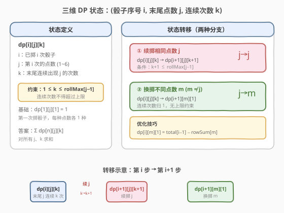
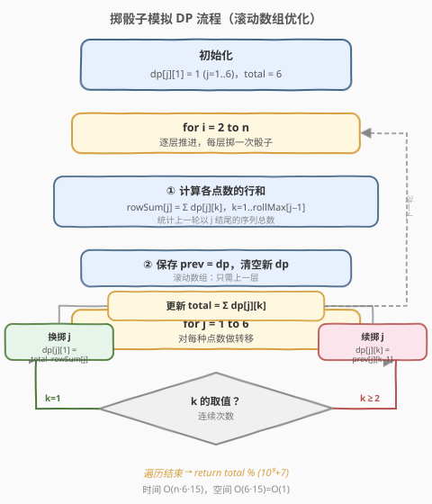
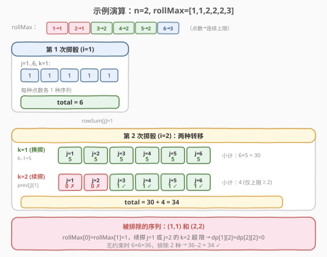

# 掷骰子模拟

- **题目名称**：掷骰子模拟
- **链接**：[1223. 掷骰子模拟](https://leetcode.cn/problems/dice-roll-simulation/)
- **难度**：困难
- **标签**：动态规划、数组

## 1. 题目概述

有一个骰子模拟器，每次投掷生成一个 1 到 6 的随机数。使用时有一个约束：**连续**掷出数字 `i` 的次数不能超过 `rollMax[i]`（`i` 从 1 开始编号，即 `rollMax[0]` 对应数字 1）。

给定整数数组 `rollMax`（长度 6）和整数 `n`，计算掷 `n` 次骰子可得到的不同点数序列的数量。由于答案可能很大，返回模 $10^9 + 7$ 之后的结果。

**示例 1**：

```text
输入：n = 2, rollMax = [1,1,2,2,2,3]
输出：34
解释：掷 2 次骰子，无约束时共 6×6=36 种组合。但数字 1 和 2 的连续上限为 1，
      所以 (1,1) 和 (2,2) 两种序列不合法。答案 = 36 − 2 = 34。
```

**示例 2**：

```text
输入：n = 2, rollMax = [1,1,1,1,1,1]
输出：30
解释：所有数字连续上限均为 1，6 种相同数字对被排除。答案 = 36 − 6 = 30。
```

**示例 3**：

```text
输入：n = 3, rollMax = [1,1,1,2,2,3]
输出：181
```

**约束条件**：

- $1 \le n \le 5000$
- `rollMax.length == 6`
- $1 \le \text{rollMax}[i] \le 15$

> 💡 **关键观察**：约束只限制「末尾连续相同数字的长度」，与中间的数字无关。因此只需跟踪**末尾是什么数字**以及**它已经连续出现了几次**，就能判断下一次掷骰是否合法——这天然适合用带状态的 DP 来建模。

---

## 2. 解题思路

### 2.1 暴力思路

枚举所有 $6^n$ 种序列，逐个检查是否存在连续段超过 `rollMax` 上限。当 $n = 5000$ 时，序列数量是天文数字，完全不可行。

### 2.2 核心观察：三维状态 DP



定义 `dp[i][j][k]` 为**长度为 $i$ 的合法序列中，末尾数字为 $j$（$1 \sim 6$）、末尾连续出现 $j$ 的次数恰好为 $k$** 的序列数量。

**状态维度**：

| 维度 | 含义 | 范围 |
|------|------|------|
| $i$ | 已掷骰子的次数 | $1 \sim n$ |
| $j$ | 第 $i$ 次掷出的点数 | $1 \sim 6$ |
| $k$ | 末尾连续出现 $j$ 的次数 | $1 \sim \text{rollMax}[j-1]$ |

**两种转移分支**（从第 $i$ 步推到第 $i+1$ 步）：

1. **续掷相同点数 $j$**（红色路径）：末尾仍然是 $j$，连续次数 $+1$。
   - `dp[i+1][j][k+1] += dp[i][j][k]`，条件 $k+1 \le \text{rollMax}[j-1]$。
   - 若 $k$ 已达上限，此分支被禁止——这正是约束的体现。

2. **换掷不同点数 $m$（$m \ne j$）**（绿色路径）：末尾变为 $m$，连续次数归 1。
   - `dp[i+1][m][1] += dp[i][j][k]`，无额外约束。

> 💡 **为什么状态只需「末尾连续长度」？** 因为约束只关心连续段的长度，不关心段在序列中的位置。一旦换掷不同数字，旧的连续段就被「打断」，新数字的连续计数从 1 重新开始。因此状态中只需记录当前末尾的连续情况，无需记住更早的历史。

**基础情况**：第一次掷骰子，`dp[1][j][1] = 1`（$j = 1 \sim 6$），共 6 种。

**答案**：$\sum_{j=1}^{6} \sum_{k=1}^{\text{rollMax}[j-1]} \text{dp}[n][j][k] \mod (10^9+7)$。

### 2.3 算法流程图



朴素三维 DP 的空间为 $O(n \times 6 \times 15)$，但由于第 $i$ 层只依赖第 $i-1$ 层，可用**滚动数组**优化到 $O(6 \times 15) = O(1)$。

**优化技巧**：换掷分支 `dp[i+1][m][1]` 需要对所有 $j \ne m$ 求和。直接枚举需 $O(6 \times 15)$ per $m$。利用**全集减子集**：

$$
\text{dp}[i+1][m][1] = \text{total}[i] - \text{rowSum}[m]
$$

其中 $\text{total}[i] = \sum_{j,k} \text{dp}[i][j][k]$ 是第 $i$ 层所有状态之和，$\text{rowSum}[m] = \sum_k \text{dp}[i][m][k]$ 是第 $i$ 层中末尾为 $m$ 的所有状态之和。这样换掷分支的计算降为 $O(1)$ per $m$。

完整流程：

1. 初始化 `dp[j][1] = 1`（$j = 1 \sim 6$），`total = 6`。
2. 对 $i = 2$ 到 $n$：
   - 计算 `rowSum[j] = Σ_k dp[j][k]`（各点数的行和）。
   - 保存 `prev = dp`，清空 `dp`。
   - 对每个 $j = 1 \sim 6$：
     - **换掷**：`dp[j][1] = (total - rowSum[j]) % MOD`。
     - **续掷**：对 $k = 2 \sim \text{rollMax}[j-1]$：`dp[j][k] = prev[j][k-1]`。
   - 更新 `total = Σ dp[j][k]`。
3. 返回 `total % MOD`。

### 2.4 示例演算

以 `n = 2, rollMax = [1,1,2,2,2,3]` 为例：



**第 1 步（$i = 1$）**：

| j | k=1 | 说明 |
|---|-----|------|
| 1 | 1 | 序列 [1] |
| 2 | 1 | 序列 [2] |
| 3 | 1 | 序列 [3] |
| 4 | 1 | 序列 [4] |
| 5 | 1 | 序列 [5] |
| 6 | 1 | 序列 [6] |

`total = 6`，`rowSum[j] = 1`（所有 $j$）。

**第 2 步（$i = 2$）**：

**换掷分支**（$k = 1$）：`dp[j][1] = total - rowSum[j] = 6 - 1 = 5`，对所有 $j$。小计 $6 \times 5 = 30$。

**续掷分支**（$k = 2$）：`dp[j][2] = prev[j][1] = 1`，但需检查 $k = 2 \le \text{rollMax}[j-1]$：

| j | rollMax[j−1] | k=2 合法？ | dp[j][2] |
|---|-------------|-----------|----------|
| 1 | 1 | ✗（2 > 1） | 0 |
| 2 | 1 | ✗（2 > 1） | 0 |
| 3 | 2 | ✓ | 1 |
| 4 | 2 | ✓ | 1 |
| 5 | 2 | ✓ | 1 |
| 6 | 3 | ✓ | 1 |

续掷小计 = 4。`total = 30 + 4 = 34`。

> 💡 **被排除的正是 (1,1) 和 (2,2)**：数字 1 和 2 的连续上限为 1，续掷第二次时 $k = 2 > \text{rollMax}$，被约束截断。无约束时 $6 \times 6 = 36$，减去 2 种非法序列得 34，与 DP 结果一致。

---

## 3. 参考代码

### 方法一：滚动数组 DP（推荐）

#### C++

```cpp
class Solution {
  public:
    int dieSimulator(int n, vector<int>& rollMax) {
        const int MOD = 1e9 + 7;
        int dp[6][16] = {};
        for (int j = 0; j < 6; j++)
            dp[j][1] = 1;
        long long total = 6;

        for (int i = 2; i <= n; i++) {
            long long rowSum[6] = {};
            for (int j = 0; j < 6; j++)
                for (int k = 1; k <= rollMax[j]; k++)
                    rowSum[j] = (rowSum[j] + dp[j][k]) % MOD;

            int prev[6][16] = {};
            for (int j = 0; j < 6; j++)
                for (int k = 1; k <= rollMax[j]; k++)
                    prev[j][k] = dp[j][k];

            for (int j = 0; j < 6; j++)
                for (int k = 1; k <= rollMax[j]; k++)
                    dp[j][k] = 0;

            for (int j = 0; j < 6; j++) {
                dp[j][1] = (total - rowSum[j] % MOD + MOD) % MOD;
                for (int k = 2; k <= rollMax[j]; k++)
                    dp[j][k] = prev[j][k - 1];
            }

            total = 0;
            for (int j = 0; j < 6; j++)
                for (int k = 1; k <= rollMax[j]; k++)
                    total = (total + dp[j][k]) % MOD;
        }
        return (int)total;
    }
};
```

#### Python

```python
class Solution:
    def dieSimulator(self, n: int, rollMax: List[int]) -> int:
        MOD = 10**9 + 7
        dp = [[0] * 16 for _ in range(6)]
        for j in range(6):
            dp[j][1] = 1
        total = 6

        for i in range(2, n + 1):
            rowSum = [0] * 6
            for j in range(6):
                for k in range(1, rollMax[j] + 1):
                    rowSum[j] = (rowSum[j] + dp[j][k]) % MOD

            prev = [row[:] for row in dp]

            for j in range(6):
                for k in range(1, rollMax[j] + 1):
                    dp[j][k] = 0

            for j in range(6):
                dp[j][1] = (total - rowSum[j]) % MOD
                for k in range(2, rollMax[j] + 1):
                    dp[j][k] = prev[j][k - 1]

            total = 0
            for j in range(6):
                for k in range(1, rollMax[j] + 1):
                    total = (total + dp[j][k]) % MOD

        return total
```

### 方法二：三维 DP（朴素，便于理解）

#### C++

```cpp
class Solution {
  public:
    int dieSimulator(int n, vector<int>& rollMax) {
        const int MOD = 1e9 + 7;
        int dp[n + 1][6][16];
        memset(dp, 0, sizeof(dp));
        for (int j = 0; j < 6; j++)
            dp[1][j][1] = 1;

        for (int i = 2; i <= n; i++) {
            for (int j = 0; j < 6; j++) {
                for (int k = 1; k <= rollMax[j]; k++) {
                    if (!dp[i - 1][j][k]) continue;
                    long long cnt = dp[i - 1][j][k];
                    if (k + 1 <= rollMax[j])
                        dp[i][j][k + 1] = (dp[i][j][k + 1] + cnt) % MOD;
                    for (int m = 0; m < 6; m++) {
                        if (m == j) continue;
                        dp[i][m][1] = (dp[i][m][1] + cnt) % MOD;
                    }
                }
            }
        }

        int ans = 0;
        for (int j = 0; j < 6; j++)
            for (int k = 1; k <= rollMax[j]; k++)
                ans = (ans + dp[n][j][k]) % MOD;
        return ans;
    }
};
```

#### Python

```python
class Solution:
    def dieSimulator(self, n: int, rollMax: List[int]) -> int:
        MOD = 10**9 + 7
        dp = [[[0] * 16 for _ in range(6)] for _ in range(n + 1)]
        for j in range(6):
            dp[1][j][1] = 1

        for i in range(2, n + 1):
            for j in range(6):
                for k in range(1, rollMax[j] + 1):
                    if dp[i - 1][j][k] == 0:
                        continue
                    cnt = dp[i - 1][j][k]
                    if k + 1 <= rollMax[j]:
                        dp[i][j][k + 1] = (dp[i][j][k + 1] + cnt) % MOD
                    for m in range(6):
                        if m != j:
                            dp[i][m][1] = (dp[i][m][1] + cnt) % MOD

        ans = 0
        for j in range(6):
            for k in range(1, rollMax[j] + 1):
                ans = (ans + dp[n][j][k]) % MOD
        return ans
```

> ⚠️ **方法二的时间复杂度**：换掷分支对每个状态枚举 5 个不同 $m$，总操作约 $n \times 6 \times 15 \times 5 \approx 2.25 \times 10^6$，仍可 AC。方法一通过「全集减子集」将换掷分支降为 $O(1)$，总操作约 $n \times 6 \times 15 \approx 4.5 \times 10^5$，更优。

---

## 4. 复杂度分析

| 方法 | 时间复杂度 | 空间复杂度 | 说明 |
|------|-----------|-----------|------|
| 滚动数组 DP | $O(n \cdot 6 \cdot \text{rollMax})$ | $O(6 \cdot \text{rollMax}) = O(1)$ | 换掷用全集减子集，每层 $O(6 \cdot 15)$ |
| 三维 DP | $O(n \cdot 6^2 \cdot \text{rollMax})$ | $O(n \cdot 6 \cdot \text{rollMax})$ | 换掷枚举 5 个 $m$，空间存全部层 |

> 💡 由于 $\text{rollMax}[i] \le 15$，滚动数组法时间约 $4.5 \times 10^5$、空间仅 $6 \times 16 = 96$ 个整数，是本题的最优解。

---

## 5. 扩展：矩阵快速幂加速

当 $n$ 极大（如 $n \le 10^{18}$）时，逐层 DP 仍然太慢。注意到状态转移是**线性**的——每一层的所有状态可表示为向量，层间转移为固定矩阵乘法：

$$
\mathbf{v}_{i+1} = \mathbf{M} \cdot \mathbf{v}_i \pmod{MOD}
$$

其中 $\mathbf{v}_i$ 是将所有 $\text{dp}[i][j][k]$ 展平为一维向量（长度 $\le 6 \times 15 = 90$），$\mathbf{M}$ 是 $90 \times 90$ 的转移矩阵。则：

$$
\mathbf{v}_n = \mathbf{M}^{n-1} \cdot \mathbf{v}_1
$$

用**矩阵快速幂**在 $O(90^3 \log n) \approx O(7.3 \times 10^5 \log n)$ 时间内求解。当 $n$ 较小（$\le 5000$）时直接 DP 更快；当 $n$ 极大时矩阵快速幂是唯一可行方案。

> ⚠️ 本题 $n \le 5000$，滚动数组 DP 足够，无需矩阵快速幂。此扩展仅在 $n$ 上界大幅提升时有意义。

---

## 6. 面试要点

1. **为什么状态要记录「末尾连续次数」而非「全局最长连续段」？**

   - 约束是对「任意连续段」的长度限制，但一旦换掷不同数字，旧连续段就被打断且不再影响后续。因此只需跟踪**当前末尾正在进行的连续段长度**，就能判断下一次掷骰是否合法。记录全局信息是冗余的。

2. **换掷分支为什么用 `total - rowSum[j]` 而非逐个枚举？**

   - `dp[i+1][j][1]` 表示「上一步末尾不是 $j$ 的所有合法序列，末尾追加 $j$」。这等价于「第 $i$ 层所有合法序列」减去「第 $i$ 层末尾为 $j$ 的序列」，即全集减子集。将 $O(6 \times 15)$ 的枚举降为 $O(1)$。

3. **续掷分支的边界条件是什么？**

   - 当 $k = \text{rollMax}[j-1]$ 时，$k + 1$ 超过上限，续掷 $j$ 被禁止。代码中 `for k in 2..rollMax[j]` 自动保证 `prev[j][k-1]` 中的 $k - 1 \le \text{rollMax}[j] - 1$，即只搬移合法状态。

4. **取模运算有什么陷阱？**

   - `total - rowSum[j]` 可能产生负数（在模运算下），需 `(total - rowSum[j] % MOD + MOD) % MOD` 确保非负。C++ 中尤其要注意，Python 的 `%` 天然返回非负。

5. **本题与 [198. 打家劫舍](../0201-0300/198_打家劫舍.md) 的状态设计有何异同？**

   - 两者都通过「记录末尾状态」来满足约束：打家劫舍记录「上一家是否偷了」决定当前能否偷；本题记录「末尾连续次数」决定能否续掷同一数字。都是**带约束的序列 DP**，状态设计的核心是「恰好记录影响下一步决策的最少信息」。

---

## 7. 同类练习题

- [198. 打家劫舍](https://leetcode.cn/problems/house-robber/)（[题解](../0201-0300/198_打家劫舍.md)）：带约束的序列 DP，记录末尾状态决定下一步选择
- [903. DI 序列的有效排列](https://leetcode.cn/problems/valid-permutations-for-di-sequence/)：序列 DP + 状态记录约束关系，难度更高
- [1269. 停在原地的方案数](https://leetcode.cn/problems/number-of-ways-to-stay-in-the-same-place-after-some-steps/)：步数与位置的二维 DP，转移分支多路
- [1411. 给 N x 3 网格涂色的方案数](https://leetcode.cn/problems/number-of-ways-to-paint-n-x-3-grid/)：状态压缩 DP，相邻约束驱动状态设计
- [1420. 生成数组](https://leetcode.cn/problems/build-array-where-you-can-find-the-maximum-exactly-k-comparisons/)：三维 DP（位置、最大值、cost），与本题的三维状态结构相似
