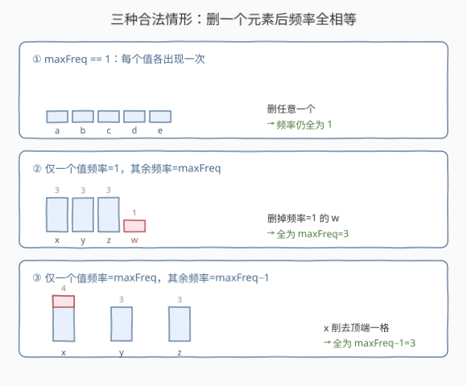
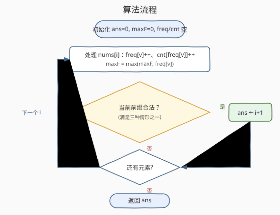
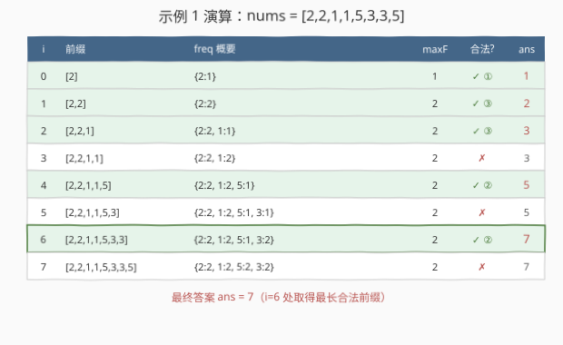

# 最大相等频率

- **题目名称**：最大相等频率
- **链接**：[1224. 最大相等频率](https://leetcode.cn/problems/maximum-equal-frequency/)
- **难度**：困难
- **标签**：数组、哈希表

## 1. 题目概述

给你一个正整数数组 `nums`，请从该数组中找出能满足下面要求的**最长**前缀，并返回该前缀的长度：

- 从前缀中**恰好删除一个**元素后，剩下每个数字的出现次数都相同。

如果删除这个元素后没有剩余元素存在，仍可认为每个数字都具有相同的出现次数（也就是 0 次）。

**示例 1**：

```text
输入：nums = [2,2,1,1,5,3,3,5]
输出：7
解释：长度为 7 的前缀 [2,2,1,1,5,3,3]，删去 5 后得到 [2,2,1,1,3,3]，每个数字都出现 2 次。
```

**示例 2**：

```text
输入：nums = [1,1,1,2,2,2,3,3,3,4,4,4,5]
输出：13
解释：整个数组，删去 5 后每个数字都出现 3 次。
```

**约束条件**：

- `2 <= nums.length <= 10^5`
- `1 <= nums[i] <= 10^5`

---

## 2. 解题思路

### 2.1 暴力思路

枚举每个前缀 `nums[0..i]`，对每个前缀再枚举删去哪一个元素，统计剩余数字的出现次数是否全相等。时间复杂度至少 $O(n^2)$，而 $n$ 可达 $10^5$，必然超时。

需要一种**在线维护、单次遍历**的判定方法。

### 2.2 核心观察：维护 freq 与 count 两张哈希表



在从左到右扫描时，同时维护两张哈希表：

- $\text{freq}[x]$：值 $x$ 在当前前缀中的出现次数；
- $\text{count}[f]$：出现次数恰好为 $f$ 的**不同值的个数**；
- $\text{maxF}$：当前前缀中的最大频率。

对于长度为 $i+1$ 的前缀，"删去一个元素后所有频率相等"只有以下三种情形（见上图）：

- **情形 ①**：$\text{maxF} == 1$。每个值各出现一次，删任意一个，剩余频率仍全为 1。
- **情形 ②**：恰有一个值频率为 1，其余值频率均为 $\text{maxF}$。删掉那个频率为 1 的值即可。
  判定：$\text{count}[1] == 1$ 且 $\text{count}[\text{maxF}]\cdot \text{maxF} + 1 == i+1$。
- **情形 ③**：恰有一个值频率为 $\text{maxF}$，其余值频率均为 $\text{maxF}-1$。从那个最大频率值削去一次即可。
  判定：$\text{count}[\text{maxF}] == 1$ 且 $\text{count}[\text{maxF}-1]\cdot(\text{maxF}-1) + \text{maxF} == i+1$。

> 💡 **关键观察**：删除一个元素只会让某个值的频率减 1（或归零）。因此"频率全等"的终态只能由上述三种局部变化达到——其余情形必不合法（证明见第 5 节）。

满足任一情形，即更新 $\text{ans} = i+1$。由于 $i$ 递增，最后记录的 `ans` 即为最长合法前缀长度。

### 2.3 算法流程图



### 2.4 示例演算

以示例 1 `nums = [2,2,1,1,5,3,3,5]` 为例逐步演算（绿色行表示当前前缀合法，`ans` 红色加粗表示在该步被更新）：



可以看到 `ans` 在 $i=0,1,2,4,6$ 处依次更新为 $1,2,3,5,7$，最终答案为 **7**。

---

## 3. 参考代码

### C++

```cpp
class Solution {
public:
    int maxEqualFreq(vector<int>& nums) {
        unordered_map<int,int> freq, cnt;
        int maxF = 0, ans = 0;
        for (int i = 0; i < (int)nums.size(); ++i) {
            int v = nums[i];
            if (freq[v] > 0) cnt[freq[v]]--;     // 离开旧频率
            freq[v]++;
            cnt[freq[v]]++;                      // 进入新频率
            maxF = max(maxF, freq[v]);

            int len = i + 1;
            bool ok = false;
            if (maxF == 1) {
                ok = true;                       // 情形 ①
            } else if (cnt[maxF] == 1 &&
                       cnt[maxF - 1] * (maxF - 1) + maxF == len) {
                ok = true;                       // 情形 ③
            } else if (cnt[1] == 1 &&
                       cnt[maxF] * maxF + 1 == len) {
                ok = true;                       // 情形 ②
            }

            if (ok) ans = len;
        }
        return ans;
    }
};
```

### Python

```python
class Solution:
    def maxEqualFreq(self, nums: List[int]) -> int:
        freq = {}
        cnt = {}
        max_f = 0
        ans = 0
        for i, v in enumerate(nums):
            old = freq.get(v, 0)
            if old > 0:
                cnt[old] -= 1                    # 离开旧频率
            new = old + 1
            freq[v] = new
            cnt[new] = cnt.get(new, 0) + 1       # 进入新频率
            max_f = max(max_f, new)

            length = i + 1
            if max_f == 1:                       # 情形 ①
                ok = True
            elif cnt.get(max_f, 0) == 1 and \
                 cnt.get(max_f - 1, 0) * (max_f - 1) + max_f == length:
                ok = True                        # 情形 ③
            elif cnt.get(1, 0) == 1 and \
                 cnt.get(max_f, 0) * max_f + 1 == length:
                ok = True                        # 情形 ②
            else:
                ok = False

            if ok:
                ans = length
        return ans
```

---

## 4. 复杂度分析

| 维度 | 复杂度 | 说明 |
|------|--------|------|
| 时间复杂度 | $O(n)$ | 单次遍历，每步哈希表增删均为摊还 $O(1)$ |
| 空间复杂度 | $O(n)$ | `freq` / `cnt` 最多各存 $O(n)$ 级条目 |

---

## 5. 扩展：为何只需检查这三种情形（简要证明）

设删除一个元素后，所有剩余值的频率均为 $k$（$k \ge 0$）。被删元素原频率记为 $f$：

- **若 $f = 1$（被删值消失）**：其余值频率不变，必须全部等于 $k$。又其余值最大频率为 $\text{maxF}$，故 $k = \text{maxF}$，且只能有一个频率为 1 的值（即被删者），其余全为 $\text{maxF}$ —— 即**情形 ②**。
  - 特例：若所有值频率都为 1（$\text{maxF} = 1$），删任意一个后其余频率仍为 1 —— 即**情形 ①**。
- **若 $f \ge 2$（被删值不消失）**：被删值频率降为 $f - 1 = k$，其余值频率不变也必须等于 $k$。
  - 若 $f = \text{maxF}$：则 $k = \text{maxF} - 1$，其余值必须全为 $\text{maxF} - 1$ —— 即**情形 ③**。
  - 若 $f < \text{maxF}$：其余值中存在频率为 $\text{maxF}$ 的值，要求 $k = \text{maxF}$；但被删值降为 $f - 1 < \text{maxF} - 1 < \text{maxF} = k$，矛盾，不可能。

故三种情形已穷尽所有可能。

---

## 6. 面试要点

1. **为什么要同时维护 freq 和 count 两张表？**
   - `freq` 记录每个值的频率；`count` 反向记录"频率 → 该频率的值个数"，使得判定 `count[maxF] == 1` 等条件在 $O(1)$ 完成，避免每次再扫一遍频率表。

2. **三种合法情形会不会遗漏？**
   - 不会。删除只让某值频率减 1 或归零，可证明（第 5 节）频率全等的终态只能由这三种局部变化产生。

3. **`count[maxF-1]` 在 `maxF == 1` 时会不会越界？**
   - 不会。`maxF == 1` 时由情形 ① 直接判定合法，根本不会走到情形 ③ 的 `maxF - 1 == 0` 分支。

4. **为什么答案是"最后一个合法前缀"而非额外求最大？**
   - 遍历中每次合法即更新 `ans = i + 1`，而 $i$ 严格递增，所以最后记录的一定是最大长度，无需额外比较。

5. **若改成"删一个元素后频率全等的最长子数组（不限定前缀）"该怎么做？**
   - 难度大增：需要滑动窗口并动态维护 freq/count/maxF 与窗口缩减逻辑，本题的单遍 $O(n)$ 不再直接适用。

---

## 7. 同类练习题

- [1207. 独一无二的出现次数](https://leetcode.cn/problems/unique-number-of-occurrences/)（[题解](../1201-1300/1207_独一无二的出现次数.md)）：频率统计后判断频率是否互异，频次哈希基础
- [2423. 删除字符使频率相等](https://leetcode.cn/problems/remove-letter-to-equalize-frequency/)：本题近亲——只判定整个串能否删一个字符使频率相等，不求最长前缀
- [1748. 唯一元素的和](https://leetcode.cn/problems/sum-of-unique-elements/)：频率统计求和，`freq` 表基础应用
- [2287. 重排字符形成目标字符串](https://leetcode.cn/problems/rearrange-characters-to-make-target-string/)：频率比较判定可重排次数
