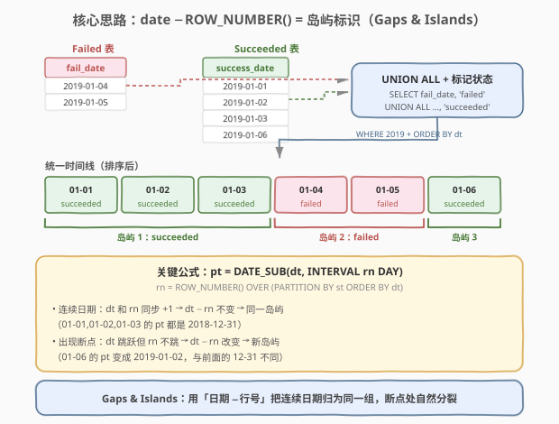
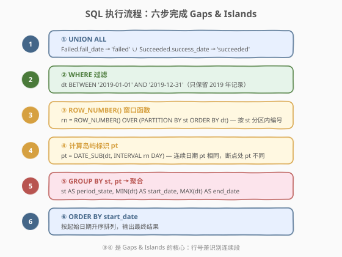
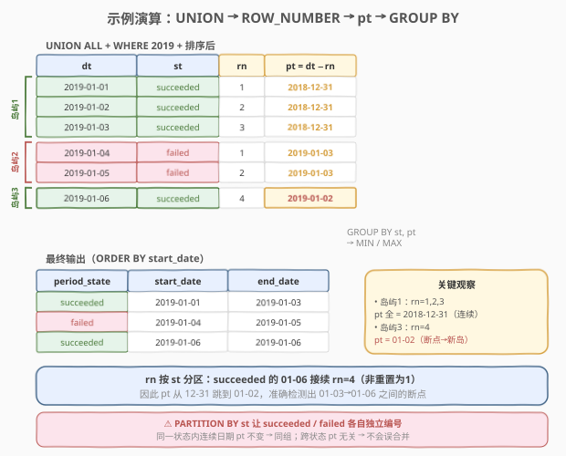

# 报告系统状态的连续日期

- **题目名称**：报告系统状态的连续日期
- **链接**：[1225. 报告系统状态的连续日期](https://leetcode.cn/problems/report-contiguous-dates/)
- **难度**：困难
- **标签**：数据库、SQL、窗口函数、Gaps & Islands、GROUP BY

## 1. 题目概述

系统每天运行一个任务，状态为**失败**或**成功**。给定两张表：

- **`Failed`** 表：记录失败任务发生的日期。

| 列名 | 类型 | 说明 |
|------|------|------|
| `fail_date` | date | 主键，失败日期 |

- **`Succeeded`** 表：记录成功任务发生的日期。

| 列名 | 类型 | 说明 |
|------|------|------|
| `success_date` | date | 主键，成功日期 |

**任务**：找出 **2019-01-01** 到 **2019-12-31** 期间，任务连续同状态 `period_state`（`'succeeded'` 或 `'failed'`）的起止日期（`start_date` 和 `end_date`）。结果按 `start_date` 升序排列。

**示例 1**：

```text
输入：
Failed 表：
+-------------------+
| fail_date         |
+-------------------+
| 2018-12-28        |
| 2018-12-29        |
| 2019-01-04        |
| 2019-01-05        |
+-------------------+
Succeeded 表：
+-------------------+
| success_date      |
+-------------------+
| 2018-12-30        |
| 2018-12-31        |
| 2019-01-01        |
| 2019-01-02        |
| 2019-01-03        |
| 2019-01-06        |
+-------------------+

输出：
+--------------+------------+------------+
| period_state | start_date | end_date   |
+--------------+------------+------------+
| succeeded    | 2019-01-01 | 2019-01-03 |
| failed       | 2019-01-04 | 2019-01-05 |
| succeeded    | 2019-01-06 | 2019-01-06 |
+--------------+------------+------------+
```

**解释**：结果忽略 2018 年的记录。2019-01-01 至 01-03 连续成功，01-04 至 01-05 连续失败，01-06 单独成功。

> 💡 本题是经典的 **Gaps & Islands（间隙与岛屿）** 问题——需要把排序后的日期序列中**连续同状态的段**识别为一组（岛屿），每段输出起止日期。核心技巧是用窗口函数 `ROW_NUMBER()` 与日期做差，让连续日期获得相同的「岛屿标识」，再用 `GROUP BY` 聚合取 `MIN/MAX`。

---

## 2. 解题思路

### 2.1 暴力思路：逐行扫描判断连续

直觉思路：把两张表 UNION 起来按日期排序，然后逐行扫描——如果当前行的状态与前一行相同且日期相差一天，则属于同一段；否则开始新段。记录每段的起始和结束日期。

但**纯 SQL 没有显式的逐行循环**，这种「看前一行」的逻辑需要换成集合式表达。可以用 `LAG()` 窗口函数取前一行的状态和日期来判定断点，但实现起来嵌套层级多、可读性差。更优雅的方案是经典的 **Gaps & Islands** 模式。

### 2.2 核心观察：date − ROW_NUMBER() = 岛屿标识



**关键洞察**：将两张表 `UNION ALL` 合并为一个统一视图（每行带 `dt` 日期和 `st` 状态标签），按日期排序后，对每个状态分区内用 `ROW_NUMBER()` 编号。此时：

$$
\text{pt} = \text{DATE\_SUB}(\text{dt},\; \text{INTERVAL}\;\text{rn}\;\text{DAY})
$$

其中 $\text{rn} = \text{ROW\_NUMBER}() \;\text{OVER}\;(\text{PARTITION BY st ORDER BY dt})$。

**为什么这个差值能识别连续段？**

- **连续日期**：日期 `dt` 每天递增 1，行号 `rn` 也递增 1 → $\text{dt} - \text{rn}$ **不变** → 同一岛屿
- **出现断点**：日期跳跃（如从 01-03 跳到 01-06），但 `rn` 只递增 1 → $\text{dt} - \text{rn}$ **改变** → 新岛屿

以示例数据为例（只看 2019 年）：

| dt | st | rn | pt = dt − rn |
|----|-----|-----|-------------|
| 2019-01-01 | succeeded | 1 | 2018-12-31 |
| 2019-01-02 | succeeded | 2 | 2018-12-31 |
| 2019-01-03 | succeeded | 3 | 2018-12-31 |
| 2019-01-04 | failed | 1 | 2019-01-03 |
| 2019-01-05 | failed | 2 | 2019-01-03 |
| 2019-01-06 | succeeded | 4 | 2019-01-02 |

前 3 行 succeeded 的 `pt` 都是 `2018-12-31`（同一岛屿）；01-04 和 01-05 的 `pt` 都是 `2019-01-03`（同一岛屿）；01-06 的 `pt` 变成 `2019-01-02`（新岛屿）。

> 💡 **为什么 `rn` 要 `PARTITION BY st`？** 因为 succeeded 和 failed 是两套独立的编号体系。如果不分区，所有日期混在一起编号，差值会被另一种状态的行干扰。分区后，每种状态在各自的时间线上独立检测连续性。

> ⚠️ **`ROW_NUMBER()` vs `RANK()`**：本题中两表的日期列都是主键（唯一），且一个日期不可能同时出现在两张表中（一天要么成功要么失败），因此不存在并列。`ROW_NUMBER()` 与 `RANK()` 结果相同。但 `ROW_NUMBER()` 是 Gaps & Islands 的标准选择——若有并列日期，`RANK()` 会给相同日期相同的行号，破坏差值的单调性，导致连续检测出错。

### 2.3 算法流程图



**完整步骤**：

1. **UNION ALL**：合并 `Failed`（标记 `'failed'`）和 `Succeeded`（标记 `'succeeded'`），统一为 `(dt, st)` 视图
2. **WHERE 过滤**：只保留 `dt BETWEEN '2019-01-01' AND '2019-12-31'` 的记录
3. **ROW_NUMBER()**：`rn = ROW_NUMBER() OVER (PARTITION BY st ORDER BY dt)`，按状态分区内按日期编号
4. **计算岛屿标识**：`pt = DATE_SUB(dt, INTERVAL rn DAY)`
5. **GROUP BY 聚合**：按 `st, pt` 分组，取 `MIN(dt) AS start_date`、`MAX(dt) AS end_date`
6. **ORDER BY**：按 `start_date` 升序输出

> 💡 **SQL 子句执行顺序**：`FROM`（含 `WHERE`）→ 窗口函数（`SELECT` 中的 `OVER`）→ `GROUP BY` → `HAVING` → `SELECT` → `ORDER BY`。步骤 ③④ 的窗口函数在 `GROUP BY` 之前执行，必须包在子查询/CTE 中，外层再做 `GROUP BY`。

### 2.4 示例演算

以示例 1 数据为例，完整的 UNION → 窗口函数 → 分组聚合过程如下：



**第一步：UNION ALL + WHERE 2019 + 排序**

过滤掉 2018 年的记录后，2019 年共 6 天，按日期排序：

| dt | st |
|----|-----|
| 2019-01-01 | succeeded |
| 2019-01-02 | succeeded |
| 2019-01-03 | succeeded |
| 2019-01-04 | failed |
| 2019-01-05 | failed |
| 2019-01-06 | succeeded |

**第二步：ROW_NUMBER() PARTITION BY st ORDER BY dt**

succeeded 分区：01-01→rn=1, 01-02→rn=2, 01-03→rn=3, 01-06→rn=4

failed 分区：01-04→rn=1, 01-05→rn=2

> ⚠️ 注意 01-06 的 rn=**4**（不是 1），因为它在 succeeded 分区内接续编号。这正是检测断点的关键——01-03 到 01-06 之间隔了两天（01-04、01-05 是 failed），rn 只增加了 1（从 3 到 4），而日期增加了 3 天，所以 `pt` 从 `2018-12-31` 跳到 `2019-01-02`。

**第三步：计算 pt = DATE_SUB(dt, INTERVAL rn DAY)**

| dt | st | rn | pt |
|----|-----|-----|-----|
| 2019-01-01 | succeeded | 1 | **2018-12-31** |
| 2019-01-02 | succeeded | 2 | **2018-12-31** |
| 2019-01-03 | succeeded | 3 | **2018-12-31** |
| 2019-01-04 | failed | 1 | **2019-01-03** |
| 2019-01-05 | failed | 2 | **2019-01-03** |
| 2019-01-06 | succeeded | 4 | **2019-01-02** |

**第四步：GROUP BY st, pt → MIN/MAX**

| 分组 (st, pt) | 行 | start_date = MIN(dt) | end_date = MAX(dt) |
|---------------|-----|----------------------|---------------------|
| (succeeded, 2018-12-31) | 01-01, 01-02, 01-03 | 2019-01-01 | 2019-01-03 |
| (failed, 2019-01-03) | 01-04, 01-05 | 2019-01-04 | 2019-01-05 |
| (succeeded, 2019-01-02) | 01-06 | 2019-01-06 | 2019-01-06 |

**第五步：ORDER BY start_date** → 最终输出 3 行，与预期一致。

> 💡 **01-06 为什么单独成岛？** 因为 succeeded 分区中，01-03 的 rn=3、pt=12-31，而 01-06 的 rn=4、pt=01-02。两者 pt 不同，说明中间有断点（01-04、01-05 属于 failed），因此 01-06 开启新的一段。即使只有一天，也是一个合法的「连续段」。

---

## 3. 参考代码

### MySQL（解法 A：ROW_NUMBER + DATE_SUB，推荐）

```sql
# 1225. 报告系统状态的连续日期
# 思路：UNION ALL 合并两表 → ROW_NUMBER 按 st 分区 → dt − rn = 岛屿标识 → GROUP BY 取 MIN/MAX
WITH
    T AS (
        SELECT fail_date AS dt, 'failed' AS st
        FROM Failed
        WHERE fail_date BETWEEN '2019-01-01' AND '2019-12-31'
        UNION ALL
        SELECT success_date AS dt, 'succeeded' AS st
        FROM Succeeded
        WHERE success_date BETWEEN '2019-01-01' AND '2019-12-31'
    ),
    Ranked AS (
        SELECT
            dt,
            st,
            ROW_NUMBER() OVER (PARTITION BY st ORDER BY dt) AS rn
        FROM T
    )
SELECT
    st AS period_state,
    MIN(dt) AS start_date,
    MAX(dt) AS end_date
FROM Ranked
GROUP BY st, DATE_SUB(dt, INTERVAL rn DAY)
ORDER BY start_date;
```

> 💡 **实现细节**：
> - **`UNION ALL`（而非 `UNION`）**：两表日期不重叠（一天要么成功要么失败），无需去重，`UNION ALL` 省去排序开销。
> - **`WHERE` 在 `UNION ALL` 的每个分支内**：先过滤再合并，减少中间数据量。也可在外层统一过滤，但分支内过滤更高效。
> - **`PARTITION BY st`**：succeeded 和 failed 各自独立编号，互不干扰。
> - **`GROUP BY st, DATE_SUB(dt, INTERVAL rn DAY)`**：直接在 `GROUP BY` 中计算岛屿标识，无需额外列。
> - **`ORDER BY start_date`**：题目要求按起始日期排序。

### MySQL（解法 B：SUBDATE + RANK，紧凑写法）

```sql
WITH
    T AS (
        SELECT fail_date AS dt, 'failed' AS st
        FROM Failed
        WHERE YEAR(fail_date) = 2019
        UNION ALL
        SELECT success_date AS dt, 'succeeded' AS st
        FROM Succeeded
        WHERE YEAR(success_date) = 2019
    )
SELECT
    st AS period_state,
    MIN(dt) AS start_date,
    MAX(dt) AS end_date
FROM (
    SELECT
        *,
        SUBDATE(dt, RANK() OVER (PARTITION BY st ORDER BY dt)) AS pt
    FROM T
) AS t
GROUP BY 1, pt
ORDER BY 2;
```

> 💡 **与解法 A 的区别**：
> - 用 `SUBDATE(dt, RANK() OVER (...))` 一步算出岛屿标识 `pt`，再在 `GROUP BY 1, pt` 中引用。`SUBDATE(date, N)` 等价于 `DATE_SUB(date, INTERVAL N DAY)`。
> - `RANK()` 替代 `ROW_NUMBER()`——本题无并列日期，两者等价。但若有并列，`RANK()` 会给相同日期相同的序号，破坏差值单调性。`ROW_NUMBER()` 更安全。
> - `YEAR(fail_date) = 2019` 替代 `BETWEEN`——更简洁，但会匹配 2019 年所有日期（与 `BETWEEN '2019-01-01' AND '2019-12-31'` 等价）。
> - `GROUP BY 1, pt` 按列位置分组，`1` 指代 `st`。

### Python（pandas）

```python
import pandas as pd

def report_contiguous_dates(failed: pd.DataFrame, succeeded: pd.DataFrame) -> pd.DataFrame:
    failed['dt'] = failed['fail_date']
    failed['st'] = 'failed'
    succeeded['dt'] = succeeded['success_date']
    succeeded['st'] = 'succeeded'

    df = pd.concat([failed[['dt', 'st']], succeeded[['dt', 'st']]], ignore_index=True)
    df = df[(df['dt'] >= '2019-01-01') & (df['dt'] <= '2019-12-31')]
    df = df.sort_values('dt').reset_index(drop=True)
    df['rn'] = df.groupby('st')['dt'].rank(method='first').astype(int)
    df['pt'] = df['dt'] - pd.to_timedelta(df['rn'] - 1, unit='D')

    result = df.groupby(['st', 'pt']).agg(
        start_date=('dt', 'min'),
        end_date=('dt', 'max')
    ).reset_index()
    result = result.rename(columns={'st': 'period_state'})
    result = result.sort_values('start_date').reset_index(drop=True)
    return result[['period_state', 'start_date', 'end_date']]
```

> 💡 **pandas 对照**：
> - `pd.concat` 对应 `UNION ALL`。
> - `df.groupby('st')['dt'].rank(method='first')` 对应 `ROW_NUMBER() OVER (PARTITION BY st ORDER BY dt)`——`method='first'` 保证无并列（等价 `ROW_NUMBER`）。
> - `pd.to_timedelta(rn - 1, unit='D')` 对应 `DATE_SUB(dt, INTERVAL rn DAY)`——pandas 中用 `rn-1` 是因为 rank 从 1 开始，减去 `(rn-1)` 天后连续日期的 pt 相同。
> - `groupby(['st', 'pt']).agg(min, max)` 对应 `GROUP BY st, pt` + `MIN/MAX`。

---

## 4. 复杂度分析

| 维度 | 复杂度 | 说明 |
|------|--------|------|
| **时间** | $O(N \log N)$ | $N$ = 两表合并后的总行数；窗口函数 `ROW_NUMBER` 需要按 `(st, dt)` 排序 $O(N \log N)$，`GROUP BY` 聚合 $O(N)$，总计 $O(N \log N)$ |
| **空间** | $O(N)$ | CTE `T` 和 `Ranked` 物化中间结果，大小为过滤后的行数 |
| **排序开销** | $O(N \log N)$ | 窗口函数的 `ORDER BY dt` 是主要开销；若日期已有索引可降为 $O(N)$ |

> ⚠️ 若 `fail_date` 和 `success_date` 上均有主键索引（题目约束为主键），且数据按日期有序存储，窗口函数的排序可利用索引顺序，实际开销接近线性。但 MySQL 8.x 的窗口函数实现通常仍需显式排序。

---

## 5. 扩展：Gaps & Islands 模式与变体

### 5.1 Gaps & Islands 的通用模板

Gaps & Islands 是 SQL 中处理「连续段识别」的经典范式，模板如下：

```sql
-- 通用模板：识别连续段
WITH Ranked AS (
    SELECT
        *,
        ROW_NUMBER() OVER (PARTITION BY <分组列> ORDER BY <排序列>) AS rn
    FROM <表>
    WHERE <过滤条件>
)
SELECT
    <分组列>,
    MIN(<排序列>) AS start_val,
    MAX(<排序列>) AS end_val
FROM Ranked
GROUP BY <分组列>, <排序列> - rn   -- 差值作为岛屿标识
ORDER BY start_val;
```

**适用场景**：
- 连续日期/数字段识别（本题）
- 连续登录天数统计
- 连续相同状态的会话分段
- 座位分配中的连续空位查找

> 💡 **核心不变量**：当 `<排序列>` 是等差数列（步长恒定）时，`<排序列> - rn` 在连续段内恒定。一旦出现间隔，差值改变，自然分裂为新段。

### 5.2 LAG() 替代方案

除 `ROW_NUMBER()` 差值法外，也可用 `LAG()` 窗口函数逐行检测断点：

```sql
WITH
    T AS (
        SELECT fail_date AS dt, 'failed' AS st
        FROM Failed
        WHERE YEAR(fail_date) = 2019
        UNION ALL
        SELECT success_date AS dt, 'succeeded' AS st
        FROM Succeeded
        WHERE YEAR(success_date) = 2019
    ),
    Lagged AS (
        SELECT
            dt,
            st,
            LAG(dt) OVER (ORDER BY dt) AS prev_dt,
            LAG(st) OVER (ORDER BY dt) AS prev_st
        FROM T
    ),
    Marked AS (
        SELECT
            dt,
            st,
            SUM(
                CASE
                    WHEN prev_st = st AND DATEDIFF(dt, prev_dt) = 1 THEN 0
                    ELSE 1
                END
            ) OVER (ORDER BY dt) AS island_id
        FROM Lagged
    )
SELECT
    st AS period_state,
    MIN(dt) AS start_date,
    MAX(dt) AS end_date
FROM Marked
GROUP BY st, island_id
ORDER BY start_date;
```

> ⚠️ `LAG()` 方案逻辑更直观（「与前一天比，状态相同且差一天→同段，否则新段」），但需要两层嵌套（`LAG` + 累计 `SUM`），代码量更大。`ROW_NUMBER()` 差值法只需一层窗口函数，更简洁。

### 5.3 非日期类型的 Gaps & Islands

| 场景 | 排序列 | 岛屿标识 | 示例题 |
|------|--------|---------|--------|
| 连续日期（本题） | date | `DATE_SUB(dt, INTERVAL rn DAY)` | 1225 |
| 连续整数 ID | int | `id - rn` | [1285. 找到连续区间的开始和结束数字](https://leetcode.cn/problems/find-the-start-and-end-number-of-continuous-ranges/) |
| 连续登录天数 | timestamp | `DATE_SUB(login_date, INTERVAL rn DAY)` | [601. 体育馆的人流量](https://leetcode.cn/problems/human-traffic-of-stadium/) |
| 连续相同状态 | int + 状态 | `id - rn`（按状态分区） | 席位/资源连续分配 |

> 💡 无论排序列是日期、整数还是时间戳，只要满足「连续 = 步长恒定」的前提，`排序列 - rn` 都能识别岛屿。

---

## 6. 面试要点

1. **为什么 `date - ROW_NUMBER()` 能识别连续日期段？**

   > 对于按日期排序的序列，`ROW_NUMBER()` 每行递增 1。如果日期也每天递增 1（连续），则 `date - rn` 保持不变——因为两者同步增长。一旦出现间隔（日期跳跃但 rn 只 +1），差值改变，标志新段开始。同一差值的行属于同一连续段。

2. **为什么 `PARTITION BY st` 是必要的？**

   > succeeded 和 failed 是两套独立的日期序列。如果不分区，所有日期混在一起编号，failed 的行会打断 succeeded 的连续编号，导致差值失真。分区后每种状态在各自的时间线上独立编号，互不干扰。同一日期不可能同时属于两种状态（一天要么成功要么失败），所以分区不会遗漏任何日期。

3. **`ROW_NUMBER()` 和 `RANK()` 在本题中有什么区别？**

   > 本题中两表日期列都是主键（唯一），且日期不跨表重复，因此没有并列，`ROW_NUMBER()` = `RANK()`，两者均可通过。但 `ROW_NUMBER()` 是 Gaps & Islands 的标准选择——若有并列日期，`RANK()` 给相同日期相同的序号，破坏差值的单调递增性，导致连续检测出错。`ROW_NUMBER()` 保证序号严格递增，永远安全。

4. **为什么用 `UNION ALL` 而不是 `UNION`？**

   > `UNION` 会排序去重，开销 $O(N \log N)$；`UNION ALL` 直接拼接，开销 $O(1)$。本题中一个日期不可能同时出现在 Failed 和 Succeeded 表中（一天只跑一个任务，状态唯一），不存在重复行，因此 `UNION ALL` 是安全的且更快。

5. **如果要统计每段的连续天数，怎么做？**

   > 在最终 `SELECT` 中加一列 `DATEDIFF(MAX(dt), MIN(dt)) + 1 AS days`。`+1` 是因为起止日期都包含在内（如 01-01 到 01-03 是 3 天）。也可用 `COUNT(*)` 代替——因为段内每个日期占一行，行数即为天数。

> 💡 **一句话总结**：1225 是 SQL **Gaps & Islands 招牌题**——`UNION ALL` 合并两表后，用 `ROW_NUMBER() OVER (PARTITION BY st ORDER BY dt)` 编号，`DATE_SUB(dt, INTERVAL rn DAY)` 算岛屿标识，`GROUP BY st, pt` 取 `MIN/MAX` 即得每段起止日期。核心不变量：连续日期 `dt-rn` 不变，断点处 `dt-rn` 跳变。这套模板适用于所有「连续段识别」类 SQL 题。

---

## 7. 同类练习题

- [1285. 找到连续区间的开始和结束数字](https://leetcode.cn/problems/find-the-start-and-end-number-of-continuous-ranges/)：Gaps & Islands 基础题，整数列 `id - rn` 识别连续区间，比本题更简单（无状态分区）
- [601. 体育馆的人流量](https://leetcode.cn/problems/human-traffic-of-stadium/)：连续天数检测，`LAG()` 方案的典型题，与本题的 `ROW_NUMBER()` 方案互为参照
- [180. 连续出现的数字](https://leetcode.cn/problems/consecutive-numbers/)：连续相同值检测，可用 `LAG()` 或自连接，是 Gaps & Islands 的入门版
- [1205. 每月交易 II](https://leetcode.cn/problems/monthly-transactions-ii/)（[题解](1205_每月交易II.md)）：`UNION ALL` 合并两类记录的技巧，与本题第一步相同，但聚合维度不同
- [1454. 活跃用户](https://leetcode.cn/problems/active-users/)：连续登录天数判定，`DATE_SUB(login_date, INTERVAL rn DAY)` 检测连续登录，与本题完全同模板
