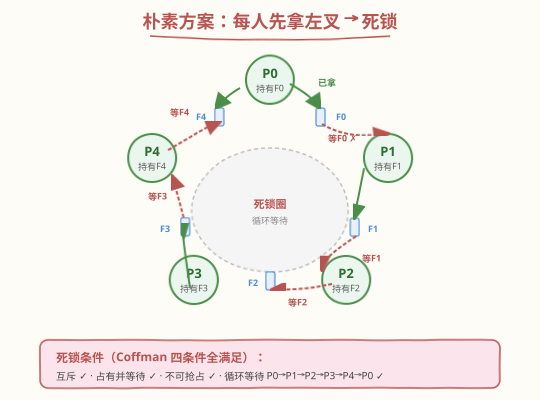
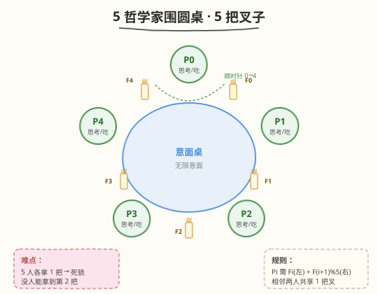
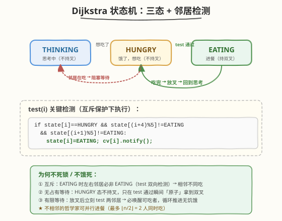

# 哲学家进餐

- **题目名称**：哲学家进餐
- **链接**：[1226. 哲学家进餐](https://leetcode.cn/problems/the-dining-philosophers/)
- **难度**：中等
- **标签**：并发、互斥、死锁、信号量、条件变量

## 1. 题目概述

5 个沉默的哲学家围坐在圆桌前，每人面前一盘意面。叉子放在相邻哲学家之间的桌面上（共 5 把叉子）。每位哲学家只在**思考**和**进餐**两种状态间交替：

- 必须**同时**拿到左边和右边的叉子才能吃面；
- 同一把叉子同一时刻只能被一人使用；
- 吃完后必须放下两把叉子供他人使用；
- 只要条件允许，可以先拿左叉或先拿右叉，但未同时拿到两把时不能进食。

要求设计一个并行规则，使得**每个哲学家都不会挨饿**——在无人知晓他人何时想吃的情况下，每个哲学家都能在吃饭与思考间无限交替。

哲学家按**顺时针**编号 $0 \sim 4$。需实现：

```cpp
void wantsToEat(int philosopher,
                function<void()> pickLeftFork,
                function<void()> pickRightFork,
                function<void()> eat,
                function<void()> putLeftFork,
                function<void()> putRightFork);
```

5 个线程分别代表 5 个哲学家，共用同一个类的实例。`wantsToEat` 可能对同一哲学家被多次调用。

**输出格式**：每次调用产生的行为序列形如 `[哲学家编号, 叉子, 动作]`，其中叉子 `{1: 左, 2: 右}`，动作 `{1: 拿起, 2: 放下, 3: 吃面}`。

**约束条件**：

- `1 <= n <= 60`（`n` 为每个哲学家需进餐的次数）

---

## 2. 解题思路

### 2.1 暴力思路：每人先拿左叉再拿右叉

最直白的方案：每位哲学家都「先拿左叉，再拿右叉，吃完放叉」。这在大多数时候能正常工作，但存在致命隐患。



设想 5 位哲学家**同一时刻**都饿了，各自先拿起左叉：

- P0 拿 F0、P1 拿 F1、P2 拿 F2、P3 拿 F3、P4 拿 F4；
- 此时 5 把叉子全部被占用，每人都在等待右边那把叉子；
- 没有人会主动放叉 → **永久死锁**。

这恰好满足了 Coffman 死锁四条件：**互斥**（叉子独占）、**占有并等待**（拿左叉等右叉）、**不可抢占**（不能强行夺叉）、**循环等待**（$P_0 \to P_1 \to P_2 \to P_3 \to P_4 \to P_0$）。破除其中任一条件即可消除死锁。

### 2.2 核心观察：Dijkstra 三态状态机



Dijkstra 的经典解法引入**状态机**抽象：把「拿叉」从分散的加锁动作，提升为受**管程（monitor）**统一保护的**状态迁移**。每位哲学家处于三态之一：

| 状态 | 含义 | 是否持叉 |
|------|------|----------|
| **THINKING** | 思考中 | 否 |
| **HUNGRY** | 饿了，想吃 | 否 |
| **EATING** | 进餐中 | 是（双叉） |

关键点：**HUNGRY 态不持有任何叉子**。哲学家只在 `test()` 判定「左右邻居都未在吃」的**瞬间**，由管程把状态原子地翻转为 EATING——等价于「同时拿到双叉」。这就**打破了「占有并等待」**这一死锁条件。

> 💡 **状态机 vs 直接加锁**：直接给每把叉子一把锁，哲学家自己去抢，很容易写出死锁。状态机把「能否吃」的判定权**集中**到一个互斥区里，由全局视角检查邻居状态，从根本上避免了循环等待。

约定叉子编号：哲学家 $i$ 的左叉为 $F_i$，右叉为 $F_{(i+1)\bmod 5}$。于是 $i$ 能吃当且仅当邻居 $(i-1)\bmod 5$ 与 $(i+1)\bmod 5$ 都不是 EATING。

### 2.3 算法流程图



`wantsToEat(philosopher, ...)` 的完整流程：

1. **加锁**进入管程；
2. 置 `state[i] = HUNGRY`；
3. 调用 `test(i)`：若 `state[i]==HUNGRY` 且左右邻居均非 EATING，则 `state[i]=EATING` 并唤醒 $i$ 的条件变量；
4. 若 `state[i] != EATING`，在条件变量上**等待**（释放锁睡眠，被唤醒后回到第 3 步判定）；
5. 一旦 `state[i] == EATING`，**释放锁**，依次调用 `pickLeftFork / pickRightFork / eat / putLeftFork / putRightFork` 回调（叉子已「原子」属于自己，回调仅为通知框架）；
6. **重新加锁**，置 `state[i] = THINKING`；
7. 调用 `test(左邻居)` 与 `test(右邻居)`——**放叉后立即检测邻居能否吃**，保证有限等待；
8. 释放锁，结束。

`test()` 是整个算法的灵魂：

```text
test(i):
    if state[i] == HUNGRY
       and state[(i+4) % 5] != EATING
       and state[(i+1) % 5] != EATING:
        state[i] = EATING
        cv[i].notify()      # 唤醒可能在等待的 i
```

> ⚠️ `test()` 必须在持锁时调用，且**只修改状态、发通知，不等待**——它本身不会阻塞，所以不会嵌套死锁。`notify` 唤醒的线程会在重新获锁后再次校验状态（谓词等待，防虚假唤醒）。

### 2.4 示例演算

设某时刻状态为 `[T, H, E, H, T]`（T=思考, H=饥饿, E=进餐），考察 P1 能否吃：

| 步骤 | 状态 `[P0,P1,P2,P3,P4]` | 说明 |
|------|--------------------------|------|
| 初始 | `[T, H, E, H, T]` | P2 正在吃，P1/P3 饿了 |
| P1 调 test(1) | `[T, H, E, H, T]` | 右邻居 P2=E → 不通过，P1 阻塞等待 |
| P3 调 test(3) | `[T, H, E, H, T]` | 左邻居 P2=E → 不通过，P3 阻塞等待 |
| P2 吃完 | `[T, H, T, H, T]` | P2 → THINKING，调 test(1)、test(3) |
| test(1) | `[T, E, T, H, T]` | P1 左 P0=T、右 P2=T → 通过！P1=EATING |
| test(3) | `[T, E, T, H, T]` | P3 左 P2=T、右 P4=T → 通过！P3=EATING |

> 💡 注意 P1 和 P3 **不相邻**，可**并行进餐**——这正是状态机相对「全局只许一人吃」方案的优势：并发度为 $\lfloor n/2 \rfloor = 2$。

---

## 3. 参考代码

### C++

```cpp
class DiningPhilosophers {
    enum State { THINKING, HUNGRY, EATING };
    State state[5] = {THINKING, THINKING, THINKING, THINKING, THINKING};
    mutex mtx;
    condition_variable cv[5];

    void test(int i) {
        if (state[i] == HUNGRY &&
            state[(i + 4) % 5] != EATING &&
            state[(i + 1) % 5] != EATING) {
            state[i] = EATING;
            cv[i].notify_one();
        }
    }

  public:
    DiningPhilosophers() {}

    void wantsToEat(int philosopher,
                    function<void()> pickLeftFork,
                    function<void()> pickRightFork,
                    function<void()> eat,
                    function<void()> putLeftFork,
                    function<void()> putRightFork) {
        unique_lock<mutex> lk(mtx);
        state[philosopher] = HUNGRY;
        test(philosopher);
        cv[philosopher].wait(lk, [&] {
            return state[philosopher] == EATING;
        });
        lk.unlock();

        pickLeftFork();
        pickRightFork();
        eat();
        putLeftFork();
        putRightFork();

        lk.lock();
        state[philosopher] = THINKING;
        test((philosopher + 4) % 5);
        test((philosopher + 1) % 5);
    }
};
```

### Python

```python
import threading


class DiningPhilosophers:
    def __init__(self):
        self.lock = threading.Lock()
        self.cvs = [threading.Condition(self.lock) for _ in range(5)]
        self.state = [0] * 5  # 0=THINKING, 1=HUNGRY, 2=EATING

    def _test(self, i):
        if (self.state[i] == 1
                and self.state[(i + 4) % 5] != 2
                and self.state[(i + 1) % 5] != 2):
            self.state[i] = 2
            self.cvs[i].notify()

    def wantsToEat(self, philosopher, *actions):
        # actions: pickLeftFork, pickRightFork, eat, putLeftFork, putRightFork
        with self.lock:
            self.state[philosopher] = 1
            self._test(philosopher)
            while self.state[philosopher] != 2:
                self.cvs[philosopher].wait()

        actions[0]()
        actions[1]()
        actions[2]()
        actions[3]()
        actions[4]()

        with self.lock:
            self.state[philosopher] = 0
            self._test((philosopher + 4) % 5)
            self._test((philosopher + 1) % 5)
```

---

## 4. 复杂度分析

| 维度 | 复杂度 | 说明 |
|------|--------|------|
| 时间复杂度 | $O(1)$ 每次进餐（均摊） | `test()` 仅做常数次状态判断与唤醒；等待时间取决于邻居吃饭时长，与数据规模无关 |
| 空间复杂度 | $O(n)$ | $n$ 位哲学家需 $n$ 个状态变量 + $n$ 个条件变量，本题 $n=5$ 为常数 |
| 并发度 | $\lfloor n/2 \rfloor$ | 不相邻的哲学家可同时进餐，5 人圆桌最多 2 人并行吃 |

> ⚠️ 本题是**并发正确性**问题，不涉及传统意义上的「算法复杂度」分析。核心指标是：**互斥性**（相邻不同吃）、**无死锁**、**无饥饿**（有限等待）。

---

## 5. 扩展：其他经典解法

### 5.1 限制并发度：信号量 $n-1$

```cpp
counting_semaphore<4> room(4);          // C++20
// 或用 mutex 数组模拟
void wantsToEat(int i, ...) {
    room.acquire();                     // 最多 4 人同时尝试
    fork[left].lock();  pickLeftFork();
    fork[right].lock(); pickRightFork();
    eat();
    putLeftFork();  fork[left].unlock();
    putRightFork(); fork[right].unlock();
    room.release();
}
```

5 人中最多 4 人进入「抢叉区」，必有一人能拿到双叉。**打破循环等待**（鸽巢原理：5 叉 4 人，至少一人两叉齐全）。实现最简，但并发度受限、且不保证严格公平。

### 5.2 非对称拿叉：打破对称性

奇数号哲学家先拿左叉、偶数号先拿右叉（或统一「先拿编号小的叉」）：

```python
def wantsToEat(self, philosopher, *actions):
    left, right = philosopher, (philosopher + 1) % 5
    first, second = (left, right) if philosopher % 2 == 0 else (right, left)
    self.forks[first].acquire();  self.forks[second].acquire()
    # 按真实顺序回调
    ...
    self.forks[second].release(); self.forks[first].release()
```

破坏了「所有人间同时先拿左叉」的对称局面，**破除循环等待**。无需中心协调，纯分布式，但奇偶策略需仔细对齐左右叉编号。

### 5.3 服务生（仲裁者）方案

引入一个中心「服务生」，哲学家必须先申请许可才能拿叉。服务生按请求队列分配，天然避免冲突与死锁，但**中心化**成为吞吐瓶颈，且可能引入优先级导致的饥饿（需配合公平队列）。

### 5.4 Chandy/Misra 消息传递

叉子带「脏/干净」标记，通过消息在哲学家间传递，无需共享内存。适用于**分布式系统**，是 Dijkstra 方案在无共享内存模型下的推广。

---

## 6. 面试要点

1. **朴素方案为什么会死锁？**

   5 人同时各拿左叉，5 把叉全被占，每人等右叉 → 满足 Coffman 四条件（互斥 + 占有等待 + 不可抢占 + 循环等待），永久阻塞。

2. **Dijkstra 状态机如何避免死锁？**

   HUNGRY 态**不持叉**，只有在 `test()` 判定邻居都不吃时才原子翻转为 EATING——「拿到双叉」是单一临界区内的状态变更，不存在「占一把等另一把」的占有等待，从根上破除死锁。

3. **为什么放叉后要立刻 `test` 两邻居？**

   保证**有限等待**（无饥饿）。放叉意味着邻居原本被阻塞的条件可能满足，主动检测并唤醒，避免邻居被「遗忘」而长期饥饿。这是进展性（progress）的关键。

4. **条件变量为什么要用谓词等待（`wait(lock, pred)`）？**

   防止**虚假唤醒**（spurious wakeup）。`notify` 只是提示「状态可能变了」，被唤醒后必须重新检查谓词 `state[i]==EATING`，否则可能在邻居又抢走机会时错误进餐。

5. **状态机方案 vs 信号量 $n-1$ 方案怎么选？**

   - 状态机：并发度高（$\lfloor n/2 \rfloor$ 并行吃）、无饥饿、但代码稍复杂；
   - 信号量 $n-1$：实现极简、一定无死锁，但并发度受限、不严格公平；
   - 面试中两者皆可，状态机更能展示对管程/条件变量的理解深度。

---

## 7. 同类练习题

- [1114. 按序打印](https://leetcode.cn/problems/print-in-order/)：三线程按序执行，条件变量/信号量同步入门
- [1115. 交替打印 FooBar](https://leetcode.cn/problems/print-foobar-alternately/)：两线程交替，互斥与唤醒的配合
- [1116. 打印零与奇偶数](https://leetcode.cn/problems/print-zero-even-odd/)：三线程协调，状态机思路的延伸
- [1195. 交替打印字符串](https://leetcode.cn/problems/fizz-buzz-multithreaded/)：多条件并发打印，综合同步原语
