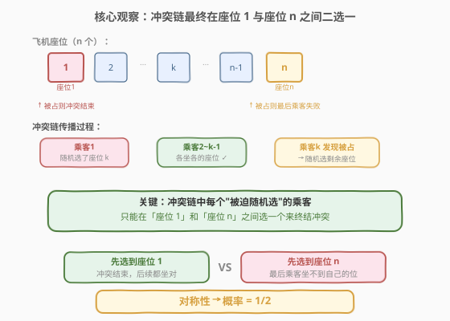
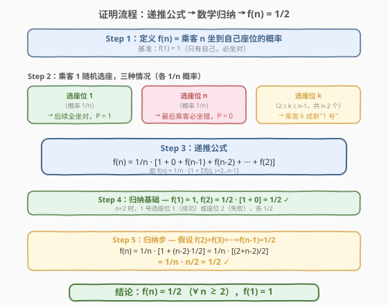
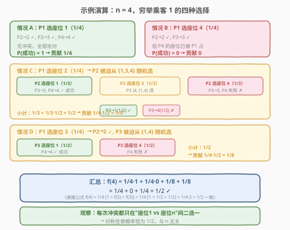

# LeetCode 飞机座位分配概率 题解

## 1. 题目概述

- **标题 / 题号**：飞机座位分配概率（#1227，medium）
- **链接**：https://leetcode.cn/problems/airplane-seat-assignment-probability/
- **难度**：中等
- **标签**：数学、动态规划、脑筋急转弯、概率与统计

**题意**：有 `n` 位乘客和 `n` 个座位（编号 `1` 到 `n`），第 `i` 位乘客的指定座位是第 `i` 号。乘客按编号 `1` 到 `n` 的顺序依次登机。

- **第 1 位乘客**丢了机票，**随机**选一个座位坐下（从 `n` 个空座中等概率选一个）。
- **第 2 ~ n 位乘客**：如果自己的指定座位还空着，就坐自己的座位；否则**随机**选一个空座。

问：第 `n` 位乘客坐到自己座位（第 `n` 号）的**概率**是多少？

**示例 1**：

```text
输入：n = 1
输出：1.00000
解释：只有 1 位乘客 1 个座位，必然坐对。
```

**示例 2**：

```text
输入：n = 2
输出：0.50000
解释：乘客 1 随机选座位 1（概率 1/2，乘客 2 坐对）或座位 2（概率 1/2，乘客 2 坐错）。
```

**示例 3**：

```text
输入：n = 3
输出：0.50000
解释：见 2.4 示例演算，结果仍为 1/2。
```

**约束**：

- `1 <= n <= 10^5`

> 💡 关键线索：虽然 `n` 可达 $10^5$，但答案与 `n` 无关——除了 $n=1$ 答案为 $1$，其余所有 $n \geq 2$ 的答案都是 $\frac{1}{2}$。这是一个经典的概率脑筋急转弯题，核心在于看出"冲突链"的对称性。

## 2. 解题思路

### 2.1 暴力思路：模拟 / 穷举所有随机选择

最直观的暴力做法是**模拟**：枚举乘客 1 的所有可能选择，对每个选择递推后续乘客的行为，直到确定乘客 `n` 是否坐对。

但问题在于随机选择会产生分支——每个"被迫随机"的乘客都有多种选择，分支树可能很深。对 $n = 4$ 还能手动穷举（见 2.4），但 $n$ 到 $10^5$ 时，状态空间指数膨胀，模拟不可行。

更关键的是：暴力思路没有抓住"冲突链"的本质——**冲突最终只在两个特殊座位之间了结**。一旦看清这一点，$10^5$ 的规模瞬间坍缩为 $O(1)$。

### 2.2 核心观察：冲突链在座位 1 与座位 n 之间二选一



定义 **"冲突链"**：乘客 1 随机选了座位 $k$（$2 \leq k \leq n-1$），则乘客 $2$ 到 $k-1$ 都能坐自己的座位（无冲突），但乘客 $k$ 到达时发现自己的座位被占了，被迫从剩余空座中随机选一个——**此时乘客 $k$ 处境与乘客 1 完全相同**。

关键洞察如下：

1. **座位 1 是"安全阀"**：一旦有人选了座位 1，冲突链立即终止——因为此后所有乘客都能找到自己的座位（没人再会发现座位被占）。
2. **座位 n 是"终结符"**：一旦有人选了座位 n，乘客 n 必然坐不到自己的座位。
3. **中间座位只是传递冲突**：选了座位 $k$（$2 \leq k \leq n-1$）只是把冲突"推迟"到乘客 $k$，不改变结局的二元性。

> ⚠️ **关键跳跃**：在任何时刻，被迫随机选座的乘客面对的剩余空座中，**座位 1 和座位 n 要么都还在、要么已被选走一个**。只要两者都还在，选到 1（冲突结束，成功）和选到 n（冲突结束，失败）的概率**完全对称**。而选到任何中间座位 $k$ 只是让冲突继续——最终必然在某个时刻有人选到 1 或 n。

因此问题的本质是：**在冲突链中，座位 1 和座位 n 谁先被选中？** 两者在每次随机选择中被选中的概率完全相等，所以答案是 $\frac{1}{2}$。

### 2.3 算法流程图：递推公式 → 数学归纳



用 $f(n)$ 表示 $n$ 位乘客时最后一位坐对的概率。乘客 1 有三种情况（各 $\frac{1}{n}$ 概率）：

| 乘客 1 选了 | 概率 | 后果 | 对 $f(n)$ 的贡献 |
|-------------|------|------|------------------|
| 座位 1 | $\frac{1}{n}$ | 无冲突，后续全坐对 | $\frac{1}{n} \times 1$ |
| 座位 n | $\frac{1}{n}$ | 乘客 n 必坐错 | $\frac{1}{n} \times 0$ |
| 座位 $k$（$2 \leq k \leq n-1$） | 各 $\frac{1}{n}$ | 乘客 $k$ 成新"1 号"，子问题规模 $n-k+1$ | $\frac{1}{n} \times f(n-k+1)$ |

> 💡 **子问题规模为什么是 $n-k+1$？** 乘客 $k$ 到达时，座位 $2$ 到 $k-1$ 已被各自的主人坐满，剩余空座为 $\{1, k+1, k+2, \ldots, n\}$，共 $n - k + 1$ 个。乘客 $k$ 的处境与乘客 1 完全同构——在这 $n-k+1$ 个座位中随机选一个。因此概率为 $f(n-k+1)$。

合并得递推公式：

$$f(n) = \frac{1}{n}\left[1 + 0 + \sum_{k=2}^{n-1} f(n-k+1)\right] = \frac{1}{n}\left[1 + \sum_{i=2}^{n-1} f(i)\right]$$

**数学归纳法证明 $f(n) = \frac{1}{2}$（$\forall n \geq 2$）**：

- **归纳基础**：$f(1) = 1$；$f(2) = \frac{1}{2}[1 + 0] = \frac{1}{2}$ ✓
- **归纳步**：假设 $f(2) = f(3) = \cdots = f(n-1) = \frac{1}{2}$，则：

$$f(n) = \frac{1}{n}\left[1 + (n-2) \cdot \frac{1}{2}\right] = \frac{1}{n} \cdot \frac{2 + n - 2}{2} = \frac{1}{n} \cdot \frac{n}{2} = \frac{1}{2} \quad \checkmark$$

归纳成立，故 $f(n) = \frac{1}{2}$ 对所有 $n \geq 2$ 成立。

### 2.4 示例演算

以 $n = 4$ 为例，穷举乘客 1 的四种选择，验证递推公式与 $\frac{1}{2}$ 的结论：



**情况 A**：P1 选座位 1（$\frac{1}{4}$）→ P2→2, P3→3, P4→4 ✓ → 贡献 $\frac{1}{4} \times 1 = \frac{1}{4}$

**情况 B**：P1 选座位 4（$\frac{1}{4}$）→ P2→2, P3→3, P4 座位被占 ✗ → 贡献 $\frac{1}{4} \times 0 = 0$

**情况 C**：P1 选座位 2（$\frac{1}{4}$）→ P2 被迫从 $\{1, 3, 4\}$ 选：
- P2 选 1（$\frac{1}{3}$）→ 成功
- P2 选 3（$\frac{1}{3}$）→ P3 从 $\{1, 4\}$ 选：选 1（$\frac{1}{2}$）成功，选 4（$\frac{1}{2}$）失败
- P2 选 4（$\frac{1}{3}$）→ 失败

小计：$\frac{1}{3} + \frac{1}{3} \times \frac{1}{2} = \frac{1}{2}$ → 贡献 $\frac{1}{4} \times \frac{1}{2} = \frac{1}{8}$

**情况 D**：P1 选座位 3（$\frac{1}{4}$）→ P2→2 ✓, P3 从 $\{1, 4\}$ 选：选 1（$\frac{1}{2}$）成功，选 4（$\frac{1}{2}$）失败

小计：$\frac{1}{2}$ → 贡献 $\frac{1}{4} \times \frac{1}{2} = \frac{1}{8}$

**汇总**：$f(4) = \frac{1}{4} + 0 + \frac{1}{8} + \frac{1}{8} = \frac{1}{2}$ ✓

与递推公式 $f(4) = \frac{1}{4}[1 + f(2) + f(3)] = \frac{1}{4}[1 + \frac{1}{2} + \frac{1}{2}] = \frac{1}{4} \times 2 = \frac{1}{2}$ 完全一致。

> 💡 **模式观察**：每次冲突都只在"座位 1 vs 座位 n"之间二选一，对称性使概率恒为 $\frac{1}{2}$，与 $n$ 无关。情况 C 中 P2 选座位 3 后 P3 面临 $\{1, 4\}$ 二选一——这正是冲突链收束到两个关键座位的缩影。

## 3. 参考代码

### C++

```cpp
class Solution {
public:
    double nthPersonGetsNthSeat(int n) {
        return n == 1 ? 1.0 : 0.5;
    }
};
```

> 💡 代码极其简洁——$n = 1$ 时答案为 $1$，$n \geq 2$ 时答案恒为 $\frac{1}{2}$。题目看似需要复杂概率计算，实则一行三目运算即可解决。这正是"脑筋急转弯"类题目的魅力：**洞察一旦到位，代码 trivial**。

### Python

```python
class Solution:
    def nthPersonGetsNthSeat(self, n: int) -> float:
        return 1.0 if n == 1 else 0.5
```

### 方法二：递推 DP（用于理解，非最优）

```cpp
class Solution {
public:
    double nthPersonGetsNthSeat(int n) {
        if (n == 1) return 1.0;
        double prev = 0.5;
        for (int i = 3; i <= n; i++) {
            double cur = 1.0 / i * (1.0 + (i - 2) * prev);
            prev = cur;
        }
        return prev;
    }
};
```

> ⚠️ 此方法按递推公式 $f(n) = \frac{1}{n}[1 + (n-2) \cdot f(n-1)]$ 逐项计算（利用归纳假设 $\sum_{i=2}^{n-1} f(i) = (n-2) \cdot f(n-1)$）。由于 $f(n) \equiv \frac{1}{2}$，每一轮 `cur` 都等于 $0.5$。虽然 $O(n)$ 时间也能通过 $n \leq 10^5$，但远不如 $O(1)$ 解法优雅，仅用于理解递推过程。

## 4. 复杂度分析

| 维度 | 复杂度 | 说明 |
|------|--------|------|
| **时间** | $O(1)$ | 直接返回 $1$ 或 $\frac{1}{2}$，与 $n$ 无关 |
| **空间** | $O(1)$ | 无额外存储 |

> ⚠️ **为什么 $O(1)$？** 因为答案只取决于 $n$ 是否等于 $1$——$n = 1$ 返回 $1$，$n \geq 2$ 返回 $\frac{1}{2}$。数学归纳已证明 $f(n) = \frac{1}{2}$ 对所有 $n \geq 2$ 成立，无需任何计算。$10^5$ 的约束只是障眼法。

## 5. 扩展：对称性证明的另一种视角

除了递推 + 归纳，还有一种更简洁的**对称性论证**：

**命题**：在冲突链的任意时刻，被迫随机选座的乘客面对的剩余空座中，座位 1 和座位 n **要么同时在场，要么已被选走一个**。

**论证**：

1. 初始时座位 1 和座位 n 都空着。
2. 冲突链中，有人选了座位 1 → 链终止，后续全坐对（成功）。有人选了座位 n → 链终止，乘客 n 失败。
3. 选了任何中间座位 $k$ → 冲突传给乘客 $k$，但座位 1 和座位 n 仍然都空着。
4. 因此，**座位 1 和座位 n 必然在同一时刻被选中**——即某次随机选择中，选座者面对的空座集合包含两者。
5. 在该次选择中，选到座位 1 和座位 n 的概率**完全相等**（都是 $\frac{1}{\text{剩余空座数}}$）。

故 $P(\text{座位 1 先被选}) = P(\text{座位 n 先被选}) = \frac{1}{2}$，而乘客 n 坐对当且仅当座位 1 先被选。

> 💡 这个对称性论证比归纳法更本质——它直接揭示了"为什么是 $\frac{1}{2}$"：因为座位 1 和座位 n 在整个过程中地位完全对等，没有任何因素偏向其中一个。归纳法只是这个对称性的形式化验证。

## 6. 面试要点

1. **为什么答案是 $\frac{1}{2}$？**

   > 冲突链中每个被迫随机选座的乘客，其选到座位 1（冲突结束，后续全坐对）和选到座位 n（乘客 n 失败）的概率完全相等。选任何中间座位只是传递冲突，不改变结局。因此最终必然在座位 1 与座位 n 之间二选一，概率 $\frac{1}{2}$。

2. **递推公式怎么来的？**

   > 乘客 1 有三种情况：选座位 1（概率 $\frac{1}{n}$，成功）、选座位 n（概率 $\frac{1}{n}$，失败）、选座位 $k$（$\frac{1}{n}$，乘客 $k$ 成新"1 号"，子问题 $f(n-k+1)$）。合并得 $f(n) = \frac{1}{n}[1 + \sum_{i=2}^{n-1} f(i)]$，用归纳法可证 $f(n) = \frac{1}{2}$。

3. **为什么子问题规模是 $n-k+1$ 而不是 $n-k$？**

   > 乘客 $k$ 到达时，座位 $2$ 到 $k-1$ 已被坐满，剩余空座为 $\{1, k+1, \ldots, n\}$，共 $n - (k-1) = n - k + 1$ 个。乘客 $k$ 在这 $n-k+1$ 个座位中随机选一个，与乘客 1 在 $n$ 个座位中选同构，故子问题规模为 $n-k+1$。

4. **$n = 10^5$ 会不会影响精度？**

   > 不会。$O(1)$ 解法直接返回 `0.5`，不涉及任何迭代或累加，完全无精度问题。即使用 $O(n)$ 递推，每一轮 $f(i)$ 都精确等于 $0.5$，也不会累积误差。

5. **这道题和普通概率题有什么不同？**

   > 普通概率题通常需要枚举样本空间或贝叶斯公式，但本题的核心是**识别对称性**——看似复杂的随机过程，本质只是一个"二选一"的对称博弈。这类"脑筋急转弯"题考察的不是计算能力，而是**化繁为简的洞察力**：能否在混乱的随机分支中看出不变的结构。

> 💡 **一句话总结**：1227 的本质是"冲突链的对称性"——座位 1（安全阀）与座位 n（终结符）在每次随机选择中地位完全对等，中间座位只传递冲突不改变结局。一旦看出这一点，$10^5$ 的规模坍缩为 $O(1)$，答案恒为 $\frac{1}{2}$。

## 同类练习题

| # | 题目 | 与本题的关联 |
|---|------|-------------|
| 剑指 Offer 46 | [把数字翻译成字符串](https://leetcode.cn/problems/ba-shu-zi-fan-yi-cheng-zi-fu-chuan-lcof/) | 递推 + 归纳发现规律，"看似需要 DP 实则可化简"的思维同类 |
| 292 | [Nim 游戏](https://leetcode.cn/problems/nim-game/) | 看似复杂的博弈问题，本质是 `n % 4` 分类，"洞察规律后 O(1)"的脑筋急转弯同类 |
| 1025 | [除数博弈](https://leetcode.cn/problems/divisor-game/) | 博弈 DP 递推后发现奇偶规律，"递推 → 归纳 → 化简"的同类思路 |
| 29 | [两数相除](https://leetcode.cn/problems/divide-two-integers/)（[题解](../0001-0100/29_两数相除.md)） | 数学洞察化繁为简，"看似复杂实则有简洁数学解"的同类 |
| 400 | [第 N 位数字](https://leetcode.cn/problems/nth-digit/)（[题解](../0301-0400/400_第N位数字.md)） | 按位数分层定位，"大数域压缩为小问题"的数学化简同类 |
