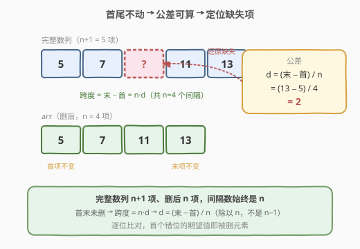
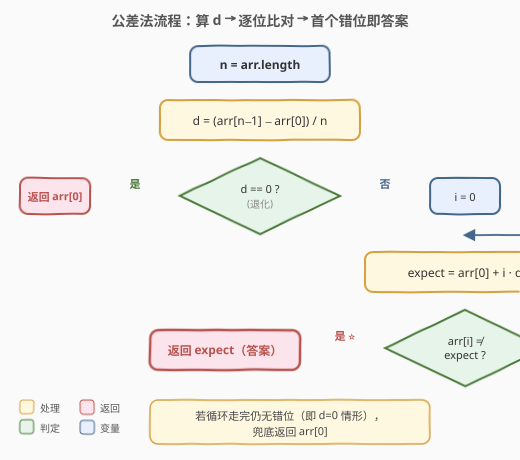
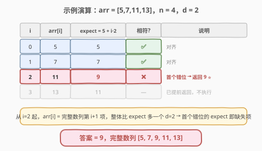

# LeetCode 等差数列中缺失的数字 题解

## 1. 题目概述

- **标题 / 题号**：等差数列中缺失的数字（#1228，easy）
- **链接**：https://leetcode.cn/problems/missing-number-in-arithmetic-progression/
- **难度**：简单
- **标签**：数组、数学

**题意**：现有数组 `arr`，它**原本是一个完整的等差数列**：相邻两项之差为常数 `d`（数列可递增也可递减）。后来有人从中**恰好删除了一个元素**，且被删除的元素**不是首项也不是末项**。请你返回被删除的那个元素。

换句话说，`arr` 是某个长度为 `n+1` 的等差数列去掉一个**内部项**后剩下的 `n` 项，首尾保持原样。

**示例 1**：

```text
输入：arr = [5,7,11,13]
输出：9
解释：完整数列为 [5,7,9,11,13]，公差 d=2，删除了 9。
```

**示例 2**：

```text
输入：arr = [15,13,12]
输出：14
解释：完整数列为 [15,14,13,12]，公差 d=−1（递减），删除了 14。
```

**约束**：

- `3 <= arr.length <= 1000`
- `0 <= arr[i] <= 10^9`
- 保证输入合法：恰好删去一个内部元素后得到 `arr`

> 💡 **首尾不动是关键**：被删的元素不在两端，意味着完整数列的**首项 = `arr[0]`、末项 = `arr[n-1]`** 都没变。完整数列长度是 `n+1`（`n` 为当前 `arr` 长度），于是公差被首尾唯一确定——这是所有解法的出发点。

## 2. 解题思路

### 2.1 暴力思路：枚举公差

完整数列长 `n+1`，公差 `d` 满足 `arr[n-1] = arr[0] + n·d`。暴力做法可枚举每个候选 `d`，再逐一验证 `arr` 是否能由"完整数列去掉一个内部项"得到。但 `d` 可由首尾直接算出，无需枚举；逐位验证也只需 `O(n)`。真正要避免的是把问题想复杂——本题**不需要**二分、不需要哈希。

### 2.2 核心观察：首尾锁公差，逐位找断点



设当前数组长度为 `n`（即删后长度）。完整数列长度为 `n+1`，共有 `n` 个等差间隔，故：

$$
d = \frac{\text{arr}[n-1] - \text{arr}[0]}{n}
$$

> ⚠️ **为何除以 `n` 而不是 `n-1`？** 完整数列有 `n+1` 项，间隔数 = 项数 − 1 = `n`。首末项未被动过，所以总跨度 `arr[n-1] - arr[0]` 正好等于 `n·d`。除以 `n` 才是真正的公差。这是本题最容易写错的一步——很多人下意识除以 `n-1`（当前数组的间隔数），那就错了。

得到 `d` 后，完整数列的第 `i` 项应为 `arr[0] + i·d`。从左到右扫 `arr`：

- 删除位置 `k` **之前**：`arr[i] = arr[0] + i·d`，完全对齐；
- 删除位置 `k` **起**：`arr[i] = arr[0] + (i+1)·d ≠ arr[0] + i·d`（因 `d ≠ 0`），整体错位一个 `d`。

所以**第一个与期望值不符的位置 `i`，其期望值 `arr[0] + i·d` 正是被删除的元素**，直接返回即可。

> 💡 **`d = 0` 的退化情形**：若所有元素相等（公差为 0），则 `d = 0`，逐位扫描找不到错位。但此时"被删的内部项"也只能等于 `arr[0]`，直接返回 `arr[0]`。严格单调的数列 `d ≠ 0`，扫描必然命中断点。

### 2.3 算法流程图



1. 令 `n = arr.length`；
2. 计算 `d = (arr[n-1] - arr[0]) / n`（整数除法，保证整除）；
3. 若 `d == 0`，返回 `arr[0]`（退化情形）；
4. 否则从 `i = 0` 起扫描，期望值 `expect = arr[0] + i·d`；
   - 若 `arr[i] != expect`，返回 `expect`（即被删元素）；
   - 否则继续。
5. （循环正常结束说明无断点，即 `d=0` 情形，返回 `arr[0]` 兜底。）

### 2.4 示例演算

以 `arr = [5,7,11,13]` 为例：`n = 4`，`d = (13 - 5) / 4 = 2`，完整数列应为 `5, 7, 9, 11, 13`。



| i | arr[i] | expect = 5 + i·2 | 是否相符 | 说明 |
|---|--------|------------------|----------|------|
| 0 | 5 | 5 | ✅ | 对齐 |
| 1 | 7 | 7 | ✅ | 对齐 |
| 2 | 11 | 9 | ❌ | 首个错位 → 返回 9 ⭐ |
| 3 | 13 | 11 | — | 已提前返回 |

从 `i = 2` 起整体比期望多 `d = 2`（因为少了一项，后面全错位一个间隔），首个错位的期望值 `9` 正是缺失项。

## 3. 参考代码

### 方法一：公差法（逐位找断点）

#### C++

```cpp
class Solution {
  public:
    int missingNumber(vector<int>& arr) {
        int n = arr.size();
        long long d = (long long)(arr.back() - arr.front()) / n;
        if (d == 0) return arr.front();
        for (int i = 0; i < n; i++) {
            long long expect = (long long)arr.front() + i * d;
            if (arr[i] != expect) return expect;
        }
        return arr.front();
    }
};
```

#### Python

```python
class Solution:
    def missingNumber(self, arr: List[int]) -> int:
        n = len(arr)
        d = (arr[-1] - arr[0]) // n
        if d == 0:
            return arr[0]
        for i in range(n):
            expect = arr[0] + i * d
            if arr[i] != expect:
                return expect
        return arr[0]
```

> ⚠️ **溢出注意**：`arr[i]` 可达 $10^9$，`arr.back() - arr.front()` 与 `i·d` 都可能超过 32 位 `int` 上限（$2 \times 10^9$ 级）。C++ 中需用 `long long` 计算 `d` 与 `expect`，再与 `int` 比较时安全。Python 整数无上限，无需处理。

### 方法二：求和法（等差求和相减）

完整数列共 `n+1` 项，其和为等差求和公式：

$$
S_{\text{full}} = \frac{(n+1)\,(\text{arr}[0] + \text{arr}[n-1])}{2}
$$

被删元素 = 完整和 − 当前和：

$$
\text{missing} = S_{\text{full}} - \sum_{i=0}^{n-1} \text{arr}[i]
$$

#### C++

```cpp
class Solution {
  public:
    int missingNumber(vector<int>& arr) {
        int n = arr.size();
        long long total = 0;
        for (int x : arr) total += x;
        long long full = (long long)(n + 1) * (arr.front() + arr.back()) / 2;
        return full - total;
    }
};
```

#### Python

```python
class Solution:
    def missingNumber(self, arr: List[int]) -> int:
        n = len(arr)
        full = (n + 1) * (arr[0] + arr[-1]) // 2
        return full - sum(arr)
```

> 💡 **为何除以 2 不会出错？** 完整数列全是整数，其和必为整数，故 $(n+1)(\text{首}+\text{末})$ 必为偶数（偶数项时首末之和为偶数，奇数项时项数为偶数），整数除法精确。求和法**天然兼容 `d = 0`、递增、递减**三种情形，无需任何特判，是本题最简洁的写法。

## 4. 复杂度分析

| 方法 | 时间复杂度 | 空间复杂度 | 说明 |
|------|-----------|-----------|------|
| 公差法 | `O(n)` | `O(1)` | 算 `d` 为 `O(1)`，扫描最坏 `n` 次；首个错位即返回 |
| 求和法 | `O(n)` | `O(1)` | 一次遍历求和 + `O(1)` 公式；无特判、代码最短 |

> 💡 两种方法均为 `O(n)` / `O(1)`。求和法代码更短且无 `d=0` 边界，面试推荐先写求和法，再用公差法讲清"首尾锁公差"的结构观察作为补充。

## 5. 扩展：两种方法的对比与变体

| 维度 | 公差法 | 求和法 |
|------|--------|--------|
| **核心思想** | 还原公差，定位错位断点 | 完整和与实际和的差 |
| **边界处理** | 需特判 `d = 0` | 无特判，三种情形统一 |
| **可解释性** | 直观还原数列结构 | 数学技巧，一句话讲清 |
| **可迁移性** | 思路可推广到"找错位/找断点"类问题 | 与 [268. 丢失的数字](../0201-0300/268_丢失的数字.md)、[LCP 22. 缺失数字]等"求和相减"套路同源 |

> ⚠️ **变体提醒**：经典 [268. 丢失的数字](../0201-0300/268_丢失的数字.md) 是 `0..n` 中缺一个（公差恒为 1），也常用求和法或异或法。本题公差不固定（首尾推算），但"求和相减"的思想完全一致——只要能算出"应有之和"，缺失项就是差值。若公差为 1 且首项为 0，本题退化为 268。

## 6. 面试要点

1. **为什么公差除以 `n` 而不是 `n-1`？**
   - 完整数列有 `n+1` 项（删后剩 `n` 项），间隔数 = 项数 − 1 = `n`。首末项未删，总跨度 = `n·d`，故 `d = (末 − 首) / n`。除以 `n-1` 会把"删后数组自身的间隔"当成"完整数列的间隔"，得到错误公差。

2. **为什么首个错位的期望值就是答案？**
   - 删除位置 `k` 之前各项对齐；从 `k` 起，`arr[k]` 实为完整数列第 `k+1` 项，比期望（第 `k` 项）多一个 `d`，之后每项都整体偏移 `d`。故**首个**不相等的位置 `i=k`，其期望 `arr[0] + k·d` 恰是被删的第 `k` 项。

3. **`d = 0` 时两种方法各如何表现？**
   - 公差法：所有 `expect = arr[0]`，扫描找不到错位，需特判返回 `arr[0]`（或靠循环后兜底）。
   - 求和法：`full = (n+1)·arr[0]`，`total = n·arr[0]`，差为 `arr[0]`，自动正确，无需特判。

4. **为什么求和法里整数除以 2 不会丢精度？**
   - 完整数列各项为整数 ⇒ 其和为整数 ⇒ $(n+1)(\text{首}+\text{末})$ 为偶数（项数偶 或 首末和偶，二者必居其一），`//2` 精确无余数。

5. **`arr[i]` 达 $10^9$，C++ 计算要注意什么？**
   - `末 − 首` 可达 $2 \times 10^9$，`i·d` 累计更大，求和可达 $10^{12}$，均超 32 位 `int`。必须用 `long long` 做减法、乘法与求和，最后再转回 `int` 返回。

## 同类练习题

| # | 题目 | 与本题的关联 |
|---|------|-------------|
| 268 | [丢失的数字](https://leetcode.cn/problems/missing-number/)（[题解](../0201-0300/268_丢失的数字.md)） | `0..n` 缺一个，公差恒为 1 的特例，求和法/异或法同源 |
| 41 | [缺失的第一个正数](https://leetcode.cn/problems/first-missing-positive/) | 求"缺失"的进阶版，要求 `O(n)`/`O(1)`，需原地哈希而非求和 |
| 1218 | [最长定差子序列](https://leetcode.cn/problems/longest-arithmetic-subsequence-of-given-difference/)（[题解](../1201-1300/1218_最长定差子序列.md)） | 等差数列家族——给定公差求最长子序列，对比"已知公差"的不同问法 |
| 413 | [等差数列划分](https://leetcode.cn/problems/arithmetic-slices/) | 统计数组中有多少个等差子数组，从"识别等差结构"角度关联 |
