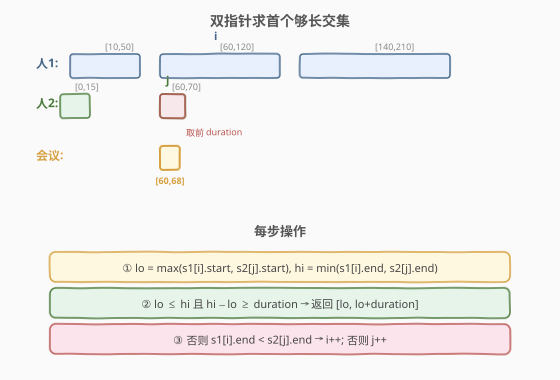
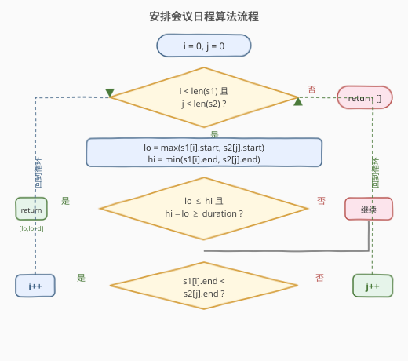
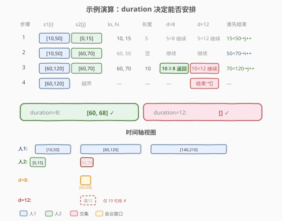

# LeetCode 安排会议日程 题解

## 1. 题目概述

- **标题 / 题号**：安排会议日程（#1229，medium）
- **链接**：https://leetcode.cn/problems/meeting-scheduler/
- **难度**：中等
- **标签**：数组、双指针、区间、贪心

**题意**：给定两个人的**可用时间段列表** `slots1` 和 `slots2`，以及一个会议时长 `duration`。每个时间段是一个闭区间 $[start, end]$，表示该人在 $[start, end]$ 内空闲。两个列表各自按起始时间**升序**排列且**内部互不重叠**。

要求返回**最早**的一个时长恰为 `duration` 的时间段 $[start, start + duration]$，使得两人同时空闲。若不存在则返回空数组。

> 💡 **关键差异**：与 [986. 区间列表的交集](../0901-1000/986_区间列表的交集.md) 不同——986 要求**所有**交集，本题只求**第一个**长度 $\ge duration$ 的交集，且返回的窗口右端是 $start + duration$ 而非交集右端。

**示例 1**：

```text
输入：slots1 = [[10,50],[60,120],[140,210]], slots2 = [[0,15],[60,70]], duration = 8
输出：[60,68]
解释：[60,120] ∩ [60,70] = [60,70]，长度 10 ≥ 8，取前 8 个单位 [60,68]。
```

**示例 2**：

```text
输入：slots1 = [[10,50],[60,120],[140,210]], slots2 = [[0,15],[60,70]], duration = 12
输出：[]
解释：唯一的共同空闲段 [60,70] 长度仅 10 < 12，无法安排。
```

**约束**：

- $1 \le \text{slots1.length}, \text{slots2.length} \le 10^4$
- $\text{slots1[i].length} = \text{slots2[i].length} = 2$
- $\text{slots1[i][0]} < \text{slots1[i][1]}$
- `slots1` 和 `slots2` 各自按起始时间升序且内部互不重叠
- $0 \le \text{slots1[i][0]}, \text{slots2[i][0]} \le 10^9$
- $1 \le \text{duration} \le 10^6$

> 💡 **交集长度判定**：两个区间 $[a_1, b_1]$ 与 $[a_2, b_2]$ 的交集为 $[\max(a_1, a_2),\ \min(b_1, b_2)]$，长度为 $\min(b_1, b_2) - \max(a_1, a_2)$。当该长度 $\ge duration$ 时，取交集起点为会议起点即可。

## 2. 解题思路

### 2.1 暴力思路

枚举 `slots1` 与 `slots2` 的所有区间对，逐对计算交集长度，记录第一个 $\ge duration$ 的。共 $O(m \times n)$ 次，$m, n = 10^4$ 时达 $10^8$，会超时，且**完全浪费了两个列表各自有序**的性质。

### 2.2 核心观察：双指针归并 + 长度判定



本题是 [986. 区间列表的交集](../0901-1000/986_区间列表的交集.md) 的直接变体：两个列表各自有序，用双指针 $i, j$ 分别扫描，每步只处理当前一对区间。处理完后**让结束更早的那个指针前进**——因为结束早的区间不可能再与对方后续区间产生交集。

> 💡 **为什么让「结束早的」先走？** 设 `slots1[i]` 的右端小于 `slots2[j]` 的右端，则 `slots1[i]` 已经"用完"——`slots2` 中 $j$ 之后的区间起始只会更大（有序），不可能再与 `slots1[i]` 相交，所以 $i$ 可以安全前进。这与 986 的指针前进规则完全一致。

每步操作：

1. 计算当前一对区间的交集：`lo = max(s1[i][0], s2[j][0])`，`hi = min(s1[i][1], s2[j][1])`
2. 若 `lo <= hi` 且 `hi - lo >= duration`，**找到答案**，立即返回 `[lo, lo + duration]`（取交集前 `duration` 长度即是最早）
3. 否则，让右端点小的指针前进：若 `s1[i][1] < s2[j][1]`，`i++`；否则 `j++`

> ⚠️ **为什么返回 $[lo,\ lo + duration]$ 而非 $[lo,\ hi]$？** 题目要求会议时长**恰为** `duration`。交集可能比所需更长，取前 `duration` 个单位既能满足时长，又保证是当前交集内最早的起点。又因双指针按时间从左到右推进，**第一个满足条件的交集即全局最早**，无需继续搜索。

### 2.3 算法流程图



```
i = 0, j = 0
while i < len(s1) and j < len(s2):
    lo = max(s1[i].start, s2[j].start)
    hi = min(s1[i].end,   s2[j].end)
    if lo <= hi and hi - lo >= duration:
        return [lo, lo + duration]      # 最早且够长，立即返回
    if s1[i].end < s2[j].end:
        i += 1
    else:
        j += 1
return []                               # 无共同够长空闲段
```

### 2.4 示例演算



以 `slots1 = [[10,50],[60,120],[140,210]]`，`slots2 = [[0,15],[60,70]]` 为例，对比 `duration = 8` 与 `duration = 12`：

| 步骤 | s1[i] | s2[j] | lo, hi | 交集长度 | duration=8 | duration=12 | 谁先结束 |
|------|-------|-------|--------|----------|------------|-------------|----------|
| 1 | [10,50] | [0,15] | 10, 15 | 5 | 5<8 继续 | 5<12 继续 | 15<50 → j++ |
| 2 | [10,50] | [60,70] | 60, 50 | 空(60>50) | 继续 | 继续 | 50<70 → i++ |
| 3 | [60,120] | [60,70] | 60, 70 | 10 | **10≥8 → 返回 [60,68]** ✓ | 10<12 继续 | 70<120 → j++ |
| 4 | [60,120] | (j 越界) | — | — | — | **循环结束 → 返回 []** ✓ | — |

- `duration = 8`：步骤 3 命中，返回 $[60, 68]$。
- `duration = 12`：步骤 3 交集长度仅 10 < 12，指针继续走到 `j` 越界，返回空。

> 💡 步骤 2 中 `lo=60 > hi=50`，交集为空，跳过——`slots2` 的 `[60,70]` 起点已超过 `slots1` 的 `[10,50]` 终点，二人此段不重叠。

## 3. 参考代码

### C++

```cpp
class Solution {
  public:
    vector<int> minAvailableDuration(vector<vector<int>>& slots1,
                                     vector<vector<int>>& slots2,
                                     int duration) {
        int i = 0, j = 0;
        while (i < slots1.size() && j < slots2.size()) {
            int lo = max(slots1[i][0], slots2[j][0]);
            int hi = min(slots1[i][1], slots2[j][1]);
            if (lo <= hi && hi - lo >= duration) {
                return {lo, lo + duration};
            }
            if (slots1[i][1] < slots2[j][1]) {
                i++;
            } else {
                j++;
            }
        }
        return {};
    }
};
```

### Python

```python
class Solution:
    def minAvailableDuration(self, slots1: List[List[int]], slots2: List[List[int]], duration: int) -> List[int]:
        i = j = 0
        while i < len(slots1) and j < len(slots2):
            lo = max(slots1[i][0], slots2[j][0])
            hi = min(slots1[i][1], slots2[j][1])
            if lo <= hi and hi - lo >= duration:
                return [lo, lo + duration]
            if slots1[i][1] < slots2[j][1]:
                i += 1
            else:
                j += 1
        return []
```

## 4. 复杂度分析

| 维度 | 复杂度 | 说明 |
|------|--------|------|
| 时间复杂度 | $O(m + n)$ | 双指针各遍历一次，每步 $i$ 或 $j$ 必有一个前进 |
| 空间复杂度 | $O(1)$ | 仅用常数变量（返回数组不计） |

> 💡 暴力法 $O(m \times n)$，双指针法利用有序性降至 $O(m+n)$，与 [986](../0901-1000/986_区间列表的交集.md) 同构，仅多了长度判定和"找到即返回"的提前终止。

## 5. 扩展：堆合并多路区间

若两人可用时间段未排序，或扩展到 $k$ 个人的会议安排，可对所有区间按起点排序后再用双指针/堆归并：

- **两人未排序**：先各自排序 $O(m \log m + n \log n)$，再双指针 $O(m+n)$。
- **$k$ 人共同空闲**：把所有人的区间塞进小顶堆（按起点排序），逐个弹出，维护一个"当前共同交集" $[\max\_start,\ \min\_end]$。每弹出一个区间更新 `min_end`（取更小者），若 `min_end - max_start >= duration` 即返回。等价于 $k$ 路归并求首个够长公共段，$O(N \log k)$，$N$ 为区间总数。

> ⚠️ 多人版中 `max_start` 是堆中**最早结束**的区间起点——它一旦弹出就代表"最紧约束者"离开，需用新堆顶起点更新。此结构与 [253. 会议室 II](../0201-0300/253_会议室II.md) 的小顶堆维护"最早结束会议"同源。

## 6. 面试要点

1. **本题和 986 区间列表的交集有什么区别？**

   - 986 收集**所有**交集；本题只求**第一个**长度 $\ge duration$ 的交集，并返回 $[start,\ start + duration]$ 而非整个交集。算法骨架相同（双指针归并），仅判定条件和返回值不同。

2. **为什么返回 $[lo,\ lo + duration]$ 而不是 $[lo,\ hi]$？**

   - 会议时长**恰好**为 `duration`。交集可能更长，取前 `duration` 个单位既满足时长又最早。题目要求返回的就是一段定长窗口。

3. **为什么第一个满足条件的交集就是全局最早的？**

   - 双指针按时间从左到右推进，每步处理的区间对起点单调不减。一旦某步命中，其交集起点 $lo$ 不可能比之前任何未命中的更晚——更早的步骤若能命中早已返回。所以首个命中即最早。

4. **指针前进为什么比较右端点而不是左端点？**

   - 右端小的区间已"用完"——对方后续区间起始更大（有序），不可能再与它相交。保留右端大的区间，因为它还可能与对方下一个区间相交。比左端点会导致遗漏交集。

5. **如果输入不保证有序怎么办？**

   - 题目保证有序。若不保证，先各自排序 $O(n \log n)$ 再双指针；或用堆对所有人区间统一按起点排序后归并（见第 5 节扩展）。

## 同类练习题

| # | 题目 | 与本题的关联 |
|---|------|-------------|
| 986 | [区间列表的交集](https://leetcode.cn/problems/interval-list-intersections/)（[题解](../0901-1000/986_区间列表的交集.md)） | 本题的母题，双指针归并求所有区间交集，本题为其加长度判定与提前返回的变体 |
| 253 | [会议室 II](https://leetcode.cn/problems/meeting-rooms-ii/)（[题解](../0201-0300/253_会议室II.md)） | 小顶堆维护最早结束会议求最大重叠数，同为区间+堆/排序应用 |
| 56 | [合并区间](https://leetcode.cn/problems/merge-intervals/)（[题解](../0001-0100/56_合并区间.md)） | 同列表内有重叠时合并，与本题"跨列表取交集"互补 |
| 435 | [无重叠区间](https://leetcode.cn/problems/non-overlapping-intervals/)（[题解](../0401-0500/435_无重叠区间.md)） | 贪心按右端点移除最少区间使无重叠，区间排序的另一种用法 |
| 352 | [将数据流变为多个不相交区间](https://leetcode.cn/problems/data-stream-as-disjoint-intervals/) | 动态维护有序不重叠区间并合并，区间数据结构进阶 |
