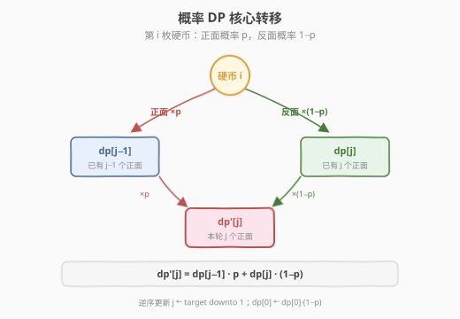
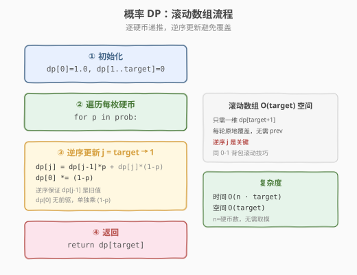

# 抛掷硬币

- **题目名称**：抛掷硬币
- **链接**：[1230. 抛掷硬币](https://leetcode.cn/problems/toss-strange-coins/)
- **难度**：中等
- **标签**：动态规划、概率、滚动数组

## 1. 题目概述

给定一个浮点数数组 `prob`，其中 `prob[i]` 表示第 `i` 枚硬币正面朝上的概率。同时给定一个整数 `target`，表示目标正面朝上的总数。

返回恰好有 `target` 枚硬币正面朝上的概率。

**示例 1**：

```text
输入：prob = [0.4], target = 1
输出：0.40000
解释：只有 1 枚硬币，正面概率 0.4，恰好 1 个正面即 0.4。
```

**示例 2**：

```text
输入：prob = [0.5,0.5,0.5,0.5,0.5], target = 0
输出：0.03125
解释：5 枚硬币全部反面朝上，概率 = (0.5)^5 = 0.03125。
```

**约束条件**：

- $1 \le \text{prob.length} \le 1000$
- $0 \le \text{target} \le \text{prob.length}$
- $0 \le \text{prob}[i] \le 1$

> 💡 这是一道**概率 DP** 招牌题：每枚硬币独立抛掷，正面数要么 +1（概率 $p$）要么不变（概率 $1-p$）。用 `dp[j]` 表示「已处理硬币中恰好 $j$ 个正面」的概率，逐硬币递推即可。滚动数组逆序更新的技巧与 0-1 背包完全同构。

---

## 2. 解题思路

### 2.1 暴力思路：枚举所有结果

每枚硬币有正面/反面两种结果，$n$ 枚硬币共 $2^n$ 种组合。枚举所有组合，统计正面数恰好等于 `target` 的组合概率之和。

时间复杂度 $O(2^n)$，$n=1000$ 时天文数字，**完全不可行**。

> ⚠️ 暴力法的问题在于**重复子问题**：前 $i$ 枚硬币中恰好 $j$ 个正面的概率，无论具体是哪 $j$ 枚，后续硬币的影响完全相同。这正是 DP 出场的时候——用「正面计数」一维状态压缩掉所有组合细节。

### 2.2 核心观察：概率 DP

**关键定义**：设 `dp[j]` = 已处理的硬币中，恰好 $j$ 枚正面朝上的概率。

**核心思考**：对于第 $i$ 枚硬币（正面概率 $p$），它有两种结果：



1. **正面**（概率 $p$）：正面数 $+1$。要使本轮恰好 $j$ 个正面，上一轮必须有 $j-1$ 个正面。
2. **反面**（概率 $1-p$）：正面数不变。要使本轮恰好 $j$ 个正面，上一轮必须有 $j$ 个正面。

两者互斥，概率相加：

$$
\text{dp}'[j] = \text{dp}[j-1] \cdot p + \text{dp}[j] \cdot (1-p)
$$

> 💡 **与 0-1 背包的类比**：0-1 背包中 `dp[j] = dp[j-w] + dp[j]`（选或不选），这里 `dp[j] = dp[j-1]·p + dp[j]·(1-p)`（正面或反面）。结构完全同构——每个物品恰好处理一次，状态一维，滚动数组逆序更新。

**边界条件**：

- `dp[0] = 1.0`（0 枚硬币，0 个正面，概率为 1）
- `dp[j] = 0`（$j > 0$，初始无正面）

**`j=0` 的特殊处理**：`dp[0]` 没有前驱 `dp[-1]`，只有「反面」分支贡献：`dp[0] = dp[0] · (1-p)`。

### 2.3 算法流程图



**四步法**：

1. **初始化**：`dp[0] = 1.0`，`dp[1..target] = 0`
2. **遍历硬币**：对每枚硬币 `p = prob[i]`
3. **逆序更新**：`j` 从 `target` 递减到 `1`：`dp[j] = dp[j-1]·p + dp[j]·(1-p)`；然后 `dp[0] *= (1-p)`
4. **返回**：`dp[target]`

> ⚠️ **为什么逆序？** `dp[j]` 的更新依赖 `dp[j-1]` 的**旧值**。若正序更新（`j` 从 `1` 到 `target`），`dp[j-1]` 已被覆盖为新值，导致错误。逆序更新保证读取的 `dp[j-1]` 仍是上一轮的值——与 0-1 背包滚动数组完全相同的技巧。

### 2.4 示例演算

以 `prob = [0.4, 0.6, 0.5, 0.3], target = 2` 为例，观察 `dp` 数组的逐轮演变：

![示例演算：prob=[0.4,0.6,0.5,0.3], target=2](../images/toss_coins_walkthrough.svg)

| 硬币 | $p$ | dp[0] | dp[1] | dp[2] |
|------|-----|-------|-------|-------|
| init | — | 1.0 | 0 | 0 |
| 0 | 0.4 | 0.6 | 0.4 | 0 |
| 1 | 0.6 | 0.24 | 0.52 | 0.24 |
| 2 | 0.5 | 0.12 | 0.38 | 0.38 |
| 3 | 0.3 | 0.084 | 0.302 | **0.38** |

以硬币 1（$p=0.6$）的 `dp[1]=0.52` 为例验证：`dp[1] = dp[0]·0.6 + dp[1]·0.4 = 0.6·0.6 + 0.4·0.4 = 0.36 + 0.16 = 0.52` ✓

最终答案 `dp[2] = 0.38`。验证：枚举 4 枚硬币中恰好 2 个正面的 6 种组合，概率之和 $= 0.084 + 0.056 + 0.024 + 0.126 + 0.054 + 0.036 = 0.38$ ✓

> 💡 注意当 `target < n` 时，`dp` 各行之和可能小于 1.0——因为超过 `target` 个正面的概率被「截断」丢弃了（我们只关心恰好 `target` 个，不需要跟踪更多）。这是正确行为，不影响答案。

---

## 3. 参考代码

### C++

```cpp
class Solution {
  public:
    double probabilityOfHeads(vector<double>& prob, int target) {
        vector<double> dp(target + 1, 0.0);
        dp[0] = 1.0;
        for (double p : prob) {
            for (int j = target; j >= 1; --j)
                dp[j] = dp[j - 1] * p + dp[j] * (1.0 - p);
            dp[0] *= (1.0 - p);
        }
        return dp[target];
    }
};
```

### Python

```python
class Solution:
    def probabilityOfHeads(self, prob: List[float], target: int) -> float:
        dp = [0.0] * (target + 1)
        dp[0] = 1.0
        for p in prob:
            for j in range(target, 0, -1):
                dp[j] = dp[j - 1] * p + dp[j] * (1 - p)
            dp[0] *= (1 - p)
        return dp[target]
```

> 💡 **无需取模**：与计数型 DP 不同，概率 DP 操作的是 $[0, 1]$ 区间的浮点数，乘法只会让值更小，不会溢出。因此不需要取模运算，直接用 `double` / `float` 即可。

---

## 4. 复杂度分析

| 维度 | 复杂度 | 说明 |
|------|--------|------|
| **时间复杂度** | $O(n \cdot \text{target})$ | $n$ 枚硬币，每轮遍历 `target+1` 个状态 |
| **空间复杂度（滚动）** | $O(\text{target})$ | 一维 `dp[target+1]` 数组 |
| **空间复杂度（二维）** | $O(n \cdot \text{target})$ | 若保留整个 `dp[n][target+1]` 表 |

> 💡 由于 $\text{target} \le n \le 1000$，最坏情况下时间约 $10^6$ 次浮点运算，空间约 1000 个 `double`，非常高效。

---

## 5. 扩展：二项分布特例

当所有硬币概率相同时（$\text{prob}[i] = p$，$\forall i$），本题退化为经典的**二项分布**：

$$
P(\text{target}) = \binom{n}{\text{target}} \cdot p^{\text{target}} \cdot (1-p)^{n-\text{target}}
$$

此时可直接用组合数公式 $O(n)$ 计算，无需 DP。但本题的硬币概率各不相同，无法用闭式公式，必须逐硬币递推。

> 💡 **对数空间技巧**：当 $n$ 极大（如 $10^6$）时，概率值可能下溢为 0。此时可在对数空间中计算：$\log P = \sum \log(\text{prob}[i]) + \sum \log(1-\text{prob}[i])$，最后用 `exp` 还原。本题 $n \le 1000$ 无需此技巧。

---

## 6. 面试要点

1. **为什么 `j` 要逆序更新？**

   - `dp[j]` 的转移依赖 `dp[j-1]` 的**旧值**（上一轮的值）。若正序更新，`dp[j-1]` 已被覆盖为新值，导致同一枚硬币的正面贡献被重复计算。逆序更新保证 `dp[j-1]` 尚未被修改——这与 0-1 背包的滚动数组技巧完全一致。

2. **`dp[0]` 为什么单独处理？**

   - `dp[0]` 表示「0 个正面」，只有反面分支贡献（`dp[0]·(1-p)`），没有 `dp[-1]·p` 的正面分支（下标越界）。因此在逆序循环结束后，单独执行 `dp[0] *= (1-p)`。

3. **如果 `target = 0` 会怎样？**

   - `dp[0]` 初始为 1.0，每轮乘以 $(1-p)$，最终 $dp[0] = \prod_{i}(1-\text{prob}[i])$，即所有硬币全反面的概率。逆序循环 `range(0, 0, -1)` 为空，不执行，逻辑正确。

4. **浮点数精度有什么注意？**

   - `double` 有约 15-16 位有效数字，$n=1000$ 次乘法的累积误差远小于题目要求的 $10^{-5}$ 容差，无需特殊处理。若 $n$ 更大，可考虑对数空间计算。

5. **本题与 0-1 背包的滚动数组有何异同？**

   - **同**：都是一维状态、逐物品处理、逆序更新防覆盖。`dp[j]` 都依赖 `dp[j-1]` 的旧值。
   - **异**：0-1 背包是「选/不选」的加法（`dp[j] = dp[j-w] + dp[j]`），本题是「正面/反面」的加权加法（`dp[j] = dp[j-1]·p + dp[j]·(1-p)`）。本质都是「每个物品恰好处理一次」的 0-1 结构。

> 💡 **一句话总结**：本题是「概率版 0-1 背包」——每枚硬币是物品，正面数是容量，转移方程用概率加权代替布尔选择。一维滚动 + 逆序更新，$O(n \cdot \text{target})$ / $O(\text{target})$ 解决。

---

## 7. 同类练习题

- [416. 分割等和子集](https://leetcode.cn/problems/partition-equal-subset-sum/)：0-1 背包滚动数组，同样逆序更新避免覆盖，理解本题后可秒杀
- [494. 目标和](https://leetcode.cn/problems/target-sum/)：同为「凑目标值」的一维 DP，正负号选择对应正面/反面
- [1223. 掷骰子模拟](https://leetcode.cn/problems/dice-roll-simulation/)：同区间骰子/硬币 DP，多维状态滚动，约束驱动状态设计
- [528. 按权重随机选择](https://leetcode.cn/problems/random-pick-with-weight/)：概率与前缀和的另一角度，从概率分布到采样
