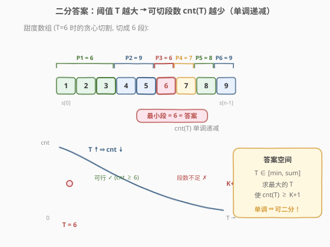
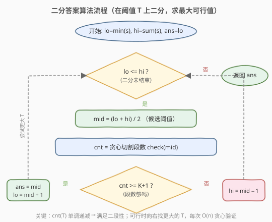

# 分享巧克力

- **题目名称**：分享巧克力
- **链接**：[1231. 分享巧克力](https://leetcode.cn/problems/divide-chocolate/)
- **难度**：困难
- **标签**：数组、二分查找、贪心

## 1. 题目概述

你有一大块巧克力，它由若干甜度不同的小块组成，用数组 `sweetness` 表示每一小块的甜度。你打算和 `K` 名朋友一起分享，所以需要**切 `K` 刀**得到 `K+1` 块，每块由一些**连续**的小块组成。

为了表现慷慨，你将吃掉**总甜度最小**的一块，其余分给朋友。请找出最佳切割策略，使你分得的巧克力**总甜度最大**，返回这个最大总甜度。

**示例 1**：

```text
输入：sweetness = [1,2,3,4,5,6,7,8,9], K = 5
输出：6
解释：切成 [1,2,3], [4,5], [6], [7], [8], [9] 共 6 块。
     各块甜度和为 6, 9, 6, 7, 8, 9，最小的一块 = 6。
```

**示例 2**：

```text
输入：sweetness = [5,6,7,8,9,1,2,3,4], K = 8
输出：1
解释：只能切成 9 块，每块恰好 1 个小块，最小甜度 = 1。
```

**示例 3**：

```text
输入：sweetness = [1,2,2,1,2,2,1,2,2], K = 2
输出：5
解释：切成 [1,2,2], [1,2,2], [1,2,2]，三块甜度和均为 5。
```

**约束条件**：

- `0 <= K < sweetness.length <= 10^4`
- `1 <= sweetness[i] <= 10^5`

---

## 2. 解题思路

### 2.1 暴力思路

要在 `n` 个小块之间切 `K` 刀，相当于从 `n-1` 个间隙里选 `K` 个切点，方案数为 $\binom{n-1}{K}$。`n` 最大 $10^4$、`K` 取 $\frac{n}{2}$ 时组合数是天文数字，对每种方案再 `O(n)` 求最小段和，必然超时。

暴力不可行的根因是**搜索空间在「切法」上**，而切法组合爆炸。我们需要换一个搜索维度。

### 2.2 核心观察：二分答案（最大化最小值）



换一个角度：不枚举切法，而是**直接猜答案**——「你吃到的那块的总甜度至少为 $T$」。给定 $T$，能否判定存在一种切法使**每块**甜度和都 $\geq T$？

**贪心判定 `check(T)`**：从左到右累加小块甜度，一旦累加和 $\geq T$ 就切一刀、清零继续。这样能切出的段数 `cnt` 越多越好。若 `cnt >= K+1`，则 $T$ 可行。

> 💡 **为什么「至少 `K+1` 段」而非「恰好 `K+1` 段」？** 因为所有 `sweetness[i] > 0`，把相邻两段**合并**只会让段和更大，不会跌破 $T$。所以能切成 $\geq K+1$ 段时，合并多余段到恰好 `K+1` 段后最小段和仍 $\geq T$。判定因此简化为「贪心切出的段数 $\geq K+1$」。

**单调性**：$T$ 越大，每段需要的甜度门槛越高，能切出的段数 `cnt(T)` 越少。即 `cnt(T)` 关于 $T$ 单调递减。于是存在分界点 $T^*$：

```text
T <= T* → cnt(T) >= K+1   (可行，每块都够甜)
T >  T* → cnt(T) <  K+1   (门槛太高，切不够段)
```

这正是二分所需的**二段性**。题目求「最大的可行 $T$」，于是在区间 `[min(sweetness), sum(sweetness)]` 上二分，每次 `O(n)` 贪心验证 `mid`，可行则去右半找更大的，不可行则去左半降低门槛。

> 💡 **识别信号**：题目求「最大的最小 / 最小的最大」，且能 `O(n)` 验证某候选值是否合法 → 想「二分答案」。本题是 [410. 分割数组的最大值](../0401-0500/410_分割数组的最大值.md) 与 [1011. 在 D 天内送达包裹的能力](../1001-1100/1011_在D天内送达包裹的能力.md) 的**镜像**：那两题是「最小化最大值」（可行→缩左界找更小），本题是「最大化最小值」（可行→缩右界找更大）。

> ⚠️ **上下界取值**：下界取 `min(sweetness)`——每块至少含 1 个小块，最小段和不可能低于最小小块甜度；上界取 `sum(sweetness)`——`K=0` 时整块归你，答案即总和。取更紧的界能减少无效二分，但不影响正确性。

### 2.3 算法流程图



注意判定为「可行」时**先记录 `ans = mid` 再收缩左界**（`lo = mid + 1`），保证最终保留的是「最大的可行值」。这与 1011「可行时缩右界」的方向恰好相反。

### 2.4 示例演算

![示例演算：sweetness = [1,2,3,4,5,6,7,8,9], K = 5](../images/chocolate_example_walkthrough.svg)

以 `sweetness = [1,2,3,4,5,6,7,8,9]`、`K = 5` 为例，`min=1`、`sum=45`，答案区间 `[1, 45]`，需切成 `K+1=6` 段：

- **第 1 轮** `[1,45]`，`mid=23`，`check`：`[1..7]=28✓`、`[8,9]=17✗`（末段不足 23 不计）`cnt=1 < 6` ✗ → `hi=22`。
- **第 2 轮** `[1,22]`，`mid=11`，`check`：`[1..5]=15✓`、`[6,7]=13✓`、`[8,9]=17✓`，`cnt=3 < 6` ✗ → `hi=10`。
- **第 3 轮** `[1,10]`，`mid=5`，`check`：每个小块都 ≥5，`cnt=9 >= 6` ✓ → `ans=5`，`lo=6`。
- **第 4 轮** `[6,10]`，`mid=8`，`check`：`[1..4]=10✓`、`[5,6]=11✓`、`[7,8]=15✓`、`[9]=9✗`，`cnt=3 < 6` ✗ → `hi=7`。
- **第 5 轮** `[6,7]`，`mid=6`，`check`：`[1,2,3]=6✓`、`[4,5]=9✓`、`[6]✓`、`[7]✓`、`[8]✓`、`[9]✓`，`cnt=6 >= 6` ✓ → `ans=6`，`lo=7`。
- **第 6 轮** `[7,7]`，`mid=7`，`check`：`[1..4]=10✓`、`[5,6]=11✓`、`[7]✓`、`[8]✓`、`[9]✓`，`cnt=5 < 6` ✗ → `hi=6`。
- **结束** `lo=7 > hi=6`，返回 `ans=6`。

---

## 3. 参考代码

### C++

```cpp
class Solution {
  public:
    int maximizeSweetness(vector<int>& sweetness, int k) {
        int lo = *min_element(sweetness.begin(), sweetness.end());
        int hi = accumulate(sweetness.begin(), sweetness.end(), 0);
        int ans = lo;

        while (lo <= hi) {
            int mid = lo + (hi - lo) / 2;
            if (canDivide(sweetness, mid, k)) {
                ans = mid;       // 可行，尝试更大的门槛
                lo = mid + 1;
            } else {
                hi = mid - 1;    // 门槛太高切不够段，降低
            }
        }
        return ans;
    }

  private:
    // 贪心验证：门槛为 T 时能否切成 >= k+1 段，每段和 >= T
    bool canDivide(const vector<int>& sweetness, int T, int k) {
        int cnt = 0;        // 已切出的段数
        int cur = 0;        // 当前段累计甜度
        for (int s : sweetness) {
            cur += s;
            if (cur >= T) {     // 达标，切一刀
                ++cnt;
                cur = 0;
            }
        }
        return cnt >= k + 1;
    }
};
```

### Python

```python
class Solution:
    def maximizeSweetness(self, sweetness: List[int], k: int) -> int:
        lo, hi = min(sweetness), sum(sweetness)
        ans = lo

        while lo <= hi:
            mid = (lo + hi) // 2
            if self._can_divide(sweetness, mid, k):
                ans = mid       # 可行，尝试更大的门槛
                lo = mid + 1
            else:
                hi = mid - 1    # 门槛太高切不够段，降低
        return ans

    def _can_divide(self, sweetness: List[int], T: int, k: int) -> bool:
        cnt, cur = 0, 0         # 已切段数 / 当前段累计
        for s in sweetness:
            cur += s
            if cur >= T:        # 达标，切一刀
                cnt += 1
                cur = 0
        return cnt >= k + 1
```

> ⚠️ **三个易错点**：
> 1. **判定是 `cnt >= k+1` 不是 `cnt >= k`**：切 `K` 刀得 `K+1` 块，段数门槛是 `K+1`。写成 `cnt > k` 等价（doocs 题解即用 `cnt > k`），但 `>= k+1` 更直白。
> 2. **可行方向向右**：与 1011 相反。1011 求「最小可行运力」，可行时 `hi = mid - 1` 往左找更小；本题求「最大可行门槛」，可行时 `lo = mid + 1` 往右找更大。方向搞反会返回错误端点。
> 3. **末段不达标不计入 `cnt`**：贪心累加到末尾若 `cur < T`，这段不完整、不算一段。例如示例演算第 1 轮 `[8,9]=17 < 23` 不计入，`cnt=1`。这保证了「每段和 $\geq T$」的承诺。

---

## 4. 复杂度分析

| 维度 | 复杂度 | 说明 |
|------|--------|------|
| 时间复杂度 | $O(n \log S)$ | $S = \sum sweetness[i]$；二分 $O(\log S)$ 次，每次贪心验证 $O(n)$ |
| 空间复杂度 | $O(1)$ | 仅用常数额外变量 |

> 💡 `n <= 10^4`、`sweetness[i] <= 10^5`，故 $S \leq 10^9$，$\log S \approx 30$，总运算量约 $3 \times 10^5$，远低于时限。

---

## 5. 扩展：与 410 / 1011 的镜像对照

三题同属「二分答案 + 贪心验证」家族，差别只在**优化方向**与 `check` 的判据：

| 题 | 目标 | 单调性 | `check` 判据 | 可行时收缩方向 |
|----|------|--------|--------------|----------------|
| [1011](../1001-1100/1011_在D天内送达包裹的能力.md) | 最小化最大日载 | `need(cap)` 随 `cap` ↑ 而 ↓ | `need <= days` | `hi = mid-1`（找更小） |
| [410](../0401-0500/410_分割数组的最大值.md) | 最小化最大子段和 | `cnt(limit)` 随 `limit` ↑ 而 ↓ | `cnt <= m` | `hi = mid-1`（找更小） |
| **1231** | **最大化最小段和** | `cnt(T)` 随 `T` ↑ 而 ↓ | `cnt >= k+1` | **`lo = mid+1`（找更大）** |

**记忆口诀**：求「最小可行」→ 可行往左缩（`hi=mid-1`）；求「最大可行」→ 可行往右缩（`lo=mid+1`）。`check` 的判据与「段数/天数上限」还是「下限」对应——上限题判 `cnt <= 上限`，下限题判 `cnt >= 下限`。

> 💡 **贪心 `check` 的正确性（交换论证）**：为何「累加到 $\geq T$ 立即切」能得到最多段？假设存在更优方案多切一段，考察贪心第一段终点 $g$ 与最优第一段终点 $p$。贪心「能切就切」最早达标，故 $p \geq g$；把最优方案第一段多余的尾部小块退还给后续段，不会减少后续可切段数。逐段对齐后，最优方案可调整为贪心方案而段数不减，矛盾。故贪心段数最多。

---

## 6. 面试要点

1. **为什么能二分？二段性体现在哪？**

   - `cnt(T)`（门槛 $T$ 下贪心可切段数）随 $T$ 单调递减。存在分界点 $T^*$，使 $T \leq T^*$ 时 `cnt >= K+1`（可行）、$T > T^*$ 时 `cnt < K+1`（不可行）。这种「左合法 / 右不合法」结构即二段性，可二分定位 $T^*$。

2. **为什么判定用「至少 `K+1` 段」而非「恰好 `K+1` 段」？**

   - `sweetness[i] > 0`，合并相邻段只会增大段和。若能切成 $\geq K+1$ 段每段 $\geq T$，把多余段合并到恰好 `K+1` 段后最小段和仍 $\geq T$。故「至少 `K+1` 段」与「存在恰好 `K+1` 段的合法切法」等价，判定因此简化为贪心计数。

3. **上下界为什么是 `min(sweetness)` 和 `sum(sweetness)`？**

   - 下界：每块至少含 1 个小块，最小段和 $\geq$ 最小小块甜度；`K = n-1` 时每块恰 1 个小块，答案即 `min(sweetness)`，故下界紧。
   - 上界：`K = 0` 时不切割、整块归你，答案即 `sum(sweetness)`，故上界紧。

4. **为什么可行时往右缩 `lo = mid + 1`，和 1011 相反？**

   - 1011 求「最小可行运力」，可行时要在左半找更小的可行值，故缩右界 `hi = mid-1`。本题求「最大可行门槛」，可行时要在右半找更大的可行值，故缩左界 `lo = mid+1`。方向由「最小化」还是「最大化」决定。

5. **`K = 0` 时答案是什么？**

   - 不切割，整块巧克力归你，答案 = `sum(sweetness)`。此时 `check(sum)` 返回 `cnt=1 >= 1` 成立，二分会一路把 `lo` 推到 `hi = sum`，最终返回 `sum`，无需特判。

---

## 7. 同类练习题

- [410. 分割数组的最大值](https://leetcode.cn/problems/split-array-largest-sum/)：镜像题，最小化最大子段和，`check` 贪心划分子数组，可行时缩右界——对照本题体会方向差异
- [1011. 在 D 天内送达包裹的能力](https://leetcode.cn/problems/capacity-to-ship-packages-within-d-days/)：同家族，最小化最大日载，`check` 贪心装船，结构与 410 几乎一致
- [875. 爱吃香蕉的珂珂](https://leetcode.cn/problems/koko-eating-bananas/)：最小化吃速 `k`，`check` 用向上取整求和，求最小可行 `k`
- [2064. 分配给商店的最小商品数量](https://leetcode.cn/problems/minimized-maximum-of-products-distributed-to-any-store/)：最小化最大分配量，`check` 统计所需商店数，与 410 同构
- [LCP 12. 小张刷题计划](https://leetcode.cn/problems/xiao-zhang-shua-ti-ji-hua/)：最小化最大单日刷题时间，`check` 贪心按天累加，二分答案模板题
