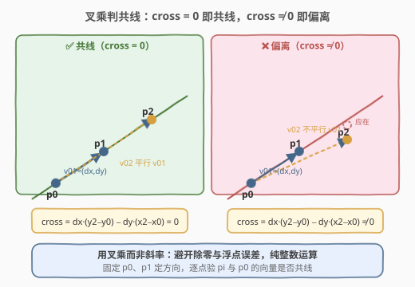
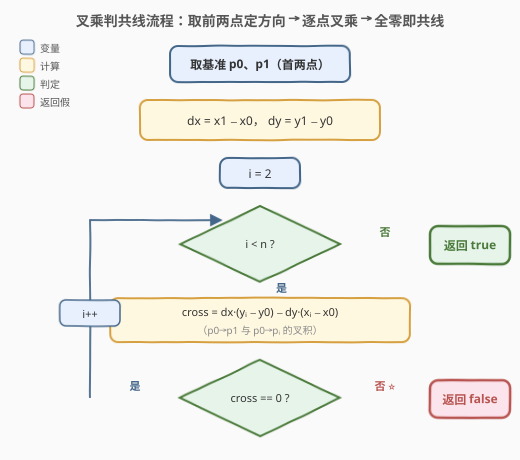

# 缀点成线

- **题目名称**：缀点成线
- **链接**：[1232. 缀点成线](https://leetcode.cn/problems/check-if-it-is-a-straight-line/)
- **难度**：简单
- **标签**：几何、数组、数学

## 1. 题目概述

给定一个点集 `coordinates`，其中 `coordinates[i] = [xi, yi]` 表示二维平面上一个点的坐标。判断这些点是否**全部落在同一条直线上**。

**示例 1**：

```text
输入：coordinates = [[1,2],[2,3],[3,4],[4,5]]
输出：true
解释：所有点都在直线 y = x + 1 上。
```

**示例 2**：

```text
输入：coordinates = [[1,1],[2,2],[3,4],[4,5],[5,6],[7,7]]
输出：false
解释：点 (3,4) 偏离了由 (1,1)、(2,2) 确定的直线 y = x。
```

**约束条件**：

- `2 <= coordinates.length <= 1000`
- `coordinates[i].length == 2`
- `-10^4 <= coordinates[i][0], coordinates[i][1] <= 10^4`
- `coordinates` 中不会出现重复点

> 💡 **两点定线**：任意两点确定一条直线。题目保证至少两点，故前两点 `p0`、`p1` 唯一确定一条候选直线，只需验证其余点是否都在其上。

---

## 2. 解题思路

### 2.1 暴力思路：逐点算斜率

取前两点 `p0`、`p1`，算出斜率 $k = \frac{y_1 - y_0}{x_1 - x_0}$，再对每个后续点 `pi` 计算 $\frac{y_i - y_0}{x_i - x_0}$，比较是否相等。

问题在于：**分母可能为 0**（垂直线 $x_1 = x_0$），需要特判；且**浮点除法有精度误差**，两个本应相等的斜率可能算出 `0.33333333` 与 `0.33333334`，导致误判。因此需要更稳健的整数判定。

### 2.2 核心观察：叉乘判共线



把问题从「**斜率相等**」转化为「**向量平行**」：以 `p0` 为公共起点，方向向量 $\vec{v_{01}} = (dx, dy) = (x_1 - x_0,\ y_1 - y_0)$，对每个点 `pi` 取向量 $\vec{v_{0i}} = (x_i - x_0,\ y_i - y_0)$。两向量平行（共线）的充要条件是**叉积为零**：

$$
\text{cross} = dx \cdot (y_i - y_0) - dy \cdot (x_i - x_0) = 0
$$

- `cross = 0` ⇒ 两向量平行 ⇒ `pi` 在直线 `p0p1` 上；
- `cross ≠ 0` ⇒ `pi` 偏离直线 ⇒ 立即返回 `false`。

> ⚠️ **为何用叉乘而非斜率？** 叉乘是**纯整数乘减运算**，没有除法、没有浮点数、无需特判垂直线（`dx = 0` 时公式依然成立，自动等价于检查 `x_i = x_0`）。坐标范围 $[-10^4, 10^4]$，差值最大 $2 \times 10^4$，叉积最大 $(2 \times 10^4)^2 = 4 \times 10^8$，远在 32 位 `int` 范围内，无溢出风险。

### 2.3 算法流程图



1. 取 `p0 = coordinates[0]`、`p1 = coordinates[1]`；
2. 计算方向向量 `dx = x1 - x0`、`dy = y1 - y0`；
3. 从 `i = 2` 起遍历每个点 `pi = coordinates[i]`：
   - 计算 `cross = dx * (yi - y0) - dy * (xi - x0)`；
   - 若 `cross != 0`，返回 `false`；
   - 否则继续。
4. 全部通过，返回 `true`。

### 2.4 示例演算

以 `coordinates = [[1,2],[2,3],[3,4],[4,5]]` 为例：`p0=(1,2)`、`p1=(2,3)` ⇒ `dx=1, dy=1`。

![示例演算：[[1,2],[2,3],[3,4],[4,5]] → true](../images/straightline_walkthrough.svg)

| i | point (xi, yi) | (xi−x0, yi−y0) | cross = 1·(yi−y0) − 1·(xi−x0) | 共线 |
|---|----------------|-----------------|-------------------------------|------|
| 2 | (3, 4) | (2, 2) | $1 \cdot 2 - 1 \cdot 2 = 0$ | ✅ |
| 3 | (4, 5) | (3, 3) | $1 \cdot 3 - 1 \cdot 3 = 0$ | ✅ |

所有点 `cross` 均为 0，返回 `true`。

> 💡 **反例对照**：示例 2 中 `p0=(1,1)`、`p1=(2,2)` ⇒ `dx=1, dy=1`；到 `p2=(3,4)` 时 `cross = 1·3 - 1·2 = 1 ≠ 0`，立即返回 `false`，无需继续扫描。

---

## 3. 参考代码

### C++

```cpp
class Solution {
  public:
    bool checkStraightLine(vector<vector<int>>& coordinates) {
        int x0 = coordinates[0][0], y0 = coordinates[0][1];
        int dx = coordinates[1][0] - x0;
        int dy = coordinates[1][1] - y0;
        for (int i = 2; i < (int)coordinates.size(); i++) {
            int xi = coordinates[i][0], yi = coordinates[i][1];
            long long cross = (long long)dx * (yi - y0) - (long long)dy * (xi - x0);
            if (cross != 0) return false;
        }
        return true;
    }
};
```

### Python

```python
class Solution:
    def checkStraightLine(self, coordinates: List[List[int]]) -> bool:
        x0, y0 = coordinates[0]
        dx = coordinates[1][0] - x0
        dy = coordinates[1][1] - y0
        for x, y in coordinates[2:]:
            if dx * (y - y0) - dy * (x - x0) != 0:
                return False
        return True
```

> ⚠️ **溢出说明**：坐标范围 $[-10^4, 10^4]$，叉积理论上界 $4 \times 10^8$，32 位 `int`（上限约 $2.1 \times 10^9$）足以容纳。C++ 代码中用 `long long` 是防御性写法，应对面试官追问「坐标放大到 $10^9$ 怎么办」——此时叉积可达 $4 \times 10^{18}$，必须用 64 位。Python 整数无上限，无需处理。

---

## 4. 复杂度分析

| 维度 | 复杂度 | 说明 |
|------|--------|------|
| 时间复杂度 | `O(n)` | 前两点 `O(1)` 取方向，剩余 `n-2` 个点各做一次常数级叉乘；最坏全部共线需扫完 |
| 空间复杂度 | `O(1)` | 只存 `x0, y0, dx, dy` 等常数个变量，原地判定 |

> 💡 本题无需排序、无需哈希，单趟扫描 + 整数运算即为最优解，理论上无法比 `O(n)` 更快（每个点至少要看一次）。

---

## 5. 扩展：最简分数斜率法

除叉乘外，还可把斜率化为**最简分数** `(dy/g, dx/g)`（`g = gcd(|dx|, |dy|)`，并统一符号约定，如规定分母非负），逐点比较归一化后的 `(dy_i/g_i, dx_i/g_i)` 是否等于基准。同样避免浮点误差。

```cpp
class Solution {
  public:
    bool checkStraightLine(vector<vector<int>>& coordinates) {
        auto norm = [&](int dy, int dx) {
            int g = gcd(abs(dy), abs(dx));
            if (g == 0) g = 1;
            if (dx < 0 || (dx == 0 && dy < 0)) { dy = -dy; dx = -dx; }
            return make_pair(dy / g, dx / g);
        };
        int x0 = coordinates[0][0], y0 = coordinates[0][1];
        auto base = norm(coordinates[1][1] - y0, coordinates[1][0] - x0);
        for (int i = 2; i < (int)coordinates.size(); i++) {
            if (norm(coordinates[i][1] - y0, coordinates[i][0] - x0) != base)
                return false;
        }
        return true;
    }
};
```

| 维度 | 叉乘法 | 最简分数法 |
|------|--------|------------|
| **运算** | 一次乘减 | 一次 gcd + 两次除法 |
| **代码量** | 更短 | 需处理符号统一 |
| **适用场景** | 单次判定共线 | 需把斜率作为**哈希键**存储/分组时（如 [149. 直线上最多的点数](../0101-0200/149_直线上最多的点数.md)） |

> 💡 **何时选谁**：只判「是否共线」用叉乘最简；若要把点按所属直线**分组计数**（每条直线一个唯一键），则必须用最简分数作为哈希键——这正是 149 题的核心套路。

---

## 6. 面试要点

1. **为什么用叉乘而不是直接比斜率？**
   - 斜率有两个坑：分母为 0（垂直线）需特判，浮点除法有精度误差。叉乘 `dx·Δy − dy·Δx` 是纯整数运算，公式对 `dx=0` 自动成立（退化为检查 `xi=x0`），无特判、无精度问题。

2. **叉乘为 0 为什么就代表共线？**
   - `cross = |v01|·|v0i|·sin θ`，其中 `θ` 为两向量夹角。`cross = 0` ⇔ `sin θ = 0` ⇔ `θ = 0 或 π` ⇔ 两向量平行。又因它们共享起点 `p0`，平行即共线，故 `pi` 落在 `p0p1` 所在直线上。

3. **只取前两点定方向可靠吗？**
   - 题目保证无重复点，故 `p0 ≠ p1`，`(dx, dy) ≠ (0, 0)`，前两点必能确定一条合法直线。若输入可能有重复点，则需先跳过与前一点相同的点再定方向。

4. **坐标放大到 $10^9$ 还能用 int 吗？**
   - 不能。差值达 $2 \times 10^9$，叉积达 $4 \times 10^{18}$，超出 64 位 `long long` 上限（约 $9.2 \times 10^{18}$ 勉强够，但接近）。更稳妥的做法是归一化后比较最简分数，或用大整数。面试时提及即可。

5. **能否提前终止？**
   - 可以。一旦发现某个 `cross ≠ 0` 立即返回 `false`，最坏情况（全部共线）才需扫完整个数组，均摊仍为 `O(n)`。

---

## 7. 同类练习题

- [149. 直线上最多的点数](https://leetcode.cn/problems/max-points-on-a-line/)（[题解](../0101-0200/149_直线上最多的点数.md)）：把斜率最简分数作为哈希键对点分组计数，求经过最多点的直线——本题的「计数升级版」
- [2280. 表示一个折线图的最少线段](https://leetcode.cn/problems/minimum-lines-to-represent-a-line-chart/)：相邻点斜率变化时分段，需用最简分数比较避免浮点误差，思路同源
- [1037. 有效的回旋镖](https://leetcode.cn/problems/valid-boomerang/)：判断三点是否共线，即本题 `n=3` 的特例，叉乘一行即可
- [593. 有效的正方形](https://leetcode.cn/problems/valid-square/)：利用四点间距离与对角线关系判定，其中相邻三点需判共线退化的处理借鉴本题
