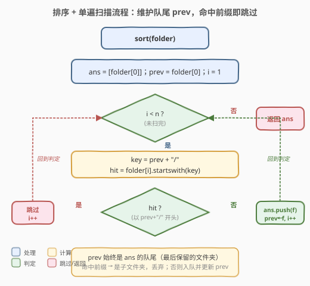
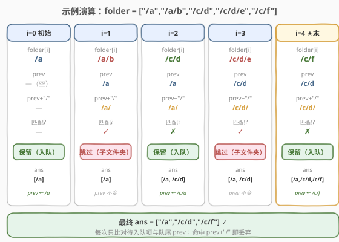

# LeetCode 删除子文件夹 题解

## 1. 题目概述

- **标题 / 题号**：删除子文件夹（#1233，medium）
- **链接**：https://leetcode.cn/problems/remove-sub-folders-from-the-filesystem/
- **难度**：中等
- **标签**：数组、字符串、排序、字典树

**题意**：给定一个文件夹路径列表 `folder`，其中每个元素形如 `"/a/b/c"`（以 `/` 起始，由若干段小写字母用 `/` 拼接而成）。如果 `folder[i]` 位于另一个文件夹 `folder[j]` **之下**（即 `folder[i]` 以 `folder[j]` 开头、且紧跟着一个 `/`），则称 `folder[i]` 是 `folder[j]` 的**子文件夹**，需要删除。要求以任意顺序返回删除所有子文件夹后剩下的文件夹。

**示例 1**：

```text
输入：folder = ["/a","/a/b","/c/d","/c/d/e","/c/f"]
输出：["/a","/c/d","/c/f"]
解释："/a/b" 是 "/a" 的子文件夹，"/c/d/e" 是 "/c/d" 的子文件夹，均删除。
```

**示例 2**：

```text
输入：folder = ["/a","/a/b/c","/a/b/d"]
输出：["/a"]
解释："/a/b/c" 与 "/a/b/d" 都是 "/a" 的子文件夹，全部删除。
```

**示例 3**：

```text
输入：folder = ["/a/b/c","/a/b/ca","/a/b/d"]
输出：["/a/b/c","/a/b/ca","/a/b/d"]
解释：三者互不为子文件夹——"/a/b/ca" 不以 "/a/b/c/" 开头（第 7 个字符是 'a' 而非 '/'）。
```

**约束**：

- `1 <= folder.length <= 4 * 10^4`
- `2 <= folder[i].length <= 100`
- `folder[i]` 只包含小写字母和 `/`
- `folder[i]` 总是以 `/` 起始
- `folder` 中每个元素唯一

> 💡 **子文件夹的定义关键在「紧跟 `/`」**：`f` 是 `g` 的子文件夹 ⟺ `f` 以 `g + "/"` 开头。示例 3 中 `/a/b/ca` 与 `/a/b/c` 虽是前缀关系，但中间没有 `/` 分隔，故不算子文件夹——这是本题最易踩的坑。

## 2. 解题思路

### 2.1 暴力思路

对每个文件夹 `f`，遍历其余所有文件夹 `g`，检查 `f` 是否以 `g + "/"` 开头；若是则标记删除。两重循环，每次前缀检查 `O(L)`（`L` 为路径长度），共 `O(n² · L)`，在 `n = 4·10⁴` 时必然超时。需要利用**路径的字典序结构**避免两两比较。

### 2.2 核心观察：排序后父文件夹必在子文件夹前


将所有路径**按字典序升序排序**后，有两条关键性质：

1. **父文件夹必排在它的所有子文件夹之前**。因为子文件夹 `f = g + "/" + ...` 在字典序上严格大于 `g`（`g` 是 `f` 的真前缀，短的更小）。
2. **同一父文件夹的全部后代构成一段连续区间**，紧跟在该父文件夹之后；走出这段区间遇到的第一个路径，必不再是它的后代。

由此得到一个极其简洁的策略：**维护「队尾」`prev`（最后一个被保留的文件夹），逐个考察排序后的路径 `f`**：

- 若 `f` 以 `prev + "/"` 开头 → `f` 是 `prev` 的子文件夹，**跳过**；
- 否则 → `f` 不属于任何已保留文件夹的子树（因为它若属于某个更早的父，那段区间尚未结束，`prev` 不会换），**保留** `f` 并更新 `prev = f`。

> ⚠️ **为什么只比对队尾就够？** 设某父 `g` 的后代区间为 `[g+1, g_end]`。扫描进入区间时 `prev = g`（刚保留），区间内每个后代都以 `g + "/"` 开头，全部跳过，`prev` 始终保持 `g`；遇到区间外第一个路径 `h`（`h > g_end`），`h` 不以 `g + "/"` 开头，于是保留并更新 `prev = h`。此后 `h` 之后的路径只可能与 `h` 比对，不可能再是 `g` 的后代——因为 `g` 的后代已被完整跳过。因此「只需比对队尾」等价于「区间内逐个跳过、区间外换父」，单遍扫描即正确。

### 2.3 算法流程图



1. 对 `folder` 升序排序；
2. 初始化答案 `ans = [folder[0]]`，队尾 `prev = folder[0]`，下标 `i = 1`；
3. 当 `i < n`：
   - 计算 `key = prev + "/"`；
   - 若 `folder[i]` 以 `key` 开头 → 跳过（`i++`）；
   - 否则 → `ans.push_back(folder[i])`，`prev = folder[i]`，`i++`；
4. 返回 `ans`。

### 2.4 示例演算

以示例 1 `folder = ["/a","/a/b","/c/d","/c/d/e","/c/f"]`（恰好已有序）为例：



| i | folder[i] | prev | prev+"/" | 匹配? | 动作 | ans |
|---|-----------|------|----------|-------|------|-----|
| 0 | /a | —（初始） | — | — | 保留 | [/a] |
| 1 | /a/b | /a | /a/ | ✓ | 跳过 | [/a] |
| 2 | /c/d | /a | /a/ | ✗ | 保留 | [/a, /c/d] |
| 3 | /c/d/e | /c/d | /c/d/ | ✓ | 跳过 | [/a, /c/d] |
| 4 | /c/f | /c/d | /c/d/ | ✗ | 保留 | [/a, /c/d, /c/f] |

> 💡 第 2 步 `/c/d` 不以 `/a/` 开头，说明已走出 `/a` 的子树，保留并换 `prev = /c/d`；第 4 步 `/c/f` 不以 `/c/d/` 开头（第 5 个字符是 `f` 不是 `/`），走出 `/c/d` 子树，再次保留。最终 `[/a, /c/d, /c/f]` 与示例 1 输出一致。

## 3. 参考代码

### 方法一：排序 + 单遍扫描（推荐）

#### C++

```cpp
class Solution {
  public:
    vector<string> removeSubfolders(vector<string>& folder) {
        sort(folder.begin(), folder.end());
        vector<string> ans;
        ans.push_back(folder[0]);
        for (int i = 1; i < (int)folder.size(); i++) {
            const string& prev = ans.back();
            string key = prev + "/";                 // 子文件夹判定的分隔符
            // folder[i] 以 key 开头 → 是子文件夹，跳过；否则入队
            if (folder[i].compare(0, key.size(), key) != 0) {
                ans.push_back(folder[i]);
            }
        }
        return ans;
    }
};
```

#### Python

```python
class Solution:
    def removeSubfolders(self, folder: List[str]) -> List[str]:
        folder.sort()
        ans = [folder[0]]
        for f in folder[1:]:
            prev = ans[-1]
            if not f.startswith(prev + "/"):
                ans.append(f)
        return ans
```

> ⚠️ **前缀检查务必拼上 `/`**：两种语言都构造 `key = prev + "/"` 再做前缀比对。若只判「以 `prev` 开头」而不拼分隔符，示例 3 中 `/a/b/ca` 会被误判为 `/a/b/c` 的子文件夹而错误删除。C++ 用 `compare(0, key.size(), key)`：当 `folder[i]` 比 `key` 短时会自动按实际长度比较并返回非 0，无越界风险；Python 的 `str.startswith` 本身安全。

## 4. 复杂度分析

| 方法 | 时间复杂度 | 空间复杂度 | 说明 |
|------|-----------|-----------|------|
| 排序 + 单遍扫描 | `O(n log n · L)` | `O(1)` 额外（不计输出） | 排序时两两比较最坏 `O(L)`；扫描 `O(n · L)` 做前缀比对；原地排序无需额外空间 |
| 字典树 | `O(N)` | `O(N)` | `N = Σ folder[i].length` 为所有路径总长；按段插入，总字符访问一次 |

> 💡 其中 `n` 为文件夹个数，`L` 为路径平均长度。本题 `n ≤ 4·10⁴`、`L ≤ 100`，排序法完全够用。字典树法在路径总长 `N` 远小于 `n·L` 时更优，且天然支持流式插入。

## 5. 扩展：字典树解法

若不希望排序、或需要边插入边判定，可用**字典树**按路径段（`split('/')` 后的各段，去掉首段空串）逐层建树。插入某路径时，若中途遇到一个已标记为「文件夹终点」的节点，则当前路径是该终点的子文件夹，直接终止插入（不入树、不标记）；否则插完整段并标记终点。

```python
class Trie:
    def __init__(self):
        self.children = {}
        self.is_end = False

class Solution:
    def removeSubfolders(self, folder: List[str]) -> List[str]:
        root = Trie()
        for f in folder:
            parts = f.split('/')[1:]          # "/a/b" -> ['a','b']
            node = root
            skip = False
            for i, p in enumerate(parts):
                if p not in node.children:
                    node.children[p] = Trie()
                node = node.children[p]
                if node.is_end and i != len(parts) - 1:
                    # 某祖先路径已是终点 → 当前为子文件夹
                    skip = True
                    break
            if not skip:
                node.is_end = True            # 标记为保留的文件夹终点

        ans = []
        def dfs(node, path):
            if node.is_end:
                ans.append('/' + '/'.join(path))
                return                         # 终点不再下探，子文件夹已被跳过
            for ch in node.children:
                dfs(node.children[ch], path + [ch])
        dfs(root, [])
        return ans
```

> 💡 **字典树法的关键剪枝**：插入时一旦走到某个 `is_end` 节点且尚未到达当前路径末尾，立即判定为子文件夹并 `skip`；收集结果时遇到 `is_end` 也**不再递归子树**，因为终点之下的所有路径都是它的子文件夹、本就不会被标记。这样每个字符仅访问一次，时间 `O(N)`。

两种方法对比：

| 维度 | 排序 + 扫描 | 字典树 |
|------|------------|--------|
| **时间** | `O(n log n · L)` | `O(N)` |
| **空间** | `O(1)` 额外 | `O(N)` 建树 |
| **实现** | 极简，几行代码 | 需手写字典树 + 收集 DFS |
| **数据要求** | 依赖可排序 | 仅需可分段 |
| **适用** | 面试首选，路径长度小 | 路径极多极长、或需流式处理 |

## 6. 面试要点

1. **为什么排序后只需比对「队尾」而不是所有已保留的文件夹？**
   - 排序后某父 `g` 的全部后代构成连续区间，紧跟 `g` 之后。进入区间时 `prev = g`，区间内后代全部跳过、`prev` 不变；遇到区间外第一个路径必不以 `g + "/"` 开头，于是换 `prev`。换父之后旧父的后代区间已结束，不可能再出现旧父的后代，故无需回看更早的父。

2. **前缀检查为什么必须加 `/`？只判 `startswith(prev)` 会怎样？**
   - 子文件夹要求 `f` 以 `g` 开头**且紧跟 `/`**。`/a/b/ca` 虽以 `/a/b/c` 开头，但下一字符是 `a` 而非 `/`，不是 `/a/b/c` 的子文件夹。只判 `startswith(prev)` 会误删 `/a/b/ca`，正是示例 3 的陷阱。

3. **字典树法中，为何插入时遇到中途 `is_end` 就能直接判定为子文件夹？**
   - `is_end` 表示存在一个更短的已保留路径恰好是当前路径的祖先前缀。当前路径的所有段都还在该祖先的段之下，必为其子文件夹。提前 `skip` 既正确又避免无谓的深插。

4. **排序的比较复杂度为什么是 `O(n log n · L)`？能否优化？**
   - 字典序比较两字符串最坏需逐字符比对 `O(L)`，排序共 `O(n log n)` 次比较。若改用字典树则与排序无关、总时间 `O(N)`；但本题 `L ≤ 100`、`n ≤ 4·10⁴`，排序法实际很快，且常数远小于字典树，面试中排序法更优。

5. **如果输入未保证「以 `/` 起始」或允许尾随 `/`，需要怎样调整？**
   - 题目保证以 `/` 起始且无尾随 `/`，故 `prev + "/"` 安全。若放宽条件，需先规范化（去尾随 `/`、保证首字符 `/`），或改用按段切分的字典树法，避免分隔符假设。

## 同类练习题

| # | 题目 | 与本题的关联 |
|---|------|-------------|
| 648 | [单词替换](https://leetcode.cn/problems/replace-words/) | 给定词根字典，把句子中每个词替换为最短前缀词根——同为「前缀判定/过滤」，对比「前缀+分隔符」与「纯前缀」的差异 |
| 208 | [实现 Trie (前缀树)](https://leetcode.cn/problems/implement-trie-prefix-tree/)（[题解](../0201-0300/208_实现Trie.md)） | 字典树母题，本题字典树解法的基础 |
| 14 | [最长公共前缀](https://leetcode.cn/problems/longest-common-prefix/)（[题解](../0001-0100/14_最长公共前缀.md)） | 字符串前缀比较的基础操作，本题前缀判定的底层技巧 |
| 720 | [词典中最长的单词](https://leetcode.cn/problems/longest-word-in-dictionary/) | 字典树 + 逐前缀验证，对比「按前缀构造/保留」的另一面 |
| 1858 | [包含所有前缀的最长单词](https://leetcode.cn/problems/longest-word-with-all-prefixes/) | 字典树找「所有前缀都存在」的最长词，与本题「遇终点即截断子树」互为镜像 |
