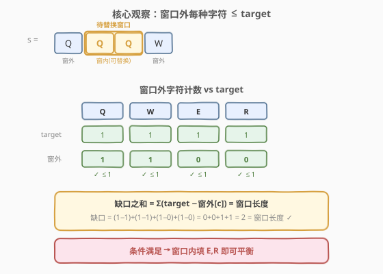
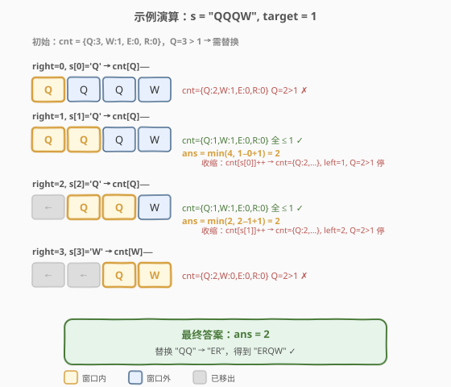

# 替换子串得到平衡字符串

- **题目名称**：替换子串得到平衡字符串
- **链接**：[1234. 替换子串得到平衡字符串](https://leetcode.cn/problems/replace-the-substring-for-balanced-string/)
- **难度**：中等
- **标签**：字符串、滑动窗口、双指针

## 1. 题目概述

给定一个只含 `'Q'`、`'W'`、`'E'`、`'R'` 四种字符且长度为 `n`（`n` 是 4 的倍数）的字符串 `s`。若四种字符各出现恰好 `n/4` 次，则称其为「平衡字符串」。

你可以通过**替换一个子串**的方式使 `s` 变平衡——用与待替换子串**长度相同**的任意字符串替换它。请返回待替换子串的**最小可能长度**。

**示例 1**：

```text
输入：s = "QWER"
输出：0
解释：s 已经是平衡的（Q/W/E/R 各 1 次）。
```

**示例 2**：

```text
输入：s = "QQWE"
输出：1
解释：把一个 'Q' 替换成 'R'，得到 "RQWE"（或 "QRWE"），各字符均 1 次。
```

**示例 3**：

```text
输入：s = "QQQW"
输出：2
解释：把前两个 'Q' 替换成 "ER"，得到 "ERQW"，各字符均 1 次。
```

**示例 4**：

```text
输入：s = "QQQQ"
输出：3
解释：替换后 3 个 'Q'，得到 "QWER"，各字符均 1 次。
```

**约束条件**：

- `1 <= s.length <= 10^5`
- `s.length` 是 `4` 的倍数
- `s` 中只含有 `'Q'`, `'W'`, `'E'`, `'R'`

> 💡 **替换 = 任意填充**：待替换子串可以被替换成**任何**等长字符串，意味着窗口内的字符可以随意改变。因此我们只关心窗口**外**的字符分布是否允许达到平衡。

---

## 2. 解题思路

### 2.1 暴力思路

枚举所有子串 `[left, right]` 作为待替换子串，对每个子串检查：将窗口内字符移除后，窗口外每种字符的个数是否都 $\leq n/4$。若是，则窗口长度为一个候选答案。两重循环 + 检查共 $O(n^2)$，在 $n = 10^5$ 时超时。

### 2.2 核心观察：窗口外「至多 target」



设 `target = n / 4`。先统计全串每种字符的总数 `cnt[c]`。

> 💡 **关键转化**：窗口 `[left, right]` 内的字符可以被替换成任意内容，因此我们只需要保证**窗口外**每种字符的个数 $\leq$ `target`。因为：
>
> - 窗口外某字符 $c$ 的个数为 `cnt[c] - windowCount[c]`。
> - 若窗口外所有字符个数都 $\leq$ `target`，则每种字符的缺口为 `target - (cnt[c] - windowCount[c])`（非负）。
> - 所有缺口之和 $= 4 \times \text{target} - \sum(\text{cnt}[c] - \text{windowCount}[c]) = n - (n - \text{windowLen}) = \text{windowLen}$。
> - 缺口之和恰好等于窗口长度，因此总能用窗口填补所有缺口，达到平衡。

于是问题转化为：**找到最短的窗口，使得窗口外每种字符个数 $\leq$ `target`**。

用 `cnt` 数组维护窗口外的字符计数（初始为全串总数，窗口扩展时对应字符 `--`，收缩时 `++`），用滑动窗口求最小长度。

### 2.3 算法流程图


1. 统计全串每种字符总数 `cnt[c]`，`target = n / 4`。
2. 若 `cnt` 中所有字符计数都 $\leq$ `target`（即原串已平衡），返回 `0`。
3. 初始化 `left = 0, ans = n`。
4. 遍历 `right` 从 `0` 到 `n-1`：
   - 将 `s[right]` 移入窗口：`cnt[s[right]]--`（窗口外计数减一）。
   - **当**窗口外所有字符计数 $\leq$ `target` 时：
     - `ans = min(ans, right - left + 1)`
     - 将 `s[left]` 移出窗口：`cnt[s[left]]++`，`left++`
5. 返回 `ans`。

> ⚠️ **为什么用 `while` 而非 `if`**：当条件满足时，我们要尽可能收缩左端以找到更短的合法窗口。收缩后条件可能仍满足，因此需要循环收缩直到条件被破坏。

### 2.4 示例演算

以 `s = "QQQW"` 为例，`n = 4, target = 1`，初始 `cnt = {Q:3, W:1, E:0, R:0}`。



| right | s[right] | 操作 | cnt（窗口外） | left | 窗口 | 条件满足？ | ans |
|-------|----------|------|--------------|------|------|-----------|-----|
| 0 | Q | cnt[Q]−− | {Q:2, W:1, E:0, R:0} | 0 | [Q] | Q=2>1 ✗ | 4 |
| 1 | Q | cnt[Q]−− | {Q:1, W:1, E:0, R:0} | 0 | [Q,Q] | 全≤1 ✓ | 2 |
| — | — | 收缩：cnt[Q]++ | {Q:2, W:1, E:0, R:0} | 1 | [Q] | Q=2>1 ✗ 停 | 2 |
| 2 | Q | cnt[Q]−− | {Q:1, W:1, E:0, R:0} | 1 | [Q,Q] | 全≤1 ✓ | 2 |
| — | — | 收缩：cnt[Q]++ | {Q:2, W:1, E:0, R:0} | 2 | [Q] | Q=2>1 ✗ 停 | 2 |
| 3 | W | cnt[W]−− | {Q:2, W:0, E:0, R:0} | 2 | [Q,W] | Q=2>1 ✗ | 2 |

> 💡 最终 `ans = 2`：替换子串 `"QQ"`（下标 0-1 或 1-2）为 `"ER"` 即可平衡。验证：`"ERQW"` → Q=1, W=1, E=1, R=1 ✓

---

## 3. 参考代码

### C++

```cpp
class Solution {
  public:
    int balancedString(string s) {
        int n = s.size();
        int target = n / 4;
        int cnt[26] = {0};
        for (char c : s) cnt[c - 'A']++;

        auto check = [&]() {
            return cnt['Q' - 'A'] <= target && cnt['W' - 'A'] <= target &&
                   cnt['E' - 'A'] <= target && cnt['R' - 'A'] <= target;
        };

        if (check()) return 0;

        int ans = n, left = 0;
        for (int right = 0; right < n; right++) {
            cnt[s[right] - 'A']--;
            while (check()) {
                ans = min(ans, right - left + 1);
                cnt[s[left] - 'A']++;
                left++;
            }
        }
        return ans;
    }
};
```

### Python

```python
class Solution:
    def balancedString(self, s: str) -> int:
        n = len(s)
        target = n // 4
        cnt = collections.Counter(s)

        if all(cnt[c] <= target for c in 'QWER'):
            return 0

        ans = n
        left = 0
        for right, ch in enumerate(s):
            cnt[ch] -= 1
            while all(cnt[c] <= target for c in 'QWER'):
                ans = min(ans, right - left + 1)
                cnt[s[left]] += 1
                left += 1
        return ans
```

---

## 4. 复杂度分析

| 维度 | 复杂度 | 说明 |
|------|--------|------|
| 时间复杂度 | $O(n)$ | `left` 和 `right` 各遍历一次，每次 `check()` 为 $O(1)$（固定 4 种字符） |
| 空间复杂度 | $O(1)$ | `cnt` 数组大小固定为 26（或 4），与输入规模无关 |

> 💡 因为字符种类固定为 4 种（Q/W/E/R），`check()` 是 $O(1)$ 的。若字符种类不固定，`check` 的代价为 $O(|\Sigma|)$，总复杂度为 $O(n|\Sigma|)$。

---

## 5. 扩展：为何「至多 target」是充要条件

窗口外每种字符个数 $\leq$ `target` 不仅是必要条件，更是**充分条件**：

1. **必要性**：若窗口外某字符 $c$ 的个数 $>$ `target`，则即使窗口全部填成其他字符，$c$ 的总数仍 $>$ `target`，无法平衡。
2. **充分性**：若窗口外所有字符 $\leq$ `target`，设窗口长度为 $L$。每种字符 $c$ 的缺口 $d_c = \text{target} - \text{cnt}_{\text{out}}[c] \geq 0$。由于 $\sum d_c = 4 \times \text{target} - \sum \text{cnt}_{\text{out}}[c] = n - (n - L) = L$，缺口之和等于窗口长度，恰好可以用窗口填补。

> ⚠️ 这也解释了为何不需要关心窗口内**具体替换成什么**——只要条件满足，替换方案一定存在，且与求最小窗口长度无关。

---

## 6. 面试要点

1. **为什么不能只看窗口内的字符？**

   - 窗口内的字符可以被替换成任意内容，因此窗口内的字符种类和数量**不影响**最终平衡性。真正约束平衡的是窗口外「不可更改」的部分——窗口外每种字符不能超过 `target`。

2. **`cnt` 数组维护的是什么？是窗口内还是窗口外的计数？**

   - 本实现中 `cnt` 维护的是**窗口外**的计数。初始为全串总数，`right` 扩展时 `cnt[s[right]]--`（字符从窗外移入窗内），`left` 收缩时 `cnt[s[left]]++`（字符从窗内移回窗外）。也可以反过来维护窗口内计数，用 `total[c] - window[c]` 判断。

3. **为什么收缩用 `while` 而不是 `if`？**

   - 收缩左端后，条件可能仍然满足（例如窗口外仍有冗余空间）。用 `while` 持续收缩直到条件恰好被破坏，才能保证找到以当前 `right` 为右端点的**最短**合法窗口。

4. **时间复杂度为什么是 $O(n)$ 而不是 $O(n^2)$？**

   - 虽然 `while` 嵌套在 `for` 内，但 `left` 在整个过程中只递增、最多从 `0` 走到 `n-1`。`left` 的总移动次数 $\leq n$，加上 `right` 的 $n$ 次移动，总操作数为 $O(n)$（摊还分析）。

5. **如果字符种类不限于 4 种，算法是否仍适用？**

   - 算法框架不变，但 `check()` 的代价从 $O(1)$ 变为 $O(|\Sigma|)$。可以用一个变量 `excess` 记录当前超过 `target` 的字符种类数，将 `check` 优化回 $O(1)$。

---

## 7. 同类练习题

- [76. 最小覆盖子串](https://leetcode.cn/problems/minimum-window-substring/)（[题解](../0001-0100/76_最小覆盖子串.md)）：经典滑动窗口求最小窗口，本题的模板原型
- [209. 长度最小的子数组](https://leetcode.cn/problems/minimum-size-subarray-sum/)（[题解](../0201-0300/209_长度最小的子数组.md)）：滑动窗口求最短合法窗口，结构相似
- [713. 乘积小于 K 的子数组](https://leetcode.cn/problems/subarray-product-less-than-k/)（[题解](../0701-0800/713_乘积小于K的子数组.md)）：滑动窗口维护窗口内乘积，对比窗口条件的设计
- [1248. 统计「优美子数组」](https://leetcode.cn/problems/count-number-of-nice-subarrays/)（[题解](../1201-1300/1248_统计优美子数组.md)）：同区间滑动窗口题，从计数角度对比本题的最小长度
- [1004. 最大连续 1 的个数 III](https://leetcode.cn/problems/max-consecutive-ones-iii/)：滑动窗口 + 条件判定求最值，同套路不同条件
