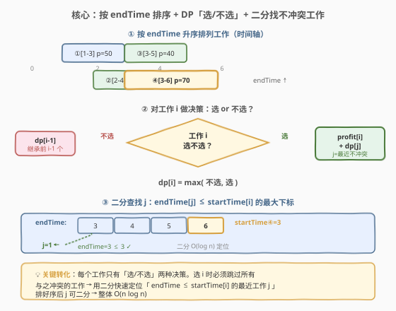
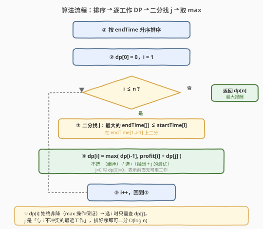
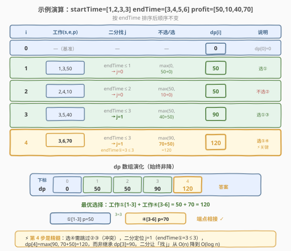

# 规划兼职工作

- **题目名称**：规划兼职工作
- **链接**：[1235. 规划兼职工作](https://leetcode.cn/problems/maximum-profit-in-job-scheduling/)
- **难度**：困难
- **标签**：动态规划、二分查找、排序、区间调度

## 1. 题目概述

有 `n` 份兼职工作，第 `i` 份从 `startTime[i]` 开始、到 `endTime[i]` 结束，报酬为 `profit[i]`。时间上**重叠**的 2 份工作不能同时进行（但若一份在时刻 `X` 结束，另一份恰在 `X` 开始，则可以连续进行）。求能获得的**最大报酬**。

**示例 1**：

```text
输入：startTime = [1,2,3,3], endTime = [3,4,5,6], profit = [50,10,40,70]
输出：120
解释：选第 1 份 [1-3] 和第 4 份 [3-6]，报酬 50 + 70 = 120。
      两份工作端点相接（3 = 3），不重叠。
```

**示例 2**：

```text
输入：startTime = [1,2,3,4,6], endTime = [3,5,10,6,9], profit = [20,20,100,70,60]
输出：150
解释：选第 1、4、5 份，报酬 20 + 70 + 60 = 150。
```

**示例 3**：

```text
输入：startTime = [1,1,1], endTime = [2,3,4], profit = [5,6,4]
输出：6
解释：三份工作起始时间相同，互相冲突，只能选报酬最高的第 2 份。
```

**约束条件**：

- $1 \le n = \text{startTime.length} = \text{endTime.length} = \text{profit.length} \le 5 \times 10^4$
- $1 \le \text{startTime}_i < \text{endTime}_i \le 10^9$
- $1 \le \text{profit}_i \le 10^4$

> 💡 这是经典的**带权区间调度**（Weighted Interval Scheduling）问题。与 [435. 无重叠区间](../0401-0500/435_无重叠区间.md)「选最多区间（等权）」不同，这里每份工作报酬不同，纯贪心「结束早优先」不再适用——必须用 **DP + 二分**：按结束时间排序后，对每份工作决策「选/不选」，选的时候用二分快速定位最近的不冲突工作。

---

## 2. 解题思路

### 2.1 暴力思路：回溯枚举

对每份工作尝试「选 / 不选」两种决策，递归搜索所有子集，验证选出的工作互不重叠，取报酬和的最大值。共 $2^n$ 个子集，$n=5\times10^4$ 时完全不可行。

> ⚠️ 即使简化为贪心，朴素贪心也会出错。例如「按报酬从高到低选」：工作 `[1,10] p=100` 与 `[2,3],[4,5],[6,7]` 各 `p=40`——贪心选了 `p=100` 的长工作，却错失三个短工作合计 `120`。「按结束时间早优先 + 等权」在 [435](../0401-0500/435_无重叠区间.md) 成立，但**带权时也不对**：`[1,3] p=10`、`[2,4] p=100`——结束早的先选会拿到 `p=10`，挡住 `p=100`。

### 2.2 核心观察：按 endTime 排序 + DP「选/不选」+ 二分找不冲突工作



算法分三步：

**第一步：按 `endTime` 升序排序**

将 $n$ 份工作按结束时间排序。这样处理到第 $i$ 份工作时，**所有在它之前的工作结束时间都 $\le$ 它的结束时间**——只需关心「哪些工作的结束时间 $\le$ 当前工作的开始时间」，就能在不冲突的前提下拼接。

**第二步：DP 决策「选/不选」**

设 $dp[i]$ 表示「考虑排序后的前 $i$ 份工作（$1 \le i \le n$）能获得的最大报酬」，$dp[0]=0$。对第 $i$ 份工作有两种决策：

- **不选**：报酬不变，$dp[i] = dp[i-1]$；
- **选**：获得 $\text{profit}[i]$，但必须跳过所有与之冲突的工作——即与第 $i$ 份不冲突的「最近一份」工作 $j$（$\text{endTime}[j] \le \text{startTime}[i]$）的最优报酬 $dp[j]$ 可直接接上，$dp[i] = \text{profit}[i] + dp[j]$。

两者取较大值：

$$dp[i] = \max\big(dp[i-1],\ \ \text{profit}[i] + dp[j]\big)$$

**第三步：二分找 $j$**

因为已按 `endTime` 排序，$\text{endTime}[1..i-1]$ 是升序数组。找「$\le \text{startTime}[i]$ 的最大 `endTime` 对应的下标 $j$」就是经典的**二分求上界**（upper_bound 后退一格），单次 $O(\log n)$。

> 💡 **为什么按 endTime 排序而非 startTime？** 选第 $i$ 份工作时，要找的是「**已结束**的工作」来拼接——关心的是前面工作的**结束时间**。按 endTime 排序后，前面所有工作都已结束（结束时间 $\le$ 当前结束时间），只需二分找结束时间 $\le$ 当前开始时间的边界。若按 startTime 排序，前面的工作可能还没结束，无法保证「选 $j$ 后中间无冲突」。

### 2.3 算法流程图



```text
1. 将工作三元组 (startTime, endTime, profit) 按 endTime 升序排序
2. dp[0] = 0，i = 1
3. 对每个工作 i (1 ≤ i ≤ n):
   a. 二分查找 j：endTime 数组中满足 endTime[j] ≤ startTime[i] 的最大下标
      （j=0 表示前面没有不冲突的工作，dp[0]=0）
   b. dp[i] = max(dp[i-1], profit[i] + dp[j])
   c. i++
4. 返回 dp[n]
```

> ⚠️ **二分的细节**：在 `endTime[1..i-1]` 中找 `≤ startTime[i]` 的最右位置。用 `upper_bound` 找首个 `> startTime[i]` 的位置再减 1，或直接手写「找最后一个 `≤ target`」的二分模板。注意 `j` 的范围是 $[0, i-1]$，找不到时 $j=0$（对应 $dp[0]=0$）。

### 2.4 示例演算

以示例 1 为例：`startTime = [1,2,3,3], endTime = [3,4,5,6], profit = [50,10,40,70]`，按 endTime 排序后顺序不变。



| $i$ | 工作 $(s,e,p)$ | 二分找 $j$（$\text{endTime} \le s$） | 不选 / 选 | $dp[i]$ | 说明 |
|-----|----------------|---------------------------------------|-----------|---------|------|
| 0 | —（基准） | — | — | 0 | $dp[0]=0$ |
| 1 | $(1,3,50)$ | $\text{endTime}\le1$ → $j=0$ | $\max(0,\ 50+0)$ | **50** | 选① |
| 2 | $(2,4,10)$ | $\text{endTime}\le2$ → $j=0$ | $\max(50,\ 10+0)$ | **50** | 不选②（报酬低） |
| 3 | $(3,5,40)$ | $\text{endTime}\le3$ → $j=1$ | $\max(50,\ 40+50)$ | **90** | 选①③ |
| 4 | $(3,6,70)$ | $\text{endTime}\le3$ → $j=1$ | $\max(90,\ 70+50)$ | **120** | 选①④ ⚡ |

**最终**：$dp[4] = 120$。

> ⚠️ **第 4 步是全题精髓**：工作④ `[3,6] p=70` 与②③冲突（它们的 endTime=4、5 都 > 3 的 start），二分定位到 $j=1$（工作① endTime=3 ≤ 3），于是「选④」的报酬为 $70 + dp[1] = 70 + 50 = 120$，超过「不选」的 $dp[3]=90$。**若不做二分**而线性扫描找 $j$，单步 $O(n)$，整体退化为 $O(n^2)$，$n=5\times10^4$ 时约 $2.5\times10^9$ 次操作会超时。

---

## 3. 参考代码

### C++

```cpp
class Solution {
  public:
    int jobScheduling(vector<int>& startTime, vector<int>& endTime,
                      vector<int>& profit) {
        int n = startTime.size();
        // 打包成三元组并按 endTime 升序排序
        vector<array<int, 3>> jobs(n);
        for (int i = 0; i < n; ++i)
            jobs[i] = {endTime[i], startTime[i], profit[i]};
        sort(jobs.begin(), jobs.end());

        vector<int> ends(n);          // 排序后的 endTime 数组，供二分
        for (int i = 0; i < n; ++i) ends[i] = jobs[i][0];

        vector<int> dp(n + 1, 0);     // dp[0]=0，1-indexed
        for (int i = 1; i <= n; ++i) {
            int s = jobs[i - 1][1], p = jobs[i - 1][2];
            // 在 ends[0..i-2] 中二分找最后一个 endTime <= s 的下标
            int lo = 0, hi = i - 2;   // 范围 [0, i-2]，i=1 时为空（hi=-1）
            while (lo <= hi) {
                int mid = (lo + hi) / 2;
                if (ends[mid] <= s) lo = mid + 1;
                else hi = mid - 1;
            }
            int j = hi + 1;           // 映射到 dp 的 1-indexed（0 表示无）
            dp[i] = max(dp[i - 1], p + dp[j]);
        }
        return dp[n];
    }
};
```

### Python

```python
class Solution:
    def jobScheduling(self, startTime: List[int], endTime: List[int],
                      profit: List[int]) -> int:
        import bisect
        jobs = sorted(zip(endTime, startTime, profit))  # 按 endTime 升序
        ends = [j[0] for j in jobs]                      # 排序后的 endTime
        dp = [0] * (len(jobs) + 1)                       # dp[0]=0，1-indexed
        for i, (e, s, p) in enumerate(jobs, 1):
            # bisect_right 找首个 > s 的位置，减 1 得最后一个 <= s 的下标
            k = bisect.bisect_right(ends, s, 0, i - 1)
            j = k                       # k 已是 1-indexed 下标（0 表示无）
            dp[i] = max(dp[i - 1], p + dp[j])
        return dp[-1]
```

> 💡 **二分写法对照**：C++ 手写「找最后一个 $\le \text{target}$」的二分模板（`lo <= hi` + `lo = mid+1` / `hi = mid-1`，循环后 `hi` 即最右满足位置）；Python 直接用 `bisect.bisect_right(ends, s, 0, i-1)`——返回首个 `> s` 的插入位置，恰等于「$\le s$ 的元素个数」，即 $j$ 的 1-indexed 值（`0` 表示无）。两者等价。
>
> ⚠️ C++ 中 `dp` 用 `int` 即可：最坏报酬和 $5\times10^4 \times 10^4 = 5\times10^8$，在 `int`（约 $2.1\times10^9$）范围内。Python 无溢出顾虑。

---

## 4. 复杂度分析

| 维度 | 复杂度 | 说明 |
|------|--------|------|
| **时间复杂度** | $O(n \log n)$ | 排序 $O(n \log n)$；遍历 $n$ 份工作，每次二分 $O(\log n)$，共 $O(n \log n)$ |
| **空间复杂度** | $O(n)$ | `jobs` 三元组数组、`ends` 数组、`dp` 数组各 $O(n)$ |

> 💡 当 $n = 5 \times 10^4$ 时，$n \log n \approx 5\times10^4 \times 15.6 \approx 7.8\times10^5$，远在时限内。这是该题的最优解：排序 + 二分都已达到下界，无法再降。

---

## 5. 扩展：DP 正确性与贪心失效的根源

### 5.1 为什么带权时「结束早优先」贪心失效？

[435. 无重叠区间](../0401-0500/435_无重叠区间.md) 中「选最多不重叠区间」用「按右端点排序 + 贪心保留」是对的，因为**每个区间价值相等**，选结束早的给后续留最大余地——局部最优即全局最优。

但本题每份工作**报酬不同**，贪心「结束早优先」会为了「留余地」放弃高报酬：

- 工作 A `[1,3] p=10`（结束早）、工作 B `[2,4] p=100`（结束晚但报酬高）。
- 贪心选 A（结束早），但 A 和 B 重叠，只能拿 10；而选 B 能拿 100。

> 💡 **本质**：等权时「数量」是唯一目标，贪心有效；带权时「数量 vs 质量」需要权衡，必须用 DP 枚举所有「选/不选」组合并取最优——DP 的 `max(不选, 选)` 正是这一权衡的精确表达。

### 5.2 为什么 DP 的 `j` 可以直接接 `dp[j]`？

按 endTime 排序后，处理第 $i$ 份工作时，设 $j$ 是「$\text{endTime}[j] \le \text{startTime}[i]$ 的最大下标」。

- 工作$j$ 结束于 $\text{endTime}[j] \le \text{startTime}[i]$，与工作 $i$ **不冲突**（端点相接允许）。
- $dp[j]$ 是「前 $j$ 份工作的最优报酬」——这些工作全部结束于 $\le \text{endTime}[j] \le \text{startTime}[i]$，**都不与工作 $i$ 冲突**。
- 因此「选工作 $i$」时，前 $j$ 份工作的最优解可以**无损拼接**：$\text{profit}[i] + dp[j]$ 一定是合法且最优的。

> ⚠️ 为什么不需要担心 $j+1 \sim i-1$ 的工作？它们满足 $\text{endTime} > \text{startTime}[i]$（$j$ 已是 $\le$ 的最大下标），与工作 $i$ **冲突**，选了 $i$ 就必须放弃它们。而 $dp[j]$ 已经考虑了前 $j$ 份的最优，不需要回头管 $j+1 \sim i-1$。

### 5.3 空间优化：滚动无门

本题 $dp[i]$ 依赖 $dp[i-1]$ 和 $dp[j]$（$j < i$），看起来需要保留整个 `dp` 数组。但实际上 $j$ 可以是任意 $< i$ 的位置（不一定相邻），**无法滚动到 $O(1)$**——必须保留 $O(n)$ 的 `dp` 数组供随机访问。这与 [198. 打家劫舍](../0001-0100/198_打家劫舍.md)（只依赖前两项、可 $O(1)$ 滚动）不同。

---

## 6. 面试要点

1. **这题和 [435. 无重叠区间](../0401-0500/435_无重叠区间.md) 有什么区别？**

   - 435 是**等权**区间调度，目标是「选最多区间」，贪心「按右端点排序 + 贪心保留」$O(n \log n)$ 即最优。
   - 本题是**带权**区间调度，目标是「报酬最大」，贪心失效（结束早的工作可能报酬低），必须用 **DP + 二分** $O(n \log n)$。两者复杂度同阶但思路迥异。

2. **为什么按 endTime 排序而不是 startTime？**

   - 选第 $i$ 份工作时，要找「已结束、可拼接」的工作 $j$，关心的是前面工作的**结束时间**。按 endTime 排序后，$\text{endTime}[1..i-1]$ 升序，可直接二分找 $\le \text{startTime}[i]$ 的边界。若按 startTime 排序，前面的工作可能还没结束，无法保证 $j$ 之后无冲突。

3. **二分找的是什么？写法上有什么坑？**

   - 找「$\text{endTime} \le \text{startTime}[i]$ 的最大下标 $j$」，即升序数组中最后一个 $\le \text{target}$ 的位置。
   - 坑：①范围是 $[0, i-2]$（1-indexed 的 $[1, i-1]$），不能包含 $i$ 自身；②找不到时 $j=0$（对应 $dp[0]=0$）；③手写二分用 `mid = (lo+hi+1)/2` 防止 `lo` 不前进导致死循环。

4. **dp 数组为什么是 1-indexed？**

   - 引入 $dp[0]=0$ 作为「无可用工作」的哨兵，避免对 $j=0$ 单独判空。工作 $i$（1-indexed）对应原数组 $i-1$，二分结果 $j$ 直接作为 `dp` 的下标，代码更简洁不易越界。

5. **这题和 [630. 课程表 III](../0601-0700/630_课程表III.md) / [1751. 最多可以参加的会议数目 II](https://leetcode.cn/problems/maximum-number-of-events-that-can-be-attended-ii/) 有什么异同？**

   - 三题都是「带约束的区间调度」：
     - 630 课程表 III：目标是「选最多门」，贪心 + 大顶堆**替换最长**（等权数量优先，堆做后悔机制）。
     - 1235 本题：目标是「报酬最大」，DP + 二分（带权，无后悔，全局最优）。
     - 1751：带「最多选 $k$ 个」的额外约束，DP 多一维 $k$，二分思路与本题完全一致。
   - 630 用贪心是因为「数量优先」可交换论证；1235/1751 用 DP是因为「权重不同」必须枚举决策。

---

## 7. 同类练习题

- [435. 无重叠区间](https://leetcode.cn/problems/non-overlapping-intervals/)（[题解](../0401-0500/435_无重叠区间.md)）：等权区间调度的祖师题，贪心按右端点排序，对比本题带权时为何贪心失效
- [630. 课程表 III](https://leetcode.cn/problems/course-schedule-iii/)（[题解](../0601-0700/630_课程表III.md)）：带截止期的区间调度，贪心 + 大顶堆替换，与本题 DP + 二分形成「贪心 vs DP」的对照
- [1751. 最多可以参加的会议数目 II](https://leetcode.cn/problems/maximum-number-of-events-that-can-be-attended-ii/)：本题 + 「最多选 $k$ 个」约束，DP 多一维，二分思路完全一致，是本题的直接进阶
- [2054. 两个最好的不重叠活动](https://leetcode.cn/problems/two-best-non-overlapping-events/)：$k=2$ 的特化版，可用两次 DP 或线段树，承接 1751 的 $k$ 维降维
- [2008. 出租车的最大盈利](https://leetcode.cn/problems/maximum-earnings-from-taxi/)：本质同本题，乘客行程即工作区间，报酬即盈利，DP + 二分模板题
