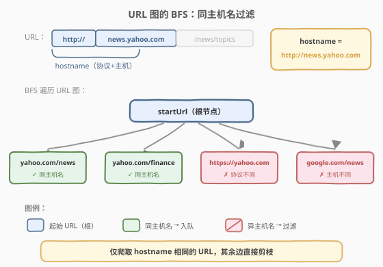
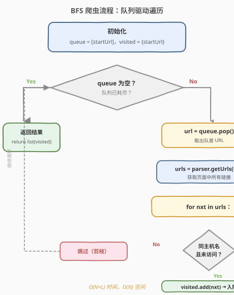
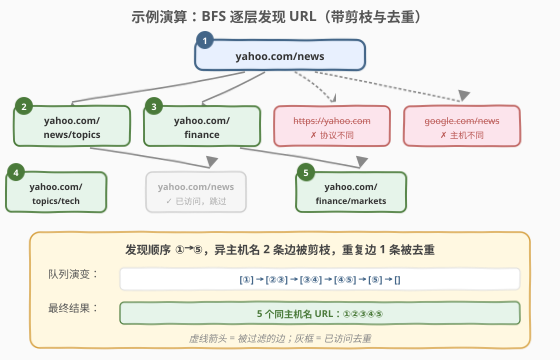

# LeetCode 网络爬虫 题解

## 1. 题目概述

- **标题 / 题号**：网络爬虫（#1236，medium）
- **链接**：https://leetcode.cn/problems/web-crawler/
- **难度**：中等
- **标签**：图、BFS、哈希表、字符串

**题意**：给定一个起始 URL `startUrl` 和一个 `HtmlParser` 接口，要求爬取从 `startUrl` 出发**可达**且**与 `startUrl` 主机名相同**的所有网页 URL。

`HtmlParser` 接口提供方法：

- `getUrls(url)`：返回该网页中包含的所有链接（`List[str]`）。

**主机名（hostname）定义**：URL 中 `协议://主机` 部分（即 `://` 之后、第一个 `/` 之前）。两个 URL 主机名相同当且仅当**协议与主机都完全一致**。

**示例 1**：

```text
输入：startUrl = "http://news.yahoo.com/news"
     HtmlParser.getUrls("http://news.yahoo.com/news") 返回：
       ["http://news.yahoo.com/news/topics",
        "http://news.yahoo.com/finance",
        "http://news.yahoo.com/sports",
        "https://news.yahoo.com/news",     ← 协议不同，过滤
        "http://news.google.com/news"]      ← 主机不同，过滤
输出：["http://news.yahoo.com/news",
       "http://news.yahoo.com/news/topics",
       "http://news.yahoo.com/finance",
       "http://news.yahoo.com/sports"]
解释：从 startUrl 出发 BFS，只保留 hostname == "http://news.yahoo.com" 的链接。
      https 链接协议不同被过滤，google.com 主机不同被过滤。
```

**示例 2**：

```text
输入：startUrl = "http://news.yahoo.com/news/topics"
     HtmlParser.getUrls(...) 返回含 "http://news.yahoo.com/news"（已访问）等链接
输出：包含 startUrl 及所有同主机名可达 URL（去重后）
解释：已访问的 URL 不重复入队，避免环路与重复爬取。
```

**约束**：

- `1 <= startUrl.length <= 300`
- `startUrl` 和所有 `getUrls` 返回的 URL 均为合法 URL（含 `协议://主机[/路径]`）
- `getUrls` 每次返回不超过 30 个链接
- 整个可爬取 URL 总数不超过 1000

> 💡 **本质是图遍历**：把每个 URL 看作图节点，`getUrls(url)` 返回的就是该节点的邻接边。题目要求在**同主机名子图**上做一次从 `startUrl` 出发的**可达性遍历**，BFS 或 DFS 均可。

## 2. 解题思路

### 2.1 暴力思路

对每个 URL 调用 `getUrls`，不做主机名过滤也不做去重，不断递归爬取。问题：

1. **跨站爬取**：会爬到无穷无尽的外部链接，永远停不下来
2. **环路**：A 链向 B、B 链向 A，无限循环
3. **重复**：同一 URL 被多次爬取，浪费时间

必须加**主机名过滤**（剪枝）+ **visited 去重**（防环）。

### 2.2 核心观察：BFS + 同主机名过滤



关键洞察：**将 URL 抽象为图的节点，`getUrls` 返回邻接表，在同主机名子图上做 BFS（或 DFS）即可**。三步走：

1. **提取主机名**：从 `startUrl` 中切出 `协议://主机` 作为过滤基准。方法是找到 `://` 后第一个 `/`，取其前缀；若无后续路径，整个 URL 即为主机名。
2. **同主机名过滤（剪枝）**：对 `getUrls` 返回的每个链接，提取其主机名与基准比较，不同则直接跳过——这道边不遍历。
3. **visited 去重（防环）**：用哈希集合记录已访问 URL，已访问的不再入队。

> 💡 **主机名提取技巧**：URL 按 `/` 切分，取前三段拼接即为 hostname。例如 `"http://news.yahoo.com/news/topics"` 切分为 `["http:", "", "news.yahoo.com", "news", "topics"]`，前三段拼接得 `"http://news.yahoo.com"`。

### 2.3 算法流程图



BFS 流程：

1. **初始化**：`hostname = getHostname(startUrl)`，`visited = {startUrl}`，`queue = deque([startUrl])`
2. **循环**（队列非空）：
   - `url = queue.popleft()`（取出队首）
   - `urls = htmlParser.getUrls(url)`（获取该页所有链接）
   - **遍历** `urls` 中每个 `nxt`：
     - 若 `getHostname(nxt) == hostname` **且** `nxt` 不在 `visited` 中：
       - `visited.add(nxt)`，`queue.append(nxt)`（入队）
3. 队列空时，`return list(visited)`

> ⚠️ **入队与标记的时机**：必须在**入队时**（而非出队时）将 URL 加入 `visited`。若推迟到出队才标记，同一 URL 可能被多个前驱重复入队，浪费 `getUrls` 调用。

### 2.4 示例演算

以 `startUrl = "http://news.yahoo.com/news"` 为例，展示 BFS 逐层发现过程：



| 步骤 | 出队 URL | getUrls 返回（节选） | 新发现 | 队列状态 |
|------|----------|----------------------|--------|----------|
| ① | — | — | startUrl 入队 | [①] |
| ② | startUrl | /news/topics, /finance, /sports, https://…, google.com | ②③（2 条被剪枝） | [②③] |
| ③ | /news/topics | /news(已访问), /topics/tech | ④ | [③④] |
| ④ | /finance | /finance/markets, /sports(已访问) | ⑤ | [④⑤] |
| ⑤ | /topics/tech | /news(已访问) | — | [⑤] |
| ⑥ | /finance/markets | — | — | [] |

最终结果为 5 个同主机名 URL（①②③④⑤），2 条异主机名边被剪枝，1 条重复边被去重。

## 3. 参考代码

### C++

```cpp
/**
 * // This is the HtmlParser's API interface.
 * // You should not implement it, or speculate about its implementation
 * class HtmlParser {
 *   public:
 *     vector<string> getUrls(string url);
 * };
 */
class Solution {
    // hostname = "协议://主机"，即 "://" 后第一个 '/' 之前的部分
    string getHostname(const string& url) {
        int i = url.find("://");
        int j = url.find('/', i + 3);
        return j == string::npos ? url : url.substr(0, j);
    }
  public:
    vector<string> crawl(string startUrl, HtmlParser htmlParser) {
        string host = getHostname(startUrl);
        unordered_set<string> visited{startUrl};
        queue<string> q;
        q.push(startUrl);
        while (!q.empty()) {
            string cur = q.front();
            q.pop();
            for (const string& nxt : htmlParser.getUrls(cur)) {
                if (getHostname(nxt) == host && !visited.count(nxt)) {
                    visited.insert(nxt);
                    q.push(nxt);
                }
            }
        }
        return vector<string>(visited.begin(), visited.end());
    }
};
```

### Python

```python
class Solution:
    def crawl(self, startUrl: str, htmlParser: 'HtmlParser') -> List[str]:
        def get_hostname(url: str) -> str:
            # "http://host/path" -> "http://host"
            return '/'.join(url.split('/')[:3])

        hostname = get_hostname(startUrl)
        visited = {startUrl}
        q = deque([startUrl])
        while q:
            cur = q.popleft()
            for nxt in htmlParser.getUrls(cur):
                if get_hostname(nxt) == hostname and nxt not in visited:
                    visited.add(nxt)
                    q.append(nxt)
        return list(visited)
```

## 4. 复杂度分析

| 维度 | 复杂度 | 说明 |
|------|--------|------|
| 时间复杂度 | `O(N × L)` | `N` 为同主机名可达 URL 数；每个 URL 调用一次 `getUrls`（最多 30 条链接），每条链接做一次 hostname 提取与比较，`L` 为 URL 平均长度 |
| 空间复杂度 | `O(N × L)` | `visited` 哈希集合存储所有已爬 URL，队列最坏存全部 `N` 个 |

> 💡 **为什么是 `O(N×L)` 而非 `O(N)`**：hostname 提取涉及字符串切分/查找，代价与 URL 长度 `L` 成正比。约束中 `L ≤ 300`、`N ≤ 1000`，总量在 `3×10⁵` 量级，完全可行。

## 5. 扩展：DFS 与多线程爬虫

**DFS 写法**：将队列换成递归栈即可，逻辑完全对称。BFS 天然按层扩展（适合后续并行化），DFS 写起来更简短但深链可能栈溢出：

```python
def crawl(self, startUrl: str, htmlParser: 'HtmlParser') -> List[str]:
    def get_hostname(url):
        return '/'.join(url.split('/')[:3])
    host = get_hostname(startUrl)
    visited = {startUrl}
    def dfs(url):
        for nxt in htmlParser.getUrls(url):
            if get_hostname(nxt) == host and nxt not in visited:
                visited.add(nxt)
                dfs(nxt)
    dfs(startUrl)
    return list(visited)
```

**多线程版本**：LeetCode [1242. Web Crawler Multithreaded](https://leetcode.cn/problems/web-crawler-multithreaded/) 是本题的多线程升级版——要求用多线程并发调用 `getUrls` 加速爬取。关键点是用线程安全的队列（或 `concurrent.futures.ThreadPoolExecutor`）+ 线程安全的 `visited` 集合（加锁或用 `threading.Lock`），主线程等待所有任务完成后返回结果。

> ⚠️ **多线程下的 visited 竞态**：检查「未访问」与「标记访问」之间若不加锁，同一 URL 可能被两个线程同时判为未访问并重复入队。需用 `with lock:` 保护「检查 + 标记」这一临界区，或使用原子操作。

## 6. 面试要点

1. **如何提取 hostname？为什么不用正则？**

   - 用 `url.split('/')[:3]` 拼接（Python）或 `find("://")` + `find('/', i+3)` + `substr`（C++）即可，`O(L)` 且无正则开销
   - 正则 `https?://([^/]+)` 也可，但常数更大、可读性不增。URL 格式在约束中已保证合法，字符串切分最直接

2. **为什么必须在入队时就标记 visited，而非出队时？**

   - 入队时标记：同一 URL 最多入队一次，`getUrls` 最多被调用 `N` 次
   - 出队时标记：同一 URL 可能被多个前驱重复入队，队列膨胀、`getUrls` 被重复调用，浪费大量 I/O（真实爬虫中 `getUrls` 是网络请求，代价极高）

3. **BFS 和 DFS 在这题有什么区别？**

   - 时间/空间渐近复杂度相同，都是 `O(N×L)`
   - BFS 按层扩展，天然适合并行化（同层 URL 可并发爬取），也更接近真实爬虫的调度逻辑
   - DFS 递归写法简短，但遇到深链（路径很长）可能栈溢出；BFS 用显式队列无此问题

4. **如果 `getUrls` 很慢（模拟网络请求），如何优化？**

   - **并行化**：用线程池/协程并发调用 `getUrls`，BFS 的同层节点天然可并发（见第 5 节多线程扩展）
   - **限制并发数**：控制同时请求的 URL 数，避免对目标服务器造成过大压力（礼貌爬取）
   - **缓存**：`getUrls` 结果缓存，避免重复请求（本题已由 visited 保证不会重复调用）

5. **hostname 比较为什么要包含协议？**

   - 题目明确定义：两个 URL 主机名相同当且仅当**协议与主机都一致**。`http://example.com` 与 `https://example.com` 视为不同主机名——前者是明文 HTTP，后者是加密 HTTPS，是不同的服务端点

## 同类练习题

| # | 题目 | 与本题的关联 |
|---|------|-------------|
| 1242 | [Web Crawler Multithreaded](https://leetcode.cn/problems/web-crawler-multithreaded/) | 本题的多线程升级版，要求线程安全的 BFS + 并发 `getUrls`，直接承接本题的遍历框架 |
| 200 | [岛屿数量](https://leetcode.cn/problems/number-of-islands/)（[题解](../0101-0200/200_岛屿数量.md)） | 同为图遍历 + visited 去重，网格 BFS/DFS 的母题，对比 URL 图的抽象方式 |
| 743 | [网络延迟时间](https://leetcode.cn/problems/network-delay-time/)（[题解](../0701-0800/743_网络延迟时间.md)） | 图 BFS/Dijkstra 单源可达性，本题是不带权重的特例——只问可达性、不求最短距离 |
| 133 | [克隆图](https://leetcode.cn/problems/clone-graph/) | 图的 BFS/DFS 遍历 + 哈希表记录已访问节点，遍历框架与本题一致，区别在于遍历时需复制而非仅收集 |
