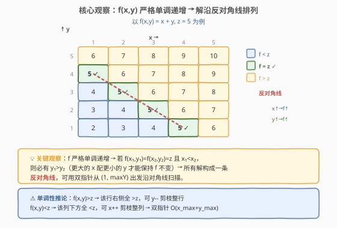
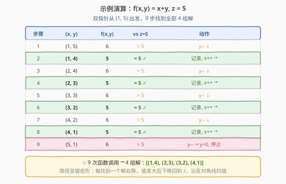

# 找出给定方程的正整数解

- **题目名称**：找出给定方程的正整数解
- **链接**：[1237. 找出给定方程的正整数解](https://leetcode.cn/problems/find-positive-integer-solution-for-a-given-equation/)
- **难度**：简单
- **标签**：数学、双指针、二分查找、交互

## 1. 题目概述

给出一个**隐藏实现**的函数 `f(x, y)` 和一个整数 `z`。函数 `f` 关于 `x` 和 `y` **严格单调递增**：

- 若 $x_1 < x_2$，则对任意 $y$，$f(x_1, y) < f(x_2, y)$；
- 若 $y_1 < y_2$，则对任意 $x$，$f(x, y_1) < f(x, y_2)$。

你只能通过调用 `customfunction.f(x, y)` 获取返回值，不知道 `f` 的具体公式。要求找出**所有**满足 $f(x, y) = z$ 的正整数对 $(x, y)$。

**示例 1**：

```text
输入：function_id = 1, z = 5
输出：[[1,4],[2,3],[3,2],[4,1]]
解释：function_id = 1 表示 f(x, y) = x + y
```

**示例 2**：

```text
输入：function_id = 2, z = 5
输出：[[1,5],[5,1]]
解释：function_id = 2 表示 f(x, y) = x * y
```

**约束条件**：

- $1 \le \text{function\_id} \le 9$
- $1 \le z \le 100$
- $1 \le x, y \le 1000$
- 保证 $f(x, y) = z$ 的解在 $[1, 1000]$ 范围内
- $f(x, y)$ 的返回值在 32 位有符号整数范围内

> 💡 这是一道**交互题**：函数 `f` 的实现对你不可见，你只能通过调用 `f(x, y)` 来探测。关键不是"猜出 `f` 的公式"，而是利用**单调性**这个已知性质高效搜索——即使不知道 `f` 的具体形式也能找到所有解。

---

## 2. 解题思路

### 2.1 暴力思路：枚举所有 (x, y) 对

最直接的思路：双重循环枚举 $x \in [1, 1000]$、$y \in [1, 1000]$，调用 `f(x, y)` 判断是否等于 $z$。共 $10^6$ 次调用。

利用单调性可以**提前终止**内层循环：当 `f(x, y) > z` 时，更大的 `y` 只会让 `f` 更大，直接 `break`；当 `f(x, 1) > z` 时，更大的 `x` 也只会更大，外层也 `break`。

> ⚠️ $10^6$ 次调用在 LeetCode 上能过（约束 $z \le 100$ 意味着实际搜索空间很小），但不是最优解。面试中应主动提出利用单调性进一步优化。

### 2.2 核心观察：单调性 → 解沿反对角线排列 → 双指针



**关键性质**：若 $(x_1, y_1)$ 和 $(x_2, y_2)$ 都是解（$f = z$）且 $x_1 < x_2$，则必有 $y_1 > y_2$。

**证明**：假设 $y_1 \le y_2$，则 $x_1 < x_2$ 且 $y_1 \le y_2$，由严格单调性 $f(x_1, y_1) < f(x_2, y_2)$，即 $z < z$，矛盾。故 $y_1 > y_2$。

这意味着所有解在 $(x, y)$ 网格上构成一条**反对角线**——$x$ 递增则 $y$ 递减。

**双指针策略**：从反对角线的「起点」$(x=1, y=1000)$ 出发：

| 情况 | 含义 | 动作 | 理由 |
|------|------|------|------|
| $f(x, y) > z$ | 值太大 | $y\text{--}$（下移） | 该行 $x$ 及右侧全 $> z$，剪掉整行 |
| $f(x, y) < z$ | 值太小 | $x\text{++}$（右移） | 该列 $y$ 及下方全 $< z$，剪掉整列 |
| $f(x, y) = z$ | 命中！ | 记录，$x\text{++}$ | 同一 $y$ 不会再有解（严格递增） |

> 💡 **为什么不会漏解？** 当 $f(x, y) > z$ 时，对于所有 $x' \ge x$，$f(x', y) \ge f(x, y) > z$，所以第 $y$ 行在 $x$ 及右侧不可能有解，减小 $y$ 安全。当 $f(x, y) < z$ 时，对于所有 $y' \le y$，$f(x, y') \le f(x, y) < z$，所以第 $x$ 列在 $y$ 及下方不可能有解，增大 $x$ 安全。每一步都**排除了不可能的区域**，不会跳过任何解。

### 2.3 算法流程图


```text
1. x = 1, y = 1000
2. while x <= 1000 and y >= 1:
   a. val = f(x, y)
   b. if val == z: 记录 (x, y), x++
   c. if val < z:  x++       （需要更大的值）
   d. if val > z:  y--       （需要更小的值）
3. 返回所有记录的解
```

### 2.4 示例演算

以 $f(x, y) = x + y$、$z = 5$ 为例（对应示例 1），双指针从 $(1, 5)$ 出发（因 $f(1, 6) = 7 > 5$，起点简化为 $y=5$）：



| 步骤 | $(x, y)$ | $f(x,y)$ | vs $z{=}5$ | 动作 |
|------|----------|----------|------------|------|
| 1 | $(1, 5)$ | 6 | $> 5$ | $y\text{--}$ ↓ |
| 2 | $(1, 4)$ | 5 | $= 5$ | ✓ 记录，$x\text{++}$ → |
| 3 | $(2, 4)$ | 6 | $> 5$ | $y\text{--}$ ↓ |
| 4 | $(2, 3)$ | 5 | $= 5$ | ✓ 记录，$x\text{++}$ → |
| 5 | $(3, 3)$ | 6 | $> 5$ | $y\text{--}$ ↓ |
| 6 | $(3, 2)$ | 5 | $= 5$ | ✓ 记录，$x\text{++}$ → |
| 7 | $(4, 2)$ | 6 | $> 5$ | $y\text{--}$ ↓ |
| 8 | $(4, 1)$ | 5 | $= 5$ | ✓ 记录，$x\text{++}$ → |
| 9 | $(5, 1)$ | 6 | $> 5$ | $y\text{--}$ → $y{=}0$，停止 |

**最终**：9 次调用找到 4 组解 $[(1,4), (2,3), (3,2), (4,1)]$，与示例 1 一致。

> ⚠️ 路径呈现完美的**锯齿形**：每找到一个解后右移（$x\text{++}$），值变大后下移（$y\text{--}$）回到 $z$，再右移……这是因为解沿反对角线排列，双指针自然地"沿着对角线走"。本例中 $f(x,y)=x+y$ 每次右移恰好使 $f$ 增加 1，故只出现 $f > z$ 和 $f = z$ 两种情况；对于 $f(x,y)=x \times y$ 等其他函数，也会出现 $f < z$ 的情况，触发 $x\text{++}$。

---

## 3. 参考代码

### 方法一：双指针（推荐）

### C++

```cpp
class Solution {
  public:
    vector<vector<int>> findSolution(CustomFunction& customfunction, int z) {
        vector<vector<int>> ans;
        int x = 1, y = 1000;
        while (x <= 1000 && y >= 1) {
            int val = customfunction.f(x, y);
            if (val == z) {
                ans.push_back({x, y});
                ++x;
            } else if (val < z) {
                ++x;
            } else {
                --y;
            }
        }
        return ans;
    }
};
```

### Python

```python
class Solution:
    def findSolution(self, customfunction: 'CustomFunction', z: int) -> List[List[int]]:
        ans = []
        x, y = 1, 1000
        while x <= 1000 and y >= 1:
            val = customfunction.f(x, y)
            if val == z:
                ans.append([x, y])
                x += 1
            elif val < z:
                x += 1
            else:
                y -= 1
        return ans
```

### 方法二：暴力枚举 + 提前终止

### Python

```python
class Solution:
    def findSolution(self, customfunction: 'CustomFunction', z: int) -> List[List[int]]:
        ans = []
        for x in range(1, 1001):
            if customfunction.f(x, 1) > z:
                break
            for y in range(1, 1001):
                val = customfunction.f(x, y)
                if val == z:
                    ans.append([x, y])
                elif val > z:
                    break
        return ans
```

> 💡 **两种方法对比**：双指针 $O(x_{\max} + y_{\max})$ 次调用，暴力 + 提前终止最坏 $O(x_{\max} \cdot y_{\max})$ 次。但由于 $z \le 100$，实际搜索空间很小，两者在 LeetCode 上运行时间差异不大。面试中**首选双指针**——它体现了对单调性的深入理解。

---

## 4. 复杂度分析

| 维度 | 方法 | 复杂度 | 说明 |
|------|------|--------|------|
| 时间复杂度 | 双指针 | $O(x_{\max} + y_{\max})$ | 每步 $x{+}{+}$ 或 $y{-}{-}$，最多 $1000 + 1000 = 2000$ 步 |
| 空间复杂度 | 双指针 | $O(\text{解的个数})$ | 仅存储答案，不计输出则 $O(1)$ |
| 时间复杂度 | 暴力+提前终止 | $O(x_{\max} \cdot y_{\max})$ | 最坏 $10^6$ 次调用，实际远小于此 |
| 空间复杂度 | 暴力+提前终止 | $O(\text{解的个数})$ | 同上 |

> 💡 双指针的 $O(x_{\max} + y_{\max})$ 是该问题的最优时间复杂度——解分布在反对角线上，至少需要 $O(x_{\max} + y_{\max})$ 步才能扫描完整个对角线。

---

## 5. 扩展：二分查找解法

除了双指针，还可以对每个 $x$ **二分查找** $y$：由于 $f(x, y)$ 关于 $y$ 单调递增，可在 $y \in [1, 1000]$ 中二分找 $f(x, y) = z$。

```python
class Solution:
    def findSolution(self, customfunction: 'CustomFunction', z: int) -> List[List[int]]:
        ans = []
        for x in range(1, 1001):
            lo, hi = 1, 1000
            while lo <= hi:
                mid = (lo + hi) // 2
                val = customfunction.f(x, mid)
                if val == z:
                    ans.append([x, mid])
                    break
                elif val < z:
                    lo = mid + 1
                else:
                    hi = mid - 1
        return ans
```

- 时间复杂度 $O(x_{\max} \log y_{\max}) = O(1000 \times 10) = O(10^4)$，介于暴力和双指针之间。
- 由于 $f$ 严格递增，每个 $x$ 最多有一个解，`break` 后继续下一个 $x$。

> ⚠️ 二分查找适合**函数调用代价高昂**的场景（如远程 API 调用），此时减少调用次数比简化代码更重要。但在本题中函数调用是本地的，双指针更简洁优雅。

---

## 6. 面试要点

1. **为什么双指针不会漏解？**

   - $f(x, y) > z$ 时，第 $y$ 行中 $x$ 及右侧都不可能有解（$f$ 随 $x$ 递增），减小 $y$ 安全。
   - $f(x, y) < z$ 时，第 $x$ 列中 $y$ 及下方都不可能有解（$f$ 随 $y$ 递增），增大 $x$ 安全。
   - 每步排除一行或一列的不可能区域，保证不遗漏。

2. **为什么找到解后是 $x{+}{+}$ 而不是 $y{-}{-}$？**

   - 同一 $y$ 不会有第二个解（$f$ 关于 $x$ 严格递增），所以 $x{+}{+}$ 跳过当前 $x$。下一个解（若有）必定在更大的 $x$、更小的 $y$ 处，$x{+}{+}$ 后 $f$ 变大，自然会触发 $y{-}{-}$ 回到 $z$。

3. **这题和 [240. 搜索二维矩阵 II](../0201-0300/240_搜索二维矩阵II.md) 有什么关系？**

   - 240 题的矩阵每行从左到右递增、每列从上到下递增，与本题 $f(x,y)$ 双调递增结构完全一致。
   - 240 用双指针从右上角出发搜索目标值，本题从 $(1, \text{maxY})$ 出发搜索 $f = z$，**思路完全相同**。

4. **如果 $z$ 的范围很大（比如 $10^9$），双指针还有效吗？**

   - 仍然有效。只要 $x, y$ 的范围确定（$[1, 1000]$），双指针最多 $2000$ 步，与 $z$ 的大小无关。$z$ 只影响比较结果，不影响搜索空间大小。

5. **如果 `f` 不是严格递增而是非严格递增（允许相等）呢？**

   - 同一 $y$ 可能有多个 $x$ 满足 $f = z$。找到解后不能只 $x{+}{+}$，需要继续在同一行搜索。解也不再是反对角线，而是一个"带状"区域。双指针需要调整：找到解后 $x{+}{+}$ 但不跳过当前 $y$，继续检查 $f(x{+}1, y)$ 是否也等于 $z$。

---

## 7. 同类练习题

- [240. 搜索二维矩阵 II](https://leetcode.cn/problems/search-a-2d-matrix-ii/)（[题解](../0201-0300/240_搜索二维矩阵II.md)）：矩阵每行每列递增，双指针从右上角搜索目标值，与本题双指针思路完全一致
- [278. 第一个错误的版本](https://leetcode.cn/problems/first-bad-version/)（[题解](../0201-0300/278_第一个错误的版本.md)）：单调布尔序列二分找边界，本题二分解法与其同构
- [875. 爱吃香蕉的珂珂](https://leetcode.cn/problems/koko-eating-bananas/)（[题解](../0801-0900/875_爱吃香蕉的珂珂.md)）：二分答案 + 单调性验证，利用单调性缩小搜索空间的思想与本题一致
- [704. 二分查找](https://leetcode.cn/problems/binary-search/)（[题解](../0701-0800/704_二分查找.md)）：二分查找母题，本题二分解法的基础模板
