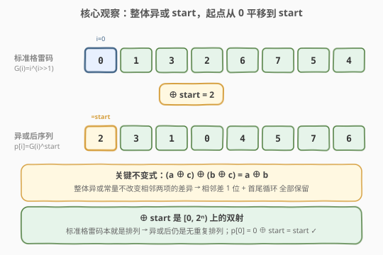
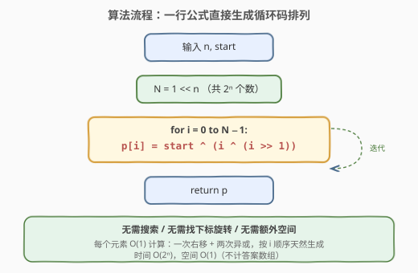
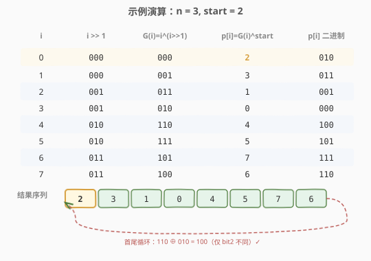

# LeetCode 循环码排列 题解

## 1. 题目概述

- **标题 / 题号**：循环码排列（#1238，medium）
- **链接**：https://leetcode.cn/problems/circular-permutation-in-binary-representation/
- **难度**：中等
- **标签**：位运算、数学、格雷码

**题意**：给你两个整数 `n` 和 `start`。返回任意一个 $(0, 1, 2, \dots, 2^n - 1)$ 的排列 `p`，满足：

1. $p[0] = \text{start}$；
2. $p[i]$ 与 $p[i+1]$ 的二进制表示**恰好有一位**不同（对所有 $i$）；
3. $p[0]$ 与 $p[2^n - 1]$ 的二进制表示也**恰好有一位**不同（首尾循环）。

**示例 1**：

```text
输入：n = 2, start = 3
输出：[3,2,0,1]
解释：二进制表示 (11,10,00,01)，相邻均差 1 位；[3,1,0,2] 也合法
```

**示例 2**：

```text
输入：n = 3, start = 2
输出：[2,6,7,5,4,0,1,3]
解释：二进制表示 (010,110,111,101,100,000,001,011)
```

**约束**：

- $1 \le n \le 16$
- $0 \le \text{start} < 2^n$

> 💡 **关键信号**：本题是 [89. 格雷编码](../0001-0100/89_格雷编码.md) 的「指定起点」变体——89 题要求从 0 开始的格雷码，本题把起点换成任意 `start`。$n \le 16$ 意味着结果最多 $2^{16} = 65536$ 个元素，$O(2^n)$ 的构造算法完全可行。题目说「返回任意一个」，所以**直接构造**而非搜索。

## 2. 解题思路

### 2.1 暴力思路：回溯搜索

从 `start` 出发逐个放置数字，每次选与上一个数「异或后 popcount 为 1」的未用候选，DFS 走满 $2^n$ 步并验证首尾循环。剪枝虽强，但最坏情况仍可能走大量死路。对构造题而言，**与其搜索，不如直接构造**——格雷码本就有优美的数学结构。

### 2.2 核心观察：整体异或 start



回顾 [89 题](../0001-0100/89_格雷编码.md) 的公式法：标准格雷码

$$G(i) = i \oplus (i \gg 1), \quad i = 0, 1, \dots, 2^n - 1$$

是一个从 **0 开始**的合法循环码排列（相邻差 1 位、首尾也差 1 位）。本题唯一多出的约束是「**起点必须是 `start`**」。能否把「从 0 开始」的序列改造成「从 `start` 开始」？

> **关键不变式**：把序列里**每个元素都异或同一个常量 `start`**，即令 $p[i] = G(i) \oplus \text{start}$。则：
>
> - **起点对齐**：$p[0] = G(0) \oplus \text{start} = 0 \oplus \text{start} = \text{start}$ ✓
> - **相邻性不变**：$(p[i] \oplus p[i+1]) = (G(i) \oplus c) \oplus (G(i+1) \oplus c) = G(i) \oplus G(i+1)$，异或常量在两边**抵消**，所以 popcount 仍为 1 ✓
> - **首尾循环不变**：同理 $p[0] \oplus p[2^n-1] = G(0) \oplus G(2^n-1)$，popcount 为 1 ✓
> - **仍是排列**：$\oplus\, c$ 是 $[0, 2^n)$ 上的**双射**（自逆运算），标准格雷码本就是排列，异或后依旧无重复、覆盖全集 ✓

于是得到一行闭式解：

$$p[i] = \text{start} \oplus i \oplus (i \gg 1), \quad i = 0, 1, \dots, 2^n - 1$$

> ⚠️ **不要混淆「整体异或」与「找下标旋转」**：另一种正确思路是先找到使 $G(j) = \text{start}$ 的下标 $j$，再把数组旋转成 $[G(j), G(j+1), \dots, G(N-1), G(0), \dots, G(j-1)]$。这也合法，但需要额外一趟查找 + 旋转。而「整体异或 `start`」是**等价且更简洁**的变换——位置不变、只改值，$p[0]$ 直接就是 `start`。

### 2.3 算法流程图



公式法的流程极其精简：

1. 计算总数 $N = 1 \ll n$；
2. 对 $i$ 从 $0$ 到 $N - 1$，计算 $p[i] = \text{start} \oplus (i \oplus (i \gg 1))$；
3. 返回 `p`。

### 2.4 示例演算（n = 3, start = 2）



以 $n = 3, \text{start} = 2$ 为例，$N = 8$，逐项计算 $p[i] = 2 \oplus i \oplus (i \gg 1)$：

| 步骤 | $i$ | $i \gg 1$ | $G(i)=i\oplus(i\gg1)$ | $p[i]=G(i)\oplus\text{start}$ | $p[i]$ 二进制 |
|------|-----|-----------|------------------------|-------------------------------|---------------|
| 1 | 0 | 000 | 000 | **2** | 010 |
| 2 | 1 | 000 | 001 | **3** | 011 |
| 3 | 2 | 001 | 011 | **1** | 001 |
| 4 | 3 | 001 | 010 | **0** | 000 |
| 5 | 4 | 010 | 110 | **4** | 100 |
| 6 | 5 | 010 | 111 | **5** | 101 |
| 7 | 6 | 011 | 101 | **7** | 111 |
| 8 | 7 | 011 | 100 | **6** | 110 |

最终序列 $[2, 3, 1, 0, 4, 5, 7, 6]$，验证相邻差异：

- $010 \oplus 011 = 001$（bit0）✓
- $011 \oplus 001 = 010$（bit1）✓
- $001 \oplus 000 = 001$（bit0）✓
- $000 \oplus 100 = 100$（bit2）✓
- $100 \oplus 101 = 001$（bit0）✓
- $101 \oplus 111 = 010$（bit1）✓
- $111 \oplus 110 = 001$（bit0）✓
- 首尾循环 $110 \oplus 010 = 100$（bit2）✓

起点 $p[0] = 2 = \text{start}$ ✓，且为 $[0,7]$ 的排列 ✓。注意题目示例 2 给出的是 $[2,6,7,5,4,0,1,3]$，本题允许**任意合法排列**，两者均正确。

## 3. 参考代码

### 方法一：整体异或公式法（最优，推荐）

### C++

```cpp
class Solution {
  public:
    vector<int> circularPermutation(int n, int start) {
        int N = 1 << n;
        vector<int> ans(N);
        for (int i = 0; i < N; ++i) {
            ans[i] = start ^ (i ^ (i >> 1));
        }
        return ans;
    }
};
```

### Python

```python
class Solution:
    def circularPermutation(self, n: int, start: int) -> List[int]:
        return [start ^ (i ^ (i >> 1)) for i in range(1 << n)]
```

> 💡 **一行 Python**：在 89 题公式 $G(i)=i\oplus(i\gg1)$ 的基础上**再异或 `start`** 即可。无需查找下标、无需旋转数组、无需额外空间（除答案数组外）。面试中先写出此式，再口述「整体异或保持相邻差异不变」的直觉即可。

### 方法二：下标旋转法（等价，对照用）

先按 89 题生成标准格雷码，找到 `start` 所在下标 `j`，再把数组从 `j` 处旋转到首位。

### C++

```cpp
class Solution {
  public:
    vector<int> circularPermutation(int n, int start) {
        int N = 1 << n;
        vector<int> g(N);
        for (int i = 0; i < N; ++i) {
            g[i] = i ^ (i >> 1);
        }
        int j = 0;
        while (g[j] != start) ++j;
        vector<int> ans;
        ans.reserve(N);
        for (int k = 0; k < N; ++k) {
            ans.push_back(g[(j + k) % N]);
        }
        return ans;
    }
};
```

### Python

```python
class Solution:
    def circularPermutation(self, n: int, start: int) -> List[int]:
        N = 1 << n
        g = [i ^ (i >> 1) for i in range(N)]
        j = g.index(start)
        return g[j:] + g[:j]
```

> ⚠️ **两种方法等价吗？** 严格说生成的是**不同**的合法序列（旋转法保持标准格雷码的相对次序只是换了起点，而整体异或法对每个值都做了变换）。但两者都满足全部约束，本题只要求「任意一个」，故任选其一即可。整体异或法代码更短、常数更小，**面试首选**。

## 4. 复杂度分析

| 维度 | 复杂度 | 说明 |
|------|--------|------|
| 时间复杂度 | $O(2^n)$ | 生成 $2^n$ 个数，每个数一次右移 + 两次异或，$O(1)$ 计算 |
| 空间复杂度 | $O(2^n)$ | 答案数组存储 $2^n$ 个元素（不计输出则 $O(1)$） |

$n = 16$ 时 $2^{16} = 65536$，毫秒级完成。两种方法时间复杂度相同；下标旋转法多一趟 $O(2^n)$ 的查找 + 一次旋转，常数略大。

## 5. 扩展：为什么「整体异或」能保相邻性？

「整体异或常量保持相邻差异」是一个**普适技巧**，本质在于异或在两边的抵消：

$$
(a \oplus c) \oplus (b \oplus c) = a \oplus b
$$

这意味着对**任何**「相邻差恰好 1 位」的序列 $\{x_i\}$，整体异或任意常量 $c$ 后的新序列 $\{x_i \oplus c\}$ 仍保持该性质——因为相邻两项的异或值不变，popcount 自然不变。同理首尾循环性也由 $x_0 \oplus x_{N-1}$ 决定，异或常量同样抵消。

更进一步：$\oplus\, c$ 是 $[0, 2^n)$ 上的双射（其逆运算就是再 $\oplus\, c$），所以「排列性」也被保留。**三个约束在「整体异或」下全部不变**，这正是本题能一行解决的根本原因。

> 💡 **推广**：凡是「给一个合法格雷码序列换起点 / 换视角」的需求，都可优先考虑整体异或。例如要求序列按某个特定值对齐，或要把一个格雷码序列「平移」到另一段值域，异或常量都是首选工具。

## 6. 面试要点

1. **本题和 89 题格雷编码的关系？**

   89 题要求返回从 0 开始的格雷码序列；本题在其基础上加了「起点必须是 `start`」的约束。解法就是 89 题公式 $G(i)=i\oplus(i\gg1)$ 再整体异或 `start`：$p[i]=\text{start}\oplus i\oplus(i\gg1)$。

2. **为什么整体异或 `start` 后仍合法？**

   三个约束都依赖「相邻两项异或值的 popcount」：异或常量在两边抵消，$(a\oplus c)\oplus(b\oplus c)=a\oplus b$，所以相邻差 1 位、首尾循环全部保留。又因 $\oplus\, c$ 是双射，序列仍是 $[0,2^n)$ 的排列。而 $p[0]=0\oplus\text{start}=\text{start}$，起点约束也满足。

3. **能不能用「找下标 + 旋转数组」做？**

   可以，也是合法做法：先生成标准格雷码，找到 `start` 的下标 `j`，把数组从 `j` 旋转到首位即可。但比整体异或多一趟查找和一次旋转，常数更大、代码更长。两种方法生成的序列不同，但都正确（题目允许任意合法排列）。

4. **$n = 16$ 时性能如何？**

   $2^{16}=65536$ 个元素，每个元素 $O(1)$ 计算，整体 $O(2^n)$ 时间、毫秒级完成。空间主要是答案数组 $O(2^n)$，不计输出则 $O(1)$。

5. **如何验证一个输出序列确实合法？**

   四个条件逐项检查：① $p[0]=\text{start}$；② 长度为 $2^n$ 且元素互异（可用集合判重）；③ 每个元素在 $[0, 2^n)$ 内；④ 相邻（含首尾）的异或结果 `popcount` 恰为 1，即 `(a ^ b).bit_count() == 1`。

## 同类练习题

| # | 题目 | 与本题的关联 |
|---|------|-------------|
| 89 | [格雷编码](https://leetcode.cn/problems/gray-code/)（[站内题解](../0001-0100/89_格雷编码.md)） | 本题的母题，标准格雷码 $G(i)=i\oplus(i\gg1)$ 从 0 开始；本题是其「指定起点」变体 |
| 191 | [位 1 的个数](https://leetcode.cn/problems/number-of-1-bits/)（[站内题解](../0001-0100/191_位1的个数.md)） | `popcount` 是验证「相邻差 1 位」的核心工具 |
| 371 | [两整数之和](https://leetcode.cn/problems/sum-of-two-integers/)（[站内题解](../0301-0400/371_两整数之和.md)） | 异或的「不进位加法」性质，与本题「异或常量抵消」同属位运算基础 |
| 468 | [验证 IP 地址](https://leetcode.cn/problems/validate-ip-address/) | 分段 + 规则校验的对照题，体会「构造题直接构造 vs 校验题逐项检查」的不同范式 |
| 78 | [子集](https://leetcode.cn/problems/subsets/)（[站内题解](../0001-0100/78_子集.md)） | 二进制枚举 $2^n$ 个子集，与格雷码枚举 $2^n$ 个码字共享「位向量空间」思想 |
