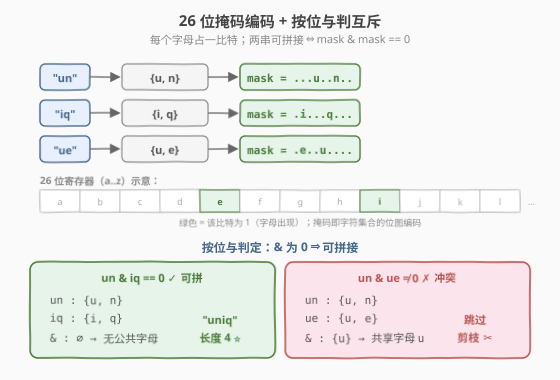
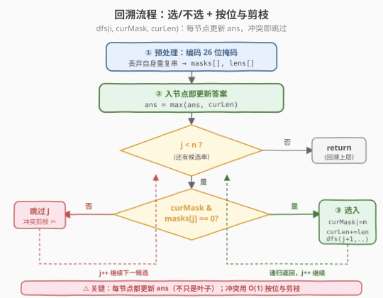
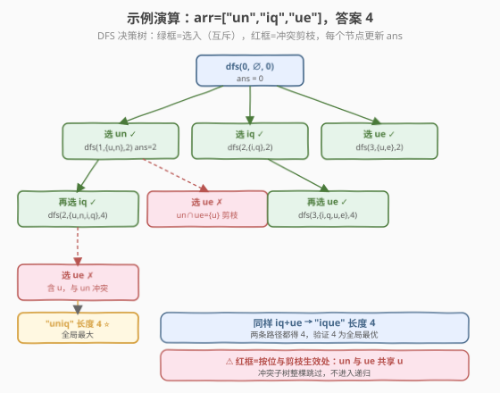

# 串联字符串的最大长度

- **题目名称**：串联字符串的最大长度
- **链接**：[1239. 串联字符串的最大长度](https://leetcode.cn/problems/maximum-length-of-a-concatenated-string-with-unique-characters/)
- **难度**：中等
- **标签**：位运算、数组、字符串、回溯

## 1. 题目概述

给定一个字符串数组 `arr`，字符串 `s` 是将 `arr` 的含有**不同字母**的**子序列**字符串**连接**所得的字符串。请返回所有可行解 `s` 中最长长度。

**子序列**：可以从数组中派生而来，通过删除某些元素或不删除元素而不改变其余元素的顺序（即每个字符串最多用一次、保持原顺序）。

**示例 1**：

```text
输入：arr = ["un","iq","ue"]
输出：4
解释：可能的串联组合有 "","un","iq","ue","uniq"("un"+"iq"),"ique"("iq"+"ue")，最大长度为 4。
```

**示例 2**：

```text
输入：arr = ["cha","r","act","ers"]
输出：6
解释：可能的解答有 "chaers"("cha"+"r"+"ers") 和 "acters"("act"+"ers")。
```

**示例 3**：

```text
输入：arr = ["abcdefghijklmnopqrstuvwxyz"]
输出：26
```

**约束条件**：

- $1 \le \text{arr.length} \le 16$
- $1 \le \text{arr[i].length} \le 26$
- `arr[i]` 中只含有小写英文字母

> 💡 **关键信号**：$\text{arr.length} \le 16$ 是回溯/子集枚举的甜区——$2^{16} = 65536$，指数级但可接受；而字母表只有 26 个小写字母，**天然适合用 26 位整数编码每个字符串的字符集合**。两件事合起来指向「**位运算 + 回溯**」：用位掩码表示字符集，用 `&` 判定两串是否字符互斥，回溯枚举所有可拼接的子序列。

---

## 2. 解题思路

### 2.1 暴力思路：枚举所有子序列逐个验证

最直白的做法：枚举 `arr` 的所有 $2^n$ 个子序列，对每个子序列把字符串拼起来，检查拼接结果是否所有字符都唯一，记录合法者的最大长度。

能过，但有两个浪费：

1. **重复拼接校验**：每次都从头扫描拼接后的长字符串判重，$O(\text{总长})$。
2. **无剪枝**：即便当前已和某串冲突，仍会把后续所有组合都试一遍。

> ⚠️ 暴力法的瓶颈在于「判重」开销和「无剪枝」。把判重从「字符串扫描」升级为「位掩码按位与 $O(1)$」，并允许在冲突处直接剪枝，就是本题的最优解形态。

### 2.2 核心观察：位掩码编码 + 按位与判互斥

关键直觉有两层。

**第一层：26 位整数编码字符集。** 小写字母共 26 个，每个字母占一个比特位。字符串 `"un"` 含 `u`、`n` 两个字母，编码为 `mask(un) = (1<<'u'-'a') | (1<<'n'-'a')`。整个字符串压缩进一个 `int`，字符集合的并/交/判重全变成位运算。



**第二层：两串可拼接 ⇔ 掩码按位与为 0。** 若 `mask(a) & mask(b) == 0`，说明两串没有公共字母，拼接后字符全唯一，可以合并为 `mask(a) | mask(b)`、长度相加；否则有字母冲突，不能同时选。

由此还得到一个**预处理优化**：若某个字符串**自身**就含重复字母（如 `"aa"`），它在编码时会出现「同一比特位被设置两次」——编码过程中检测到 `mask & bit != 0` 即可直接丢弃该串，因为它永远不可能出现在任何合法解里。

> 💡 **位掩码把「集合运算」摊销到 $O(1)$**：判互斥用 `&`、求并用 `|`、判自身重复用编码时检测冲突。这是所有「字符集/状态集 ≤ 64」类问题的通用武器——本题 26 字母、[474. 一和零](https://leetcode.cn/problems/ones-and-zeroes/) 的 0/1 串、[187. 重复的 DNA 序列](https://leetcode.cn/problems/repeated-dna-sequences/) 的 4 碱基，都是同一套位压缩思路。

### 2.3 算法流程图

把「选/不选」回溯套上位掩码：每层决策第 `i` 个（过滤后的）字符串，维护当前已选掩码 `curMask` 与累计长度 `curLen`。



完整步骤：

1. **预处理**：把每个字符串编码为 26 位掩码；编码时若发现某比特已被设置（自身重复），丢弃该串。得到有效掩码数组 `masks` 与对应长度数组 `lens`。
2. **回溯** `dfs(i, curMask, curLen)`：
   - **入节点即更新答案**：`ans = max(ans, curLen)`（每个节点都是一种合法拼接方案）。
   - 从 `j = i` 到 `n-1` 枚举下一个要加入的字符串：
     - 若 `curMask & masks[j] == 0`（互斥可拼），递归 `dfs(j+1, curMask | masks[j], curLen + lens[j])`。
     - 否则跳过 `j`（剪枝：冲突的不选）。
3. 返回 `ans`。

> ⚠️ **为什么用「start 索引循环」而非「二叉选/不选」？** 本题只求最大长度、不求所有方案，且「选了 `j` 之后只能往后选」天然用 `start` 索引避免重复组合（与 [78. 子集](78_子集.md) 的 start 循环版同构）。每个节点都更新 `ans`（而不是只在叶子），因为「空拼接」「只选前几个」都是合法方案。

### 2.4 示例演算

以 `arr = ["un","iq","ue"]` 为例。预处理后三个字符串都无自身重复：

| 字符串 | 掩码（字母位） | 长度 |
|--------|----------------|------|
| `"un"` | `{u, n}` | 2 |
| `"iq"` | `{i, q}` | 2 |
| `"ue"` | `{u, e}` | 2 |



DFS 访问过程（`dfs(i, curMask, curLen)`，每节点更新 `ans`）：

| 步骤 | 调用 | 决策 | curMask | curLen | ans | 说明 |
|------|------|------|---------|--------|-----|------|
| 0 | dfs(0,0,0) | 入节点 | ∅ | 0 | 0 | 空方案 |
| 1 | dfs(1,un,2) | 选 un | {u,n} | 2 | 2 | un 与 ∅ 互斥 |
| 2 | dfs(2,un\|iq,4) | 再选 iq | {u,n,i,q} | 4 | **4** ⭐ | iq 与 un 互斥 |
| 3 | dfs(2,iq,2) | 选 iq | {i,q} | 2 | 4 | 回到层 0 选 iq |
| 4 | dfs(3,iq\|ue,4) | 再选 ue | {i,q,u,e} | 4 | 4 | ue 与 iq 互斥 → "ique" |
| 5 | dfs(3,ue,2) | 选 ue | {u,e} | 2 | 4 | 回到层 0 选 ue |

关键剪枝点：步骤 2 选了 `un` 后，`ue` 与 `un` 都含 `u`（`mask(un) & mask(ue) ≠ 0`），被跳过——这就是按位与剪枝起作用的时刻。最终答案 **4**（对应 `"uniq"` 或 `"ique"`）。

> 💡 注意步骤 2 之后 `curLen` 已达 4，但回溯仍会尝试「不选 un、改选 iq+ue」等分支，它们也都得到 4，说明 4 确实是全局最大而非首条路径的偶然值。

---

## 3. 参考代码

### 方法一：回溯 + 位掩码（推荐）

### C++

```cpp
// 串联字符串的最大长度.cpp —— 回溯 + 位掩码
// 编译: g++ -O2 -std=c++17 串联字符串的最大长度.cpp -o maxconcat
#include <functional>
#include <string>
#include <vector>
using namespace std;

class Solution {
  public:
    int maxLength(vector<string>& arr) {
        // 预处理：编码为 26 位掩码，丢弃自身含重复字母的串
        vector<int> masks, lens;
        for (const string& s : arr) {
            int m = 0;
            bool ok = true;
            for (char c : s) {
                int bit = 1 << (c - 'a');
                if (m & bit) {        // 自身重复，永不可用
                    ok = false;
                    break;
                }
                m |= bit;
            }
            if (ok) {
                masks.push_back(m);
                lens.push_back((int)s.size());
            }
        }

        int n = (int)masks.size();
        int ans = 0;
        // i: 下一个可选下标；curMask: 已选字符并集；curLen: 已选总长
        function<void(int, int, int)> dfs = [&](int i, int curMask, int curLen) {
            ans = max(ans, curLen);             // 每个节点都更新答案
            for (int j = i; j < n; ++j) {
                if ((curMask & masks[j]) == 0) { // 互斥才能拼
                    dfs(j + 1, curMask | masks[j], curLen + lens[j]);
                }
            }
        };
        dfs(0, 0, 0);
        return ans;
    }
};
```

### Python

```python
class Solution:
    def maxLength(self, arr: list[str]) -> int:
        # 预处理：编码为 26 位掩码，丢弃自身含重复字母的串
        masks: list[int] = []
        lens: list[int] = []
        for s in arr:
            m = 0
            ok = True
            for c in s:
                bit = 1 << (ord(c) - 97)
                if m & bit:              # 自身重复，永不可用
                    ok = False
                    break
                m |= bit
            if ok:
                masks.append(m)
                lens.append(len(s))

        n = len(masks)
        ans = 0

        def dfs(i: int, cur_mask: int, cur_len: int) -> None:
            nonlocal ans
            ans = max(ans, cur_len)                  # 每个节点都更新答案
            for j in range(i, n):
                if cur_mask & masks[j] == 0:         # 互斥才能拼
                    dfs(j + 1, cur_mask | masks[j], cur_len + lens[j])

        dfs(0, 0, 0)
        return ans
```

> 💡 **为什么不维护 `path` 列表？** 本题只问最大长度，不要求输出具体拼接方案。因此用标量 `curLen` 累加长度、`curMask` 累积字符集即可，省去 `push/pop` 与拷贝。若面试官追问「输出方案」，再加一个 `path` 数组在选/撤销处同步增删即可。

### 方法二：迭代合并可达掩码集合

不用递归，维护「目前已能生成的所有合法拼接掩码」列表，逐个字符串尝试并入。

### Python

```python
class Solution:
    def maxLength(self, arr: list[str]) -> int:
        # dp: 当前所有可达的 (mask, length)；初始只有空方案 (0, 0)
        dp = [(0, 0)]
        for s in arr:
            m = 0
            ok = True
            for c in s:
                bit = 1 << (ord(c) - 97)
                if m & bit:
                    ok = False
                    break
                m |= bit
            if not ok:
                continue
            # 用本轮新并入的掩码扩展 dp（只读旧项，追加新项）
            for cur_mask, cur_len in dp[:]:
                if cur_mask & m == 0:
                    dp.append((cur_mask | m, cur_len + len(s)))
        return max(length for _, length in dp)
```

> ⚠️ **必须用** `dp[:]` **快照**：在遍历 `dp` 的同时向其追加新项，若不切片会无限扩展。这是「滚动扩张」型 DP 的经典陷阱（与 [78. 子集](78_子集.md) 迭代扩张法同源）。该方法最坏仍生成 $O(2^n)$ 个组合，但常数比递归大、且无法剪枝，面试中以方法一为主、方法二作为对照。

---

## 4. 复杂度分析

| 维度 | 方法一：回溯 + 位掩码 | 方法二：迭代合并 |
|------|----------------------|------------------|
| **时间复杂度** | $O(2^n)$ | $O(2^n)$ |
| **空间复杂度** | $O(n)$（递归栈，不计答案） | $O(2^n)$（保存所有可达掩码） |
| **能否剪枝** | ✅ 冲突处直接跳过 | ❌ 全量扩张 |
| **常数** | 小（位运算 $O(1)$ 判定） | 较大（列表追加 + 元组） |

> ⚠️ 设 $n$ 为**过滤后**的有效字符串数（$\le 16$）。时间 $O(2^n)$ 的来源：所有子序列共 $2^n$ 个，回溯每个节点做一次 $O(1)$ 的按位与判定。$n = 16$ 时 $2^{16} = 65536$，毫秒级完成。空间 $O(n)$ 指递归深度最大 $n$ 层；方法二需保存全部可达掩码故为 $O(2^n)$。

---

## 5. 扩展：剩余长度上界剪枝

当数据较强（多个长字符串、答案已较大）时，可加一道**上界剪枝**进一步加速：预处理后缀最大长度 `suffixMax[i] = max(lens[i..n-1])`，在 `dfs` 入口判断

$$\text{curLen} + \text{suffixMax}[i] \le \text{ans}$$

若成立，说明即便把剩余全部可拼的都加上也无法超越当前最优，直接 `return`。

```cpp
// 在方法一基础上新增后缀最大长度剪枝
vector<int> suffixMax(n + 1, 0);
for (int i = n - 1; i >= 0; --i)
    suffixMax[i] = max(lens[i], suffixMax[i + 1]);

function<void(int, int, int)> dfs = [&](int i, int curMask, int curLen) {
    ans = max(ans, curLen);
    if (curLen + suffixMax[i] <= ans) return;   // 上界剪枝
    for (int j = i; j < n; ++j)
        if ((curMask & masks[j]) == 0)
            dfs(j + 1, curMask | masks[j], curLen + lens[j]);
};
```

> 💡 这是经典的「**剩余可行解上界 ≤ 当前最优则剪**」范式，与 [39. 组合总和](https://leetcode.cn/problems/combination-sum/) 的「剩余和不足 target 剪枝」、[47. 全排列 II](https://leetcode.cn/problems/permutations-ii/) 的同层去重同属回溯三大剪枝套路（上界剪枝 / 约束剪枝 / 去重剪枝）。本题数据弱，不加也能过；加上后面对极端用例更稳。

---

## 6. 面试要点

1. **为什么用 26 位掩码而不是哈希集合判重？**

   - 字母表只有 26 个小写字母，恰好装进一个 `int` 的低 26 位。判互斥从「扫描两个集合 $O(L)$」降为「按位与 $O(1)$」，并集从「合并两个集合」降为「按位或」。常数极小、代码极简，是 $|\Sigma| \le 64$ 类问题的标准做法。

2. **预处理时为什么要丢弃自身含重复字母的字符串？**

   - 一个字符串若自身就有重复字母（如 `"aa"`、`"aba"`），它无论与谁拼接，结果都必然含重复字母，永远不可能出现在任何合法解里。在编码时检测到 `mask & bit != 0` 就直接丢弃，既缩小了搜索空间 $n$，也避免了后续重复判定的浪费。

3. **回溯的「选/不选」和「start 索引循环」两种写法有什么区别？**

   - 二叉「选/不选」版：每层对 `arr[i]` 做选或不选两分支，语义直观、易加剪枝。
   - 「start 索引循环」版：每层从 `i` 往后枚举下一个要选的串，天然避免重复组合（`{un,iq}` 与 `{iq,un}` 不会都出现），与 [78. 子集](78_子集.md) 的 start 版同构。
   - 本题只求最大长度、组合无序，两者等价；start 版代码更紧凑，是首选。

4. **时间复杂度为什么是 $O(2^n)$ 而不是 $O(n \cdot 2^n)$？**

   - 与 [78. 子集](78_子集.md) 不同，本题不收集每个子集的完整内容（那需 $O(n)$ 拷贝），只用标量 `curLen` / `curMask` 累积，每个节点 $O(1)$。故总时间为节点数 $O(2^n)$，而非 $O(n \cdot 2^n)$。

5. **迭代合并法（方法二）和回溯法等价吗？**

   - 生成的合法掩码集合相同，最坏时间都是 $O(2^n)$。但迭代法保存全部可达掩码（空间 $O(2^n)$）、无法在冲突处剪枝，常数更大。回溯法空间 $O(n)$、可剪枝、可扩展上界剪枝，是面试首选；迭代法胜在无递归、思路直白，可作为对照或当递归栈受限时的备选。

> 💡 **一句话总结**：$n \le 16$ + 26 字母 → 位掩码编码 + 回溯枚举子序列，`&` 判互斥 $O(1)$ 剪枝，每个节点更新最大长度。时间 $O(2^n)$、空间 $O(n)$，是「小字母表 + 小规模子集枚举」的招牌模板。

---

## 7. 同类练习题

- [78. 子集](https://leetcode.cn/problems/subsets/)（[站内题解](../0001-0100/78_子集.md)）：回溯枚举子集的母题，start 索引循环模板的本题直接来源
- [187. 重复的 DNA 序列](https://leetcode.cn/problems/repeated-dna-sequences/)（[站内题解](../0001-0100/187_重复的DNA序列.md)）：4 碱基用 2 bit 编码 + 滚动哈希，同属「小字母表位压缩」家族
- [474. 一和零](https://leetcode.cn/problems/ones-and-zeroes/)（[站内题解](../0401-0500/474_一和零.md)）：把 0/1 串视作二维费用背包，与本题的字符串位压缩思路对照
- [39. 组合总和](https://leetcode.cn/problems/combination-sum/)：回溯 + 剪枝的招牌题，上界剪枝 / 约束剪枝范式同源
- [1238. 循环码排列](https://leetcode.cn/problems/circular-permutation-in-binary-representation/)（[站内题解](1238_循环码排列.md)）：同区间位运算题，对照「构造型位运算」与「搜索型位运算」的不同范式
