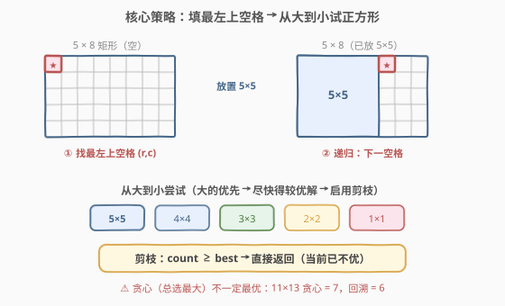
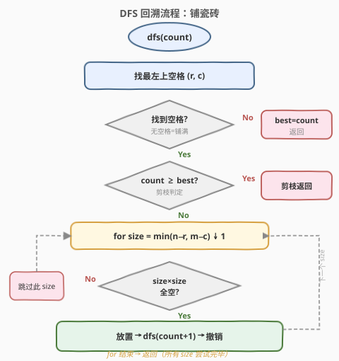
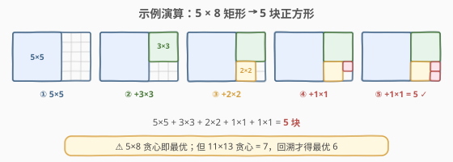

# LeetCode 铺瓷砖 题解

## 1. 题目概述

- **标题 / 题号**：铺瓷砖（#1240，hard）
- **链接**：https://leetcode.cn/problems/tiling-a-rectangle-with-the-fewest-squares/
- **难度**：困难
- **标签**：回溯、动态规划

**题意**：给定一个大小为 $n \times m$ 的长方形，返回贴满矩形所需的**整数边正方形**的最小数量。

**示例 1**：

```text
输入：n = 2, m = 3
输出：3
解释：需要 3 个正方形来覆盖长方形。
     2 个 1×1 的正方形
     1 个 2×2 的正方形
```

**示例 2**：

```text
输入：n = 5, m = 8
输出：5
```

**示例 3**：

```text
输入：n = 11, m = 13
输出：6
```

**约束**：

- $1 \le n, m \le 13$

> 💡 **关键信号**：$n, m \le 13$ 意味着网格最多 $13 \times 13 = 169$ 格，规模极小——这是**回溯搜索**的甜区。更关键的是，$11 \times 13 = 6$ 这个经典反例说明**贪心和简单 DP 都会失效**：最优解需要在中间放一个 $7 \times 7$ 的大正方形，产生 L 形剩余区域，无法由任何一次水平或竖直分割得到。因此必须用回溯枚举所有可能的铺法，配合剪枝加速。

## 2. 解题思路

### 2.1 暴力思路：枚举所有铺法

最直白的做法：在 $n \times m$ 网格上尝试所有可能的正方形放置方案，记录使用块数最少的方案。

问题在于：同一个铺法可以按不同顺序放置正方形，产生大量**等价排列**。例如 $2 \times 3$ 的 3 块正方形有 $3! = 6$ 种放置顺序，但本质是同一种铺法。暴力枚举会在排列空间中爆炸。

> ⚠️ 暴力法的核心瓶颈是**排列重复**：不固定放置顺序的话，$k$ 块正方形对应 $k!$ 种顺序，搜索树膨胀 $k!$ 倍。解决方法是**固定填充顺序**——每次只处理「最左上空格」，消除排列等价。

### 2.2 核心观察：固定顺序 + 从大到小 + 剪枝



三个关键设计将暴力搜索变成高效回溯：

**关键一：固定填充顺序——每次找最左上空格。**

扫描网格（从上到下、从左到右），找到第一个未被覆盖的格子 $(r, c)$。所有合法铺法都必须覆盖这个格子，因此只需要考虑「在 $(r, c)$ 放置一个正方形」这一类决策。这彻底消除了排列等价——搜索树从排列级 $k!$ 缩减到组合级。

**关键二：从大到小尝试正方形。**

在 $(r, c)$ 处可放置的最大正方形边长为 $s_{\max} = \min(n - r, m - c)$（受边界约束）。从 $s_{\max}$ 到 1 依次尝试：检查 $s \times s$ 区域是否全空，若全空则放置、递归、撤销。

从大到小的顺序有**贪心偏置**效果：先尝试大正方形能快速得到一个较优解（即较小的 `best`），使得后续剪枝更早生效。

**关键三：剪枝——`count ≥ best` 直接返回。**

维护全局最优解 `best`（初始为 $n \times m$，即全铺 $1 \times 1$ 的最坏情况）。进入 `dfs(count)` 时若 `count ≥ best`，说明即便后续全部铺满也无法超越已知最优，直接返回。

> 💡 **为什么不能用 DP？** 标准 DP 做法 $dp[i][j] = \min_k(dp[k][j] + dp[i-k][j],\ dp[i][k] + dp[i][j-k])$ 只考虑了「沿一条直线将矩形切成两个子矩形」的铺法。但 $11 \times 13$ 的最优解（6 块）需要在中间放一个 $7 \times 7$ 正方形，剩余区域是 **L 形**，无法由任何一次直线分割得到。DP 会给出 7 而非 6，因此本题必须回溯。详见第 5 节扩展。

### 2.3 算法流程图



完整步骤：

1. **入口** `dfs(count)`：`count` 为已放置的正方形数。
2. **找最左上空格** $(r, c)$：扫描网格找到第一个未覆盖格。
3. **判断铺满**：若无空格，说明已铺满，更新 `best = count`，返回。
4. **剪枝判定**：若 `count ≥ best`，当前分支不可能更优，返回。
5. **枚举 size**：从 $s_{\max} = \min(n-r, m-c)$ 到 1：
   - 检查 $(r, c)$ 起的 $s \times s$ 区域是否全空。
   - 若全空：放置 $s \times s$ → 递归 `dfs(count+1)` → 撤销 $s \times s$。
   - 若不全空：跳过此 size（更小的 size 可能仍可行）。
6. **返回**：所有 size 尝试完毕，回溯到上层。

> ⚠️ **为什么更小的 size 仍可能可行？** 当 size $s$ 因为区域中某个已填充格 $(r+i, c+j)$ 而失败时，若 $i \ge s'$ 且 $j \ge s'$（$s' < s$），则 $s' \times s'$ 区域不包含该格，仍然可行。因此失败后应 `continue` 尝试更小 size，而非 `break`。

### 2.4 示例演算

以 $n=5, m=8$ 为例，展示回溯过程（从大到小尝试，贪心路径直接得到最优）：



| 步骤 | 最左上空格 | 可放最大 | 放置 | 剩余区域 | 累计 |
|------|-----------|---------|------|---------|------|
| ① | (0, 0) | 5 | 5×5 | 5×3 右侧条带 | 1 |
| ② | (0, 5) | 3 | 3×3 | 2×3 右下角 | 2 |
| ③ | (3, 5) | 2 | 2×2 | 2×1 右下角 | 3 |
| ④ | (3, 7) | 1 | 1×1 | 1×1 | 4 |
| ⑤ | (4, 7) | 1 | 1×1 | 无（铺满） | **5** |

> 💡 本例中「从大到小」的贪心路径恰好得到最优解 5。但对于 $11 \times 13$，贪心路径（先放 $11 \times 11$）会产生大量条带碎片，总计 7 块；而回溯会探索「先放 $7 \times 7$」这条分支，找到 6 块的最优解。剪枝使得探索在 `best = 7` 后大量裁剪，实际搜索空间远小于理论上界。

## 3. 参考代码

### C++

```cpp
// 铺瓷砖.cpp —— DFS 回溯 + 剪枝
// 编译: g++ -O2 -std=c++17 铺瓷砖.cpp -o tiling
#include <algorithm>
#include <cstring>
#include <vector>
using namespace std;

class Solution {
    int best;
    int n, m;
    bool filled[14][14];

    void dfs(int count) {
        if (count >= best) return;            // 剪枝

        // 找最左上空格
        int r = -1, c = -1;
        for (int i = 0; i < n && r == -1; ++i)
            for (int j = 0; j < m; ++j)
                if (!filled[i][j]) { r = i; c = j; break; }

        if (r == -1) {                        // 全部铺满
            best = count;
            return;
        }

        int maxS = min(n - r, m - c);
        for (int s = maxS; s >= 1; --s) {     // 从大到小尝试
            // 检查 s×s 区域是否全空
            bool ok = true;
            for (int i = r; i < r + s && ok; ++i)
                for (int j = c; j < c + s; ++j)
                    if (filled[i][j]) { ok = false; break; }
            if (!ok) continue;

            // 放置
            for (int i = r; i < r + s; ++i)
                for (int j = c; j < c + s; ++j)
                    filled[i][j] = true;
            dfs(count + 1);
            // 撤销
            for (int i = r; i < r + s; ++i)
                for (int j = c; j < c + s; ++j)
                    filled[i][j] = false;
        }
    }

  public:
    int tilingRectangle(int nn, int mm) {
        n = nn; m = mm;
        best = n * m;                         // 最坏：全铺 1×1
        memset(filled, 0, sizeof(filled));
        dfs(0);
        return best;
    }
};
```

### Python

```python
class Solution:
    def tilingRectangle(self, n: int, m: int) -> int:
        best = n * m                         # 最坏：全铺 1×1
        filled = [[False] * m for _ in range(n)]

        def dfs(count: int) -> None:
            nonlocal best
            if count >= best:                # 剪枝
                return

            # 找最左上空格
            r = c = -1
            for i in range(n):
                for j in range(m):
                    if not filled[i][j]:
                        r, c = i, j
                        break
                if r != -1:
                    break

            if r == -1:                      # 全部铺满
                best = count
                return

            max_s = min(n - r, m - c)
            for s in range(max_s, 0, -1):    # 从大到小尝试
                # 检查 s×s 区域是否全空
                ok = True
                for i in range(r, r + s):
                    for j in range(c, c + s):
                        if filled[i][j]:
                            ok = False
                            break
                    if not ok:
                        break
                if not ok:
                    continue

                # 放置
                for i in range(r, r + s):
                    for j in range(c, c + s):
                        filled[i][j] = True
                dfs(count + 1)
                # 撤销
                for i in range(r, r + s):
                    for j in range(c, c + s):
                        filled[i][j] = False

        dfs(0)
        return best
```

> 💡 **代码要点**：`filled` 数组记录覆盖状态；`dfs` 入口先剪枝、再找空格、再枚举 size。放置与撤销是严格的对称操作（填 `True` / 复位 `False`），确保回溯后状态完全恢复。`best` 初始化为 $n \times m$（全铺 $1 \times 1$ 的最坏情况），保证第一次搜索就有上界可用。

## 4. 复杂度分析

| 维度 | 复杂度 | 说明 |
|------|--------|------|
| **时间复杂度** | 最坏 $O(n^{n \cdot m})$，实际远小 | 理论上界为每个格子独立选 size 的组合；剪枝后实测 $13 \times 13$ 毫秒级 |
| **空间复杂度** | $O(n \cdot m)$ | `filled` 网格 $O(nm)$ + 递归栈深度最多 $O(nm)$（每次至少填 1 格） |
| **剪枝效果** | 决定性 | 从大到小尝试快速获得较优 `best`，后续大量分支被 `count ≥ best` 裁剪 |

> ⚠️ 本题**没有多项式时间的精确算法**（问题本身是 NP-hard 的变体）。$n, m \le 13$ 的约束是刻意设计的小规模，使回溯 + 剪枝成为可行方案。若无剪枝，即使 $11 \times 13$ 也会超时；有了「固定顺序 + 从大到小 + `count ≥ best`」三重优化，$13 \times 13$ 也能在毫秒内完成。

## 5. 扩展：为什么 DP 会给出错误答案？

一个直觉做法是区间 DP：

$$dp[i][j] = \min \begin{cases} 1 & i = j \\ \min_{k=1}^{i-1}(dp[k][j] + dp[i-k][j]) & \text{横切} \\ \min_{k=1}^{j-1}(dp[i][k] + dp[i][j-k]) & \text{竖切} \end{cases}$$

即：把 $i \times j$ 矩形沿一条直线切成两个子矩形，取最优切分。这对大多数情况有效，但对 $11 \times 13$ 给出 **7** 而非 **6**。

**原因**：$11 \times 13$ 的最优铺法在中间放一个 $7 \times 7$ 正方形，剩余区域是 **L 形**（不可由一次直线分割得到），需要再切成多个子区域。而 DP 只考虑了「一次直线分割成两个矩形」的转移，无法表达这种「先放大正方形再处理 L 形」的结构。

```python
# DP 版本（仅对部分用例正确，11×13 会出错）
def tilingRectangle_dp(n, m):
    dp = [[0] * (m + 1) for _ in range(n + 1)]
    for i in range(1, n + 1):
        for j in range(1, m + 1):
            if i == j:
                dp[i][j] = 1
                continue
            dp[i][j] = i * j  # 最坏：全 1×1
            for k in range(1, i):
                dp[i][j] = min(dp[i][j], dp[k][j] + dp[i - k][j])
            for k in range(1, j):
                dp[i][j] = min(dp[i][j], dp[i][k] + dp[i][j - k])
    return dp[n][m]
# tilingRectangle_dp(11, 13) → 7（错误，正确答案为 6）
```

> 💡 本题是「**DP 最优子结构不成立**」的经典案例。面试中如果提出 DP 解法，一定要用 $11 \times 13$ 这个反例自我检验——如果 DP 无法处理 L 形分割，就必须转向回溯。

## 6. 面试要点

1. **为什么每次只填最左上空格？**

   - 所有合法铺法必须覆盖每个格子。固定「先填最左上空格」后，每步只需决定「在该位置放多大的正方形」，消除了同一铺法的 $k!$ 种放置顺序等价，将搜索树从排列级缩减到组合级。

2. **为什么从大到小尝试 size？**

   - 大正方形覆盖面积多、用块少，先尝试大 size 能快速到达铺满状态、获得较小的 `best`。随后小 size 分支因 `count ≥ best` 被大量剪掉。若改为从小到大，首次铺满需 $n \times m$ 块，`best` 过大导致剪枝几乎无效。

3. **剪枝条件 `count ≥ best` 是否会漏掉最优解？**

   - 不会。进入 `dfs(count)` 时若 `count ≥ best`，即便后续每步只放 1 块就铺满（实际不可能更快），总块数也 $\ge count \ge best$，无法严格优于已知最优。若 `count < best` 且铺满，则 `best = count` 严格改进。因此剪枝安全。

4. **为什么 DP 对 $11 \times 13$ 会出错？**

   - DP 转移只考虑沿一条直线将矩形切成两个子矩形。$11 \times 13$ 的最优解在中间放 $7 \times 7$，产生 L 形剩余区域，不可由一次直线分割得到。DP 的最优子结构在此不成立。

5. **时间复杂度上界是多少？为什么 $n, m \le 13$ 可行？**

   - 理论最坏为指数级（每格可选多种 size），但三重优化（固定顺序消除排列、从大到小偏置贪心、`count ≥ best` 剪枝）使得实际搜索树极小。LeetCode 将约束设为 $\le 13$ 正是为了让回溯可行而 DP 不可行，考察对算法范式的选择能力。

> 💡 **一句话总结**：$n, m \le 13$ + DP 反例 $11 \times 13$ → 必须回溯。固定填最左上空格消除排列、从大到小尝试贪心偏置、`count ≥ best` 剪枝三件套，是搜索类问题「小规模 + 无最优子结构」的招牌模板。

## 同类练习题

| # | 题目 | 与本题的关联 |
|---|------|-------------|
| 79 | [单词搜索](https://leetcode.cn/problems/word-search/)（[站内题解](../0001-0100/79_单词搜索.md)） | 网格上的 DFS + 回溯，撤销操作同构（标记/复位访问状态） |
| 51 | [N 皇后](https://leetcode.cn/problems/n-queens/)（[站内题解](../0001-0100/51_N皇后.md)） | 回溯 + 剪枝招牌题，「逐行放置 + 列/对角线判重」与本题「逐格填充 + 区域判空」同范式 |
| 37 | [解数独](https://leetcode.cn/problems/sudoku-solver/)（[站内题解](../0001-0100/37_解数独.md)） | 网格回溯 + 三表判重剪枝，放置/撤销结构与本题完全一致 |
| 279 | [完全平方数](https://leetcode.cn/problems/perfect-squares/)（[站内题解](../0201-0300/279_完全平方数.md)） | 名字相关但思路不同（完全平方数之和BFS/DP vs 铺砖回溯），作为对照 |
| 473 | [火柴拼正方形](https://leetcode.cn/problems/matchsticks-to-square/) | 回溯 + 剪枝的另一经典应用，将数组分成 k 组等和子集 |
