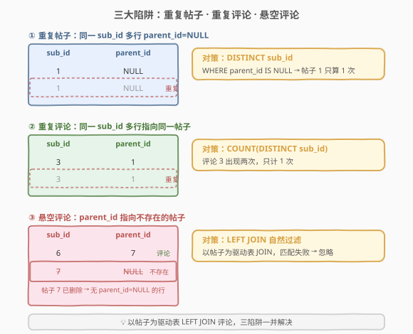
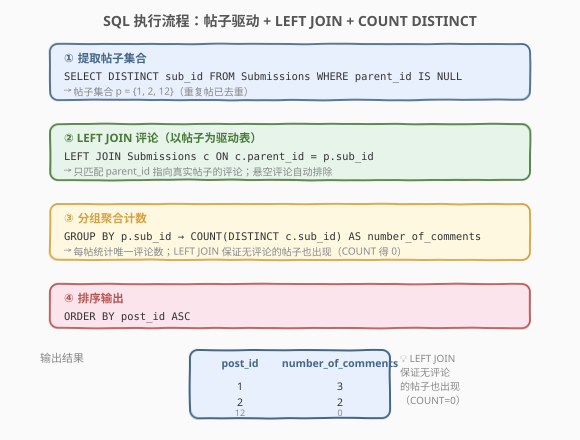
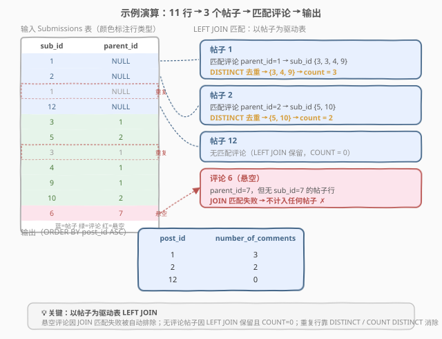

# LeetCode 每个帖子的评论数 题解

## 1. 题目概述

- **标题 / 题号**：每个帖子的评论数（#1241，easy）
- **链接**：https://leetcode.cn/problems/number-of-comments-per-post/
- **难度**：简单
- **标签**：SQL、LEFT JOIN、COUNT DISTINCT、GROUP BY、去重

**题意**：给定 `Submissions` 表，每行可以是一个**帖子**或一条**评论**：

- `parent_id` 为 `NULL` → 该行是**帖子**，`sub_id` 即帖子编号；
- `parent_id` 不为 `NULL` → 该行是**评论**，`parent_id` 指向其所评论帖子的 `sub_id`。

要求编写 SQL 查询，统计**每个帖子的评论数**。结果表包含 `post_id` 和 `number_of_comments`，并按 `post_id` **升序**排列。

**表结构**：

```text
Table: Submissions
+-----------+----------+
| Column Name | Type    |
+-----------+----------+
| sub_id    | int      |
| parent_id | int      |
+-----------+----------+
```

- 此表**无主键**，可能包含**重复行**
- `parent_id` 为 NULL 表示帖子，非 NULL 表示评论

> ⚠️ 本题有**三个陷阱**：① 帖子可能重复出现（需 `DISTINCT` 去重）；② 评论可能重复出现（需 `COUNT(DISTINCT)` 去重）；③ 评论的 `parent_id` 可能指向一个**已删除 / 不存在**的帖子（需以帖子为驱动表 `LEFT JOIN` 自然过滤）。三陷阱一并解决的核心是「**以帖子为左表 LEFT JOIN 评论**」。

**示例 1**：

```text
输入：
Submissions 表:
+---------+-----------+
| sub_id  | parent_id |
+---------+-----------+
| 1       | Null      |
| 2       | Null      |
| 1       | Null      |
| 12      | Null      |
| 3       | 1         |
| 5       | 2         |
| 3       | 1         |
| 4       | 1         |
| 9       | 1         |
| 10      | 2         |
| 6       | 7         |
+---------+-----------+

输出：
+---------+--------------------+
| post_id | number_of_comments |
+---------+--------------------+
| 1       | 3                  |
| 2       | 2                  |
| 12      | 0                  |
+---------+--------------------+
```

**解释**：

| post_id | 评论来源 | 计数说明 |
|---------|---------|---------|
| 1 | `parent_id=1` 的评论：`sub_id` {3, 3, 4, 9} | 评论 3 重复，去重后 {3, 4, 9} → **3** |
| 2 | `parent_id=2` 的评论：`sub_id` {5, 10} | 无重复 → **2** |
| 12 | 无 `parent_id=12` 的评论 | LEFT JOIN 保留，COUNT 得 **0** |

- 帖子 1 出现两次（两行 `sub_id=1, parent_id=NULL`），按**一个帖子**处理
- 评论 3 出现两次，只计**一次**
- 评论 6 的 `parent_id=7`，但表中**没有** `sub_id=7` 的帖子行（已删除），故**忽略**

**约束**：

- `Submissions` 表无主键，可能包含重复的帖子和评论
- 重复帖子视为同一个帖子
- 重复评论只计一次（统计**唯一评论数**）
- 评论的 `parent_id` 可能指向不存在的帖子（悬空评论），需忽略
- 结果按 `post_id` 升序排列

## 2. 解题思路

### 2.1 暴力思路：GROUP BY parent_id（❌ 错误）

最直觉的过程式思路是：找出所有评论行（`parent_id IS NOT NULL`），按 `parent_id` 分组计数：

```sql
-- ❌ 错误写法
SELECT parent_id AS post_id,
       COUNT(DISTINCT sub_id) AS number_of_comments
FROM Submissions
WHERE parent_id IS NOT NULL
GROUP BY parent_id;
```

看似合理，但有**两个致命缺陷**：

1. **悬空评论被错误计入**：评论 6 的 `parent_id=7`，而 7 不是帖子。此写法会输出 `post_id=7, number_of_comments=1`——把一个不存在的帖子当作结果行。
2. **无评论的帖子丢失**：帖子 12 没有任何评论，`GROUP BY parent_id` 不会为它生成行，输出中直接缺少 `post_id=12`。

> ⚠️ 根本问题在于「以评论为驱动表」——评论的 `parent_id` 不可信（可能指向已删帖），且无法覆盖无评论的帖子。正确思路必须**以帖子为驱动表**。

### 2.2 核心观察：以帖子为驱动表 LEFT JOIN 评论



将思路反转：**从帖子出发，去匹配评论**，而非从评论出发去归组。这需要三步处理三个陷阱：

**陷阱①：重复帖子 → `DISTINCT` 去重**

帖子由 `parent_id IS NULL` 的行标识，但同一 `sub_id` 可能出现多行。先用子查询提取**去重后的帖子集合**：

```sql
SELECT DISTINCT sub_id FROM Submissions WHERE parent_id IS NULL
```

得到帖子集合 $P = \{1, 2, 12\}$。

**陷阱②：重复评论 → `COUNT(DISTINCT sub_id)` 去重**

帖子 1 下评论 `sub_id` 为 {3, 3, 4, 9}，其中 3 重复。用 `COUNT(DISTINCT c.sub_id)` 保证同一评论只计一次。

**陷阱③：悬空评论 → `LEFT JOIN` 自然过滤**

以帖子集合 $P$ 为**左表**，`LEFT JOIN Submissions c ON c.parent_id = p.sub_id`：

- 只有 `parent_id` 等于某个帖子 `sub_id` 的评论才会被匹配；
- 评论 6 的 `parent_id=7`，7 不在 $P$ 中，JOIN 条件不成立 → **自动排除** ✓；
- 帖子 12 无匹配评论，`LEFT JOIN` 保留该行，`c.sub_id` 为 NULL → `COUNT(DISTINCT c.sub_id)` 得 0 ✓。

> 💡 **为什么必须 LEFT JOIN 而非 INNER JOIN**：`INNER JOIN` 会丢弃无匹配的左表行，导致帖子 12（0 评论）从结果中消失。`LEFT JOIN` 保留全部帖子，未匹配的行右侧为 NULL，`COUNT(DISTINCT)` 对全 NULL 列计数得 0——恰好满足「无评论帖子也输出」的要求。

### 2.3 算法流程图



**逻辑执行步骤**：

| 步骤 | SQL 子句 | 作用 |
|------|----------|------|
| ① | `SELECT DISTINCT sub_id ... WHERE parent_id IS NULL` | 提取去重后的帖子集合 $P$ |
| ② | `LEFT JOIN Submissions c ON c.parent_id = p.sub_id` | 以帖子为驱动表匹配评论，悬空评论自动排除 |
| ③ | `GROUP BY p.sub_id` + `COUNT(DISTINCT c.sub_id)` | 按帖子分组，统计唯一评论数 |
| ④ | `ORDER BY post_id ASC` | 按帖子编号升序输出 |

> 💡 **SQL 子句执行顺序**：`FROM`（含 `JOIN`）→ `WHERE` → `GROUP BY` → `HAVING` → `SELECT`（含聚合函数）→ `ORDER BY`。子查询中的 `DISTINCT` + `WHERE` 先执行得到帖子集合，再作为左表参与 `LEFT JOIN`，最后 `GROUP BY` 分组聚合。

### 2.4 示例演算



以示例 1 数据为例，逐步跟踪：

**步骤 ①：提取帖子集合**

```sql
SELECT DISTINCT sub_id FROM Submissions WHERE parent_id IS NULL
```

`parent_id IS NULL` 的行有 `sub_id` = {1, 2, 1, 12}，`DISTINCT` 后 → $P = \{1, 2, 12\}$

**步骤 ②：LEFT JOIN 匹配评论**

以 $P$ 为左表，匹配 `c.parent_id = p.sub_id`：

| 帖子 p.sub_id | 匹配到的评论 c.sub_id | 说明 |
|---------------|----------------------|------|
| 1 | 3, 3, 4, 9 | parent_id=1 的评论（3 重复） |
| 2 | 5, 10 | parent_id=2 的评论 |
| 12 | NULL（无匹配） | 无 parent_id=12 的评论 |

> 评论 6（parent_id=7）：7 ∉ $P$，JOIN 失败 → 排除 ✓

**步骤 ③：分组 + COUNT DISTINCT**

| 帖子 | 匹配的 c.sub_id | COUNT(DISTINCT) | number_of_comments |
|------|----------------|-----------------|-------------------|
| 1 | 3, 3, 4, 9 | {3, 4, 9} | **3** |
| 2 | 5, 10 | {5, 10} | **2** |
| 12 | NULL | {} | **0** |

**步骤 ④：排序输出**

按 `post_id ASC` 排序：1, 2, 12 → 最终结果与预期一致 ✓

## 3. 参考代码

### SQL（解法 A：LEFT JOIN + COUNT DISTINCT，推荐）

```sql
SELECT p.sub_id AS post_id,
       COUNT(DISTINCT c.sub_id) AS number_of_comments
FROM (
    SELECT DISTINCT sub_id
    FROM Submissions
    WHERE parent_id IS NULL
) p
LEFT JOIN Submissions c
    ON c.parent_id = p.sub_id
GROUP BY p.sub_id
ORDER BY post_id ASC;
```

> 💡 **写法要点**：
> - **`SELECT DISTINCT sub_id ... WHERE parent_id IS NULL`**：子查询提取去重后的帖子集合，解决「重复帖子」陷阱。
> - **`LEFT JOIN`**：以帖子为左表，保证无评论的帖子也出现在结果中（右侧为 NULL，COUNT 得 0）。若用 `INNER JOIN` 则帖子 12 会丢失。
> - **`COUNT(DISTINCT c.sub_id)`**：对每个帖子统计**唯一**评论数，解决「重复评论」陷阱。当帖子无匹配评论时，`c.sub_id` 全为 NULL，`COUNT` 自动返回 0。
> - **`ORDER BY post_id ASC`**：题目要求按 `post_id` 升序排列。

### SQL（解法 B：相关子查询，等价写法）

```sql
SELECT p.sub_id AS post_id,
       (
           SELECT COUNT(DISTINCT c.sub_id)
           FROM Submissions c
           WHERE c.parent_id = p.sub_id
       ) AS number_of_comments
FROM (
    SELECT DISTINCT sub_id
    FROM Submissions
    WHERE parent_id IS NULL
) p
ORDER BY post_id ASC;
```

> 💡 **写法要点**：用相关子查询替代 `LEFT JOIN + GROUP BY`。子查询 `WHERE c.parent_id = p.sub_id` 自动只匹配当前帖子的评论，悬空评论因 `parent_id` 不等于任何帖子 `sub_id` 而被排除。无评论时 `COUNT` 返回 0，无需 `LEFT JOIN`。逻辑等价于解法 A，但写法更显式——每个帖子的评论数独立计算，适合面试时口述思路。

### SQL（解法 C：WITH 子句 + LEFT JOIN，可读性优先）

```sql
WITH Posts AS (
    SELECT DISTINCT sub_id
    FROM Submissions
    WHERE parent_id IS NULL
)
SELECT p.sub_id AS post_id,
       COUNT(DISTINCT c.sub_id) AS number_of_comments
FROM Posts p
LEFT JOIN Submissions c
    ON c.parent_id = p.sub_id
GROUP BY p.sub_id
ORDER BY post_id ASC;
```

> 💡 **写法要点**：用 `WITH`（CTE）把帖子集合提取为命名临时表 `Posts`，使主查询更清晰。逻辑与解法 A 完全相同，只是把子查询具名化。CTE 在复杂查询中可显著提升可读性，面试推荐此写法。

### Python（pandas）

```python
import pandas as pd

def count_comments(submissions: pd.DataFrame) -> pd.DataFrame:
    posts = submissions.loc[submissions['parent_id'].isna(), 'sub_id'].unique()
    comments = submissions.loc[submissions['parent_id'].notna()]
    comment_counts = comments.groupby('parent_id')['sub_id'].nunique()
    result = pd.DataFrame({'post_id': posts})
    result['number_of_comments'] = result['post_id'].map(comment_counts).fillna(0).astype(int)
    result = result.sort_values('post_id').reset_index(drop=True)
    return result
```

> 💡 **pandas 对照**：
> - `submissions['parent_id'].isna()` 对应 SQL 的 `WHERE parent_id IS NULL`，`.unique()` 对应 `DISTINCT sub_id`。
> - `comments.groupby('parent_id')['sub_id'].nunique()` 对应 `GROUP BY parent_id` + `COUNT(DISTINCT sub_id)`——按 `parent_id` 分组并取唯一 `sub_id` 数。注意此处 `groupby` 的键是 `parent_id`，仅对评论行生效，天然只统计指向某 `parent_id` 的评论。
> - `result['post_id'].map(comment_counts).fillna(0)` 对应 `LEFT JOIN`——把评论计数映射到帖子集合上，无评论的帖子 `fillna(0)` 补 0，等价于 `LEFT JOIN` 保留无匹配行。
> - `.sort_values('post_id')` 对应 `ORDER BY post_id ASC`。

## 4. 复杂度分析

| 维度 | 解法 A（LEFT JOIN） | 解法 B（子查询） | pandas |
|------|---------------------|-----------------|--------|
| **时间** | $O(n)$ | $O(n + k \cdot m)$ | $O(n)$ |
| **空间** | $O(k + n)$ | $O(k)$ | $O(n)$ |
| **可读性** | ✓ 标准 JOIN | ✓ 显式逐帖计数 | ✓ pandas 习惯 |
| **推荐度** | ✓ **首选** | ✓ 备选 | ✓ pandas 环境 |

> - $n$ = `Submissions` 表总行数，$k$ = 去重后帖子数，$m$ = 评论行数
> - 解法 A：子查询 $O(n)$ 扫描去重 + LEFT JOIN $O(n)$（哈希连接）+ 分组聚合 $O(n)$，整体 $O(n)$
> - 解法 B：帖子集合 $O(n)$ + 每个帖子执行一次子查询 $O(m)$，最坏 $O(k \cdot m)$；现代数据库通常会优化为与解法 A 等价的执行计划
> - pandas：`groupby + nunique` $O(n)$，`map` $O(k)$，整体 $O(n)$
> - **索引优化**：在 `parent_id` 上建索引可加速 JOIN 匹配与子查询查找

## 5. 扩展：为什么不能 GROUP BY parent_id？

### 5.1 错误写法的两个缺陷

```sql
-- ❌ 错误：以评论为驱动表 GROUP BY parent_id
SELECT parent_id AS post_id,
       COUNT(DISTINCT sub_id) AS number_of_comments
FROM Submissions
WHERE parent_id IS NOT NULL
GROUP BY parent_id;
```

| 缺陷 | 说明 | 示例 |
|------|------|------|
| **悬空评论误入** | `parent_id` 可能指向不存在的帖子，该评论会被归入一个不存在的 `post_id` | 评论 6 (parent_id=7) → 输出 `post_id=7`，但帖子 7 不存在 |
| **零评论帖子丢失** | 无评论的帖子没有 `parent_id` 等于它的评论行，`GROUP BY` 不会为其生成分组 | 帖子 12 无评论 → 结果中完全缺失 |

### 5.2 正确思路：驱动表的选择

| 方案 | 驱动表 | 悬空评论 | 零评论帖子 | 正确性 |
|------|--------|---------|-----------|--------|
| GROUP BY parent_id | 评论（parent_id） | ✗ 误入 | ✗ 丢失 | ❌ |
| LEFT JOIN（帖子驱动） | 帖子（sub_id） | ✓ 排除 | ✓ 保留 | ✓ |
| 相关子查询 | 帖子（sub_id） | ✓ 排除 | ✓ 保留 | ✓ |

> 💡 **核心原则**：当需要「统计每个主体的关联数量」时，**以主体为驱动表**（LEFT JOIN 或相关子查询），而非以关联记录为驱动表（GROUP BY 外键）。这保证：① 零关联的主体不被遗漏；② 无效外键引用不被误计。

### 5.3 如果要统计所有评论（含嵌套回复）？

本题只统计**直接评论**（`parent_id` = 帖子 `sub_id`）。若要统计帖子下**所有评论**（包括回复其他评论的嵌套评论），需要**递归查询**沿父链追溯到根帖子：

```sql
WITH RECURSIVE CommentTree AS (
    -- 基准：直接评论（parent_id 指向帖子）
    SELECT sub_id, parent_id, parent_id AS root_post_id
    FROM Submissions
    WHERE parent_id IS NOT NULL
    UNION ALL
    -- 递归：回复评论的评论，沿父链向上找根帖子
    SELECT c.sub_id, c.parent_id, ct.root_post_id
    FROM Submissions c
    JOIN CommentTree ct ON c.parent_id = ct.sub_id
)
SELECT p.sub_id AS post_id,
       COUNT(DISTINCT ct.sub_id) AS number_of_comments
FROM (SELECT DISTINCT sub_id FROM Submissions WHERE parent_id IS NULL) p
LEFT JOIN CommentTree ct ON ct.root_post_id = p.sub_id
GROUP BY p.sub_id;
```

> ⚠️ 此扩展仅作思路参考，并非本题要求。MySQL 8.0+、PostgreSQL 等支持 `WITH RECURSIVE`。递归 CTE 沿 `parent_id` 链向上传播 `root_post_id`，使每条评论都能追溯到其所属帖子。

## 6. 面试要点

1. **为什么不能直接 `GROUP BY parent_id`？**

   > 两个缺陷：① 评论的 `parent_id` 可能指向已删除的帖子（悬空评论），`GROUP BY` 会把这种评论归入一个不存在的 `post_id`；② 无评论的帖子不会出现在 `GROUP BY` 结果中。正确做法是以帖子为驱动表 `LEFT JOIN` 评论。

2. **为什么用 `LEFT JOIN` 而非 `INNER JOIN`？**

   > `INNER JOIN` 会丢弃无匹配的左表行。帖子 12 没有任何评论，`INNER JOIN` 后该行消失，结果中缺少 `post_id=12`。`LEFT JOIN` 保留全部帖子，未匹配的行右侧为 NULL，`COUNT(DISTINCT c.sub_id)` 对 NULL 计数得 0，满足「无评论帖子也输出」的要求。

3. **`COUNT(DISTINCT c.sub_id)` 在无匹配时为什么返回 0 而非 NULL？**

   > `LEFT JOIN` 未匹配时右侧所有列为 NULL。`COUNT(DISTINCT expr)` 会**先排除 NULL 值**再计数——当全部值为 NULL 时，可计数的值为零个，故返回 0。这与 `COUNT(c.sub_id)` 行为一致（均忽略 NULL），但 `COUNT(*)` 会返回 1（计入未匹配行本身），因此本题**不能用 `COUNT(*)`**，否则无评论帖子会得到 1 而非 0。

4. **子查询中 `DISTINCT` 的作用是什么？**

   > 帖子可能有多行 `parent_id IS NULL`（如 `sub_id=1` 出现两次）。若不去重，`LEFT JOIN` 时同一个帖子会匹配评论多次，导致 `GROUP BY` 后行数膨胀。虽然 `COUNT(DISTINCT)` 能消除评论重复，但 `GROUP BY` 分组仍可能产生重复的 `post_id` 行。子查询中 `DISTINCT sub_id` 确保每个帖子只出现一次，驱动表干净。

5. **评论 6 的 `parent_id=7`，但表中没有 `sub_id=7` 的帖子行，如何处理？**

   > 以帖子集合 $P = \{1, 2, 12\}$ 为左表 `LEFT JOIN`，JOIN 条件是 `c.parent_id = p.sub_id`。7 不在 $P$ 中，评论 6 无法匹配任何帖子行 → 自动排除，不计入任何帖子的评论数。这正是「以帖子为驱动表」的优势——无效引用被 JOIN 条件天然过滤。

> 💡 **一句话总结**：1241 是 SQL **"LEFT JOIN + COUNT DISTINCT"招牌题**——核心就一句：以 `DISTINCT sub_id WHERE parent_id IS NULL` 提取帖子为左表，`LEFT JOIN` 评论按 `parent_id` 匹配，`GROUP BY` 后 `COUNT(DISTINCT c.sub_id)` 统计唯一评论数，`ORDER BY post_id`。三陷阱（重复帖子、重复评论、悬空评论）一并解决的关键全在「以帖子为驱动表」。

## 同类练习题

| # | 题目 | 与本题的关联 |
|---|------|-------------|
| 1211 | [查询结果的质量和占比](https://leetcode.cn/problems/queries-quality-and-percentage/)（[站内题解](../1101-1200/1211_查询结果的质量和占比.md)） | `GROUP BY` + `AVG` 聚合，同为「分组后多指标统计」SQL 基础题，对比理解 `COUNT DISTINCT` 与 `AVG` 两种聚合 |
| 1205 | [每月交易 II](https://leetcode.cn/problems/monthly-transactions-ii/)（[站内题解](1205_每月交易II.md)） | `GROUP BY` + 多指标聚合 + `UNION` 拼接，共享「分组聚合 + 去重统计」模式 |
| 1174 | [即时食物配送 II](https://leetcode.cn/problems/immediate-food-delivery-ii/)（[站内题解](../1101-1200/1174_即时食物配送II.md)） | `GROUP BY` + `AVG(布尔)` 算比例，对照 `COUNT(DISTINCT)` 的「计数去重」与 `AVG(布尔)` 的「比例统计」 |
| 570 | [至少有 5 名直接下属的经理](https://leetcode.cn/problems/managers-with-at-least-5-direct-reports/) | 自连接 + `GROUP BY` + `HAVING COUNT` 过滤，同为「父子关系表 + 分组计数」模式 |
| 584 | [寻找用户推荐人](https://leetcode.cn/problems/find-customer-referee/) | `LEFT JOIN` / `NOT IN` 查找无匹配行，对照理解「以主体为驱动表 LEFT JOIN」与「以关联表为驱动表」的差异 |
