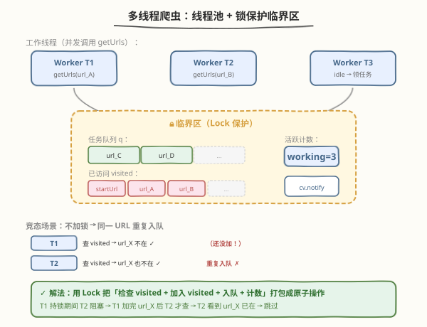
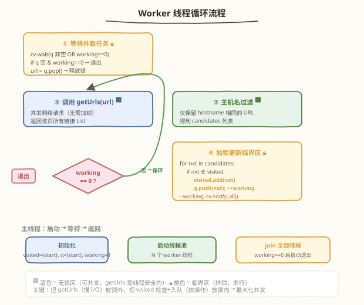

# LeetCode 多线程网络爬虫 题解

## 1. 题目概述

- **标题 / 题号**：多线程网络爬虫（#1242，medium）
- **链接**：https://leetcode.cn/problems/web-crawler-multithreaded/
- **难度**：中等
- **标签**：并发、多线程、BFS、互斥锁、条件变量、线程池

**题意**：给定一个起始 URL `startUrl` 和一个 `HtmlParser` 接口，要求**使用多线程**并发爬取从 `startUrl` 出发**可达**且**与 `startUrl` 主机名相同**的所有网页 URL。

`HtmlParser` 接口提供方法：

- `getUrls(url)`：返回该网页中包含的所有链接（`List[str]`）。

**主机名（hostname）定义**：URL 中 `协议://主机` 部分（即 `://` 之后、第一个 `/` 之前）。两个 URL 主机名相同当且仅当**协议与主机都完全一致**。

> 💡 本题是 [1236. 网络爬虫](../1201-1300/1236_网络爬虫.md) 的**多线程升级版**——题目逻辑完全相同（BFS + 同主机名过滤 + visited 去重），但要求用多线程并发调用 `getUrls` 以加速爬取。单线程实现会因 `getUrls` 模拟网络请求的延迟而超时。

**接口签名**：

```python
class Solution:
    def crawl(self, startUrl: str, htmlParser: 'HtmlParser') -> List[str]:
```

```cpp
class Solution {
public:
    vector<string> crawl(string startUrl, HtmlParser htmlParser) {
```

**示例 1**：

```text
输入：startUrl = "http://news.yahoo.com/news"
     HtmlParser.getUrls("http://news.yahoo.com/news") 返回：
       ["http://news.yahoo.com/news/topics",
        "http://news.yahoo.com/finance",
        "http://news.google.com/news"]
输出：["http://news.yahoo.com/news",
       "http://news.yahoo.com/news/topics",
       "http://news.yahoo.com/finance"]
解释：从 startUrl 出发并发爬取，只保留 hostname == "http://news.yahoo.com" 的链接。
      google.com 主机不同被过滤。多线程同时爬取多个页面，加速完成。
```

**约束**：

- `1 <= startUrl.length <= 300`
- `startUrl` 和所有 `getUrls` 返回的 URL 均为合法 URL
- `getUrls` 每次返回不超过 30 个链接
- 整个可爬取 URL 总数不超过 1000

> ⚠️ **为什么必须多线程**：`getUrls` 模拟网络 I/O，单次调用有延迟。单线程串行爬取 1000 个 URL 会超时。多线程将多个 `getUrls` 并发执行，总时间近似降为 `O(N / 线程数 × 单次延迟)`。

## 2. 解题思路

### 2.1 暴力思路：直接把单线程 BFS 改成多线程

最直觉的做法：把 1236 题的 BFS 队列改用多线程处理——每个线程从队列取一个 URL，调用 `getUrls`，把新发现的同主机名 URL 丢回队列。问题在于**共享数据的竞态条件（race condition）**：

1. **visited 竞态**：线程 T1 和 T2 同时发现 URL_X，都检查 `visited` 发现不在，都把它加入队列 → 同一 URL 被重复爬取，`getUrls` 被重复调用
2. **队列竞态**：多线程同时 `push`/`pop` 队列，可能导致数据结构损坏
3. **终止竞态**：如何判断所有任务都完成了？没有全局计数器就无法知道

### 2.2 核心观察：锁保护临界区 + 条件变量协调终止



关键洞察：**把「慢 I/O」放锁外，把「快操作」放锁内**。具体来说：

- **锁外（可并发）**：`getUrls(url)` 是网络请求，最慢，不需要共享数据 → 多线程并发调用
- **锁内（串行）**：检查 `visited` + 入队 + 更新计数器，都是内存操作，极快 → 用互斥锁串行化

> 💡 **为什么这样分？** 如果把 `getUrls` 放锁内，多线程就退化成串行——每次只有一个线程能爬页面，完全失去了并发的意义。把 `getUrls` 放锁外，多个线程可以同时爬不同页面；锁只保护毫秒级的内存操作，锁竞争极小。

**三个共享数据结构**：

| 数据结构 | 作用 | 保护方式 |
|----------|------|----------|
| `visited` 哈希集合 | 记录已爬 URL，防止重复 | 互斥锁 |
| `q` 任务队列 | 待爬 URL 的 BFS 队列 | 互斥锁 |
| `working` 计数器 | 正在处理（已入队但未完成）的 URL 数 | 互斥锁 |

**终止协调**：用**条件变量** `cv` + 计数器 `working`：
- 主线程启动线程池后，在 `cv.wait(working == 0)` 上等待
- Worker 每完成一个 URL 的处理，`--working`；每发现一个新 URL，`++working`
- 当 `working` 降到 0 时，最后一个完成的 worker `notify_all` 唤醒主线程

### 2.3 算法流程图



**Worker 线程循环**（每个 worker 执行相同逻辑）：

1. **加锁等待**：`cv.wait(q 非空 OR working == 0)`；若 `q` 空且 `working == 0` → 退出
2. **取任务**：`url = q.pop()`，释放锁
3. **并发爬取**（锁外）：`urls = htmlParser.getUrls(url)`
4. **主机名过滤**（锁外）：筛选出 `hostname` 相同的 `candidates`
5. **加锁更新**（锁内）：遍历 `candidates`，未访问的加入 `visited` + `q` + `++working`；然后 `--working`；`cv.notify_all()`
6. 回到步骤 1

**主线程**：

1. 初始化：`visited = {startUrl}`，`q = [startUrl]`，`working = 1`
2. 启动 N 个 worker 线程
3. `join` 全部线程（worker 在 `working == 0` 后自动退出）
4. 返回 `list(visited)`

### 2.4 示例演算

以 `startUrl` 出发可达 `A, B`；`A` 可达 `C, D`；`B` 可达 `D, E` 为例，展示 3 个 worker 的并发执行过程：


| 时刻 | T1 | T2 | T3 | working | 队列 |
|------|----|----|----|---------|------|
| $t_0$ | 🔒 取 start | 等待 | 等待 | 1 | [] |
| $t_1$ | getUrls(start)→[A,B,X✗] | 等待 | 等待 | 1 | [] |
| $t_2$ | 🔒 +A, +B → q | — | — | 2 | [A, B] |
| $t_3$ | 🔒 取 A | 🔒 取 B | 等待 | 2 | [] |
| $t_4$ | getUrls(A)→[C,D] | getUrls(B)→[D,E] | 等待 | 2 | [] |
| $t_5$ | 🔒 +C, +D → q | ⏳ 等 T1 释放锁 | 等待 | 3 | [C, D] |
| $t_6$ | 🔒 取 C | 🔒 D 已访问→跳, +E | 🔒 取 D | 3 | [E] |
| $t_7$ | C 空→work=2 | getUrls(E)→空 | D 空→work=0 | 0 | [] |

> ⚠️ **关键瞬间 $t_5$→$t_6$**：T1 和 T2 都发现了 `D`。T1 先持锁，把 `D` 加入 `visited` 和队列。T2 获锁后发现 `D` 已在 `visited` 中，直接跳过——**锁保证了 `D` 只入队一次**，避免了重复爬取。

最终结果 `visited = {start, A, B, C, D, E}`，共 6 个 URL。`getUrls(A)` 和 `getUrls(B)` 在 $t_4$ 时刻**并发执行**，总时间约为串行的一半。

## 3. 参考代码

### Python

使用 `concurrent.futures.ThreadPoolExecutor` + `threading.Condition`：

```python
from concurrent.futures import ThreadPoolExecutor
import threading
from typing import List

class Solution:
    def crawl(self, startUrl: str, htmlParser: 'HtmlParser') -> List[str]:
        def get_hostname(url: str) -> str:
            # "http://news.yahoo.com/news" -> "http://news.yahoo.com"
            return '/'.join(url.split('/')[:3])

        hostname = get_hostname(startUrl)
        visited = {startUrl}
        lock = threading.Lock()
        cond = threading.Condition(lock)
        working = 0  # 已入队但尚未处理完成的 URL 数

        def worker(url: str):
            nonlocal working
            # ① 锁外并发调用 getUrls（最慢的 I/O，不需要锁）
            candidates = [
                nxt for nxt in htmlParser.getUrls(url)
                if get_hostname(nxt) == hostname
            ]
            # ② 锁内：检查 visited + 入队 + 更新计数（极快的内存操作）
            new_urls = []
            with cond:
                for nxt in candidates:
                    if nxt not in visited:
                        visited.add(nxt)
                        new_urls.append(nxt)
                working += len(new_urls) - 1  # 新增子任务 - 自身完成
                if working == 0:
                    cond.notify_all()
            # ③ 锁外提交新任务
            for nxt in new_urls:
                pool.submit(worker, nxt)

        with ThreadPoolExecutor(max_workers=10) as pool:
            with cond:
                working = 1  # startUrl 入队
                pool.submit(worker, startUrl)
                while working > 0:
                    cond.wait()  # 释放锁并等待，被 notify 唤醒后重新检查
        return list(visited)
```

### C++

使用 `std::thread` + `std::mutex` + `std::condition_variable` 构建线程池：

```cpp
class Solution {
    std::mutex mtx;
    std::condition_variable cv;
    std::unordered_set<std::string> visited;
    std::queue<std::string> q;
    int working = 0;
    std::string hostname;

    // hostname = "协议://主机"，即 "://" 后第一个 '/' 之前的部分
    std::string getHostname(const std::string& url) {
        int i = url.find("://");
        int j = url.find('/', i + 3);
        return j == std::string::npos ? url : url.substr(0, j);
    }

    void worker(HtmlParser* parser) {
        while (true) {
            // ① 加锁等待并取任务
            std::string url;
            {
                std::unique_lock<std::mutex> lk(mtx);
                cv.wait(lk, [&] { return !q.empty() || working == 0; });
                if (q.empty() && working == 0) return;  // 全部完成，退出
                url = q.front();
                q.pop();
            }  // 释放锁

            // ② 锁外并发调用 getUrls（慢 I/O）
            std::vector<std::string> urls = parser->getUrls(url);

            // ③ 主机名过滤（锁外，纯函数无共享状态）
            std::vector<std::string> candidates;
            for (const std::string& nxt : urls) {
                if (getHostname(nxt) == hostname) {
                    candidates.push_back(nxt);
                }
            }

            // ④ 加锁更新临界区
            {
                std::lock_guard<std::mutex> lk(mtx);
                for (const std::string& nxt : candidates) {
                    if (!visited.count(nxt)) {
                        visited.insert(nxt);
                        q.push(nxt);
                        ++working;
                    }
                }
                --working;
                cv.notify_all();  // 唤醒等待的 worker 和主线程
            }
        }
    }

public:
    std::vector<std::string> crawl(std::string startUrl, HtmlParser htmlParser) {
        hostname = getHostname(startUrl);
        visited.insert(startUrl);
        q.push(startUrl);
        working = 1;

        int n = std::min((int)std::thread::hardware_concurrency(), 10);
        if (n == 0) n = 4;
        std::vector<std::thread> threads;
        for (int i = 0; i < n; ++i) {
            threads.emplace_back(&Solution::worker, this, &htmlParser);
        }
        for (auto& t : threads) t.join();

        return std::vector<std::string>(visited.begin(), visited.end());
    }
};
```

## 4. 复杂度分析

| 维度 | 复杂度 | 说明 |
|------|--------|------|
| 时间复杂度 | $O(N \times L / T)$ | $N$ 为同主机名可达 URL 数，$L$ 为 URL 平均长度，$T$ 为线程数。每个 URL 调用一次 `getUrls`（并发执行），hostname 提取与比较为 $O(L)$。墙钟时间近似串行的 $1/T$ |
| 空间复杂度 | $O(N \times L)$ | `visited` 哈希集合 + 任务队列存储所有已爬 URL，最坏全部 $N$ 个 |
| 线程数 | $O(T)$ | 固定 $T$ 个 worker 线程（Python 用 `ThreadPoolExecutor`，C++ 手动创建），$T \leq 10$ |

> 💡 **关键：锁持有时间极短**。`getUrls`（网络 I/O，可能数十毫秒）在锁外执行；锁内只做 `visited` 查询 + 队列 push（微秒级）。因此锁几乎不成为瓶颈，多线程加速比接近 $T$。

## 5. 扩展：Python `Condition` 版 vs `ThreadPoolExecutor` 简化版

### 5.1 为什么用 `Condition` 而非简单的 `join`？

`ThreadPoolExecutor.__exit__` 会 `shutdown(wait=True)`，自动等待所有**已提交**的任务完成。但本题的难点在于**任务是动态发现的**——worker 在运行过程中才发现新的 URL 需要爬取，此时才 `submit` 新任务。主线程无法预知总任务数，因此不能简单地「提交完所有任务后 join」。

`Condition` + `working` 计数器解决了这个问题：

- `working` 追踪所有「已发现但未完成」的 URL
- 主线程在 `cond.wait(working == 0)` 上阻塞
- 只有当所有 URL 都处理完毕（没有新 URL 被发现），`working` 才降为 0

### 5.2 `working += len(new_urls) - 1` 的一行技巧

Python 版用 `working += len(new_urls) - 1` 把「新增子任务」和「自身完成」合并为一次原子更新：

- 新增 `len(new_urls)` 个子任务（每个都会被 `submit`）
- 自身完成，减 1
- 合计 `+len(new_urls) - 1`

如果结果为 0，说明自己是最后一个活跃任务且没有新子任务 → `notify_all` 唤醒主线程。这保证了 `working == 0` 时所有 worker 都已走过 `finally` 逻辑，不会有遗漏的 `submit`。

### 5.3 替代方案：`queue.Queue` + 哨兵

Python 标准库的 `queue.Queue` 本身是线程安全的（内部有锁），可以简化手写加锁：

```python
from concurrent.futures import ThreadPoolExecutor
import queue
import threading

class Solution:
    def crawl(self, startUrl: str, htmlParser: 'HtmlParser') -> List[str]:
        def get_hostname(url):
            return '/'.join(url.split('/')[:3])

        hostname = get_hostname(startUrl)
        visited = {startUrl}
        lock = threading.Lock()
        q = queue.Queue()
        q.put(startUrl)
        working = 1
        working_lock = threading.Lock()
        done = threading.Event()

        def worker():
            nonlocal working
            while True:
                if done.is_set():
                    return
                try:
                    url = q.get(timeout=0.1)
                except queue.Empty:
                    continue
                candidates = [n for n in htmlParser.getUrls(url)
                              if get_hostname(n) == hostname]
                new_urls = []
                with lock:
                    for nxt in candidates:
                        if nxt not in visited:
                            visited.add(nxt)
                            new_urls.append(nxt)
                with working_lock:
                    working += len(new_urls) - 1
                    if working == 0:
                        done.set()
                        return
                for nxt in new_urls:
                    q.put(nxt)

        with ThreadPoolExecutor(max_workers=10) as pool:
            for _ in range(10):
                pool.submit(worker)
        return list(visited)
```

> ⚠️ 这种写法用 `queue.get(timeout=0.1)` 轮询 `done` 事件，比 `Condition` 版多了轮询开销。`Condition` 版的 `cv.wait()` 是真正的阻塞等待，被 `notify` 精准唤醒，更高效。

## 6. 面试要点

1. **为什么 `getUrls` 要放在锁外面？**

   `getUrls` 模拟网络 I/O，是最慢的操作。如果放锁内，多线程退化为串行——同一时刻只有一个线程能爬页面，完全失去并发优势。放锁外，多个线程同时爬不同页面；锁只保护微秒级的 `visited` 查询和队列操作，锁竞争极小，加速比接近线程数。

2. **`working` 计数器的作用是什么？为什么不能只看队列是否为空？**

   队列为空不代表所有工作完成——可能有线程正在调用 `getUrls`（还没把新 URL 入队）。`working` 追踪「已入队但尚未处理完成」的 URL 数：入队时 `++working`，处理完时 `--working`。只有 `working == 0` 才表示真正全部完成（队列空 + 无在途任务）。

3. **「检查 visited」和「加入 visited」为什么必须在同一次持锁中完成？**

   如果分开：T1 检查 `url_X ∉ visited`（持锁→释放），T2 也检查 `url_X ∉ visited`（持锁→释放），然后 T1 加入（持锁→释放），T2 也加入（持锁→释放）→ `url_X` 被加入两次。**检查与修改必须在同一个临界区内**，这是「check-then-act」竞态的经典解法。

4. **为什么用条件变量而不是忙等待（busy-wait）？**

   忙等待（如 `while working > 0: pass`）会持续占用 CPU，浪费资源。条件变量的 `cv.wait()` 会让线程**阻塞**（不占 CPU），直到被 `notify` 唤醒。主线程在等待期间不消耗 CPU，worker 在 `cv.wait(q 非空)` 时也不消耗 CPU。

5. **Python 的 GIL 对本题有影响吗？**

   Python 的 GIL（全局解释器锁）限制同一时刻只有一个线程执行 Python 字节码。但 `getUrls` 模拟的 I/O 操作（或真实的网络请求）会在 I/O 等待时**释放 GIL**，因此多线程在 I/O 密集型任务中仍然有效加速。本题是典型的 I/O 密集型场景，GIL 不构成瓶颈。若改为 CPU 密集型，则需用 `multiprocessing` 或 C 扩展绕过 GIL。

6. **如果 `getUrls` 可能抛异常怎么办？**

   需要用 `try/finally` 确保 `--working` 一定执行，否则 `working` 永远不会降到 0，主线程死等。Python 版可改为：

   ```python
   try:
       candidates = [...]
   finally:
       with cond:
           working += len(new_urls) - 1
           if working == 0:
               cond.notify_all()
   ```

## 同类练习题

| # | 题目 | 与本题的关联 |
|---|------|-------------|
| 1236 | [网络爬虫](https://leetcode.cn/problems/web-crawler/)（[题解](../1201-1300/1236_网络爬虫.md)） | 本题的单线程版，BFS + 同主机名过滤 + visited 去重，是理解本题的基础 |
| 1114 | [按序打印](https://leetcode.cn/problems/print-in-order/) | 并发入门题，用互斥锁/条件变量协调三个线程的执行顺序，理解 `Condition` 的基本用法 |
| 1115 | [交替打印 FooBar](https://leetcode.cn/problems/print-foobar-alternately/) | 两个线程交替执行，条件变量或信号量的经典练习 |
| 1226 | [哲学家进餐](https://leetcode.cn/problems/the-dining-philosophers/)（[题解](../1201-1300/1226_哲学家进餐.md)） | 多线程互斥与死锁避免的经典问题，深入理解锁的粒度与 Coffman 死锁四条件 |
| 1195 | [交替打印字符串](https://leetcode.cn/problems/fizz-buzz-multithreaded/) | 多线程协调打印，条件变量 + 角色分工的综合练习 |
