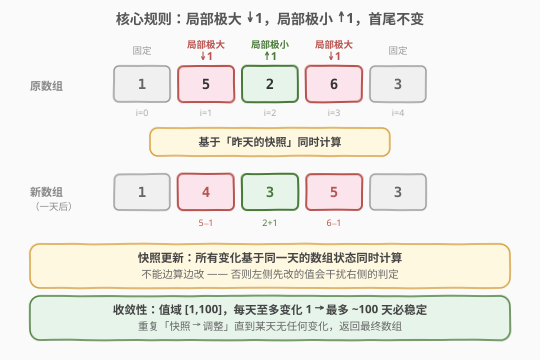
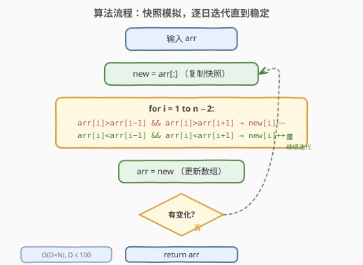
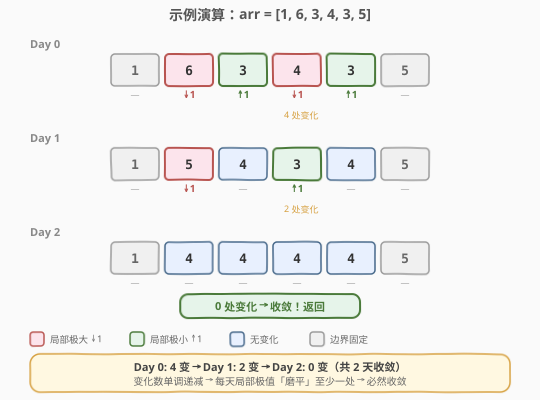

# LeetCode 数组变换 题解

## 1. 题目概述

- **标题 / 题号**：数组变换（#1243，easy）
- **链接**：https://leetcode.cn/problems/array-transformation/
- **难度**：简单
- **标签**：数组、模拟

**题意**：给定一个初始数组 `arr`，每天对数组进行一次变换，规则如下：

- 对于每个**中间元素** `arr[i]`（即 $0 < i < \text{arr.length} - 1$）：
  - 若 `arr[i] > arr[i-1]` **且** `arr[i] > arr[i+1]`（**局部极大**），则 `arr[i]` 减 1
  - 若 `arr[i] < arr[i-1]` **且** `arr[i] < arr[i+1]`（**局部极小**），则 `arr[i]` 加 1
- **首尾元素**永远不变
- 重复此过程，直到数组**不再发生变化**

返回最终的数组。

> ⚠️ **关键细节**：每天的变换必须基于**同一天的数组状态同时计算**（快照更新），不能边算边改——否则左侧先改的值会干扰右侧的判定。

**示例 1**：

```text
输入：arr = [1,6,3,4,3,5]
输出：[1,4,4,4,4,5]
解释：
  Day 0: [1,6,3,4,3,5] → 6↓1, 3↑1, 4↓1, 3↑1（4 处变化）
  Day 1: [1,5,4,3,4,5] → 5↓1, 3↑1（2 处变化）
  Day 2: [1,4,4,4,4,5] → 无变化，收敛
```

**示例 2**：

```text
输入：arr = [2,1,2,1]
输出：[2,2,1,1]
解释：
  Day 0: [2,1,2,1] → 1↑1, 2↓1（2 处变化）
  Day 1: [2,2,1,1] → 无变化，收敛
```

**约束**：

- $1 \le \text{arr.length} \le 200$
- $1 \le \text{arr}[i] \le 100$

> 💡 **关键信号**：元素值域仅 $[1,100]$，每天至多变化 1，意味着最多约 100 天就必然收敛。$n \le 200$，每天 $O(n)$ 扫描，总量 $O(100 \times 200) = O(20000)$，直接模拟即可。

## 2. 解题思路

### 2.1 暴力思路：直接模拟

最直观的做法：**逐天模拟**，每天复制一份快照，基于快照判定每个中间元素是否为局部极大/极小，修改后检查是否有变化。若有变化则继续下一天，否则返回。

核心难点只有一个：**必须用快照**。如果直接在原数组上修改，`arr[1]` 先从 6 变成 5，那么判断 `arr[2]` 时看到的左邻居就是 5 而非 6，导致错误。

### 2.2 核心观察：快照同时更新



关键点拆解：

1. **局部极大 ↓1**：`arr[i]` 比左右邻居都**严格大** → 减 1（山峰削平）
2. **局部极小 ↑1**：`arr[i]` 比左右邻居都**严格小** → 加 1（山谷填高）
3. **首尾固定**：`arr[0]` 和 `arr[n-1]` 永远不变（没有左右邻居）
4. **快照同时计算**：每天所有变化基于**同一个起始状态**，互不干扰

> 💡 **为什么一定收敛？** 定义「总变差」 $E = \sum_{i=0}^{n-2} |\text{arr}[i+1] - \text{arr}[i]|$。每次有元素变化时，局部极大减 1 使其两侧边差各减小 1（贡献 $-2$），局部极小加 1 同理（贡献 $-2$）。即使相邻的极大和极小同时变化、共享边的减少量可能为 0，但两条外侧边仍各减 1，所以 $E$ **每天至少减 2**。$E$ 是非负整数、初始值有限，过程必然终止。

### 2.3 算法流程图



流程极简：

1. 复制快照 `new = arr[:]`
2. 遍历 $i = 1 \dots n-2$，基于**原数组** `arr` 判定极大/极小，修改**快照** `new`
3. 令 `arr = new`
4. 若本轮有变化 → 回到步骤 1；否则 → 返回 `arr`

### 2.4 示例演算



以 `arr = [1,6,3,4,3,5]` 为例，逐天追踪：

| 天 | 数组状态 | 变化位置 | 极大↓ | 极小↑ |
|----|----------|----------|-------|-------|
| Day 0 | `[1,6,3,4,3,5]` | i=1,2,3,4 | 6→5, 4→3 | 3→4, 3→4 |
| Day 1 | `[1,5,4,3,4,5]` | i=1,3 | 5→4 | 3→4 |
| Day 2 | `[1,4,4,4,4,5]` | — | — | — |

Day 2 无任何变化，数组收敛，返回 `[1,4,4,4,4,5]`。

验证 Day 1 的判定（基于 Day 0 的快照 `[1,6,3,4,3,5]`）：

- $i=1$：$6 > 1$ 且 $6 > 3$ → 局部极大 → $6 - 1 = 5$ ✓
- $i=2$：$3 < 6$ 且 $3 < 4$ → 局部极小 → $3 + 1 = 4$ ✓
- $i=3$：$4 > 3$ 且 $4 > 3$ → 局部极大 → $4 - 1 = 3$ ✓
- $i=4$：$3 < 4$ 且 $3 < 5$ → 局部极小 → $3 + 1 = 4$ ✓

## 3. 参考代码

### 方法一：快照模拟（推荐，简洁直观）

### C++

```cpp
class Solution {
  public:
    vector<int> transformArray(vector<int>& arr) {
        int n = arr.size();
        if (n <= 2) return arr;
        bool changed = true;
        while (changed) {
            changed = false;
            vector<int> snap = arr;
            for (int i = 1; i < n - 1; ++i) {
                if (arr[i] > arr[i - 1] && arr[i] > arr[i + 1]) {
                    snap[i]--;
                    changed = true;
                } else if (arr[i] < arr[i - 1] && arr[i] < arr[i + 1]) {
                    snap[i]++;
                    changed = true;
                }
            }
            arr = snap;
        }
        return arr;
    }
};
```

### Python

```python
class Solution:
    def transformArray(self, arr: List[int]) -> List[int]:
        n = len(arr)
        if n <= 2:
            return arr
        changed = True
        while changed:
            changed = False
            snap = arr[:]
            for i in range(1, n - 1):
                if arr[i] > arr[i - 1] and arr[i] > arr[i + 1]:
                    snap[i] -= 1
                    changed = True
                elif arr[i] < arr[i - 1] and arr[i] < arr[i + 1]:
                    snap[i] += 1
                    changed = True
            arr = snap
        return arr
```

> 💡 **核心要点**：判定条件用**原数组 `arr`**，修改写入**快照 `snap`**，一轮结束后 `arr = snap` 统一更新。`changed` 标志位控制循环退出——某轮无任何变化即收敛。

## 4. 复杂度分析

| 维度 | 复杂度 | 说明 |
|------|--------|------|
| 时间复杂度 | $O(D \times N)$ | $D$ 为收敛天数，$N$ 为数组长度。每天 $O(N)$ 扫描 |
| 空间复杂度 | $O(N)$ | 快照数组 `snap` |

其中 $D \le 100$：元素值域 $[1,100]$，极端情况如 $[1,100,1]$ 需要约 99 天收敛（中间元素每天减 1 直到与邻居持平）。$N \le 200$，故总操作数 $\le 100 \times 200 = 20000$，毫秒级完成。

## 5. 扩展：BFS 活跃集优化

直接模拟每天扫描整个数组，但在收敛后期往往只有少数几个元素还在变化。可以用 **BFS 活跃集** 避免无效扫描：

**核心思路**：只有「自身刚变化」或「邻居刚变化」的索引才可能需要重新判定。维护一个活跃索引集合，每轮只处理这些索引。

1. **初始化**：扫描一遍，把所有局部极大/极小的下标加入活跃集
2. **每轮**（对应一天）：
   - 对活跃集中每个索引，基于当前数组判定是否极大/极小
   - 记录所有变化，**同时应用**
   - 将每个变化索引的**自身及左右邻居**加入下一轮活跃集
3. **活跃集为空**时收敛

> ⚠️ **为何要把「变化的索引自身」也加入下一轮？** 一个局部极大减 1 后，若左右邻居也在同轮变化（如左邻居是局部极小加 1），则该索引可能在新状态下变成局部极小，需要在下一轮重新判定。

### C++

```cpp
class Solution {
  public:
    vector<int> transformArray(vector<int>& arr) {
        int n = arr.size();
        if (n <= 2) return arr;
        unordered_set<int> active;
        for (int i = 1; i < n - 1; ++i) {
            if ((arr[i] > arr[i - 1] && arr[i] > arr[i + 1]) ||
                (arr[i] < arr[i - 1] && arr[i] < arr[i + 1]))
                active.insert(i);
        }
        while (!active.empty()) {
            unordered_map<int, int> changes;
            unordered_set<int> nextActive;
            for (int i : active) {
                if (arr[i] > arr[i - 1] && arr[i] > arr[i + 1])
                    changes[i] = arr[i] - 1;
                else if (arr[i] < arr[i - 1] && arr[i] < arr[i + 1])
                    changes[i] = arr[i] + 1;
            }
            for (auto& [i, v] : changes) {
                arr[i] = v;
                for (int j : {i - 1, i, i + 1})
                    if (j > 0 && j < n - 1)
                        nextActive.insert(j);
            }
            active = move(nextActive);
        }
        return arr;
    }
};
```

### Python

```python
class Solution:
    def transformArray(self, arr: List[int]) -> List[int]:
        n = len(arr)
        if n <= 2:
            return arr
        active = set()
        for i in range(1, n - 1):
            if (arr[i] > arr[i - 1] and arr[i] > arr[i + 1]) or \
               (arr[i] < arr[i - 1] and arr[i] < arr[i + 1]):
                active.add(i)
        while active:
            changes = {}
            next_active = set()
            for i in active:
                if arr[i] > arr[i - 1] and arr[i] > arr[i + 1]:
                    changes[i] = arr[i] - 1
                elif arr[i] < arr[i - 1] and arr[i] < arr[i + 1]:
                    changes[i] = arr[i] + 1
            for i, v in changes.items():
                arr[i] = v
                for j in (i - 1, i, i + 1):
                    if 0 < j < n - 1:
                        next_active.add(j)
            active = next_active
        return arr
```

| 维度 | 复杂度 | 说明 |
|------|--------|------|
| 时间复杂度 | $O(\sum_{d} |A_d|)$ | $A_d$ 为第 $d$ 天的活跃集大小，通常远小于 $N$ |
| 空间复杂度 | $O(N)$ | 活跃集 + 变化表 |

> 💡 **何时值得用 BFS？** 当 $N$ 很大但变化集中在少数区域时（如 $N = 10^5$），BFS 优势明显。本题 $N \le 200$，两种方法性能相当，**面试中写方法一即可**，BFS 作为优化思路口述。

## 6. 面试要点

1. **为什么要用快照而不是直接在原数组上修改？**

   每天的变换必须基于「昨天的数组状态」**同时计算**。若直接在原数组上改，`arr[1]` 先从 6 变成 5，那么判断 `arr[2]` 时左邻居已变成 5 而非原始的 6，导致 `3 < 5` 而非 `3 < 6`，可能产生不同的判定结果。快照确保所有判定基于同一个起始状态。

2. **模拟过程一定会终止吗？如何证明？**

   一定终止。定义总变差 $E = \sum |arr[i+1] - arr[i]|$，它是非负整数。每次有元素变化时，局部极大减 1 使其两侧边差各减小至少 1，局部极小加 1 同理。即使相邻极大和极小共享一条边（该边可能不减），两条外侧边仍各减 1，所以 $E$ 每天至少减 2。$E$ 有下界 0，故必然收敛。

3. **最多需要模拟多少天？**

   元素值域 $[1, 100]$，极端情况如 $[1, 100, 1]$ 需要约 99 天（中间元素从 100 每天减 1 直到变成 1）。一般 $D \le 100$，$O(D \times N) \le O(20000)$，完全可接受。

4. **BFS 优化和直接模拟的区别是什么？**

   直接模拟每天扫描整个数组 $O(N)$；BFS 只检查「自身或邻居刚变化」的索引，每轮 $O(|active|)$。当 $N$ 大、变化稀疏时 BFS 更优。本题 $N \le 200$，两者性能相当，面试写直接模拟即可，BFS 作为优化思路口述。

5. **本题和 289 生命游戏有什么共同点？**

   两者都需要「基于邻居状态同时更新」——289 题根据周围 8 个活细胞数更新生死，本题根据左右 2 个邻居判断极大/极小。两者都用**快照法**保证同时性，是「同步元胞自动机」的典型模式。

## 同类练习题

| # | 题目 | 与本题的关联 |
|---|------|-------------|
| 289 | [生命游戏](https://leetcode.cn/problems/game-of-life/)（[站内题解](../0201-0300/289_生命游戏.md)） | 同为「基于邻居状态同时更新」的同步元胞自动机，用快照法保证同时性，本题的直接对照题 |
| 73 | [矩阵置零](https://leetcode.cn/problems/set-matrix-zeroes/)（[站内题解](../0001-0100/73_矩阵置零.md)） | 需先记录零位置后统一置零，避免级联修改——与本题快照思想同源（修改不能影响后续判定） |
| 994 | [腐烂的橘子](https://leetcode.cn/problems/rotting-oranges/)（[站内题解](../0901-1000/994_腐烂的橘子.md)） | 多源 BFS 逐层扩散模拟，与本题 BFS 活跃集优化思路相通（只处理「受影响」的格子） |
| 200 | [岛屿数量](https://leetcode.cn/problems/number-of-islands/)（[站内题解](../0201-0300/200_岛屿数量.md)） | 网格 DFS/BFS 基础题，与本题共享「逐格扫描 + 邻居判定」的网格操作范式 |
