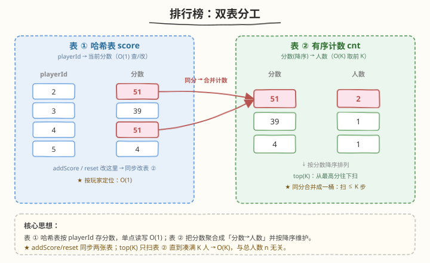
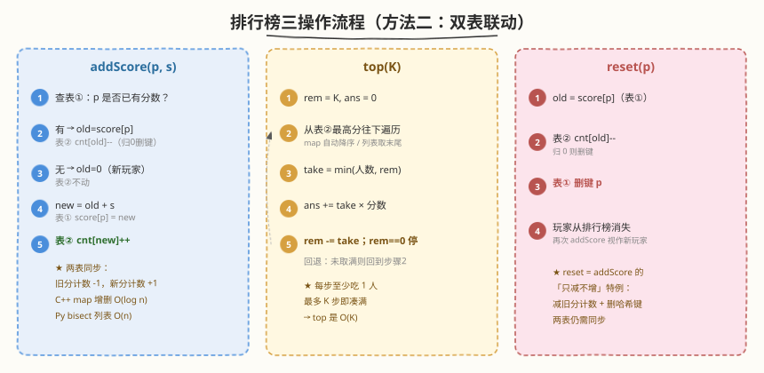
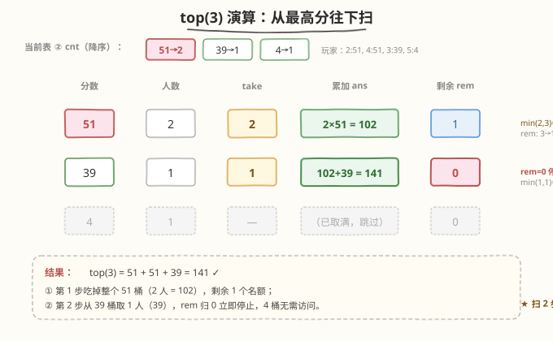

# LeetCode 力扣排行榜 题解

## 1. 题目概述

- **标题 / 题号**：力扣排行榜（#1244，medium）
- **链接**：https://leetcode.cn/problems/design-a-leaderboard/
- **难度**：中等
- **标签**：设计、哈希表、有序集合、排序、堆

**题意**：设计一个游戏**排行榜**，支持三类操作：

- `addScore(playerId, score)`：将 `score` 累加到玩家 `playerId` 的当前分数上。若该玩家不在排行榜中，则先加入再累加（即初始分数为 0）。
- `top(K)`：返回**前 K 名**玩家的分数之和。
- `reset(playerId)`：将玩家 `playerId` 的分数重置为 0（等价于移除该玩家）。**保证**调用时该玩家已存在。

> ⚠️ `addScore` 是**累加**而非覆盖；`reset` 后玩家从排行榜消失，再次 `addScore` 视作新玩家。

**示例 1**：

```text
输入：
["Leaderboard","addScore","addScore","addScore","addScore","addScore","top","reset","reset","addScore","top"]
[[],[1,73],[2,56],[3,39],[4,51],[5,4],[1],[1],[2],[2,51],[3]]
输出：
[null,null,null,null,null,null,73,null,null,null,141]

解释：
addScore(1,73)  → 排行榜 = {1:73}
addScore(2,56)  → 排行榜 = {1:73, 2:56}
addScore(3,39)  → 排行榜 = {1:73, 2:56, 3:39}
addScore(4,51)  → 排行榜 = {1:73, 2:56, 3:39, 4:51}
addScore(5,4)   → 排行榜 = {1:73, 2:56, 3:39, 4:51, 5:4}
top(1)          → 73            （最高分 73）
reset(1)        → 排行榜 = {2:56, 3:39, 4:51, 5:4}
reset(2)        → 排行榜 = {3:39, 4:51, 5:4}
addScore(2,51)  → 排行榜 = {2:51, 3:39, 4:51, 5:4}
top(3)          → 141 = 51 + 51 + 39   （前三名：51、51、39）
```

**约束**：

- `1 <= playerId, K <= 10000`
- 保证 `K` 不超过当前排行榜中的玩家数
- `1 <= score <= 100`（每次传入的单次分数）
- 最多调用 `1000` 次函数

> 💡 注意：单次 `score ≤ 100`，但 `addScore` 可对同一玩家**反复累加**，故玩家累计分数上限约为 $1000 \times 100 = 10^5$，不能直接用「分数值域桶」做 $O(1)$ 查询（桶太大）。玩家数 $n \le 10000$。

## 2. 解题思路

### 2.1 暴力思路：哈希表 + 每次排序

最直观的做法：用一个**哈希表** `score` 记录 `playerId → 当前分数`。

- `addScore` / `reset`：直接改哈希表，$O(1)$。
- `top(K)`：把所有分数取出来，**排序降序**，取前 $K$ 个求和，$O(n \log n)$。

在约束下（$n \le 10^4$、调用 $\le 10^3$）完全够用，代码也最短。但每次 `top` 都要全量排序，当 `top` 调用频繁时不够优雅。能否把「取前 $K$」也降到接近 $O(K)$？

### 2.2 核心观察：双表分工——哈希表查玩家，有序表取前 K

瓶颈在于 `top(K)` 需要排序。若我们**同时维护一张按分数降序排列的「分数 → 人数」计数表**，就能从最高分开始往下扫描，每次吃掉若干人，直到凑满 $K$ 个：



- **表 ① 哈希表 `score`**：`playerId → 当前分数`。负责 $O(1)$ 查/改单个玩家分数。
- **表 ② 有序计数字典 `cnt`**：`分数 → 该分数的人数`，**按键降序排列**。负责 $O(K)$ 取前 $K$。

**三操作如何联动两张表**：

| 操作 | 表 ①（哈希表） | 表 ②（有序计数） |
|------|----------------|-------------------|
| `addScore(p, s)` | 读旧分 `old`，写新分 `old+s` | `cnt[old]--`（归 0 删键），`cnt[old+s]++` |
| `top(K)` | 不动 | 从最高分往下扫，`min(人数, 剩余) × 分数` 累加 |
| `reset(p)` | 读旧分 `old`，删键 `p` | `cnt[old]--`（归 0 删键） |

> 💡 **为什么要计数而不是存每个分数？** 多个玩家可能同分（如示例中 `2:51` 与 `4:51`）。计数表把同分玩家合并成一个桶，`top(K)` 里一次能吃掉一整桶，扫描的键数 ≤ $K$（取满即停），所以 `top` 是 $O(K)$ 而非 $O(n)$。

### 2.3 算法流程图



**`addScore(playerId, s)`**：

1. 若 `p` 在表 ①：`old = score[p]`；在表 ② 把 `cnt[old]--`（若变 0 删键）。
2. 若 `p` 不在表 ①：视作 `old = 0`（且 `cnt[0]` 不存在，无需动表 ②）。
3. `new = old + s`；写 `score[p] = new`；在表 ② `cnt[new]++`。

**`top(K)`**：

1. `rem = K`，`ans = 0`。
2. 从 `cnt` 最高分键往下遍历：
   - `take = min(cnt[分数], rem)`
   - `ans += take × 分数`
   - `rem -= take`；`rem == 0` 即停。

**`reset(playerId)`**：

1. `old = score[p]`；在表 ② `cnt[old]--`（若变 0 删键）。
2. 在表 ① 删键 `p`。

### 2.4 示例演算

以示例最后一步 `top(3)` 为例。此时排行榜为 `{2:51, 3:39, 4:51, 5:4}`，表 ② 计数为 `{51:2, 39:1, 4:1}`（降序）。求前三名之和：



| 步骤 | 当前分数键 | 人数 | take | 累加 ans | 剩余 rem |
|------|-----------|------|------|---------|----------|
| ① | 51 | 2 | min(2, 3) = 2 | 2×51 = 102 | 3−2 = 1 |
| ② | 39 | 1 | min(1, 1) = 1 | 102 + 1×39 = 141 | 1−1 = 0 |
| ③ | — | — | — | rem=0 停 | — |

最终 `top(3) = 141`，与示例一致。注意第一步直接吃掉整个 `51` 桶（2 人），这正是计数表相对逐人遍历的优势——同分玩家一次性结算。

## 3. 参考代码

### 方法一：哈希表 + 排序（简单，推荐面试首选）

### C++

```cpp
class Leaderboard {
    unordered_map<int, int> score; // playerId -> 当前分数
  public:
    void addScore(int playerId, int score) {
        this->score[playerId] += score;
    }

    int top(int K) {
        vector<int> v;
        v.reserve(score.size());
        for (auto& [id, s] : score) v.push_back(s);
        // 降序排序取前 K
        sort(v.begin(), v.end(), greater<int>());
        int sum = 0;
        for (int i = 0; i < K; ++i) sum += v[i];
        return sum;
    }

    void reset(int playerId) {
        score.erase(playerId);
    }
};
```

> 💡 想把 `top` 从 $O(n \log n)$ 降到 $O(n \log K)$，可用 `partial_sort(v.begin(), v.begin()+K, v.end(), greater<int>())`（堆选 top-K）或 `nth_element`（线性选择第 K 大再求和）。

### Python

```python
class Leaderboard:
    def __init__(self):
        self.score = {}  # playerId -> 当前分数

    def addScore(self, playerId: int, score: int) -> None:
        self.score[playerId] = self.score.get(playerId, 0) + score

    def top(self, K: int) -> int:
        return sum(sorted(self.score.values(), reverse=True)[:K])

    def reset(self, playerId: int) -> None:
        del self.score[playerId]
```

### 方法二：哈希表 + 有序计数字典（最优，top 降到 O(K)）

### C++

```cpp
class Leaderboard {
    unordered_map<int, int> score;                 // playerId -> 当前分数
    map<int, int, greater<int>> cnt;               // 分数(降序) -> 人数

    void dec(int s) {                              // 表②人数减1，归0删键
        if (--cnt[s] == 0) cnt.erase(s);
    }
  public:
    void addScore(int playerId, int s) {
        auto it = score.find(playerId);
        if (it != score.end()) {
            int old = it->second;
            dec(old);
            it->second = old + s;
        } else {
            score[playerId] = s;
        }
        cnt[score[playerId]]++;
    }

    int top(int K) {
        int ans = 0, rem = K;
        for (auto& [s, c] : cnt) {                 // 从最高分往下
            int take = min(c, rem);
            ans += take * s;
            if ((rem -= take) == 0) break;
        }
        return ans;
    }

    void reset(int playerId) {
        dec(score[playerId]);
        score.erase(playerId);
    }
};
```

### Python

> ⚠️ Python 标准库没有内置平衡树 / 有序映射。这里用 `bisect` 维护一份**有序分数数组**（含重复，每个玩家一条），`top(K)` 直接取末尾 $K$ 个求和，同样做到 $O(K)$。`addScore` / `reset` 的增删是 $O(n)$（数组搬移），但 $n \le 10^4$、调用 $\le 10^3$ 足够快。

```python
import bisect


class Leaderboard:
    def __init__(self):
        self.score = {}      # playerId -> 当前分数
        self.sorted_scores = []  # 维护有序（升序）的所有分数，含重复

    def addScore(self, playerId: int, score: int) -> None:
        if playerId in self.score:
            old = self.score[playerId]
            # 删掉旧分（只删一个出现）
            idx = bisect.bisect_left(self.sorted_scores, old)
            self.sorted_scores.pop(idx)
            new = old + score
        else:
            new = score
        self.score[playerId] = new
        bisect.insort(self.sorted_scores, new)

    def top(self, K: int) -> int:
        # 升序数组的末尾 K 个即为前 K 高
        return sum(self.sorted_scores[-K:])

    def reset(self, playerId: int) -> None:
        old = self.score[playerId]
        idx = bisect.bisect_left(self.sorted_scores, old)
        self.sorted_scores.pop(idx)
        del self.score[playerId]
```

> 💡 **关于 Python 的平衡树替代品**：若环境支持第三方库，`sortedcontainers.SortedDict` 可精确复刻 C++ `map` 的 $O(\log n)$ 增删 + $O(K)$ 扫描；在不依赖第三方库时，`bisect` + 列表是最常用的折中——$O(n)$ 增删换取 $O(K)$ 查询，在题目约束下完全可接受。

## 4. 复杂度分析

| 维度 | 方法 | addScore / reset | top(K) | 空间 | 说明 |
|------|------|------------------|--------|------|------|
| 方法一 | 哈希表 + 排序 | $O(1)$ | $O(n \log n)$ | $O(n)$ | `top` 全量排序；可换 `partial_sort` 降到 $O(n \log K)$ |
| 方法二 (C++) | 哈希表 + `map` | $O(\log n)$ | $O(K)$ | $O(n)$ | 平衡树增删 $O(\log n)$，扫描取满 $K$ 即停 |
| 方法二 (Py) | 哈希表 + `bisect` 列表 | $O(n)$ | $O(K)$ | $O(n)$ | 列表增删搬移 $O(n)$；查询最优 |

> ⚠️ **方法二 `top` 为什么是 $O(K)$ 而非 $O(n)$？** 扫描从最高分开始，每步至少吃掉 1 个玩家，最多 $K$ 步就凑满停止。即便同分合并成桶，步数只会更少，不会更多。因此 `top` 的代价只与 $K$ 有关，与总玩家数 $n$ 无关——这是计数表相对排序的关键优势。

> 💡 **方法选择**：约束宽松（$\le 10^3$ 调用）时方法一最简、最不易错，面试优先写出；若面试官追问「`top` 频繁调用怎么办」或「能否避免每次排序」，再升级到方法二。方法二中 C++ 有 `std::map` 天然支持 $O(\log n)$；Python 无内置平衡树，用 `bisect` 列表做折中。

## 5. 扩展：其他 top-K 设计思路

| 思路 | 数据结构 | top(K) | 增删 | 适用场景 |
|------|----------|--------|------|----------|
| 全量排序 | 哈希表 | $O(n \log n)$ | $O(1)$ | $n$ 小、`top` 少（本题方法一） |
| 有序计数 | 平衡树 | $O(K)$ | $O(\log n)$ | `top` 频繁、$K$ 小（本题方法二 C++） |
| 有序数组 | `bisect` 列表 | $O(K)$ | $O(n)$ | 无平衡树时的折中（本题方法二 Py） |
| 定长小顶堆 | 大小为 $K$ 的堆 | $O(K)$ | $O(\log K)$ | 只关心「第 K 大」而非前 $K$ 之和（见 [703](../0701-0800/703_数据流中的第K大元素.md)） |
| 值域桶 | 数组 | $O(值域)$ | $O(1)$ | 分数值域很小且不累加时（本题分数会累加，不适用） |

> 💡 若题目只要「第 K 大的值」而不要前 $K$ 之和，维护一个**大小为 $K$ 的小顶堆**即可，增删 $O(\log K)$——这正是 [703. 数据流中的第 K 大元素](../0701-0800/703_数据流中的第K大元素.md) 的做法。本题要的是「前 $K$ 名之和」，需要全部前 $K$ 个的值，小顶堆虽能拿到第 $K$ 大阈值但要遍历堆求和反而不便，故有序计数表更合适。

## 6. 面试要点

1. **`addScore` 是累加还是覆盖？`reset` 之后玩家还在吗？**

   累加。`reset` 等价于移除玩家（分数清零并从排行榜消失）；之后若再 `addScore`，视作新玩家从 0 开始累加。方法二里 `reset` 必须**同时**删表 ① 的键和把表 ② 对应分数的人数减 1，两张表要保持同步。

2. **方法二为什么用「分数 → 人数」的计数表，而不是直接存每个分数？**

   多人可能同分。计数表把同分玩家合并成一桶，`top(K)` 一次能吃掉整桶，扫描键数 ≤ $K$。若逐个存分数，扫描仍是 $O(n)$，与排序无异。

3. **`top(K)` 为什么是 $O(K)$ 而不是 $O(n)$？**

   从最高分往下扫，每步至少消耗 1 个玩家，$K$ 步内必凑满停止。同分合并成桶后步数只会更少。因此代价只依赖 $K$，与 $n$ 无关。

4. **Python 没有内置平衡树怎么办？**

   三种折中：① `bisect` 维护有序数组（增删 $O(n)$、查询 $O(K)$，本题方法二）；② 借助第三方 `sortedcontainers.SortedDict`（精确复刻 $O(\log n)$ 增删）；③ 退回方法一全量排序。在 $n \le 10^4$、调用 $\le 10^3$ 时三种都能过，按是否允许第三方库选择。

5. **方法一里 `top` 能否比 $O(n \log n)$ 更快？**

   可以。用 `partial_sort` / `heapq.nlargest` 做 top-K 选择降到 $O(n \log K)$；用 `nth_element` 找到第 $K$ 大再对前 $K$ 求和可到期望 $O(n)$。但若 `top` 调用频繁，仍不如方法二把「有序性」常驻维护来得划算——这是「查询密集 → 预排序/预索引」的通用权衡。

## 同类练习题

| # | 题目 | 与本题的关联 |
|---|------|-------------|
| 703 | [数据流中的第 K 大元素](https://leetcode.cn/problems/kth-largest-element-in-a-stream/)（[题解](../0701-0800/703_数据流中的第K大元素.md)） | 只问第 K 大的值，用大小为 K 的小顶堆 $O(\log K)$ 增删，对照本题「前 K 之和」需求不同 |
| 347 | [前 K 个高频元素](https://leetcode.cn/problems/top-k-frequent-elements/)（[题解](../0301-0400/347_前K个高频元素.md)） | top-K 套路，桶排 / 小顶堆 / 快速选择三选一 |
| 911 | [在线选举](https://leetcode.cn/problems/online-election/)（[题解](../0901-1000/911_在线选举.md)） | 设计题 + 二分查询「某时刻的领先者」，同为「预处理有序性以加速查询」 |
| 295 | [数据流的中位数](https://leetcode.cn/problems/find-median-from-data-stream/)（[题解](../0201-0300/295_数据流的中位数.md)） | 设计题 + 双堆维护有序，与本题「动态维护有序结构以快速查询」同思路 |
| 1206 | [设计跳表](https://leetcode.cn/problems/design-skiplist/)（[题解](1206_设计跳表.md)） | 同为有序数据结构设计，跳表用概率替代平衡树旋转实现 $O(\log n)$ |
