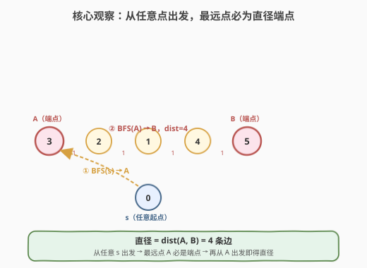
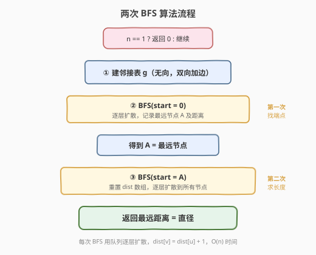
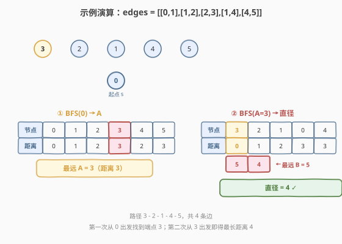
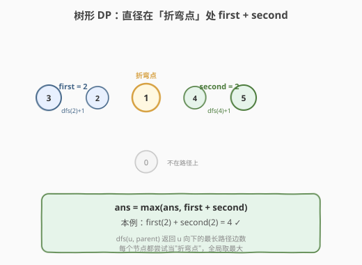

# LeetCode 树的直径 题解

## 1. 题目概述

- **标题 / 题号**：树的直径（#1245，medium）
- **链接**：https://leetcode.cn/problems/tree-diameter/
- **难度**：中等
- **标签**：树、图、广度优先搜索、深度优先搜索

**题意**：给你一棵**无向树**（连通无环图），以边列表 `edges` 表示，其中 `edges[i] = [u_i, v_i]` 表示节点 `u_i` 与 `v_i` 之间有一条无向边。返回这棵树的**直径**——即树中**任意两个节点之间最长路径**的**边数**。

**示例 1**：

```text
输入：edges = [[0,1],[0,2]]
输出：2
解释：最长路径为 1 - 0 - 2，共 2 条边。
```

**示例 2**：

```text
输入：edges = [[0,1],[1,2],[2,3],[1,4],[4,5]]
输出：4
解释：最长路径为 3 - 2 - 1 - 4 - 5，共 4 条边。
```

**约束**：

- `0 <= edges.length <= 10^4`
- `edges[i].length == 2`
- `0 <= u_i, v_i <= edges.length`
- 给定的 `edges` 构成一棵合法的树。

> 💡 **与 543 的区别**：[543. 二叉树的直径](../0501-0600/543_二叉树的直径.md) 给的是**有根二叉树**（每个节点最多两个子节点，且有明确的父→子方向）；本题给的是**无向无根树**（用边列表表示，每个节点度数不限）。核心思想一致——都是求"最长路径的边数"，但实现上需要建邻接表并用 `parent` 参数防止回头。

## 2. 解题思路

### 2.1 暴力思路

对每对节点 `(u, v)` 求路径长度（树中两节点路径唯一），取最大值。共 $\binom{n}{2}$ 对节点，每对 BFS/DFS 求距离 $O(n)$，总计 $O(n^3)$，在 $n = 10^4$ 时远超时限。

### 2.2 核心观察：两次 BFS



树有一个关键性质：**从任意节点 $s$ 出发 BFS，找到的最远节点 $A$ 一定是某条直径的一个端点**。

> 💡 **直觉**：如果 $A$ 不是直径端点，那么从 $s$ 到 $A$ 的路一定在某处"拐弯"偏离了直径。但既然 $A$ 比直径端点更远，说明把直径端点换成 $A$ 能得到一条更长的路——矛盾。

基于此，只需两步：

1. **第一次 BFS**：从任意节点 `s`（如节点 0）出发，找到最远节点 `A`。
2. **第二次 BFS**：从 `A` 出发，找到最远节点 `B`，$\text{dist}(A, B)$ 即为直径。

> ⚠️ **为什么成立**：第一步保证 $A$ 是直径端点；第二步从直径端点出发，最远距离自然就是直径长度。完整证明见第 6 节面试要点。

### 2.3 算法流程图



**第一次 BFS（找端点 A）**：

1. 从节点 0 出发，`dist[0] = 0`，其余初始化为 `-1`
2. BFS 逐层扩散，记录最远节点 `A` 及其距离

**第二次 BFS（从 A 找直径）**：

3. 从 `A` 出发，重置 `dist` 数组
4. BFS 逐层扩散，返回最远距离即为答案

### 2.4 示例演算

以 `edges = [[0,1],[1,2],[2,3],[1,4],[4,5]]` 为例：



**第一次 BFS（从节点 0 出发）**：

| 节点 | 0 | 1 | 2 | 3 | 4 | 5 |
|------|---|---|---|---|---|---|
| 距离 | 0 | 1 | 2 | 3 | 2 | 3 |

最远节点为 3（距离 3），取 $A = 3$。

**第二次 BFS（从 A=3 出发）**：

| 节点 | 3 | 2 | 1 | 0 | 4 | 5 |
|------|---|---|---|---|---|---|
| 距离 | 0 | 1 | 2 | 3 | 3 | 4 |

最远节点为 5（距离 4），即直径 $= 4$ ✓

> 💡 路径 `3 - 2 - 1 - 4 - 5` 共 4 条边，与答案一致。注意节点 0 虽然离起点最远之一，但它不是直径端点——第一次 BFS 正是从 0 出发，"纠偏"找到了真正的端点 3。

## 3. 参考代码

### 方法一：两次 BFS

#### C++

```cpp
class Solution {
  public:
    int treeDiameter(vector<vector<int>>& edges) {
        int n = edges.size() + 1;
        if (n == 1) return 0;
        vector<vector<int>> g(n);
        for (auto& e : edges) {
            g[e[0]].push_back(e[1]);
            g[e[1]].push_back(e[0]);
        }
        auto bfs = [&](int start) -> pair<int, int> {
            vector<int> dist(n, -1);
            queue<int> q;
            q.push(start);
            dist[start] = 0;
            int farNode = start, farDist = 0;
            while (!q.empty()) {
                int u = q.front(); q.pop();
                for (int v : g[u]) {
                    if (dist[v] == -1) {
                        dist[v] = dist[u] + 1;
                        q.push(v);
                        if (dist[v] > farDist) {
                            farDist = dist[v];
                            farNode = v;
                        }
                    }
                }
            }
            return {farNode, farDist};
        };
        int a = bfs(0).first;
        return bfs(a).second;
    }
};
```

#### Python

```python
class Solution:
    def treeDiameter(self, edges: List[List[int]]) -> int:
        n = len(edges) + 1
        if n == 1:
            return 0
        g = [[] for _ in range(n)]
        for u, v in edges:
            g[u].append(v)
            g[v].append(u)

        def bfs(start: int) -> tuple:
            dist = [-1] * n
            dist[start] = 0
            q = deque([start])
            far_node, far_dist = start, 0
            while q:
                u = q.popleft()
                for v in g[u]:
                    if dist[v] == -1:
                        dist[v] = dist[u] + 1
                        q.append(v)
                        if dist[v] > far_dist:
                            far_dist = dist[v]
                            far_node = v
            return far_node, far_dist

        a = bfs(0)[0]
        return bfs(a)[1]
```

## 4. 复杂度分析

| 方法 | 时间复杂度 | 空间复杂度 | 说明 |
|------|-----------|-----------|------|
| 两次 BFS | $O(n)$ | $O(n)$ | 两次 BFS 各遍历所有节点一次；邻接表 + `dist` 数组 |
| 树形 DP | $O(n)$ | $O(n)$ | 一次 DFS 遍历；递归栈深度最坏 $O(n)$ |

> 💡 两种方法时间空间同级。两次 BFS 思路更直观、用循环无递归栈溢出风险，适合快速实现；树形 DP 是 543 二叉树直径的自然推广，展示"换根"思维。

## 5. 扩展：树形 DP



与 [543. 二叉树的直径](../0501-0600/543_二叉树的直径.md) 完全同构：对每个节点，取其**向下的最长两条子路径** `first`、`second`，经过该节点的最长路径边数为 `first + second`，全局取最大值即为直径。

#### C++

```cpp
class Solution {
  public:
    int treeDiameter(vector<vector<int>>& edges) {
        int n = edges.size() + 1;
        vector<vector<int>> g(n);
        for (auto& e : edges) {
            g[e[0]].push_back(e[1]);
            g[e[1]].push_back(e[0]);
        }
        int ans = 0;
        function<int(int, int)> dfs = [&](int u, int parent) -> int {
            int first = 0, second = 0;
            for (int v : g[u]) {
                if (v == parent) continue;
                int d = dfs(v, u) + 1;
                if (d > first) { second = first; first = d; }
                else if (d > second) second = d;
            }
            ans = max(ans, first + second);
            return first;
        };
        dfs(0, -1);
        return ans;
    }
};
```

#### Python

```python
class Solution:
    def treeDiameter(self, edges: List[List[int]]) -> int:
        n = len(edges) + 1
        g = [[] for _ in range(n)]
        for u, v in edges:
            g[u].append(v)
            g[v].append(u)
        self.ans = 0

        def dfs(u: int, parent: int) -> int:
            first = second = 0
            for v in g[u]:
                if v == parent:
                    continue
                d = dfs(v, u) + 1
                if d > first:
                    first, second = d, first
                elif d > second:
                    second = d
            self.ans = max(self.ans, first + second)
            return first

        dfs(0, -1)
        return self.ans
```

> ⚠️ **`parent` 参数的作用**：无向树中每个邻接点既可能是"子"也可能是"父"，传入 `parent` 跳过来时的方向，避免在父↔子之间来回横跳导致死循环。这是无向树 DFS 与有根二叉树 DFS 的关键区别。

## 6. 面试要点

1. **为什么两次 BFS 一定能求出直径？（证明）**

   - 设 $(U, V)$ 为某条直径。从任意节点 $s$ 出发，设最远点为 $A$。要证 $A$ 是某条直径的端点。
   - 设 $W$ 为路径 $s \to A$ 与直径路径 $U \to V$ 的**分岔点**（两者共有的、离 $A$ 最近的节点），则 $\text{dist}(s, A) = \text{dist}(s, W) + \text{dist}(W, A)$，而 $\text{dist}(s, U) = \text{dist}(s, W) + \text{dist}(W, U)$。
   - 因 $A$ 最远：$\text{dist}(s, A) \geq \text{dist}(s, U)$，故 $\text{dist}(W, A) \geq \text{dist}(W, U)$。
   - 于是 $\text{dist}(A, V) = \text{dist}(A, W) + \text{dist}(W, V) \geq \text{dist}(U, W) + \text{dist}(W, V) = \text{dist}(U, V)$。
   - 但 $(U, V)$ 是直径（最长），所以 $\text{dist}(A, V) = \text{dist}(U, V)$，即 $(A, V)$ 也是直径，$A$ 是端点。$\square$

2. **两次 BFS vs 树形 DP，面试选哪个？**

   - 两次 BFS 思路更"巧"、用循环无递归栈溢出风险，适合快速实现；树形 DP 更通用（可推广到带边权的最长路径、最大路径和等变体），且是 543 的直接迁移。两者时间空间同级，按面试官偏好选择。

3. **单节点 / 两节点怎么处理？**

   - `edges = []` 时 $n = 1$，直径为 0（没有边）。代码中 `if (n == 1) return 0` 特判。两节点时直径为 1，BFS 正常处理无需特判。

4. **`parent` 参数在树形 DP 中为什么不能省？**

   - 无向图的邻接表双向存储边，DFS 时不传 `parent` 会沿来时方向走回去，无限递归。有根二叉树天然有左右子方向，不需要 `parent`。这是无向树题的通用坑。

5. **本题与 [543. 二叉树的直径](https://leetcode.cn/problems/diameter-of-binary-tree/) 的关系？**

   - 543 是有根二叉树版（父→子方向明确），用后序 DFS 取左右子树最大深度之和即可；1245 是无向无根树版，需要建邻接表 + `parent` 防回头。树形 DP 的核心公式完全一致：`ans = max(ans, first + second)`。

## 同类练习题

| # | 题目 | 与本题的关联 |
|---|------|-------------|
| 543 | [二叉树的直径](https://leetcode.cn/problems/diameter-of-binary-tree/)（[题解](../0501-0600/543_二叉树的直径.md)） | 有根二叉树版直径，树形 DP 的入门母题，1245 的直接前身 |
| 310 | [最小高度树](https://leetcode.cn/problems/minimum-height-trees/)（[题解](../0301-0400/310_最小高度树.md)） | 不断剥叶子找树的中心，直径的中点即为使高度最小的根 |
| 2246 | [相邻字符不同的最长路径](https://leetcode.cn/problems/longest-path-with-different-adjacent-characters/) | 树形 DP 求带约束的最长路径，1245 DP 思路的进阶变体 |
| 124 | [二叉树中的最大路径和](https://leetcode.cn/problems/binary-tree-maximum-path-sum/) | 把"最长边数"换成"最大节点权和"，树形 DP `first + second` 模板的迁移 |
| 1522 | [N 叉树的直径](https://leetcode.cn/problems/diameter-of-n-ary-tree/) | 543 的 N 叉树版，与 1245 一样需要处理多分支取 top-2 |
