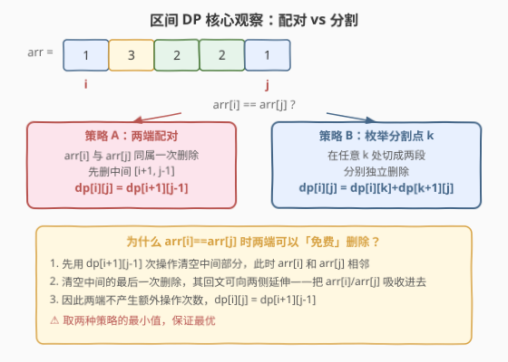
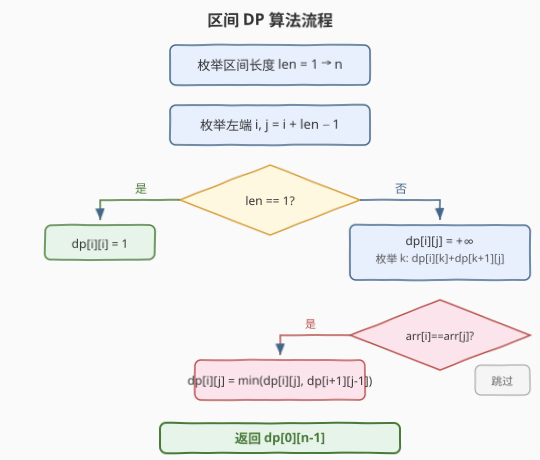
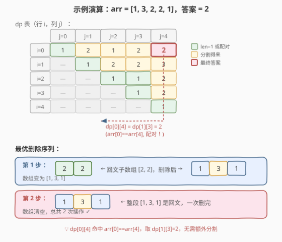

# 删除回文子数组

- **题目名称**：删除回文子数组
- **链接**：[1246. 删除回文子数组](https://leetcode.cn/problems/palindrome-removal/)
- **难度**：困难
- **标签**：动态规划、区间 DP

## 1. 题目概述

给你一个整数数组 `arr`。在一步操作中，你可以选择一个**回文子数组** `arr[i], arr[i+1], ..., arr[j]`（其中 `i <= j`），将其从数组中移除。移除后，两侧的元素会**移动到一起**（即数组缩短，剩余元素保持相对顺序）。返回使数组**完全清空**所需的**最少操作次数**。

**示例 1**：

```text
输入：arr = [1, 2]
输出：2
解释：[1] 和 [2] 各自单独删除，共 2 次。
```

**示例 2**：

```text
输入：arr = [1,3,4,1,5]
输出：3
解释：先删 [4]，数组变为 [1,3,1,5]；再删 [1,3,1]（回文），数组变为 [5]；最后删 [5]。
```

**约束条件**：

- `1 <= arr.length <= 100`
- `1 <= arr[i] <= 20`

> 💡 **关键限制**：`n <= 100` 直接暗示 `O(n³)` 算法可接受——这是**区间 DP** 的经典信号。同时 `arr[i]` 取值范围极小（`1~20`），但本题并不依赖值域，区间 DP 是通用解法。

---

## 2. 解题思路

### 2.1 暴力思路

枚举所有可能的回文子数组删除顺序。每一步有至多 `O(n²)` 个候选回文子数组可选，深度可达 `n` 层，总复杂度 `O(n²^n)`，完全不可行。

换个角度：最终每个元素都要被删掉，而一次操作可以删除一整段回文。问题等价于：**把数组划分成若干段，每段恰好可在一次操作中作为回文删掉**，求最少段数。但回文删除后两侧会合并，因此「段」并非简单的固定划分——删掉中间一段后，左右两段会相邻，可能产生新的回文。这正是区间 DP 擅长处理的「合并/消除」型问题。

### 2.2 核心观察：区间 DP + 两端配对



定义 `dp[i][j]` = 清空子数组 `arr[i..j]` 所需的最少操作次数。

**两种策略取最小值**：

**策略 A——两端配对**（当 `arr[i] == arr[j]` 时）：

如果首尾元素相同，它们可以「免费」删除——即不增加额外操作次数。直觉是：先用 `dp[i+1][j-1]` 次操作清空中间部分，清空后 `arr[i]` 与 `arr[j]` 相邻且相等，自然构成回文；而清空中间的**最后一次操作**的回文可以向两侧延伸，把 `arr[i]` 和 `arr[j]` 一并吸收进去。

$$
\text{dp}[i][j] = \text{dp}[i+1][j-1] \quad (\text{当 } \text{arr}[i] = \text{arr}[j])
$$

**策略 B——枚举分割点 k**：

在任何情况下，都可以在位置 `k`（`i <= k < j`）处将区间切成两段，分别独立清空：

$$
\text{dp}[i][j] = \min_{i \le k < j} \big( \text{dp}[i][k] + \text{dp}[k+1][j] \big)
$$

> ⚠️ **为什么「配对」是免费的？** 形式化证明用交换论证：设最优方案中 `arr[i]` 在第 $m_1$ 次操作被删，`arr[j]` 在第 $m_2$ 次被删（$m_1 \ne m_2$）。由于 `arr[i] == arr[j]`，可以调整操作顺序，使二者在**同一次**操作中作为回文两端被删除，且不增加总操作数。因此 `dp[i][j] <= dp[i+1][j-1]`。配合分割策略保证不遗漏，取最小即为最优。

### 2.3 算法流程图



**区间 DP 标准框架**——按长度从小到大枚举区间：

1. **初始化**：`dp[i][i] = 1`（单元素是回文，1 次删除）；`dp[i][i-1] = 0`（空区间，用于 `arr[i]==arr[i+1]` 时 `dp[i+1][i]` 取 0）
2. **枚举长度** `len` 从 `2` 到 `n`：
   - **枚举左端** `i` 从 `0` 到 `n - len`，`j = i + len - 1`
   - **策略 B**：`dp[i][j] = min(dp[i][k] + dp[k+1][j])`，`k` 从 `i` 到 `j-1`
   - **策略 A**：若 `arr[i] == arr[j]`，`dp[i][j] = min(dp[i][j], dp[i+1][j-1])`
3. **返回** `dp[0][n-1]`

### 2.4 示例演算

以 `arr = [1, 3, 2, 2, 1]` 为例，展示完整 `dp` 表与最优删除序列：



**dp 表关键值解读**：

| 区间 | arr 值 | arr[i]==arr[j]? | 最优来源 | dp 值 |
|------|--------|-----------------|----------|-------|
| `[0,0]` | [1] | — | 单元素 | 1 |
| `[2,3]` | [2,2] | 是 ✓ | 配对：dp[3][2]=0 | 1 |
| `[0,2]` | [1,3,2] | 否 | 分割 | 2 |
| `[1,3]` | [3,2,2] | 否 | 分割：dp[1][1]+dp[2][3]=1+1 | 2 |
| `[0,4]` | [1,3,2,2,1] | 是 ✓ | 配对：dp[1][3]=2 | **2** |

> 💡 `dp[0][4]` 命中策略 A——`arr[0]==arr[4]==1`，直接取 `dp[1][3]=2`，无需任何分割枚举就能得到最优值。配对策略的优势在于：它把 `O(n)` 的分割循环降为 `O(1)`，且可能直接给出全局最优。

**对应删除序列**：

1. 删除 `[2, 2]`（下标 2-3，回文）→ 数组变为 `[1, 3, 1]`
2. 删除 `[1, 3, 1]`（整段回文）→ 数组清空

---

## 3. 参考代码

### C++

```cpp
class Solution {
  public:
    int minimumMoves(vector<int>& arr) {
        int n = arr.size();
        vector<vector<int>> dp(n, vector<int>(n, 0));
        for (int i = 0; i < n; i++) {
            dp[i][i] = 1;
            if (i > 0) dp[i][i - 1] = 0; // 空区间，供 arr[i]==arr[i+1] 配对使用
        }
        for (int len = 2; len <= n; len++) {
            for (int i = 0; i + len - 1 < n; i++) {
                int j = i + len - 1;
                dp[i][j] = INT_MAX;
                for (int k = i; k < j; k++)
                    dp[i][j] = min(dp[i][j], dp[i][k] + dp[k + 1][j]);
                if (arr[i] == arr[j])
                    dp[i][j] = min(dp[i][j], dp[i + 1][j - 1]);
            }
        }
        return dp[0][n - 1];
    }
};
```

### Python

```python
class Solution:
    def minimumMoves(self, arr: List[int]) -> int:
        n = len(arr)
        dp = [[0] * n for _ in range(n)]
        for i in range(n):
            dp[i][i] = 1

        for length in range(2, n + 1):
            for i in range(n - length + 1):
                j = i + length - 1
                dp[i][j] = min(dp[i][k] + dp[k + 1][j] for k in range(i, j))
                if arr[i] == arr[j]:
                    dp[i][j] = min(dp[i][j], dp[i + 1][j - 1])
        return dp[0][n - 1]
```

> ⚠️ **边界细节**：`dp[i+1][j-1]` 在 `len==2`（即 `j==i+1`）时访问 `dp[i+1][i]`，Python 中初始为 0 自然处理；C++ 中需显式初始化 `dp[i][i-1] = 0`（上方代码在循环中设置 `i > 0` 的 `dp[i][i-1]`，配合 `dp` 默认值为 0 即可）。当 `arr[i]==arr[i+1]` 时 `dp[i][i+1] = min(2, 0) = 1`，正确——两个相同元素本身是回文。

---

## 4. 复杂度分析

| 维度 | 复杂度 | 说明 |
|------|--------|------|
| **时间** | `O(n³)` | 枚举区间 `O(n²)` × 枚举分割点 `O(n)` |
| **空间** | `O(n²)` | 二维 `dp` 表，`n <= 100` 时约 10000 个 int，开销极小 |

> 💡 `n = 100` 时 `n³ = 10^6`，远在时间限制内。区间 DP 的 `O(n³)` 在 `n <= 200` 内都是安全的。

---

## 5. 扩展：更优的转移写法

上述代码对每个区间枚举所有分割点 `k`，时间 `O(n³)`。存在一种等价但常数更小的写法——**只在 `arr[i]` 与某个 `arr[k]` 相等时尝试配对**，其余情况靠「单独删除 `arr[j]`」兜底：

```cpp
for (int len = 1; len <= n; len++) {
    for (int i = 0; i + len - 1 < n; i++) {
        int j = i + len - 1;
        if (len == 1) { dp[i][j] = 1; continue; }
        dp[i][j] = 1 + dp[i][j - 1]; // arr[j] 单独删
        for (int k = i; k < j; k++)
            if (arr[k] == arr[j])
                dp[i][j] = min(dp[i][j],
                    (k > i ? dp[i][k - 1] : 0) + dp[k + 1][j - 1]);
    }
}
```

这种写法把「配对 `arr[k]` 与 `arr[j]`」作为核心转移，省去了对不相等 `k` 的无效分割枚举。虽然渐近复杂度仍为 `O(n³)`，但由于 `arr[i]` 取值仅 `1~20`，相等的 `k` 平均只有 `n/20` 个，实际运行更快。两种写法等价，面试中写第一种（更易理解）即可，提前了解第二种可展示对问题的深入理解。

---

## 6. 面试要点

1. **为什么用区间 DP 而不是贪心？**

   - 贪心策略（如「每次删最长回文子数组」）不一定最优。例如 `arr = [1,2,1,2]`，贪心先删 `[1,2,1]` 剩 `[2]` 共 2 次，恰好最优；但 `arr = [1,2,2,3,1]` 中贪心先删 `[2,2]` 剩 `[1,3,1]` 再删共 2 次，而直接删 `[1,3,1]` 剩 `[2,2]` 再删也是 2 次——看似一样，但构造反例是可行的。区间 DP 通过穷举所有分割与配对来保证最优性，贪心无法覆盖「先删中间使两端相邻配对」的间接收益。

2. **`dp[i+1][j-1]` 的边界（`len==2`）怎么处理？**

   - `len==2` 即 `j = i+1`，`dp[i+1][j-1] = dp[i+1][i]` 是空区间。Python 中 `dp` 初始为 0 自然正确；C++ 中 `vector` 默认初始化为 0 也没问题，但建议显式设 `dp[i][i-1] = 0` 以表意。

3. **配对策略的「免费」如何理解？**

   - 核心是清空中间 `[i+1, j-1]` 后，`arr[i]` 和 `arr[j]` 相邻且相等，构成回文。而清空中间的最后一次操作可以把这个回文吸收——不额外增加操作数。形式化证明用交换论证：若两端在不同操作中被删，可以合并为同一次操作而不增加总数。

4. **本题与经典区间 DP（如合并石子）有何异同？**

   - 相同点：都是 `dp[i][j]` 表示区间 `[i,j]` 的最优值，按长度递增枚举。
   - 不同点：合并石子是「合并相邻两堆」的累加型问题；本题是「删除回文」的消除型问题。消除型的关键转移是**配对**（`arr[i]==arr[j]` 时免费），这在合并型中不存在。两者的分割枚举结构完全一致。

5. **`n=100` 时 `O(n³)` 是否会超时？**

   - `10^6` 次运算在 1 秒限制内绰绰有余。区间 DP 的经验阈值：`n <= 200` 用 `O(n³)` 安全，`n > 200` 需考虑优化（如四边形不等式优化到 `O(n² \log n)`，但本题 `n<=100` 不需要）。

---

## 7. 同类练习题

- [312. 戳气球](https://leetcode.cn/problems/burst-balloons/)（[题解](../0301-0400/312_戳气球.md)）：区间 DP 经典，`dp[i][j]` 表示开区间 `(i,j)` 内全部戳完的最大得分，按长度枚举 + 枚举最后戳的气球
- [375. 猜数字大小 II](https://leetcode.cn/problems/guess-number-higher-or-lower-ii/)：区间 DP 求最小化最大代价，`dp[i][j]` 表示猜 `[i,j]` 区间的最小保证花费
- [516. 最长回文子序列](https://leetcode.cn/problems/longest-palindromic-subsequence/)：区间 DP + `arr[i]==arr[j]` 配对思想，求最长回文子序列长度
- [1000. 合并石子的最低成本](https://leetcode.cn/problems/minimum-cost-to-merge-stones/)：区间 DP 进阶，`K` 堆合并，状态维度更高但枚举结构相同
- [664. 奇怪的打印机](https://leetcode.cn/problems/strange-printer/)：区间 DP + `arr[i]==arr[j]` 配对，与本题思路极为相似——打印机每次可打印同一段连续字符，求最少打印次数
